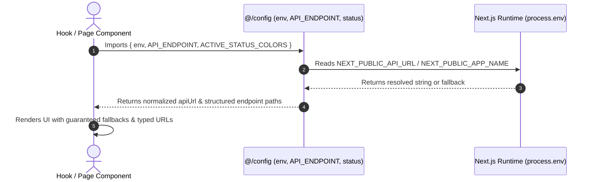

# Implementation Plan: Standardizing System Configuration Architecture in Only One FE

Grounded in [concept.md](file:///Users/kiem/Sources/Personal/only-one-fe/only-one/tasks/20260821-161300-build-config-module/concept.md), this implementation plan defines the structure, files, interfaces, and test scenarios to establish a centralized, type-safe `src/config/` module for `only-one-fe` modeled after `carwash-portal`.

---

## Section 1. Current State

### 1.1 Verified Current Behavior & Files
- Currently, `only-one-fe` lacks a dedicated `src/config/` directory. Configuration and constant values are partially scattered across:
  - [src/constants/common.constant.ts](file:///Users/kiem/Sources/Personal/only-one-fe/src/constants/common.constant.ts): Contains mixed UI limits, slideshow delays, and storage keys.
  - [src/constants/index.ts](file:///Users/kiem/Sources/Personal/only-one-fe/src/constants/index.ts): Re-exports constants from the flat directory.
  - Direct `process.env` lookups in [src/libs/googleapis.ts](file:///Users/kiem/Sources/Personal/only-one-fe/src/libs/googleapis.ts#L24) (`NEXT_PUBLIC_GOOGLE_CLIENT_ID`, `NEXT_PUBLIC_GOOGLE_REDIRECT_URI`), [src/libs/api-url-helper.ts](file:///Users/kiem/Sources/Personal/only-one-fe/src/libs/api-url-helper.ts#L7) (`NEXT_PUBLIC_API_URL`), [src/hooks/common/useSocket.ts](file:///Users/kiem/Sources/Personal/only-one-fe/src/hooks/common/useSocket.ts#L12) (`NEXT_PUBLIC_SOCKET_URL`), and [src/contexts/RefineContext.tsx](file:///Users/kiem/Sources/Personal/only-one-fe/src/contexts/RefineContext.tsx#L33).
  - Hardcoded string endpoint literals in hooks and components (e.g. `'data-providers'`, `'data-provider-features'`, `'scraping-data'`, `'simulation-contexts'`).

### 1.2 Core Problem Being Addressed
1. No single source of truth for backend endpoints creates duplication, typos, and makes URL refactoring error-prone.
2. Inconsistent fallback handling when environment variables are undefined.
3. Lack of standardized badge/tag color mappings for status indicators (`active`/`inactive`, `yes`/`no`, job execution states) across tables and detail cards.

### 1.3 Behaviors That Must Remain Unchanged
- All existing imports from `@/constants` must continue to work without breaking.
- Existing environment variable resolution (`process.env.NEXT_PUBLIC_*`) must remain fully functional.

---

## Section 2. Detailed Design

### 2.1 Architectural Decisions & Module Organization
The `src/config/` directory will consist of 7 focused modules:

1. **`src/config/api.ts`**:
   - Centralizes default pagination and sorting rules (`DEFAULT_PAGE_SIZE = 10`, `DEFAULT_PAGE_INDEX = 1`, `DEFAULT_ORDER_BY = 'createdAt'`, `DEFAULT_SORTERS`).
2. **`src/config/date.ts`**:
   - Standard date and time format strings (`DEFAULT_DATE_FORMAT = 'DD/MM/YYYY'`, `DEFAULT_TIME_FORMAT = 'DD/MM/YYYY HH:mm:ss'`, `DATE_FORMAT_SHORT`, `DATE_FORMAT_TIME`).
3. **`src/config/endpoint.ts`**:
   - Structured `API_ENDPOINT` object with typed functions for detail and child resources, matching `only-one-be` REST API surface.
4. **`src/config/env.ts`**:
   - Reads `process.env` with Next.js public client prefix awareness (`NEXT_PUBLIC_*`), provides fallbacks, defines `appBrand`, and includes `applyDocumentBranding`.
5. **`src/config/media.ts`**:
   - Media extensions (`MEDIA_IMAGE_EXTENSIONS`, `MEDIA_VIDEO_EXTENSIONS`), input `MEDIA_ACCEPT` filter string, SVG fallback placeholder `MEDIA_IMAGE_FALLBACK`, and `MEDIA_MAX_SIZE_MB`.
6. **`src/config/status.ts`**:
   - Ant Design Tag color mappings for statuses: `ACTIVE_STATUS_COLORS`, `BOOLEAN_TAG_COLORS`, `SCHEDULE_JOB_STATUS_COLORS`.
7. **`src/config/index.ts`**:
   - Aggregates and re-exports all config files for seamless `@/config` consumption.

### 2.2 UI Tag & Status Mapping Flow

```text
+-----------------------------------------------------------------------------------+
|                           Status & Color Mapping Flow                             |
+-----------------------------------------------------------------------------------+
|  Record Status: 'active'   --> ACTIVE_STATUS_COLORS.active  --> Tag color="green" |
|  Record Status: 'inactive' --> ACTIVE_STATUS_COLORS.inactive--> Tag color="red"   |
|  Boolean Value: true       --> BOOLEAN_TAG_COLORS.yes       --> Tag color="blue"  |
|  Job Status:    'completed'--> SCHEDULE_JOB_STATUS_COLORS   --> Tag color="green" |
|  Job Status:    'failed'   --> SCHEDULE_JOB_STATUS_COLORS   --> Tag color="red"   |
+-----------------------------------------------------------------------------------+
```

---

## Section 3. Implementation Architecture

### 3.1 Target Directory Tree
```text
only-one-fe/src/
├── config/
│   ├── api.ts                                [NEW] (API pagination, sorting defaults)
│   ├── date.ts                               [NEW] (Date/time formats)
│   ├── endpoint.ts                           [NEW] (Centralized API_ENDPOINT registry)
│   ├── env.ts                                [NEW] (Next.js environment reader & branding)
│   ├── media.ts                              [NEW] (Media extensions, accept strings, limits)
│   ├── status.ts                             [NEW] (Ant Design Tag status colors)
│   └── index.ts                              [NEW] (Barrel export)
```

### 3.2 Sequence Diagram: Configuration Resolution



---

## Section 4. Implementation Code Examples

### 1. `[NEW] src/config/api.ts`
- **Summary**: Defines standard pagination and sorter configurations.
- **Snippet**:
```typescript
import type { CrudSorting } from '@refinedev/core';

export const DEFAULT_ORDER_BY = 'createdAt';
export const DEFAULT_PAGE_INDEX = 1;
export const DEFAULT_PAGE_SIZE = 10;
export const DEFAULT_SORTERS: CrudSorting = [{ field: DEFAULT_ORDER_BY, order: 'desc' }];
```

---

### 2. `[NEW] src/config/date.ts`
- **Summary**: Standard date and time format tokens.
- **Snippet**:
```typescript
export const DEFAULT_DATE_FORMAT = 'DD/MM/YYYY';
export const DEFAULT_TIME_FORMAT = 'DD/MM/YYYY HH:mm:ss';
export const DATE_FORMAT_SHORT = 'DD/MM/YYYY';
export const DATE_FORMAT_TIME = 'DD/MM/YYYY HH:mm:ss';
```

---

### 3. `[NEW] src/config/endpoint.ts`
- **Summary**: Comprehensive dictionary mapping all backend endpoints.
- **Snippet**:
```typescript
const API_VERSION = '';

const prefix = (path: string) => (API_VERSION ? `${API_VERSION}/${path}` : path);

export const API_ENDPOINT = {
    AUTH: {
        LOGIN: prefix('auth/login'),
        REGISTER: prefix('auth/register'),
        REFRESH: prefix('auth/refresh-token'),
        ME: prefix('auth/me'),
        FORGET_PASSWORD: prefix('auth/forget-password'),
    },
    DATA_PROVIDERS: {
        BASE: prefix('data-providers'),
        ALL: prefix('data-providers/all'),
        DETAIL: (id: string | number) => prefix(`data-providers/${id}`),
    },
    DATA_PROVIDER_FEATURES: {
        BASE: prefix('data-provider-features'),
        ALL: prefix('data-provider-features/all'),
        BY_PROVIDER: (providerId: string | number) =>
            prefix(`data-provider-features/data-providers/${providerId}`),
        DETAIL: (id: string | number) => prefix(`data-provider-features/${id}`),
        TEST: prefix('data-provider-features/test'),
        ROLLBACK: (id: string | number) => prefix(`data-provider-features/${id}/rollback`),
    },
    DATA_PROVIDER_ITEMS: {
        BASE: prefix('data-provider-items'),
        ALL: prefix('data-provider-items/all'),
        DETAIL: (id: string | number) => prefix(`data-provider-items/${id}`),
    },
    ITEMS: {
        BASE: prefix('items'),
        ALL: prefix('items/all'),
        DETAIL: (id: string | number) => prefix(`items/${id}`),
        IMPORT: prefix('items/import'),
    },
    SCRAPING_DATA: {
        BASE: prefix('scraping-data'),
        ALL: prefix('scraping-data/all'),
        DETAIL: (id: string | number) => prefix(`scraping-data/${id}`),
        PROCESS: prefix('scraping-data/process'),
    },
    SCHEDULES: {
        BASE: prefix('schedules'),
        ALL: prefix('schedules/all'),
        DETAIL: (id: string | number) => prefix(`schedules/${id}`),
        TRIGGER: (id: string | number) => prefix(`schedules/${id}/trigger`),
        JOBS: (scheduleId: string | number) => prefix(`schedule-jobs/schedule/${scheduleId}`),
    },
    SCHEDULE_JOBS: {
        BASE: prefix('schedule-jobs'),
        ALL: prefix('schedule-jobs/all'),
        DETAIL: (id: string | number) => prefix(`schedule-jobs/${id}`),
    },
    SCHEDULE_JOB_EVENTS: {
        BASE: prefix('schedule-job-events'),
        ALL: prefix('schedule-job-events/all'),
        DETAIL: (id: string | number) => prefix(`schedule-job-events/${id}`),
    },
    GOOGLE_DRIVE: {
        FOLDERS: prefix('google-folder'),
        FOLDERS_ALL: prefix('google-folder/all'),
        FILES: prefix('google-file'),
        FILES_ALL: prefix('google-file/all'),
        SYNC: prefix('google/sync'),
        EXCHANGE_TOKEN: prefix('google/exchange-token'),
    },
    SIMULATION: {
        CONTEXTS: prefix('simulation-contexts'),
        CONTEXTS_ALL: prefix('simulation-contexts/all'),
        ITEMS: prefix('simulation-items'),
        ITEMS_ALL: prefix('simulation-items/all'),
    },
    USERS: {
        BASE: prefix('users'),
        ALL: prefix('users/all'),
        DETAIL: (id: string | number) => prefix(`users/${id}`),
    },
    NOTIFICATIONS: {
        BASE: prefix('notifications'),
        READ: (id: string | number) => prefix(`notifications/read/${id}`),
        MARK_ALL_READ: prefix('notifications/mark-all-read'),
    },
    SETTINGS: {
        BASE: prefix('settings'),
    },
} as const;
```

---

### 4. `[NEW] src/config/env.ts`
- **Summary**: Safe Next.js environment configuration reader with typed fallbacks and branding metadata.
- **Snippet**:
```typescript
const DEFAULT_API_URL = 'http://localhost:3001/api';
const DEFAULT_APP_NAME = 'Only One Hub';
const DEFAULT_APP_LOGO_SRC = '/images/logo.png';
const DEFAULT_AUTH_TOKEN_KEY = 'google_access_token';

const trimTrailingSlash = (value: string) => value.replace(/\/+$/, '');

const readEnvString = (value: string | undefined, fallback: string) => {
    const normalizedValue = value?.trim();
    return normalizedValue ? normalizedValue : fallback;
};

export const env = {
    apiUrl: trimTrailingSlash(
        readEnvString(process.env.NEXT_PUBLIC_API_URL, DEFAULT_API_URL),
    ),
    appName: readEnvString(
        process.env.NEXT_PUBLIC_APP_NAME,
        DEFAULT_APP_NAME,
    ),
    appLogoSrc: readEnvString(
        process.env.NEXT_PUBLIC_APP_LOGO_SRC,
        DEFAULT_APP_LOGO_SRC,
    ),
    notificationUrl: readEnvString(
        process.env.NEXT_PUBLIC_NOTIFICATION_URL,
        '',
    ),
    socketUrl: readEnvString(
        process.env.NEXT_PUBLIC_SOCKET_URL,
        '',
    ),
    googleClientId: readEnvString(
        process.env.NEXT_PUBLIC_GOOGLE_CLIENT_ID,
        '',
    ),
    googleRedirectUri: readEnvString(
        process.env.NEXT_PUBLIC_GOOGLE_REDIRECT_URI,
        '',
    ),
    authTokenKey: DEFAULT_AUTH_TOKEN_KEY,
    isDevelopment: process.env.NODE_ENV === 'development',
    isProduction: process.env.NODE_ENV === 'production',
} as const;

export const appBrand = {
    appName: env.appName,
    brandName: `${env.appName}`,
    description: `${env.appName} Portal`,
    documentTitleSuffix: ` | ${env.appName}`,
    usersLabel: `${env.appName} users`,
    viUsersLabel: `Người dùng ${env.appName}`,
} as const;

export const applyDocumentBranding = () => {
    if (typeof document === 'undefined') {
        return;
    }

    document.title = appBrand.appName;

    const description = document.querySelector<HTMLMetaElement>(
        'meta[name="description"]',
    );
    description?.setAttribute('content', appBrand.description);
};
```

---

### 5. `[NEW] src/config/media.ts`
- **Summary**: Media formats, mime types, accept filters, and fallback SVG.
- **Snippet**:
```typescript
export const MEDIA_VIDEO_EXTENSIONS = ['mp4', 'webm', 'ogg'];

export const MEDIA_IMAGE_EXTENSIONS = [
    'png',
    'jpg',
    'jpeg',
    'svg',
    'webp',
    'gif',
    'avif',
    'bmp',
    'ico',
];

export const MEDIA_ACCEPT =
    'image/png,image/jpeg,image/svg+xml,image/webp,image/gif,image/avif,video/mp4,.png,.jpg,.jpeg,.svg,.webp,.gif,.avif,.mp4';

export const MEDIA_IMAGE_FALLBACK =
    'data:image/svg+xml;utf8,<svg xmlns="http://www.w3.org/2000/svg" width="64" height="44" fill="%23ccc"><rect width="64" height="44"/></svg>';

export const MEDIA_MAX_SIZE_MB = 10;
export const IMAGE_WIDTH_DEFAULT = 1500;
export const IMAGE_HEIGHT_DEFAULT = 1200;
```

---

### 6. `[NEW] src/config/status.ts`
- **Summary**: Status color mapping for Ant Design Tag rendering.
- **Snippet**:
```typescript
export const ACTIVE_STATUS_COLORS = {
    active: 'green',
    inactive: 'red',
    true: 'green',
    false: 'red',
} as const;

export const BOOLEAN_TAG_COLORS = {
    no: 'default',
    yes: 'blue',
    false: 'default',
    true: 'blue',
} as const;

export const SCHEDULE_JOB_STATUS_COLORS = {
    pending: 'default',
    processing: 'processing',
    completed: 'success',
    failed: 'error',
} as const;
```

---

### 7. `[NEW] src/config/index.ts`
- **Summary**: Root barrel export.
- **Snippet**:
```typescript
export * from './api';
export * from './date';
export * from './endpoint';
export * from './env';
export * from './media';
export * from './status';
```

---

## Section 5. Test Cases

### 5.1 Unit & Integration Test Matrix

#### TC-01: `env` Normalization & Fallbacks
- **Objective**: Verify `env.apiUrl` trims trailing slashes and falls back safely when env vars are missing.
- **Precondition / Setup**: `process.env.NEXT_PUBLIC_API_URL = undefined`.
- **Action**: Read `env.apiUrl`.
- **Expected result**: Returns `'http://localhost:3001/api'`.

#### TC-02: `API_ENDPOINT` Resolution & Function Parametrization
- **Objective**: Verify `API_ENDPOINT.DATA_PROVIDER_FEATURES.BY_PROVIDER('123')` and detail routes output exact URL strings.
- **Action**: Evaluate `API_ENDPOINT.DATA_PROVIDER_FEATURES.BY_PROVIDER('123')` and `API_ENDPOINT.SCHEDULES.DETAIL(45)`.
- **Expected result**: Returns `'data-provider-features/data-providers/123'` and `'schedules/45'`.

#### TC-03: `status` Color Mappings
- **Objective**: Verify `ACTIVE_STATUS_COLORS` and `BOOLEAN_TAG_COLORS` provide expected Antd Tag color strings.
- **Action**: Check `ACTIVE_STATUS_COLORS.active` and `BOOLEAN_TAG_COLORS.yes`.
- **Expected result**: `ACTIVE_STATUS_COLORS.active === 'green'` and `BOOLEAN_TAG_COLORS.yes === 'blue'`.

#### TC-04: Barrel Export Resolution via `@/config`
- **Objective**: Verify all symbols are cleanly importable from `@/config`.
- **Action**: Check `import { env, API_ENDPOINT, DEFAULT_PAGE_SIZE, ACTIVE_STATUS_COLORS } from '@/config'`.
- **Expected result**: TypeScript resolves all types and values without error.

### 5.2 Verification Commands
```bash
# Typecheck
npx tsc --noEmit

# Lint
npx eslint src/config/
```
