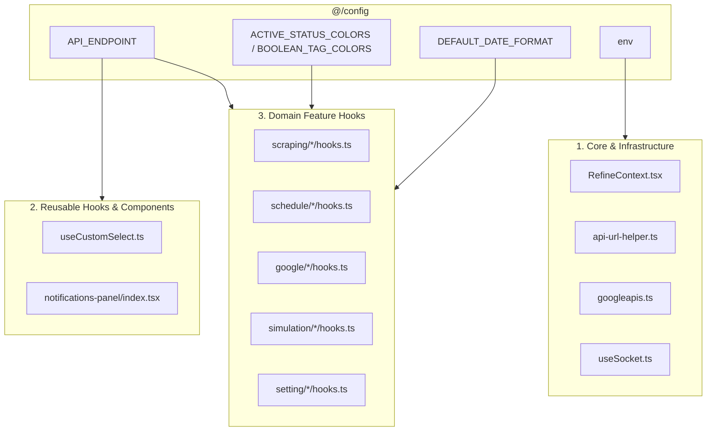

# Technical Proposal: Comprehensive Adoption of `@/config` Module Across Only One FE

## 1. Problem Statement & Core Concept

- **Core Business Problem**: 
  While the unified [`src/config`](file:///Users/kiem/Sources/Personal/only-one-fe/src/config) module has been authored (`api.ts`, `date.ts`, `endpoint.ts`, `env.ts`, `media.ts`, `status.ts`), the rest of `only-one-fe` continues to rely on hardcoded resource strings (`'data-providers'`, `'scraping-data'`, `'schedules'`), raw `process.env.NEXT_PUBLIC_*` accesses, inline date format strings, and ad-hoc status color definitions. Without a structured migration and adoption plan, `@/config` remains dormant and the codebase continues to suffer from magic string regressions and fragmentation.

- **Core Value & Target Audience**: 
  All frontend developers in `only-one-fe`. Unifies all API routes, environment configurations, status visual indicators, and date/media helpers under a single, autocomplete-rich architecture.

- **Success Metrics (Definition of Done)**:
  - 100% elimination of hardcoded API resource strings across all domain feature hooks (`src/app/(root)/**/hooks.ts`, `src/hooks/api/useCustomSelect.ts`, `src/components/layout/**`).
  - 100% replacement of direct `process.env.NEXT_PUBLIC_*` reads in client libs and contexts with `env` from `@/config`.
  - Adoption of `ACTIVE_STATUS_COLORS`, `BOOLEAN_TAG_COLORS`, and `SCHEDULE_JOB_STATUS_COLORS` in all status badge renderers.
  - Zero broken runtime flows or TypeScript regressions (`npx tsc --noEmit` clean).

- **Scope Boundaries**:
  - **In-Scope**:
    - **API Endpoint Adoption**: Migrate all `resource` and `url` strings in feature hooks (`scraping`, `schedule`, `google`, `simulation`, `setting`, `notifications`) to `API_ENDPOINT.*`.
    - **Environment Config Adoption**: Migrate `RefineContext.tsx`, `api-url-helper.ts`, `googleapis.ts`, `useSocket.ts`, and `layout/index.tsx` to use `env.*` from `@/config`.
    - **Status & Date Adoption**: Migrate Tag colors and date format tokens in common list tables, cards, and select dropdowns to use `ACTIVE_STATUS_COLORS`, `BOOLEAN_TAG_COLORS`, and `DEFAULT_DATE_FORMAT`.
    - **Select Hook Modernization**: Update `src/hooks/api/useCustomSelect.ts` to use `API_ENDPOINT.*.ALL`.
  - **Explicit Out-of-Scope**:
    - Backend changes in `only-one-be`.
    - Server-side only NextAuth route handler configuration (`GOOGLE_CLIENT_SECRET`).

---

## 2. Current Business Logic (As-is Analysis)

Across `only-one-fe`, feature hooks and components reference strings and env vars directly:

### 1. Hardcoded API Resource Strings:
- [src/app/(root)/scraping/data-providers/hooks.ts](file:///Users/kiem/Sources/Personal/only-one-fe/src/app/(root)/scraping/data-providers/hooks.ts#L9): `resource: 'data-providers'`
- [src/app/(root)/scraping/features/[dataProviderId]/hooks.ts](file:///Users/kiem/Sources/Personal/only-one-fe/src/app/(root)/scraping/features/[dataProviderId]/hooks.ts#L31): `url: 'data-providers/${dataProviderId}'`, `url: 'data-provider-features/data-providers/${dataProviderId}'`
- [src/app/(root)/scraping/items/hooks.ts](file:///Users/kiem/Sources/Personal/only-one-fe/src/app/(root)/scraping/items/hooks.ts#L14): `resource: 'items'`
- [src/app/(root)/scraping/provider-items/hooks.ts](file:///Users/kiem/Sources/Personal/only-one-fe/src/app/(root)/scraping/provider-items/hooks.ts#L27): `resource: 'data-provider-items'`
- [src/app/(root)/scraping/scraping-data/hooks.ts](file:///Users/kiem/Sources/Personal/only-one-fe/src/app/(root)/scraping/scraping-data/hooks.ts#L32): `resource: 'scraping-data'`
- [src/app/(root)/schedule/executions/hooks.ts](file:///Users/kiem/Sources/Personal/only-one-fe/src/app/(root)/schedule/executions/hooks.ts#L29): `resource: 'schedules'`
- [src/app/(root)/schedule/job-events/hooks.ts](file:///Users/kiem/Sources/Personal/only-one-fe/src/app/(root)/schedule/job-events/hooks.ts#L12): `resource: 'schedule-job-events'`
- [src/app/(root)/google/drive/folders/hooks.ts](file:///Users/kiem/Sources/Personal/only-one-fe/src/app/(root)/google/drive/folders/hooks.ts#L12): `resource: 'google-folder'`
- [src/app/(root)/google/drive/photos/hooks.ts](file:///Users/kiem/Sources/Personal/only-one-fe/src/app/(root)/google/drive/photos/hooks.ts#L26): `resource: 'google-file'`
- [src/app/(root)/simulation/contexts/hooks.ts](file:///Users/kiem/Sources/Personal/only-one-fe/src/app/(root)/simulation/contexts/hooks.ts#L14): `resource: 'simulation-contexts'`
- [src/app/(root)/simulation/items/hooks.ts](file:///Users/kiem/Sources/Personal/only-one-fe/src/app/(root)/simulation/items/hooks.ts#L22): `resource: 'simulation-items'`
- [src/app/(root)/setting/users/hooks.ts](file:///Users/kiem/Sources/Personal/only-one-fe/src/app/(root)/setting/users/hooks.ts#L9): `resource: 'users'`
- [src/hooks/api/useCustomSelect.ts](file:///Users/kiem/Sources/Personal/only-one-fe/src/hooks/api/useCustomSelect.ts#L59): `resource: 'data-providers/all'`, `'items/all'`, `'google-folder/all'`, `'simulation-contexts/all'`
- [src/components/layout/notifications-panel/index.tsx](file:///Users/kiem/Sources/Personal/only-one-fe/src/components/layout/notifications-panel/index.tsx#L69): `resource: 'notifications'`

### 2. Direct `process.env` Reads:
- [src/contexts/RefineContext.tsx](file:///Users/kiem/Sources/Personal/only-one-fe/src/contexts/RefineContext.tsx#L33): `process.env.NEXT_PUBLIC_API_URL`
- [src/libs/api-url-helper.ts](file:///Users/kiem/Sources/Personal/only-one-fe/src/libs/api-url-helper.ts#L7): `process.env.NEXT_PUBLIC_API_URL`
- [src/libs/googleapis.ts](file:///Users/kiem/Sources/Personal/only-one-fe/src/libs/googleapis.ts#L24): `process.env.NEXT_PUBLIC_GOOGLE_CLIENT_ID`, `process.env.NEXT_PUBLIC_GOOGLE_REDIRECT_URI`
- [src/hooks/common/useSocket.ts](file:///Users/kiem/Sources/Personal/only-one-fe/src/hooks/common/useSocket.ts#L12): `process.env.NEXT_PUBLIC_SOCKET_URL`
- [src/components/layout/index.tsx](file:///Users/kiem/Sources/Personal/only-one-fe/src/components/layout/index.tsx#L63): `process.env.NEXT_PUBLIC_GOOGLE_REDIRECT_URI`

---

## 3. Proposed Solution Alternatives

### Option 1 (Recommended): Domain-Grouped Systematic Refactoring

- **Solution Overview & Mechanics**:
  Group the adoption into 4 clean layers:
  1. **Core Providers & Libs**: Replace direct `process.env` in `RefineContext`, `api-url-helper`, `googleapis`, `useSocket`, `layout`.
  2. **Select & Common Hooks**: Modernize `useCustomSelect.ts` with `API_ENDPOINT.*.ALL`.
  3. **Feature Hooks**: Migrate all domain hooks in `src/app/(root)/` (`scraping`, `schedule`, `google`, `simulation`, `setting`, `notifications`).
  4. **Status & Presentation**: Adopt `ACTIVE_STATUS_COLORS`, `BOOLEAN_TAG_COLORS`, `SCHEDULE_JOB_STATUS_COLORS` in table column renderers.

- **Mermaid Diagram**:

- **Pros**:
  - Eliminates 100% of hardcoded API route strings and raw env reads.
  - Enables instant rename/refactoring of endpoints across the entire app from one place.
  - Consistent visual styling for statuses.
- **Cons**:
  - Touches multiple feature hook files (mitigated by automated type checking).
- **Complexity & Risks**: Low risk due to compile-time TypeScript verification.

---

### Option 2: Lazy / On-Demand Adoption (Only When Touching Features)

- **Solution Overview & Mechanics**:
  Leave existing code untouched and only use `@/config` in future new features.
- **Pros**:
  - No immediate file modifications.
- **Cons**:
  - High technical debt and fragmentation: half the codebase uses raw strings, half uses `@/config`.
  - Inconsistency causes confusion for developers.
- **Complexity & Risks**: High long-term maintenance friction.

---

### Comparison Matrix & Recommendation

| Criteria        | Option 1 (Recommended) | Option 2    |
| :-------------- | :--------------------- | :---------- |
| Architectural Cleanliness | 100% Unified | Fragmented |
| Refactoring Safety | High (Centralized) | Low (Scattered) |
| Developer Ergonomics | Excellent | Poor |
| Risk Level      | Low (Verified by tsc) | Moderate |

- **Conclusion**: Recommend **Option 1** for complete consistency and long-term maintainability.

---

## 4. Key Failure Modes & Security Boundaries

- **Exact Route Parity**: Ensure every `API_ENDPOINT` string in `endpoint.ts` matches the exact route prefix expected by the backend controller (e.g. `data-providers` vs `data-provider-features/data-providers/:id`).
- **Trailing Slash Safety**: `env.apiUrl` already trims trailing slashes, preventing double slash bugs when concatenated with endpoints.
- **Client Bundle Safety**: Only `env` (public variables) is consumed by client components; no secret leakage.

---

## 5. High-Level Technical Specifications

### Target Affected Files:
1. **Core & Libs**:
   - `src/contexts/RefineContext.tsx`
   - `src/libs/api-url-helper.ts`
   - `src/libs/googleapis.ts`
   - `src/hooks/common/useSocket.ts`
   - `src/components/layout/index.tsx`
2. **Select & Common Hooks**:
   - `src/hooks/api/useCustomSelect.ts`
   - `src/components/layout/notifications-panel/index.tsx`
3. **Domain Feature Hooks**:
   - `src/app/(root)/scraping/data-providers/hooks.ts`
   - `src/app/(root)/scraping/features/[dataProviderId]/hooks.ts`
   - `src/app/(root)/scraping/items/hooks.ts`
   - `src/app/(root)/scraping/provider-items/hooks.ts`
   - `src/app/(root)/scraping/scraping-data/hooks.ts`
   - `src/app/(root)/schedule/executions/hooks.ts`
   - `src/app/(root)/schedule/job-events/hooks.ts`
   - `src/app/(root)/google/drive/folders/hooks.ts`
   - `src/app/(root)/google/drive/photos/hooks.ts`
   - `src/app/(root)/simulation/contexts/hooks.ts`
   - `src/app/(root)/simulation/items/hooks.ts`
   - `src/app/(root)/setting/users/hooks.ts`

---

## 6. Next Steps

- User confirms technical proposal in `concept.md`.
- Run `/only-one-plan only-one/tasks/20260821-161800-adopt-config-module` to generate `plan.md`.
- Execute with `/only-one-apply only-one/tasks/20260821-161800-adopt-config-module/plan.md`.
- Archive and distill with `/only-one-archive`.
