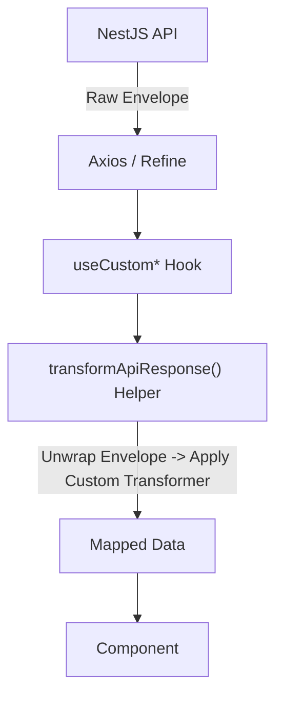

# Technical Proposal: Standardized BE Response Transformer & Custom Mapping in API Hooks

## 1. Problem Statement & Core Concept

- **Core Business Problem**: Currently, backend (BE) endpoints return responses wrapped in standard formats:
  1. Standard API response (via [`TransformResponseInterceptor`](file:///Users/kiem/Sources/Personal/only-one-be/src/interceptors/transform-response.interceptor.ts)): `{ data: T, errors: null, isSuccess: true }`.
  2. Paginated API response (via [`BaseController:getPagination`](file:///Users/kiem/Sources/Personal/only-one-be/src/common/base.controller.ts#L104-L116)): `{ data: T[], meta: { itemsPerPage, totalItems, currentPage, totalPages, ... }, links: { ... } }`.
  
  In the frontend ([`src/hooks/api`](file:///Users/kiem/Sources/Personal/only-one-fe/src/hooks/api)), consumers of hooks (e.g. `useCustomData`, `useCustomOne`, `useCustomList`, `useCustomTable`) often have to manually perform repetitive unnesting, null-checks, array fallbacks, and data transformations (e.g., `res?.data?.data || provider?.features || []`). Furthermore, there is no centralized, standardized default unwrap mechanism or first-class `transform` / `select` callback exposed on custom API hooks to allow callers to seamlessly shape the data right at the query hook level.
- **Core Value & Target Audience**: 
  - **Frontend Developers**: Eliminates boilerplate data unnesting (`res?.data?.data`), ensures strong type-safety, and provides intuitive `transform` / `select` hooks options.
  - **System Consistency**: Unifies response handling across all REST endpoints while maintaining full backward-compatibility and zero-boilerplate defaults.
- **Success Metrics (Definition of Done)**:
  - 100% of standard BE response envelopes (`ResponseDto` and `Paginated`) are handled and unwrapped by default in [`RestServer`](file:///Users/kiem/Sources/Personal/only-one-fe/src/providers/data-provider.ts) and API hooks.
  - All query hooks (`useCustomOne`, `useCustomList`, `useCustomData`, `useCustomTable`, `useCustomSelect`) support optional `transform` / `select` parameters with full TypeScript generics.
  - Existing hook consumers continue functioning without breaking changes.
- **Scope Boundaries**:
  - **In-Scope**:
    - Standardization of BE response unwrapping in `RestServer` (`getList`, `getOne`, `custom`, `getMany`).
    - Adding `transform` (and/or TanStack Query `select`) support across [`src/hooks/api/`](file:///Users/kiem/Sources/Personal/only-one-fe/src/hooks/api).
    - Updating `useCustomData`, `useCustomOne`, `useCustomList`, `useCustomTable`, and `useCustomSelect` with proper return types and default transformations.
  - **Explicit Out-of-Scope**:
    - Altering Backend response interceptors or controller contracts.
    - Modifying global authentication or third-party OAuth payload formats.

---

## 2. Current Business Logic (As-is Analysis)

### 2.1 Backend Contract (Ground Truth)
1. **Single / Mutation Responses** ([`TransformResponseInterceptor`](file:///Users/kiem/Sources/Personal/only-one-be/src/interceptors/transform-response.interceptor.ts)):
   ```typescript
   export interface ResponseDto<T> {
       data: T;
       errors: string[] | null;
       isSuccess: boolean;
   }
   ```
2. **Paginated Responses** ([`BaseController`](file:///Users/kiem/Sources/Personal/only-one-be/src/common/base.controller.ts#L104-L116) / `Paginated<T>`):
   ```typescript
   export interface Paginated<T> {
       data: T[];
       meta: {
           itemsPerPage: number;
           totalItems: number;
           currentPage: number;
           totalPages: number;
           sortBy?: string[][];
           searchBy?: string[];
           search?: string;
           filter?: Record<string, string | string[]>;
       };
       links: { first?: string; previous?: string; current: string; next?: string; last?: string };
   }
   ```

### 2.2 Frontend As-is Execution Flow & Bottlenecks
- **[`RestServer`](file:///Users/kiem/Sources/Personal/only-one-fe/src/providers/data-provider.ts)**:
  - `getOne`: Returns `{ data: data.data }`. If BE returns `{ data: { ... } }`, it unwraps 1 level, but if the endpoint returns raw data or nested custom shapes, it can behave inconsistently.
  - `getList`: Unpacks `apiResponseData.data` and `apiResponseData.meta`.
  - `custom`: Returns raw Axios response without standard unwrapping.
- **[`src/hooks/api`](file:///Users/kiem/Sources/Personal/only-one-fe/src/hooks/api)**:
  - `useCustomData`: Exposes raw `result.data` (nested inside Axios `data.data`), forcing components to do `providerResult?.data?.data as IDataProvider`.
  - `useCustomOne` / `useCustomList`: Return Refine's raw `query` and `result` without typed custom transform callbacks.
  - Components often have multi-line fallback and mapping logic scattered in page hooks:
    ```typescript
    const rawFeatures = (featuresResult?.data || provider?.features || []) as IDataProviderFeature[];
    const features: IDataProviderFeature[] = Array.isArray(rawFeatures) ? rawFeatures : [];
    ```

---

## 3. Proposed Solution Alternatives

### Option 1 (Recommended): Unified Two-Tier Transformation (DataProvider Unwrap + Hook-Level `transform` / `select`)

- **Solution Overview & Mechanics**:
  1. **Tier 1 (Transport/DataProvider Layer - Default BE Unwrap)**:
     - `RestServer` handles standard BE responses:
       - If response has `{ data: ..., meta: ..., links: ... }` (Paginated) $\rightarrow$ extract `data`, `meta`, `total`.
       - If response has `{ data: ..., isSuccess: true }` (Standard `ResponseDto`) $\rightarrow$ extract `data`.
       - If raw response $\rightarrow$ fallback gracefully.
  2. **Tier 2 (Hook Layer - Custom Transform Callback & Generics)**:
     - Provide `transform?: (data: TData) => TTransformed` (or leveraging TanStack Query's `select`) in `useCustomOne`, `useCustomList`, `useCustomData`, `useCustomTable`, `useCustomSelect`.
     - Defaults: When `transform` is not provided, hooks return `TData` directly unwrapped.
     - When `transform` is provided, the hook returns `TTransformed` with full type inference and memoization.

```mermaid
flowchart TD
    subgraph Backend [NestJS Backend]
        API_PAGINATED["GET /data-providers (Paginated)"] -->|Paginated: data, meta, links| BE_OUT
        API_ONE["GET /data-providers/:id (Normal)"] -->|ResponseDto: data, isSuccess| BE_OUT
        BE_OUT["HTTP Response JSON"]
    end

    subgraph DataProvider [FE RestServer / Axios]
        BE_OUT --> REST_SERVER["RestServer (Default BE Envelope Unwrapper)"]
        REST_SERVER -->|Standardized BaseRecord / ListResponse| REFINE_CORE["Refine / TanStack Query Cache"]
    end

    subgraph Hooks [src/hooks/api/*]
        REFINE_CORE --> HOOK_CHECK{"Caller supplied 'transform'?"}
        HOOK_CHECK -->|No (Default)| DEFAULT_DATA["Unwrapped Data: TData"]
        HOOK_CHECK -->|Yes (Custom)| CUSTOM_TRANSFORM["transform(data) -> TTransformed"]
    end

    subgraph UI [Page / Component Hooks]
        DEFAULT_DATA --> CONSUMER["Page Hook (e.g. useDataProviderFeaturesPage)"]
        CUSTOM_TRANSFORM --> CONSUMER
    end
```

- **Pros**:
  - Clean separation of concerns: transport unwrap happens once in `dataProvider`, domain/view mapping happens in hooks.
  - Zero boilerplate for 90% of standard APIs.
  - Powerful customization via `transform` for edge cases (e.g. fallback chains, data normalizers, sorting).
  - High performance: TanStack Query `select` only recomputes when data changes.
- **Cons**:
  - Need to update TypeScript generic signatures in `src/hooks/api/`.
- **Complexity & Risks**: Low complexity, low risk.

---

### Option 2 (Alternative): Hook-Only Middleware / Transformer Pipeline

- **Solution Overview & Mechanics**:
  - Keep `RestServer` unmodified.
  - Implement a centralized `transformApiResponse(response, customTransformer?)` helper function inside each custom hook in `src/hooks/api/`.
  - Every hook runs data through this transformer before returning.



- **Pros**:
  - Does not touch `RestServer` / `dataProvider.ts`.
- **Cons**:
  - Duplicated parsing logic across hook wrappers.
  - Refine's internal cache holds raw nested envelope instead of clean entities.
- **Complexity & Risks**: Low-to-moderate complexity; slightly less architectural elegance.

---

### Comparison Matrix & Recommendation

| Criteria | Option 1 (Recommended): Two-Tier Pipeline | Option 2: Hook-Only Transformer |
| :--- | :--- | :--- |
| **Architectural Cleanliness** | ⭐⭐⭐⭐⭐ (Transport vs Domain separation) | ⭐⭐⭐ (Hook coupling) |
| **DX & Ease of Use** | ⭐⭐⭐⭐⭐ (Clean `data` directly, optional `transform`) | ⭐⭐⭐⭐ (Requires hook wrapper unpacking) |
| **Type Safety & Generics** | ⭐⭐⭐⭐⭐ (Full `TData` $\rightarrow$ `TTransformed` inference) | ⭐⭐⭐⭐ |
| **Cache Purity** | ⭐⭐⭐⭐⭐ (Clean normalized data in query cache) | ⭐⭐⭐ (Nested `{ data: { data: ... } }` in cache) |
| **Refine Compatibility** | ⭐⭐⭐⭐⭐ (Fully aligns with Refine dataProvider protocol) | ⭐⭐⭐⭐ |

- **Recommendation**: **Option 1** is strongly recommended because it addresses the root cause at the DataProvider layer while empowering every hook with a flexible, memoized `transform` prop.

---

## 4. Key Failure Modes & Edge Cases

1. **Non-Standard Responses**:
   - Endpoints returning raw primitive values (boolean, string) or non-standard arrays/objects without `data` envelope.
   - *Mitigation*: Safe unwrap helper that checks `data?.data !== undefined ? data.data : data`.
2. **Error Responses**:
   - Error envelopes (`isSuccess: false` or HTTP error status).
   - *Mitigation*: Handled via Axios interceptor / Refine `HttpError` mapper without triggering transformer on failed queries.
3. **Empty or Null Responses**:
   - Query returns `null` / `undefined` when disabled or pending.
   - *Mitigation*: `transform` callback is guarded and only invoked when data is present; hooks provide sensible fallback defaults.

---

## 5. High-Level Technical Specifications

### 5.1 Updated Hook Signature Example (`useCustomOne`)
```typescript
export interface UseCustomOneRequest<TData extends BaseRecord = any, TTransformed = TData>
    extends Omit<RefineUseOneRequest<TData>, 'id' | 'resource'> {
    resource: string;
    id?: string | number | null;
    transform?: (data: TData | undefined) => TTransformed;
}
```

### 5.2 Updated Hook Signature Example (`useCustomList`)
```typescript
export interface UseCustomListRequest<TData extends BaseRecord = any, TTransformed = TData[]>
    extends Omit<RefineUseListRequest<TData>, 'resource'> {
    resource: string;
    transform?: (data: TData[]) => TTransformed;
}
```

### 5.3 Consumer Usage Example in `features/[dataProviderId]/hooks.ts`
```typescript
// Query Features with built-in fallback transformation directly in hook
const { query: featuresQuery, data: features } = useCustomList<IDataProviderFeature>({
    resource: API_ENDPOINT.DATA_PROVIDER_FEATURES.BY_PROVIDER(dataProviderId),
    enabled: Boolean(dataProviderId),
    transform: (features) => (features?.length ? features : provider?.features || []),
});
```

---

## 6. Next Steps

1. User confirms the proposed intent and architecture in `concept.md`.
2. Run `/only-one-plan only-one/tasks/20260821-163500-api-hooks-response-transform-support` to author the detailed implementation plan.
3. Execute with `/only-one-apply only-one/tasks/20260821-163500-api-hooks-response-transform-support`.
