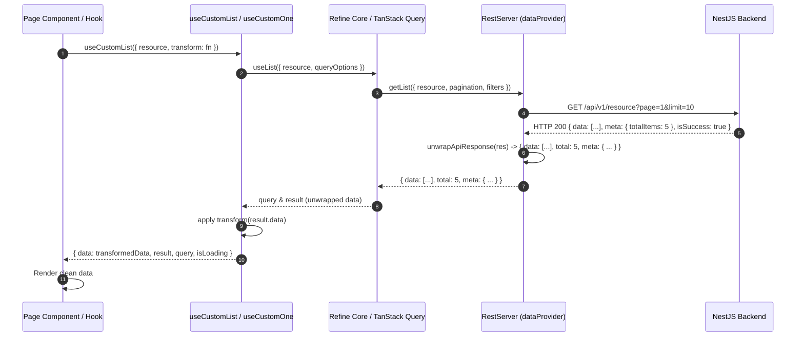

# Implementation Plan: Standardized BE Response Transformer & Custom Mapping in API Hooks

## Section 1. Current State

### 1.1 Verified Current Behavior
- Backend services return responses formatted by two primary decorators/interceptors:
  1. **Standard REST Endpoints** via [`TransformResponseInterceptor`](file:///Users/kiem/Sources/Personal/only-one-be/src/interceptors/transform-response.interceptor.ts): Envelops payloads into `ResponseDto<T> = { data: T, errors: null, isSuccess: true }`.
  2. **Paginated Endpoints** via [`BaseController:getPagination`](file:///Users/kiem/Sources/Personal/only-one-be/src/common/base.controller.ts#L104-L116): Returns `Paginated<T> = { data: T[], meta: { itemsPerPage, totalItems, currentPage, totalPages, ... }, links: { ... } }`.
- In the Frontend ([`src/providers/data-provider.ts`](file:///Users/kiem/Sources/Personal/only-one-fe/src/providers/data-provider.ts) and [`src/hooks/api`](file:///Users/kiem/Sources/Personal/only-one-fe/src/hooks/api)):
  - [`RestServer`](file:///Users/kiem/Sources/Personal/only-one-fe/src/providers/data-provider.ts#L143-L299) assumes direct envelope unwrapping for `getOne` (`data.data`), but `getList` and `custom` do not handle variations (e.g. `ResponseDto<T[]>` vs `Paginated<T>`).
  - [`useCustomData`](file:///Users/kiem/Sources/Personal/only-one-fe/src/hooks/api/useCustomData.ts) returns raw Axios response `result.data` (nested inside `data.data`), forcing components to do `result?.data?.data as IDataProvider`.
  - [`useCustomOne`](file:///Users/kiem/Sources/Personal/only-one-fe/src/hooks/api/useCustomOne.ts) and [`useCustomList`](file:///Users/kiem/Sources/Personal/only-one-fe/src/hooks/api/useCustomList.ts) return raw Refine responses without an explicit `transform` option or a unified `data` accessor.
  - Page-level hooks like [`features/[dataProviderId]/hooks.ts`](file:///Users/kiem/Sources/Personal/only-one-fe/src/app/%28root%29/scraping/features/%5BdataProviderId%5D/hooks.ts#L44-L48) are forced to perform defensive unnesting, null-checks, and fallback parsing locally:
    ```typescript
    const rawFeatures = (featuresResult?.data || provider?.features || []) as IDataProviderFeature[];
    const features: IDataProviderFeature[] = Array.isArray(rawFeatures) ? rawFeatures : [];
    ```

### 1.2 Invariant Behaviors (Must Remain Unchanged)
- **Refine Protocol Compatibility**: `getList`, `getOne`, `getMany`, `create`, `update`, `deleteOne` in `RestServer` must still return the exact shape expected by Refine (`{ data, total, meta }` for lists and `{ data }` for single entities).
- **Notification Flow**: `getErrorNotification` and `getSuccessNotification` mechanisms must remain intact across all hooks.
- **Backward Compatibility**: Existing hooks and consumers omitting `transform` must continue working seamlessly.

---

## Section 2. Detailed Design

### 2.1 Two-Tier Transformation Architecture
1. **Tier 1: Transport & DataProvider Layer (`src/providers/data-provider.ts`)**:
   - Centralize safe unwrapping of BE responses with helper `unwrapApiResponse(response)`:
     - If payload is `Paginated<T>` (`payload.data` is array + `payload.meta` exists) $\rightarrow$ extract `data: payload.data`, `meta: payload.meta`, `total: payload.meta.totalItems`.
     - If payload is `ResponseDto<T>` (`payload.data` exists + `payload.isSuccess` is boolean) $\rightarrow$ extract `data: payload.data`.
     - If payload is raw array/object $\rightarrow$ return payload directly.
2. **Tier 2: Hook Layer (`src/hooks/api/*`)**:
   - Provide a typed `transform` callback prop on all data-fetching hooks:
     - `useCustomOne<TData, TTransformed>`
     - `useCustomList<TData, TTransformed>`
     - `useCustomData<TData, TTransformed>`
     - `useCustomTable<TData, TTransformed>`
     - `useCustomSelect<TData>`
   - Memoize transformed values with `useMemo` so re-renders do not cause unnecessary component churn.
   - Return both `data` (the unwrapped/transformed entity/array) and the raw `query` / `result` for full control.

### 2.2 Component State Flow & Wireframe (Data Pipeline)

```text
+-----------------------------------------------------------------------------------+
|                            API Response Data Pipeline                              |
+-----------------------------------------------------------------------------------+
| 1. Backend REST API                                                               |
|    - Standard:  { data: { ...entity }, errors: null, isSuccess: true }            |
|    - Paginated: { data: [ ...items ], meta: { totalItems: 42, ... }, links: { } } |
+-----------------------------------------------------------------------------------+
                                         │
                                         ▼
+-----------------------------------------------------------------------------------+
| 2. RestServer (Transport Envelope Unwrapper)                                      |
|    - unwrapApiResponse() handles Paginated vs ResponseDto vs Raw                  |
|    - Produces clean Refine GetListResponse / GetOneResponse                        |
+-----------------------------------------------------------------------------------+
                                         │
                                         ▼
+-----------------------------------------------------------------------------------+
| 3. API Custom Hook (useCustomOne / useCustomList / useCustomData)                  |
|    - Has 'transform' prop?                                                        |
|      ├─ YES ──> transform(unwrappedData) ──> memoized 'data' & 'result'           |
|      └─ NO  ──> unwrappedData            ──> default 'data' & 'result'            |
+-----------------------------------------------------------------------------------+
                                         │
                                         ▼
+-----------------------------------------------------------------------------------+
| 4. UI Hook / Component Consumer                                                   |
|    const { data: features, isLoading } = useCustomList({                          |
|        resource: API_ENDPOINT.DATA_PROVIDER_FEATURES.BY_PROVIDER(dataProviderId), |
|        transform: (items) => items.length ? items : provider?.features || [],     |
|    });                                                                            |
+-----------------------------------------------------------------------------------+
```

### 2.3 Adversarial Red-Team Analysis (`doubt-driven-development`)
- **CLAIM**: `RestServer` unwrap might break custom endpoints returning nested objects where the key happens to be `data`.
  - **DOUBT**: What if an entity has a property named `data` (e.g. `{ id: '1', data: '{"foo":"bar"}' }`)?
  - **RECONCILE**: Check `isSuccess` boolean or `errors` property for `ResponseDto`, or `meta` for `Paginated`. Do not unwrap generic objects blindly if they do not match the BE envelope signatures.
- **CLAIM**: `transform` callback references may cause infinite re-renders if passed as an inline anonymous function.
  - **DOUBT**: If caller passes `transform: (d) => ...`, a new function reference is created on every render.
  - **RECONCILE**: Memoize using `useMemo` with `[rawData, transform]` dependencies or stable reference pattern.

---

## Section 3. Implementation Architecture

### 3.1 Directory & File Scaffold
```text
only-one-fe/
└── src/
    ├── providers/
    │   └── data-provider.ts             # [MODIFY] Standardize response envelope unwrapping
    ├── hooks/
    │   └── api/
    │       ├── useCustomData.ts         # [MODIFY] Add transform prop & unwrapped data property
    │       ├── useCustomOne.ts          # [MODIFY] Add transform prop, generic TTransformed, memoized data
    │       ├── useCustomList.ts         # [MODIFY] Add transform prop, generic TTransformed, memoized data
    │       ├── useCustomTable.ts        # [MODIFY] Add transform prop for table dataSource
    │       ├── useCustomSelect.ts       # [MODIFY] Support custom item transform / filters
    │       └── index.ts                 # [MODIFY] Ensure clean type & hook exports
    └── app/
        └── (root)/
            └── scraping/
                └── features/
                    └── [dataProviderId]/
                        └── hooks.ts     # [MODIFY] Adopt clean hook-level transform for features fallback
```

### 3.2 Sequence Diagram (`c4-diagrams`)



---

## Section 4. Implementation Code Examples

### 4.1 [MODIFY] [`src/providers/data-provider.ts`](file:///Users/kiem/Sources/Personal/only-one-fe/src/providers/data-provider.ts)
- **Summary**: Add standard `unwrapApiResponse` and unwrap Paginated and standard `ResponseDto` responses across `getList`, `getOne`, `getMany`, and `custom`.
- **Symbols**:
  - Add `unwrapResponseData<T>(responsePayload: any): { data: T; meta?: any; total?: number }`
- **Illustrative Code**:
```typescript
export const unwrapResponseData = (payload: any) => {
    if (!payload) return { data: payload, total: 0 };

    // Paginated: { data: T[], meta: { totalItems: number, ... }, links: { ... } }
    if (Array.isArray(payload.data) && payload.meta) {
        return {
            data: payload.data,
            meta: payload.meta,
            extraData: payload.extraData,
            total: payload.meta.totalItems ?? payload.data.length,
        };
    }

    // ResponseDto with array: { data: T[], isSuccess: true }
    if (Array.isArray(payload.data) && (payload.isSuccess !== undefined || payload.errors !== undefined)) {
        return {
            data: payload.data,
            meta: payload.meta,
            extraData: payload.extraData,
            total: payload.meta?.totalItems ?? payload.data.length,
        };
    }

    // ResponseDto with single entity: { data: T, isSuccess: true }
    if (payload.data !== undefined && (payload.isSuccess !== undefined || payload.errors !== undefined)) {
        return {
            data: payload.data,
            meta: payload.meta,
            total: 1,
        };
    }

    // Raw array
    if (Array.isArray(payload)) {
        return {
            data: payload,
            total: payload.length,
        };
    }

    // Fallback: return payload as-is
    return {
        data: payload.data !== undefined ? payload.data : payload,
        meta: payload.meta,
        total: payload.total ?? (Array.isArray(payload.data) ? payload.data.length : 1),
    };
};
```

---

### 4.2 [MODIFY] [`src/hooks/api/useCustomOne.ts`](file:///Users/kiem/Sources/Personal/only-one-fe/src/hooks/api/useCustomOne.ts)
- **Summary**: Add generic `TTransformed = TData`, support `transform` prop, and return unified `data` and `result`.
- **Illustrative Code**:
```typescript
import { useMemo } from 'react';
import { getErrorNotification, NotificationAction } from '@/utilities';
import type { BaseRecord, HttpError } from '@refinedev/core';
import { useOne } from '@refinedev/core';

type RefineUseOneRequest<TData extends BaseRecord> = Parameters<typeof useOne<TData, HttpError>>[0];

export type UseCustomOneRequest<
    TData extends BaseRecord = BaseRecord,
    TTransformed = TData,
> = Omit<RefineUseOneRequest<TData>, 'id' | 'queryOptions' | 'resource'> & {
    resource: string;
    id?: RefineUseOneRequest<TData>['id'] | null;
    enabled?: boolean;
    errorMessage?: string;
    queryOptions?: RefineUseOneRequest<TData>['queryOptions'];
    successMessage?: string;
    transform?: (data: TData | undefined) => TTransformed;
};

export const useCustomOne = <
    TData extends BaseRecord = BaseRecord,
    TTransformed = TData,
>({
    id,
    resource,
    enabled,
    errorMessage,
    queryOptions,
    errorNotification,
    successNotification = false,
    transform,
    ...rest
}: UseCustomOneRequest<TData, TTransformed>) => {
    const refineResult = useOne<TData, HttpError>({
        ...rest,
        resource,
        id: id ?? '',
        errorNotification: getErrorNotification({
            resource,
            errorNotification,
            message: errorMessage,
            action: NotificationAction.Load,
        }),
        successNotification,
        queryOptions: {
            ...queryOptions,
            enabled: enabled ?? queryOptions?.enabled ?? Boolean(id),
        },
    });

    const rawData = refineResult.data?.data ?? refineResult.result;

    const transformedData = useMemo(() => {
        if (transform) {
            return transform(rawData);
        }
        return rawData as unknown as TTransformed;
    }, [rawData, transform]);

    return {
        ...refineResult,
        data: transformedData,
        result: transformedData,
    };
};
```

---

### 4.3 [MODIFY] [`src/hooks/api/useCustomList.ts`](file:///Users/kiem/Sources/Personal/only-one-fe/src/hooks/api/useCustomList.ts)
- **Summary**: Add generic `TTransformed = TData[]`, support `transform` prop, and return unwrapped `data`.
- **Illustrative Code**:
```typescript
import { useMemo } from 'react';
import { DEFAULT_PAGE_INDEX, DEFAULT_PAGE_SIZE, DEFAULT_SORTERS } from '@/config';
import { getErrorNotification, NotificationAction } from '@/utilities';
import type { BaseRecord, HttpError } from '@refinedev/core';
import { useList } from '@refinedev/core';

type RefineUseListRequest<TData extends BaseRecord> = NonNullable<
    Parameters<typeof useList<TData, HttpError>>[0]
>;

export type UseCustomListRequest<
    TData extends BaseRecord = BaseRecord,
    TTransformed = TData[],
> = Omit<RefineUseListRequest<TData>, 'resource'> & {
    resource: string;
    errorMessage?: string;
    successMessage?: string;
    transform?: (data: TData[]) => TTransformed;
};

export const useCustomList = <
    TData extends BaseRecord = BaseRecord,
    TTransformed = TData[],
>({
    resource,
    errorMessage,
    pagination,
    sorters,
    errorNotification,
    successNotification = false,
    transform,
    ...rest
}: UseCustomListRequest<TData, TTransformed>) => {
    const refineResult = useList<TData, HttpError>({
        ...rest,
        resource,
        pagination: pagination ?? {
            pageSize: DEFAULT_PAGE_SIZE,
            currentPage: DEFAULT_PAGE_INDEX,
        },
        sorters: sorters ?? DEFAULT_SORTERS,
        errorNotification: getErrorNotification({
            resource,
            errorNotification,
            message: errorMessage,
            action: NotificationAction.Load,
        }),
        successNotification,
    });

    const rawList = useMemo(() => {
        const items = refineResult.data?.data ?? refineResult.result?.data ?? [];
        return Array.isArray(items) ? items : [];
    }, [refineResult.data?.data, refineResult.result?.data]);

    const transformedData = useMemo(() => {
        if (transform) {
            return transform(rawList);
        }
        return rawList as unknown as TTransformed;
    }, [rawList, transform]);

    return {
        ...refineResult,
        data: transformedData,
        result: {
            ...refineResult.result,
            data: transformedData as any,
        },
    };
};
```

---

### 4.4 [MODIFY] [`src/hooks/api/useCustomData.ts`](file:///Users/kiem/Sources/Personal/only-one-fe/src/hooks/api/useCustomData.ts)
- **Summary**: Unwrap `result.data` automatically and support optional `transform` callback.
- **Illustrative Code**:
```typescript
export interface UseCustomDataRequest<
    TData extends BaseRecord = any,
    TTransformed = TData,
> {
    url: string;
    query?: Record<string, any>;
    enabled?: boolean;
    refetchInterval?: number | false;
    resource?: string;
    method?: CustomDataMethod;
    errorMessage?: string;
    successMessage?: string;
    errorNotification?: ...;
    successNotification?: ...;
    queryOptions?: Parameters<typeof useCustom<TData, HttpError>>[0]['queryOptions'];
    transform?: (data: TData | undefined, rawResponse?: any) => TTransformed;
}

export const useCustomData = <
    TData extends BaseRecord = any,
    TTransformed = TData,
>({
    url,
    query,
    resource,
    enabled = true,
    method = 'get',
    errorMessage,
    successNotification = false,
    errorNotification,
    refetchInterval,
    queryOptions,
    transform,
}: UseCustomDataRequest<TData, TTransformed>): UseCustomDataResponse<TTransformed> => {
    const apiUrl = useApiUrl();
    const targetUrl = url.startsWith('http') || url.startsWith('/') ? url : `${apiUrl}/${url}`;

    const { query: customQuery, result } = useCustom<TData, HttpError>({
        url: targetUrl,
        method,
        config: { query },
        queryOptions: { enabled, refetchInterval, ...queryOptions },
        errorNotification: ...,
        successNotification,
    });

    const rawResponse = result?.data;
    const unwrappedData = useMemo(() => {
        if (!rawResponse) return undefined;
        if ((rawResponse as any)?.data !== undefined && (rawResponse as any)?.isSuccess !== undefined) {
            return (rawResponse as any).data;
        }
        return (rawResponse as any)?.data !== undefined ? (rawResponse as any).data : rawResponse;
    }, [rawResponse]);

    const transformedData = useMemo(() => {
        if (transform) {
            return transform(unwrappedData as TData, rawResponse);
        }
        return unwrappedData as unknown as TTransformed;
    }, [unwrappedData, rawResponse, transform]);

    return {
        apiUrl,
        result,
        data: transformedData,
        query: customQuery,
    };
};
```

---

### 4.5 [MODIFY] [`src/app/(root)/scraping/features/[dataProviderId]/hooks.ts`](file:///Users/kiem/Sources/Personal/only-one-fe/src/app/(root)/scraping/features/[dataProviderId]/hooks.ts)
- **Summary**: Refactor feature list query to use the new `transform` prop directly in `useCustomList`.
- **Illustrative Code**:
```typescript
    // 1. Query Data Provider details
    const { query: providerQuery, data: provider } = useCustomOne<IDataProvider>({
        resource: API_ENDPOINT.DATA_PROVIDERS.BASE,
        id: dataProviderId,
        enabled: Boolean(dataProviderId),
    });

    // 2. Query all Features for this provider with declarative fallback transform
    const { query: featuresQuery, data: features } = useCustomList<IDataProviderFeature>({
        resource: API_ENDPOINT.DATA_PROVIDER_FEATURES.BY_PROVIDER(dataProviderId),
        queryOptions: {
            enabled: Boolean(dataProviderId),
        },
        transform: (list) => (list && list.length > 0 ? list : provider?.features || []),
    });
```

---

## Section 5. Test Cases

### 5.1 Test Cases Matrix

| Case ID | Objective | Precondition / Setup | Action | Expected Result | Proposed Test File |
| :--- | :--- | :--- | :--- | :--- | :--- |
| **TC-01** | Verify default unwrap of standard BE `ResponseDto` | Mock API returns `{ data: { id: 'p-1', name: 'Google' }, isSuccess: true }` | Call `useCustomOne({ resource: 'data-providers', id: 'p-1' })` | Hook returns `data` equal to `{ id: 'p-1', name: 'Google' }` directly without nested envelope | `src/hooks/api/__tests__/useCustomOne.spec.tsx` |
| **TC-02** | Verify custom `transform` callback on `useCustomOne` | Mock API returns `{ data: { id: 'p-1', name: 'google' } }` | Call `useCustomOne({ ..., transform: (p) => p?.name.toUpperCase() })` | Hook returns `data` equal to `'GOOGLE'` with inferred string type | `src/hooks/api/__tests__/useCustomOne.spec.tsx` |
| **TC-03** | Verify default unwrap of `Paginated` response | Mock API returns `{ data: [{ id: '1' }], meta: { totalItems: 1 } }` | Call `useCustomList({ resource: 'items' })` | Hook returns `data` array `[{ id: '1' }]` and `result.total` = 1 | `src/hooks/api/__tests__/useCustomList.spec.tsx` |
| **TC-04** | Verify fallback `transform` in `useCustomList` | Mock features API returns empty array `[]`, provider has `[{ id: 'f-1' }]` | Call `useCustomList({ ..., transform: (list) => list.length ? list : provider.features })` | Hook returns `data` containing `[{ id: 'f-1' }]` | `src/hooks/api/__tests__/useCustomList.spec.tsx` |
| **TC-05** | Verify `useCustomData` auto-unwrapping | Mock API returns `{ data: { count: 10 }, isSuccess: true }` | Call `useCustomData({ url: '/stats' })` | `data` is `{ count: 10 }` without needing `result.data.data` | `src/hooks/api/__tests__/useCustomData.spec.tsx` |

### 5.2 Verification & Typecheck Commands
```bash
# Type check TypeScript compilation across entire project
npx tsc --noEmit
```
