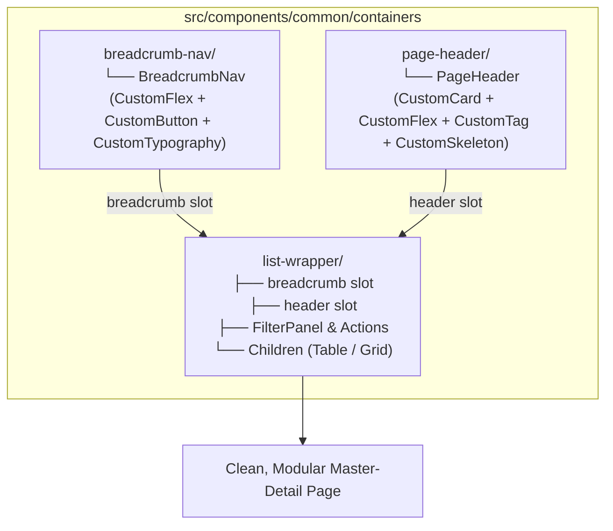

# Technical Proposal: Standardized Breadcrumb Navigation & Page Header Components

## 1. Problem Statement & Core Concept

- **Core Business Problem**:
  In detail and sub-resource management pages (such as [`ProviderFeaturesHeader.tsx`](file:///d:/Sources/Personal/only-one-fe/src/app/(root)/scraping/features/[dataProviderId]/components/ProviderFeaturesHeader.tsx)), there is a recurring UI pattern consisting of two distinct modules:
  1. **Breadcrumb Navigation (`BreadcrumbNav`)**: Back button with an icon (`lucide:arrow-left`), separator (`/`), and current entity/page title hierarchy.
  2. **Page Header Overview Card (`PageHeader`)**: A glassmorphic Ant Design card presenting an entity avatar/icon, main title, identifier/status badges, metadata links (e.g., `baseUrl`), and timestamp details (`createdAt`, `updatedAt`, or custom metadata).

  Currently, these elements are bundled in an ad-hoc local file [`ProviderFeaturesHeader.tsx`](file:///d:/Sources/Personal/only-one-fe/src/app/(root)/scraping/features/[dataProviderId]/components/ProviderFeaturesHeader.tsx) with raw HTML elements. To maximize modularity, theme compliance, and reusability across `only-one-fe`, each capability is separated into its own dedicated component folder within `src/components/common/containers/`:
  - [`src/components/common/containers/breadcrumb-nav/`](file:///d:/Sources/Personal/only-one-fe/src/components/common/containers/breadcrumb-nav)
  - [`src/components/common/containers/page-header/`](file:///d:/Sources/Personal/only-one-fe/src/components/common/containers/page-header)

  Both components strictly prioritize `custom-antd` components (`CustomFlex`, `CustomSpace`, `CustomTypography`, `CustomCard`, `CustomTag`, `CustomButton`, `CustomSkeleton`) over raw HTML tags, while [`ListWrapper`](file:///d:/Sources/Personal/only-one-fe/src/components/common/containers/list-wrapper/index.tsx) provides standardized slots (`breadcrumb` and `header`) to render them cleanly above filters and tables.

- **Core Value & Target Audience**:
  - **Frontend Developers**: High modularity with clean Ant Design primitives, strong TypeScript typing, and reusable layout slots.
  - **End Users**: Predictable navigation hierarchy, responsive desktop/mobile layouts, and smooth skeleton loading states.

- **Success Metrics (Definition of Done)**:
  - Dedicated folder [`src/components/common/containers/breadcrumb-nav/`](file:///d:/Sources/Personal/only-one-fe/src/components/common/containers/breadcrumb-nav) for breadcrumb navigation.
  - Dedicated folder [`src/components/common/containers/page-header/`](file:///d:/Sources/Personal/only-one-fe/src/components/common/containers/page-header) for entity/page overview cards using `custom-antd` with skeleton support.
  - [`ListWrapper`](file:///d:/Sources/Personal/only-one-fe/src/components/common/containers/list-wrapper/index.tsx) updated with optional `breadcrumb` and `header` props.
  - [`ProviderFeaturesHeader.tsx`](file:///d:/Sources/Personal/only-one-fe/src/app/(root)/scraping/features/[dataProviderId]/components/ProviderFeaturesHeader.tsx) refactored to compose these two independent components with 100% visual and functional parity.

- **Scope Boundaries**:
  - **In-Scope**:
    - Creation of `breadcrumb-nav/` folder (`index.tsx`, `types.ts`).
    - Creation of `page-header/` folder (`index.tsx`, `types.ts`).
    - Updating `ListWrapper` to support `breadcrumb?: ReactNode` and `header?: ReactNode` (or `headerBanner?: ReactNode`) slots.
    - Barrel exports in `src/components/common/index.ts`.
    - Refactoring `ProviderFeaturesHeader.tsx`.
  - **Explicit Out-of-Scope**:
    - Global app sidebar / layout header modifications.
    - Backend schema or API endpoint adjustments.

---

## 2. Current Business Logic (As-is Analysis)

### 2.1 As-is Implementation: `ProviderFeaturesHeader.tsx`
[`ProviderFeaturesHeader.tsx`](file:///d:/Sources/Personal/only-one-fe/src/app/(root)/scraping/features/[dataProviderId]/components/ProviderFeaturesHeader.tsx) hardcodes both breadcrumb navigation and entity banner using raw HTML `<div>`, `<span>`, `<h1>`, `<a>` with ad-hoc classes.

### 2.2 As-is Implementation: `ListWrapper.tsx`
[`ListWrapper`](file:///d:/Sources/Personal/only-one-fe/src/components/common/containers/list-wrapper/index.tsx) only hosts actions, filters, and children, without dedicated slots for breadcrumbs or page overview headers.

---

## 3. Proposed Solution Architecture

### Architecture: Decoupled Folders (`breadcrumb-nav` & `page-header`) + `custom-antd` Primitives + `ListWrapper` Slots



---

## 4. High-Level Technical Specifications

### 4.1 Folder Structure
```text
src/components/common/containers/
├── breadcrumb-nav/
│   ├── index.tsx
│   └── types.ts
├── page-header/
│   ├── index.tsx
│   └── types.ts
├── list-wrapper/
│   └── index.tsx
```

### 4.2 Next Steps
1. Author `plan.md` in `only-one/tasks/20260821-215200-common-breadcrumb-banner-container/plan.md`.
2. Apply changes via `/only-one-apply`.
