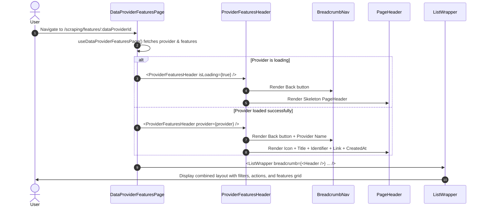

# Implementation Plan: Standardized Breadcrumb Nav & Page Header Container Components

## Section 1. Current State

### 1.1 Verified Current Implementation
- **Ad-hoc Header in Detail Page**:
  [`ProviderFeaturesHeader.tsx`](file:///d:/Sources/Personal/only-one-fe/src/app/(root)/scraping/features/[dataProviderId]/components/ProviderFeaturesHeader.tsx) hardcodes custom JSX with raw HTML (`div`, `span`, `h1`, `a`) for breadcrumb navigation (back button with `lucide:arrow-left`, separator `/`, and title) and an entity overview card (`bg-hub-section/40`, glassmorphism, icon, identifier badge, external link, and created timestamp).
- **Container Structure**:
  [`ListWrapper`](file:///d:/Sources/Personal/only-one-fe/src/components/common/containers/list-wrapper/index.tsx) manages the filter bar (`FilterPanel`), top-right actions (`CardAction[]`), error boundaries (`DataNotFound`), and loading skeletons. However, it lacks dedicated `breadcrumb` and `header` slots to display hierarchical navigation and overview cards above the main card.
- **Page Composition**:
  In [`DataProviderFeaturesPage`](file:///d:/Sources/Personal/only-one-fe/src/app/(root)/scraping/features/[dataProviderId]/page.tsx#L80-L86), `<ProviderFeaturesHeader>` is rendered inside the `children` of `<ListWrapper>`, mixing entity-level context with sub-resource feature list grids.

### 1.2 Identified Limitations & Problems
1. **Raw HTML Usage**: Uses raw `div`, `span`, `h1`, `a` elements instead of `custom-antd` primitives (`CustomFlex`, `CustomTypography`, `CustomCard`, `CustomTag`), violating repository rules in `rules.md`.
2. **Missing Loading States for Headers**: When `provider` is loading, `ProviderFeaturesHeader` renders plain text fallback `"Đang tải..."` without a standard skeleton card.
3. **Lack of Reusable Slots**: Without standard slots in `ListWrapper`, detail pages have varying vertical margins, padding, and layout structures.

### 1.3 Behaviors That Must Remain Unchanged
- Existing `ListWrapper` consumers without `breadcrumb` or `header` props (e.g. standard listing pages) must function with 100% backward compatibility and identical layout.
- `ProviderFeaturesHeader` visual appearance and interaction (navigation back to `/scraping/data-providers`, external URL link, identifier badge, creation date) must be preserved or enhanced with skeleton support.
- Permission-based action filtering and mobile actions dropdown in `ListWrapper` must remain untouched.

---

## Section 2. Detailed Design

### 2.1 Component Architecture & Responsibilities
We design two decoupled, dedicated container folders under [`src/components/common/containers/`](file:///d:/Sources/Personal/only-one-fe/src/components/common/containers/) strictly utilizing `custom-antd` primitives:

1. **`breadcrumb-nav/` (`BreadcrumbNav`)**:
   - Built on `CustomFlex`, `CustomButton`, and `CustomTypography.Text`.
   - Renders a back navigation button (with `lucide:arrow-left` icon, hover token `hover:bg-hub-section`, and accessible focus rings).
   - Renders optional hierarchical breadcrumb segments separated by `/` or a custom separator.
   - Renders the current entity/page title with truncation support (`truncate`).
   - Can be used independently in form pages, detail views, or wizard dialogs.

2. **`page-header/` (`PageHeader`)**:
   - Built on `CustomCard`, `CustomFlex`, `CustomTypography.Title`, `CustomTypography.Paragraph`, `CustomTypography.Link`, `CustomTag`, and `CustomSkeleton`.
   - Left side: Avatar/Icon badge (`bg-hub-primary/10`, `border-hub-primary/20`, `text-hub-primary`), entity/page title, status/identifier `CustomTag`s, and external link with `lucide:external-link`.
   - Right side: Metadata items (key-value labels, dates, custom metrics) and optional `extra` action buttons.
   - Integrated skeleton state using `CustomSkeleton` when `isLoading={true}`.

3. **`ListWrapper` Integration**:
   - Accepts optional `breadcrumb?: ReactNode` and `header?: ReactNode` props.
   - When present, renders `breadcrumb` and `header` sequentially at the top of the container while preserving card wrapping options (`withCard={true|false}`).

### 2.2 ASCII Layout Wireframe

#### Desktop Layout (md and above)
```text
+-----------------------------------------------------------------------------------+
| [< Arrow] Danh sách nhà cung cấp  /  Shopee Data Provider                         |  <-- BreadcrumbNav
+-----------------------------------------------------------------------------------+
| +----------+  Shopee Data Provider  [shopee_sg]                                   |
| | [Database|  https://shopee.sg [->]                          Ngày tạo: 21/08/2026|  <-- PageHeader
| |   Icon]  |                                                                      |
| +----------+                                                                      |
+-----------------------------------------------------------------------------------+
| +---------------------------------------------------------+ +-------------------+ |
| | [Search Input...]  [Status Filter v]                    | | [ + Thêm cài đặt ]| |  <-- ListWrapper Header
| +---------------------------------------------------------+ +-------------------+ |
| +-------------------------------------------------------------------------------+ |
| |  ListTable / Feature Card Grid / Sub-resource Children                        | |  <-- Children
| +-------------------------------------------------------------------------------+ |
+-----------------------------------------------------------------------------------+
```

#### Mobile Layout (< md)
```text
+-------------------------------------------------------+
| [< Arrow] Danh sách...  /  Shopee Data...             |  <-- BreadcrumbNav
+-------------------------------------------------------+
| +-----+  Shopee Data Provider                         |
| |Icon |  [shopee_sg]                                  |  <-- PageHeader
| +-----+  https://shopee.sg [->]                       |
| Ngày tạo: 21/08/2026                                  |
+-------------------------------------------------------+
| [Search Input...]                                     |
| [Status Filter v]                    [ Thao tác v ]   |
| +---------------------------------------------------+ |
| | Sub-resource Children                             | |
| +---------------------------------------------------+ |
+-------------------------------------------------------+
```

### 2.3 5-State Component Matrix

| State | `BreadcrumbNav` | `PageHeader` | `ListWrapper` |
| :--- | :--- | :--- | :--- |
| **1. Loading** | Shows Back button + Skeleton text for title | Shows `CustomSkeleton active` with avatar & rows | Full card skeleton if `isLoading` on ListWrapper |
| **2. Error** | Shows Back button + fallback error title | Hidden or error alert banner | Displays `DataNotFound` with retry button |
| **3. Empty Data** | Shows Back button + default title | Title only with missing fields cleanly omitted | Renders empty state inside children table/grid |
| **4. Success (Populated)** | Full breadcrumb hierarchy | Complete icon, title, badges, link, and metadata | Normal filter bar, actions, and children content |
| **5. Partial / Minimal** | Back button + Current title only | Title and icon only (no badges/links/metadata) | Normal rendering |

### 2.4 Design System Tokens & WCAG Accessibility
- **Backgrounds**: `bg-hub-section/40`, `bg-hub-card`, `bg-hub-primary/10`.
- **Borders**: `border-hub-border/60`, `border-hub-primary/20`.
- **Text**: `text-hub-title` (contrast ratio > 7:1 against card background), `text-hub-subtitle` (> 4.5:1), `text-hub-primary`.
- **Typography & Scale**: Title `text-xl font-bold`, breadcrumbs `text-sm font-medium`, metadata `text-xs`.
- **Accessibility**: Keyboard navigable back button (`<CustomButton>`), `aria-label` for icons and links, `rel="noreferrer"` on external links.

---

## Section 3. Implementation Architecture

### 3.1 Directory Tree & File Changes

```text
src/
└── components/
    └── common/
        ├── containers/
        │   ├── breadcrumb-nav/                       # [NEW] Dedicated Breadcrumb navigation folder
        │   │   ├── index.tsx                         # [NEW] BreadcrumbNav component
        │   │   └── types.ts                          # [NEW] BreadcrumbNavProps, BreadcrumbItem
        │   ├── page-header/                          # [NEW] Dedicated PageHeader folder
        │   │   ├── index.tsx                         # [NEW] PageHeader component
        │   │   └── types.ts                          # [NEW] PageHeaderProps, PageHeaderMetaItem
        │   ├── list-wrapper/
        │   │   └── index.tsx                         # [MODIFY] Add optional breadcrumb & header slots
        │   └── index.ts                              # [MODIFY] Re-export both folders
        └── index.ts                                  # [MODIFY] Barrel export verification
src/app/(root)/scraping/features/[dataProviderId]/
├── components/
│   └── ProviderFeaturesHeader.tsx                    # [MODIFY] Refactor to compose BreadcrumbNav & PageHeader
└── page.tsx                                          # [MODIFY] Slot cleanup with ListWrapper
```

### 3.2 Planned File Changes

| Action | File Path | Concise Responsibility |
| :--- | :--- | :--- |
| **`[NEW]`** | [`src/components/common/containers/breadcrumb-nav/types.ts`](file:///d:/Sources/Personal/only-one-fe/src/components/common/containers/breadcrumb-nav/types.ts) | Contracts for Breadcrumb items and navigation props |
| **`[NEW]`** | [`src/components/common/containers/breadcrumb-nav/index.tsx`](file:///d:/Sources/Personal/only-one-fe/src/components/common/containers/breadcrumb-nav/index.tsx) | Implementation of `BreadcrumbNav` component using `custom-antd` |
| **`[NEW]`** | [`src/components/common/containers/page-header/types.ts`](file:///d:/Sources/Personal/only-one-fe/src/components/common/containers/page-header/types.ts) | Contracts for Page Header items, metadata, and props |
| **`[NEW]`** | [`src/components/common/containers/page-header/index.tsx`](file:///d:/Sources/Personal/only-one-fe/src/components/common/containers/page-header/index.tsx) | Implementation of `PageHeader` component using `custom-antd` |
| **`[MODIFY]`** | [`src/components/common/containers/list-wrapper/index.tsx`](file:///d:/Sources/Personal/only-one-fe/src/components/common/containers/list-wrapper/index.tsx) | Extend `ListWrapperProps` with `breadcrumb?: ReactNode` and `header?: ReactNode` slots |
| **`[MODIFY]`** | [`src/components/common/index.ts`](file:///d:/Sources/Personal/only-one-fe/src/components/common/index.ts) | Export `breadcrumb-nav` and `page-header` components & types |
| **`[MODIFY]`** | [`src/app/(root)/scraping/features/[dataProviderId]/components/ProviderFeaturesHeader.tsx`](file:///d:/Sources/Personal/only-one-fe/src/app/(root)/scraping/features/[dataProviderId]/components/ProviderFeaturesHeader.tsx) | Refactor to compose `BreadcrumbNav` and `PageHeader` |

### 3.3 Sequence / Component Interaction Diagram



---

## Section 4. Implementation Code Examples

### 4.1 `[NEW]` [`src/components/common/containers/breadcrumb-nav/types.ts`](file:///d:/Sources/Personal/only-one-fe/src/components/common/containers/breadcrumb-nav/types.ts)

**Summary**: Defines contracts for `BreadcrumbNav`.
**Design Pattern**: Interface Segregation.

```typescript
import type { ReactNode } from 'react';

export interface BreadcrumbItem {
    key?: string;
    label: ReactNode;
    href?: string;
    onClick?: () => void;
    icon?: ReactNode;
}

export interface BreadcrumbNavProps {
    backButton?: {
        label?: ReactNode;
        href?: string;
        onClick?: () => void;
        icon?: ReactNode;
    };
    items?: BreadcrumbItem[];
    currentTitle?: ReactNode;
    separator?: ReactNode;
    className?: string;
}
```

---

### 4.2 `[NEW]` [`src/components/common/containers/breadcrumb-nav/index.tsx`](file:///d:/Sources/Personal/only-one-fe/src/components/common/containers/breadcrumb-nav/index.tsx)

**Summary**: Implements `BreadcrumbNav` using `CustomFlex`, `CustomButton`, and `CustomTypography`.
**Design Pattern**: Atomic Navigation Component.

```tsx
'use client';

import type { FC, JSX } from 'react';
import { CustomButton, CustomFlex, CustomTypography } from '@/components/custom-antd';
import { Icon } from '@iconify/react';
import type { BreadcrumbNavProps } from './types';

export * from './types';

export const BreadcrumbNav: FC<BreadcrumbNavProps> = ({
    backButton,
    items = [],
    currentTitle,
    separator = '/',
    className = '',
}): JSX.Element => {
    const navContent = (
        <CustomFlex
            align="center"
            gap="small"
            wrap
            className={`text-sm ${className}`.trim()}
            component="nav"
            aria-label="Breadcrumb"
        >
            {backButton && (
                <CustomButton
                    type="text"
                    icon={backButton.icon || <Icon icon="lucide:arrow-left" className="w-5 h-5" />}
                    onClick={backButton.onClick}
                    href={backButton.href}
                    className="hover:bg-hub-section px-2 py-1 h-auto font-normal text-hub-subtitle hover:text-hub-title"
                >
                    {backButton.label}
                </CustomButton>
            )}

            {items.map((item, index) => (
                <CustomFlex key={item.key || index} align="center" gap="small">
                    <CustomTypography.Text type="secondary" className="select-none text-hub-subtitle">
                        {separator}
                    </CustomTypography.Text>
                    {item.onClick || item.href ? (
                        <CustomButton
                            type="text"
                            icon={item.icon}
                            onClick={item.onClick}
                            href={item.href}
                            className="hover:bg-hub-section px-2 py-1 h-auto font-normal text-hub-subtitle hover:text-hub-title"
                        >
                            {item.label}
                        </CustomButton>
                    ) : (
                        <CustomTypography.Text type="secondary" className="text-hub-subtitle">
                            {item.label}
                        </CustomTypography.Text>
                    )}
                </CustomFlex>
            ))}

            {currentTitle && (
                <CustomFlex align="center" gap="small">
                    {(backButton || items.length > 0) && (
                        <CustomTypography.Text type="secondary" className="select-none text-hub-subtitle">
                            {separator}
                        </CustomTypography.Text>
                    )}
                    <CustomTypography.Text
                        strong
                        className="text-hub-title truncate max-w-xs sm:max-w-md md:max-w-lg"
                    >
                        {currentTitle}
                    </CustomTypography.Text>
                </CustomFlex>
            )}
        </CustomFlex>
    );

    return navContent;
};
```

---

### 4.3 `[NEW]` [`src/components/common/containers/page-header/types.ts`](file:///d:/Sources/Personal/only-one-fe/src/components/common/containers/page-header/types.ts)

**Summary**: Defines contracts for `PageHeader`.
**Design Pattern**: Interface Segregation.

```typescript
import type { ReactNode } from 'react';

export interface PageHeaderMetaItem {
    key?: string;
    label?: ReactNode;
    value: ReactNode;
    icon?: ReactNode;
    href?: string;
}

export interface PageHeaderProps {
    icon?: ReactNode;
    iconClassName?: string;
    title?: ReactNode;
    badges?: ReactNode[];
    description?: ReactNode;
    link?: {
        url: string;
        label?: string;
    };
    metaItems?: PageHeaderMetaItem[];
    extra?: ReactNode;
    isLoading?: boolean;
    className?: string;
}
```

---

### 4.4 `[NEW]` [`src/components/common/containers/page-header/index.tsx`](file:///d:/Sources/Personal/only-one-fe/src/components/common/containers/page-header/index.tsx)

**Summary**: Implements `PageHeader` using `CustomCard`, `CustomFlex`, `CustomTypography`, `CustomTag`, and `CustomSkeleton`.
**Design Pattern**: Composite Presentational Component.

```tsx
'use client';

import type { FC, JSX } from 'react';
import {
    CustomCard,
    CustomFlex,
    CustomSkeleton,
    CustomSpace,
    CustomTag,
    CustomTypography,
} from '@/components/custom-antd';
import { Icon } from '@iconify/react';
import type { PageHeaderProps } from './types';

export * from './types';

export const PageHeader: FC<PageHeaderProps> = ({
    icon,
    iconClassName = '',
    title,
    badges = [],
    description,
    link,
    metaItems = [],
    extra,
    isLoading = false,
    className = '',
}): JSX.Element => {
    if (isLoading) {
        const skeletonCard = (
            <CustomCard
                className={`bg-hub-section/40 border-hub-border/60 backdrop-blur-sm shadow-sm rounded-2xl p-5 sm:p-6 ${className}`.trim()}
                styles={{ body: { padding: 0 } }}
            >
                <CustomSkeleton active avatar={{ size: 56, shape: 'square' }} paragraph={{ rows: 2 }} />
            </CustomCard>
        );
        return skeletonCard;
    }

    const headerContent = (
        <CustomCard
            className={`bg-hub-section/40 border-hub-border/60 backdrop-blur-sm shadow-sm rounded-2xl ${className}`.trim()}
            styles={{ body: { padding: '20px 24px' } }}
        >
            <CustomFlex
                justify="space-between"
                align="center"
                gap="middle"
                className="flex-col sm:flex-row"
            >
                {/* Left Side: Avatar/Icon + Title + Badges + Link */}
                <CustomFlex align="center" gap="middle" className="w-full sm:w-auto min-w-0">
                    {icon && (
                        <div
                            className={`p-3.5 rounded-xl bg-hub-primary/10 border border-hub-primary/20 text-hub-primary shrink-0 flex items-center justify-center ${iconClassName}`.trim()}
                        >
                            {icon}
                        </div>
                    )}
                    <CustomFlex vertical gap={4} className="min-w-0 flex-1">
                        <CustomFlex align="center" gap="small" wrap>
                            {title && (
                                <CustomTypography.Title
                                    level={4}
                                    className="!mb-0 text-hub-title truncate !font-bold text-xl"
                                >
                                    {title}
                                </CustomTypography.Title>
                            )}
                            {badges.map((badge, idx) => (
                                <CustomTag
                                    key={idx}
                                    className="font-mono bg-hub-section border-hub-border text-hub-subtitle text-xs rounded-full px-2.5 py-0.5 m-0"
                                >
                                    {badge}
                                </CustomTag>
                            ))}
                        </CustomFlex>

                        {description && (
                            <CustomTypography.Paragraph
                                type="secondary"
                                className="!mb-0 text-xs text-hub-subtitle"
                            >
                                {description}
                            </CustomTypography.Paragraph>
                        )}

                        {link && (
                            <CustomTypography.Link
                                href={link.url}
                                target="_blank"
                                rel="noreferrer"
                                className="text-xs text-hub-primary hover:underline flex items-center gap-1 inline-flex max-w-full truncate"
                            >
                                <span className="truncate">{link.label || link.url}</span>
                                <Icon icon="lucide:external-link" className="w-3.5 h-3.5 shrink-0" />
                            </CustomTypography.Link>
                        )}
                    </CustomFlex>
                </CustomFlex>

                {/* Right Side: Meta Items & Extra Actions */}
                <CustomFlex
                    vertical
                    align="flex-start"
                    justify="space-between"
                    gap="small"
                    className="w-full sm:w-auto sm:items-end shrink-0"
                >
                    {extra && <CustomSpace size="small">{extra}</CustomSpace>}
                    {metaItems.map((meta, idx) => (
                        <CustomFlex
                            key={meta.key || idx}
                            align="center"
                            gap={4}
                            className="text-xs text-hub-subtitle"
                        >
                            {meta.icon}
                            {meta.label && <span>{meta.label}:</span>}
                            {meta.href ? (
                                <CustomTypography.Link
                                    href={meta.href}
                                    className="font-medium text-hub-primary hover:underline"
                                >
                                    {meta.value}
                                </CustomTypography.Link>
                            ) : (
                                <CustomTypography.Text strong className="text-hub-title font-medium">
                                    {meta.value}
                                </CustomTypography.Text>
                            )}
                        </CustomFlex>
                    ))}
                </CustomFlex>
            </CustomFlex>
        </CustomCard>
    );

    return headerContent;
};
```

---

### 4.5 `[MODIFY]` [`src/components/common/containers/list-wrapper/index.tsx`](file:///d:/Sources/Personal/only-one-fe/src/components/common/containers/list-wrapper/index.tsx)

**Summary**: Adds `breadcrumb?: ReactNode` and `header?: ReactNode` to `ListWrapperProps`.

```diff
 export type ListWrapperProps = {
+    /** Breadcrumb navigation rendered above the main card/container */
+    breadcrumb?: ReactNode;
+
+    /** Page header overview card rendered above filters/table */
+    header?: ReactNode;
+
     /** The resource name (e.g. "users", "devices", "vouchers") */
     resource?: string;
```

```diff
 export const ListWrapper = ({
+    breadcrumb,
+    header: customHeader,
     children,
     permissionGroup,
     actions = [],
...
     if (!withCard) {
-        return (
+        const unwrapContent = (
             <CustomSpace
                 size="middle"
                 direction="vertical"
                 className={`w-full ${className}`.trim()}
             >
+                {breadcrumb}
+                {customHeader}
                 {header && <CustomCard className="w-full">{header}</CustomCard>}
                 {children}
             </CustomSpace>
         );
+        return unwrapContent;
     }

-    return (
+    const cardContent = (
+        <div className={`space-y-4 w-full ${className}`.trim()}>
+            {breadcrumb}
+            {customHeader}
             <CustomCard
                 styles={{ body: { padding: 0 } }}
-                className={`overflow-hidden ${className}`.trim()}
+                className="overflow-hidden"
             >
                 <CustomSpace direction="vertical" size="middle" className="w-full p-3 sm:p-5">
                     {header}
                     {children}
                 </CustomSpace>
             </CustomCard>
+        </div>
     );
+    return cardContent;
```

---

### 4.6 `[MODIFY]` [`src/components/common/index.ts`](file:///d:/Sources/Personal/only-one-fe/src/components/common/index.ts)

**Summary**: Re-exports `breadcrumb-nav` and `page-header`.

```diff
 // Containers
+export * from './containers/breadcrumb-nav';
 export * from './containers/content-section';
 export * from './containers/filter-panel';
+export * from './containers/page-header';
 export * from './containers/list-table';
 export * from './containers/list-wrapper';
```

---

### 4.7 `[MODIFY]` [`src/app/(root)/scraping/features/[dataProviderId]/components/ProviderFeaturesHeader.tsx`](file:///d:/Sources/Personal/only-one-fe/src/app/(root)/scraping/features/[dataProviderId]/components/ProviderFeaturesHeader.tsx)

**Summary**: Composes `BreadcrumbNav` and `PageHeader`.

```tsx
'use client';

import type { FC, JSX } from 'react';
import type { IDataProvider } from '@/app/(root)/scraping/data-providers/types';
import { BreadcrumbNav, PageHeader } from '@/components/common';
import { formatDate } from '@/libs';
import { Icon } from '@iconify/react';

interface ProviderFeaturesHeaderProps {
    provider?: IDataProvider;
    onBack: () => void;
    isLoading?: boolean;
}

export const ProviderFeaturesHeader: FC<ProviderFeaturesHeaderProps> = ({
    provider,
    onBack,
    isLoading = false,
}): JSX.Element => {
    const headerContent = (
        <div className="space-y-4">
            {/* Breadcrumb & Navigation */}
            <BreadcrumbNav
                backButton={{
                    label: 'Danh sách nhà cung cấp',
                    onClick: onBack,
                }}
                currentTitle={provider?.name || 'Chi tiết tính năng'}
            />

            {/* Provider Info Banner Card */}
            <PageHeader
                isLoading={isLoading}
                icon={<Icon icon="lucide:database" className="w-7 h-7" />}
                title={provider?.name || 'Chi tiết nhà cung cấp'}
                badges={provider?.identifier ? [provider.identifier] : []}
                link={
                    provider?.baseUrl
                        ? {
                              url: provider.baseUrl,
                              label: provider.baseUrl,
                          }
                        : undefined
                }
                metaItems={
                    provider?.createdAt
                        ? [
                              {
                                  key: 'createdAt',
                                  label: 'Ngày tạo',
                                  value: formatDate(provider.createdAt),
                              },
                          ]
                        : []
                }
            />
        </div>
    );

    return headerContent;
};
```

---

## Section 5. Test Cases

### 5.1 Test Case Matrix

| ID | Level | Objective | Precondition / Setup | Action | Expected Result |
| :--- | :--- | :--- | :--- | :--- | :--- |
| **TC-01** | Unit / UI | Renders `BreadcrumbNav` with Back button and current title using `CustomFlex` & `CustomTypography` | Back button handler defined, `currentTitle="Shopee Provider"` | Render `<BreadcrumbNav backButton={{ label: "Back", onClick: fn }} currentTitle="Shopee Provider" />` | Back button text and title render properly; clicking Back executes `fn`. |
| **TC-02** | Unit / UI | Renders `PageHeader` with complete metadata using `CustomCard`, `CustomTag`, and `CustomTypography` | Provider object with name, identifier, baseUrl, createdAt | Render `<PageHeader title="Shopee" badges={["shopee_sg"]} link={{ url: "https://shopee.sg" }} metaItems={[{ label: "Ngày tạo", value: "21/08/2026" }]} />` | Title, badge, external link (with target="_blank"), and meta item render correctly. |
| **TC-03** | Unit / UI | Displays `CustomSkeleton` when `isLoading={true}` in `PageHeader` | `isLoading={true}` | Render `<PageHeader isLoading={true} title="Test" />` | Skeleton placeholder card renders; title and metadata are hidden. |
| **TC-04** | Unit / UI | `ListWrapper` renders `breadcrumb` and `header` slots above the card | Slots passed to `ListWrapper` | Render `<ListWrapper breadcrumb={<BreadcrumbNav ... />} header={<PageHeader ... />}><div>Table</div></ListWrapper>` | Breadcrumb and header appear before the card container without breaking filter layout. |
| **TC-05** | Regression | `ListWrapper` without `breadcrumb` or `header` props renders identically to baseline | Standard listing page props | Render `<ListWrapper actions={actions} filters={filters}><div>Content</div></ListWrapper>` | Renders exactly as before with zero layout shift or extra DOM wrapper space. |
| **TC-06** | Integration | `DataProviderFeaturesPage` integration with `ProviderFeaturesHeader` | App Router at `/scraping/features/[dataProviderId]` with mock provider | User navigates to page, views banner, clicks Back button | Page header displays provider name and badge; clicking back redirects to `/scraping/data-providers`. |

### 5.2 Verification Commands
Run in `d:\Sources\Personal\only-one-fe`:
```bash
npm run lint
npm run build
```
