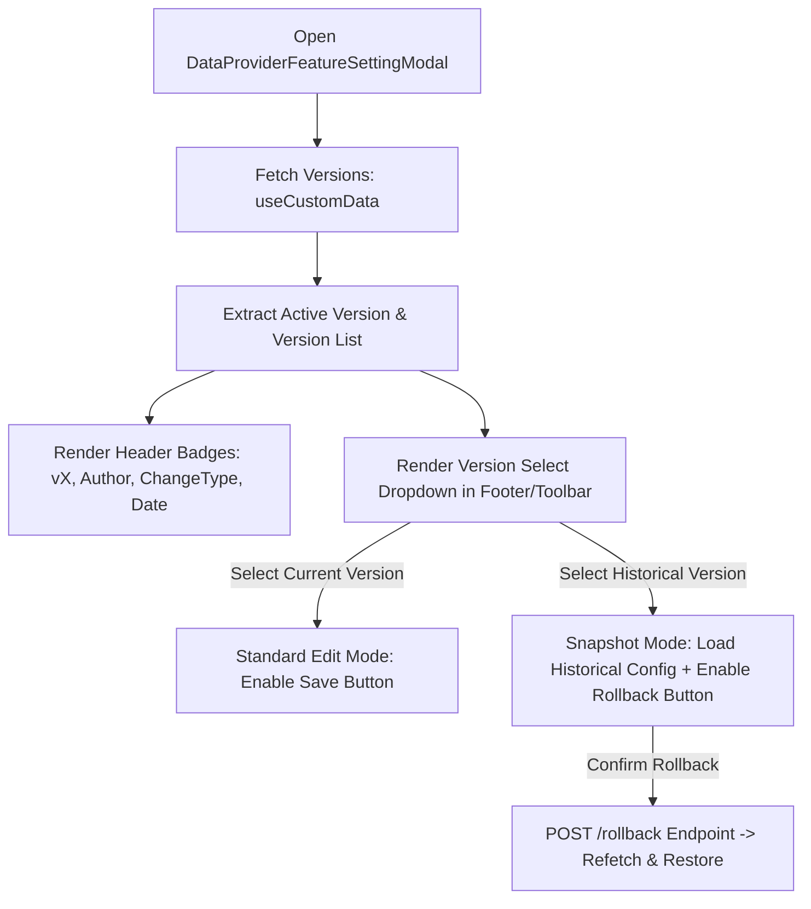
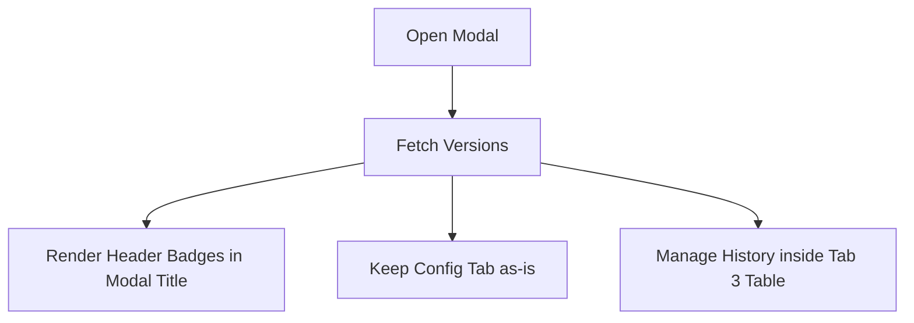

# Technical Proposal: Data Provider Feature Modal Version Display & History Workflow

## 1. Problem Statement & Core Concept

- **Core Business Problem**: Currently, in `only-one-fe` (`DataProviderFeatureSettingModal`), version information for a feature configuration is tucked away inside a secondary tab (`FeatureVersionHistoryTab`). Users configuring a feature cannot see at a glance what version is currently active, who made the last change, when it was updated, or what type of change was applied (`MANUAL_EDIT`, `AI_GENERATED`, `ROLLBACK`). Furthermore, inspecting older versions requires navigating away from the config form to the history tab and opening a preview modal.
- **Reference Pattern**: In `orien-trade-admin` (`configure-scraping-modal.tsx`), the active version metadata (author, change type, timestamp) is prominently displayed in the modal header, and a version selector dropdown in the footer allows seamless switching between snapshots, highlighting differences, and executing quick rollbacks.
- **Core Value & Target Audience**: Scraper engineers and admins managing data provider features get instant visibility of the active configuration lineage and can swiftly compare or restore previous snapshots without disrupting their configuration workflow.
- **Success Metrics (Definition of Done)**:
  - Active version details (version ID, author/user, change type, updated timestamp) visible directly in modal header when configuring an existing feature.
  - Seamless version selection & rollback capability integrated with Ant Design components (`custom-antd`).
  - Zero breaking changes to existing backend API contracts (`/data-provider-features/:id/versions`, `/rollback`).
- **Scope Boundaries**:
  - **In-Scope**:
    - Updating [DataProviderFeatureSettingModal.tsx](file:///d:/Sources/Personal/only-one-fe/src/app/(root)/scraping/features/[dataProviderId]/components/DataProviderFeatureSettingModal.tsx) to fetch/display version metadata in header.
    - Providing version selection & rollback interaction inspired by `orien-trade-admin`.
    - Harmonizing [FeatureVersionHistoryTab.tsx](file:///d:/Sources/Personal/only-one-fe/src/app/(root)/scraping/features/[dataProviderId]/components/FeatureVersionHistoryTab.tsx) and Config forms.
  - **Explicit Out-of-Scope**:
    - Modifying backend endpoints or database schema in `only-one-be`.
    - Modifying non-scraping feature modules.

---

## 2. Current Business Logic (As-is Analysis)

- **Entry Point**: [DataProviderFeaturesPage](file:///d:/Sources/Personal/only-one-fe/src/app/(root)/scraping/features/[dataProviderId]/page.tsx) opens [DataProviderFeatureSettingModal.tsx](file:///d:/Sources/Personal/only-one-fe/src/app/(root)/scraping/features/[dataProviderId]/components/DataProviderFeatureSettingModal.tsx) with active feature data.
- **Modal Header**: Currently renders only the feature icon, title (`Thiết lập / Cấu hình: <type>`), and service tag (`feature.service`).
- **Version Management**: Isolated strictly inside `FeatureVersionHistoryTab`:
  - Calls `GET /data-provider-features/:id/versions`.
  - Displays a table of historical versions.
  - Rollback is executed via `POST /data-provider-features/:id/versions/:versionId/rollback`.
- **Identified Limitations**:
  - No active version indicator on the configuration tab or in the modal header.
  - No fast switcher to load a historical configuration snapshot directly into the form view for inspection.

---

## 3. Proposed Solution Alternatives

### Option 1 (Recommended): Header Metadata Badges + Integrated Version Selector & Quick Rollback

- **Solution Overview & Mechanics**:
  1. **Header Metadata**: Query feature versions using `useCustomData` in the modal. Extract the `activeVersion = versions.find(v => v.isActive)`. Display version tags in the header:
     - `Tag: v{versionId} Active` (with `ClockCircleOutlined` or `lucide:git-commit`)
     - `Tag: {user.fullName || user.email}` (with `lucide:user`)
     - `Tag: {changeType}` (localized: AI tạo, Chỉnh sửa thủ công, Rollback)
     - `Tag: {formatDate(createdAt)}` (with `lucide:calendar`)
  2. **Footer / Toolbar Version Switcher**:
     - When on the "Cấu hình" (`config`) tab, provide a version dropdown selector in the footer/header:
       - Default: `Phiên bản hiện tại (v{activeVersionId})`
       - Other options: `v{versionId} - {changeType} ({formatDate(createdAt)})`
     - Selecting a previous version switches the form into **Snapshot Preview Mode** (loads the historical config into the form, disables standard save, and presents a **Khôi phục phiên bản này (Rollback)** action button with Popconfirm).
  3. **Tab Preservation**: Keep `FeatureVersionHistoryTab` available for full table listing and changelog audit.

- **Mermaid Flowchart**:

- **Pros**:
  - Matches the streamlined UX of `orien-trade-admin` while adhering to `only-one-fe` clean architecture.
  - High developer ergonomics: compare previous config directly inside the familiar form view without reading raw JSON strings.
  - Clean separation: viewing historical config cannot accidentally overwrite active config unless explicitly rolled back.
- **Cons**:
  - Slightly more state coordination between modal footer and individual config form components.

---

### Option 2 (Alternative): Header Metadata Badges + Full History Tab Only

- **Solution Overview & Mechanics**:
  - Modal header displays active version info tags (vId, user, change type, date).
  - Version switching and rollback actions remain solely within the `FeatureVersionHistoryTab` table.
- **Mermaid Diagram**:

- **Pros**:
  - Very minimal code modifications.
  - Low complexity.
- **Cons**:
  - Does not provide quick in-form version switching like `orien-trade-admin`.

---

### Comparison Matrix & Recommendation

| Criteria          | Option 1 (Recommended: Header Badges + In-Modal Selector) | Option 2 (Header Badges Only) |
| :---------------- | :-------------------------------------------------------- | :---------------------------- |
| **UX Alignment with Orien-Trade** | **High (Exact Match & Workflow)**          | Partial                       |
| **Form Inspection Ergonomics**    | **High (Direct in-form snapshot preview)** | Moderate (Separate modal/tab) |
| **Complexity**                    | Moderate                                  | Low                           |
| **Risk Level**                    | Low                                       | Very Low                      |

- **Conclusion**: Recommend **Option 1** because it delivers the full power and convenience of `orien-trade-admin`'s version navigation while preserving Next.js / `custom-antd` standards in `only-one-fe`.

---

## 4. Key Failure Modes & Security Boundaries

- **Draft Features (Unsaved)**: When creating a new feature (`isDraft = true`), version query is disabled, and no version badges or selectors are rendered.
- **Network / API Failures**: If version fetching fails or is empty, graceful fallbacks ensure modal opens normally without header tags.
- **Rollback Confirmation**: Rollbacks must always require confirmation (`CustomPopconfirm`) to prevent accidental configuration overwrites.

---

## 5. High-Level Technical Specifications

- **Affected Components**:
  - [DataProviderFeatureSettingModal.tsx](file:///d:/Sources/Personal/only-one-fe/src/app/(root)/scraping/features/[dataProviderId]/components/DataProviderFeatureSettingModal.tsx): Fetch versions, render header tags, manage selected version state.
  - [ScrapingConfigForm.tsx](file:///d:/Sources/Personal/only-one-fe/src/app/(root)/scraping/features/[dataProviderId]/components/ScrapingConfigForm.tsx) / [SearchConfigForm.tsx](file:///d:/Sources/Personal/only-one-fe/src/app/(root)/scraping/features/[dataProviderId]/components/SearchConfigForm.tsx): Support receiving selected version snapshot and toggling preview/read-only vs edit mode.
- **API Contracts**:
  - `GET /data-provider-features/:id/versions` (Existing)
  - `POST /data-provider-features/:id/versions/:versionId/rollback` (Existing)

---

## 6. Next Steps

1. Review and confirm the proposed solution in this document (`concept.md`).
2. Run `/only-one-plan only-one/tasks/20260822-215000-feature-modal-version-display` to produce the concrete implementation plan.
3. Run `/only-one-apply` to implement and verify the changes.
