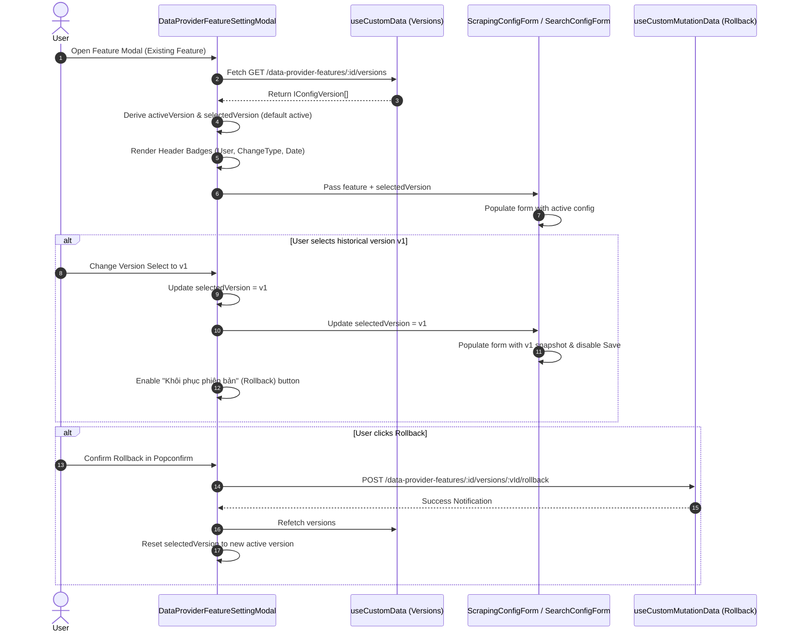

# Implementation Plan: Data Provider Feature Modal Version Display & History Workflow

## Section 1. Current State

### 1.1. Current Execution Flow & Code Evidence
- **Feature Settings Modal**: [DataProviderFeatureSettingModal.tsx](file:///d:/Sources/Personal/only-one-fe/src/app/(root)/scraping/features/[dataProviderId]/components/DataProviderFeatureSettingModal.tsx) receives `feature: IDataProviderFeature` and renders a 3-tab modal (`config`, `test`, `versions`).
- **Modal Header**: Currently renders only the icon, title (`Thiết lập/Cấu hình: <type>`), and service tag (`feature.service`), without any version metadata.
- **Version Query & Management**: Version retrieval is isolated exclusively within [FeatureVersionHistoryTab.tsx](file:///d:/Sources/Personal/only-one-fe/src/app/(root)/scraping/features/[dataProviderId]/components/FeatureVersionHistoryTab.tsx), which queries `API_ENDPOINT.DATA_PROVIDER_FEATURES.VERSIONS(feature.id)` and renders a full table with preview modal and rollback popconfirm.
- **Config Forms**: [ScrapingConfigForm.tsx](file:///d:/Sources/Personal/only-one-fe/src/app/(root)/scraping/features/[dataProviderId]/components/ScrapingConfigForm.tsx) and [SearchConfigForm.tsx](file:///d:/Sources/Personal/only-one-fe/src/app/(root)/scraping/features/[dataProviderId]/components/SearchConfigForm.tsx) only receive `feature.config` on mount and provide standard save actions without snapshot inspection capabilities.

### 1.2. Unchanged Behaviors (Regression Guard)
- The stateless & contextual test playgrounds in [FeatureTestTab.tsx](file:///d:/Sources/Personal/only-one-fe/src/app/(root)/scraping/features/[dataProviderId]/components/FeatureTestTab.tsx) must continue to function unchanged.
- The 1-step draft creation flow (`isDraft = true`, `POST` to backend) must continue to operate smoothly without attempting to query or display nonexistent version history.
- API endpoints `GET /data-provider-features/:id/versions` and `POST /data-provider-features/:id/versions/:versionId/rollback` must be preserved as single sources of truth.

---

## Section 2. Detailed Design

### 2.1. Architectural & UX Mechanics Grounded in `orien-trade-admin`
1. **Modal Header Active Version Metadata (Orien-Trade Port)**:
   - When editing an existing feature (`!isDraft`), [DataProviderFeatureSettingModal.tsx](file:///d:/Sources/Personal/only-one-fe/src/app/(root)/scraping/features/[dataProviderId]/components/DataProviderFeatureSettingModal.tsx) fetches version history.
   - Computes `selectedVersion` (defaults to active version).
   - In the right area of the modal title/header, renders:
     - **Author Tag**: `<CustomTag icon={<Icon icon="lucide:user" />}>FullName / CreatedBy</CustomTag>`
     - **Change Type Tag**: `<CustomTag icon={<Icon icon="lucide:info" />}>AI tạo / Chỉnh sửa thủ công / Khôi phục</CustomTag>`
     - **Timestamp Tag**: `<CustomTag icon={<Icon icon="lucide:clock" />}>DD/MM/YYYY HH:mm</CustomTag>`
2. **Version Switcher & Snapshot Preview Sub-header / Toolbar**:
   - In the `config` tab or modal sub-header, render a version selector:
     - Dropdown `<CustomSelect>` listing `v{vId} - Hiện tại (Active)` and past snapshots `v{vId} - {changeType} ({createdAt})`.
     - When an older version is selected:
       - Active config in form is replaced with the selected version's snapshot (`version.config` and `version.service`).
       - An informative notification banner / alert appears: *"Đang xem lại bản chụp lịch sử v{vId}. Để áp dụng phiên bản này, vui lòng nhấn 'Khôi phục phiên bản'."*
       - The standard Save button is disabled (preventing accidental overwrite).
       - A **Khôi phục phiên bản này (Rollback)** button with `CustomPopconfirm` is enabled.
3. **Tab 3 Audit History Sync**:
   - [FeatureVersionHistoryTab.tsx](file:///d:/Sources/Personal/only-one-fe/src/app/(root)/scraping/features/[dataProviderId]/components/FeatureVersionHistoryTab.tsx) remains available for detailed table comparisons, JSON diff viewing, and full changelog auditing.

### 2.2. ASCII Wireframe

```text
+---------------------------------------------------------------------------------------------------------+
| [Icon] Cấu hình: HTML Scraper  [GENERIC]          [User: Admin] [AI Tạo] [22/08/2026 21:50] [v2 Active] |
+---------------------------------------------------------------------------------------------------------+
| [ Cấu hình ]   [ Thử nghiệm ]   [ Lịch sử phiên bản (3) ]                                               |
+---------------------------------------------------------------------------------------------------------+
| Toolbar:                                                                                                |
| Phiên bản: [ v2 - Hiện tại (Active)                   v ]       [ Khôi phục phiên bản này (Disabled) ]  |
+---------------------------------------------------------------------------------------------------------+
| Form Fields:                                                                                            |
| - Service Engine: [ Generic HTML Parser  v ]                                                            |
| - Selector nội dung chính: [ #main-content                 ]                                            |
| - Wait for selector:       [ .price-tag                    ]                                            |
| - Mã nguồn Function Generator:                                                                          |
|   +---------------------------------------------------------------------------------------------------+ |
|   | async function extract(page, context) { ... }                                                     | |
|   +---------------------------------------------------------------------------------------------------+ |
|                                                                                                         |
|                                                                      [ Hủy ]  [ Lưu cấu hình (Save) ]   |
+---------------------------------------------------------------------------------------------------------+
```

---

## Section 3. Implementation Architecture

### 3.1. Target Directory & Planned File Changes

```text
src/app/(root)/scraping/features/[dataProviderId]/
├── components/
│   ├── DataProviderFeatureSettingModal.tsx   [MODIFY] // Add version fetching, header badges, version switcher
│   ├── FeatureVersionHistoryTab.tsx          [MODIFY] // Refactor to accept versions/refetch from parent props
│   ├── ScrapingConfigForm.tsx                [MODIFY] // Support selectedVersion snapshot & read-only state
│   ├── SearchConfigForm.tsx                  [MODIFY] // Support selectedVersion snapshot & read-only state
│   └── index.ts                              [MODIFY] // Ensure clean exports
└── types.ts                                  [MODIFY] // Add helper props/types for version selection
```

### 3.2. Data & Interaction Flow (Mermaid Sequence Diagram)



---

## Section 4. Implementation Code Examples

### 4.1. [MODIFY] [DataProviderFeatureSettingModal.tsx](file:///d:/Sources/Personal/only-one-fe/src/app/(root)/scraping/features/[dataProviderId]/components/DataProviderFeatureSettingModal.tsx)
- Add version query via `useCustomData`.
- Compute active and selected version.
- Render header tags (User, ChangeType, CreatedAt).
- Add Version selection bar and rollback handler.

```tsx
// Key snippet in DataProviderFeatureSettingModal.tsx
const isDraft = !feature.id;
const { result: versionsResult, query: versionsQuery } = useCustomData({
    url: API_ENDPOINT.DATA_PROVIDER_FEATURES.VERSIONS(feature.id),
    enabled: Boolean(feature.id),
});
const versions = useMemo(() => (versionsResult?.data?.data || []) as IConfigVersion[], [versionsResult]);

const activeVersion = useMemo(() => versions.find((v) => v.isActive), [versions]);
const [selectedVersionId, setSelectedVersionId] = useState<number | undefined>();

// Default to active version whenever versions load
useEffect(() => {
    if (activeVersion && selectedVersionId === undefined) {
        setSelectedVersionId(activeVersion.versionId);
    }
}, [activeVersion, selectedVersionId]);

const currentSelectedVersion = useMemo(
    () => versions.find((v) => v.versionId === selectedVersionId) || activeVersion,
    [versions, selectedVersionId, activeVersion]
);

const isViewingHistory = Boolean(currentSelectedVersion && !currentSelectedVersion.isActive);
```

### 4.2. [MODIFY] [ScrapingConfigForm.tsx](file:///d:/Sources/Personal/only-one-fe/src/app/(root)/scraping/features/[dataProviderId]/components/ScrapingConfigForm.tsx) & [SearchConfigForm.tsx](file:///d:/Sources/Personal/only-one-fe/src/app/(root)/scraping/features/[dataProviderId]/components/SearchConfigForm.tsx)
- Accept `selectedVersion?: IConfigVersion | null` prop.
- When `selectedVersion` changes, populate form with `selectedVersion.config` and `selectedVersion.service`.
- When `isViewingHistory === true`, render snapshot warning alert and disable Save button.

```tsx
// In ScrapingConfigForm.tsx
type ScrapingConfigFormProps = {
    feature: IDataProviderFeature;
    selectedVersion?: IConfigVersion | null;
    onClose: () => void;
    onSuccess: () => void;
};

// Inside component:
useEffect(() => {
    const activeConfig = selectedVersion?.config || feature.config || {};
    const activeService = selectedVersion?.service || feature.service || ScraperServiceEnum.GENERIC;
    form.setFieldsValue({
        service: activeService,
        changeDescription: '',
        ...activeConfig,
    });
}, [feature, selectedVersion, form]);
```

### 4.3. [MODIFY] [FeatureVersionHistoryTab.tsx](file:///d:/Sources/Personal/only-one-fe/src/app/(root)/scraping/features/[dataProviderId]/components/FeatureVersionHistoryTab.tsx)
- Accept `versions?: IConfigVersion[]`, `onRollbackSuccess?: () => void`, and `refetchVersions?: () => void` so data is shared cleanly without duplicate requests.

---

## Section 5. Test Cases

### 5.1. Test Matrix

| ID | Objective | Precondition / Setup | Action | Expected Result | Proposed Test File |
| :--- | :--- | :--- | :--- | :--- | :--- |
| **TC-01** | Header Metadata Display | Feature with existing v1 & v2 (v2 active) | Open Setting Modal for feature | Header displays Author, ChangeType, Date, and v2 Active badge | `DataProviderFeatureSettingModal.spec.tsx` |
| **TC-02** | Version Selector Switch | Modal is open on `config` tab | Select `v1` from dropdown | Form values populate with v1 config snapshot; Save button is disabled; Alert banner appears | `DataProviderFeatureSettingModal.spec.tsx` |
| **TC-03** | Rollback Execution | In snapshot preview of `v1` | Click "Khôi phục phiên bản" & Confirm in Popconfirm | Triggers POST `/rollback`, shows success toast, refetches versions, resets selected version to new active v3 | `DataProviderFeatureSettingModal.spec.tsx` |
| **TC-04** | Draft Feature Isolation | Feature has no ID (`isDraft = true`) | Open modal to create new feature | Version query disabled, no header version tags, Save button enabled | `DataProviderFeatureSettingModal.spec.tsx` |

### 5.2. Verification Commands
```bash
# Typecheck and linting
npm run type-check
npm run lint
```
