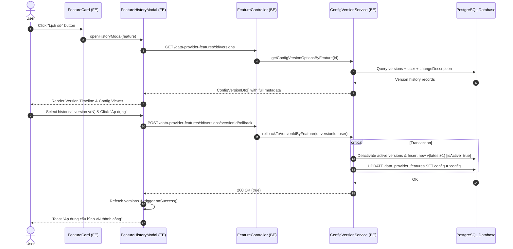
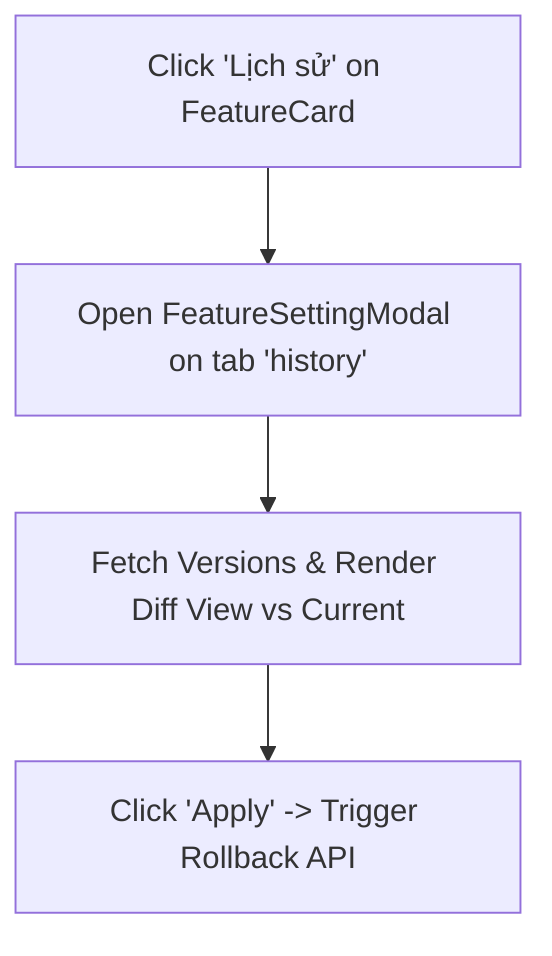

# Technical Proposal: Data Provider Feature History Modal & BE Synchronization

## 1. Problem Statement & Core Concept

- **Core Business Problem**:
  - In [FeatureCard.tsx](file:///d:/Sources/Personal/only-one-fe/src/app/(root)/scraping/features/[dataProviderId]/components/FeatureCard.tsx#L212-L218), clicking the "Lịch sử" (History) button currently opens the general configuration modal (`FeatureSettingModal` on tab `'config'`).
  - Users lack a dedicated, clear audit interface to view the timeline/changelog of configuration modifications (`changeDescription`, `changeType`, author, timestamp), inspect historical snapshots in detail, and one-click "Apply" / "Rollback" a historical version as the active configuration.
  - On the Backend (`only-one-be`):
    1. [ConfigVersionService.getConfigVersionOptionsByFeature](file:///d:/Sources/Personal/only-one-be/src/modules/data-provider/services/config-version.service.ts#L58-L80) omits `changeDescription` and `user` profile fields from the explicit select query, causing metadata to be missing on the frontend.
    2. [ConfigVersionService.rollbackToVersionIdByFeature](file:///d:/Sources/Personal/only-one-be/src/modules/data-provider/services/config-version.service.ts#L82-L104) inserts a new active `ConfigVersionEntity` snapshot but fails to synchronize the `DataProviderFeatureEntity.config` field in the database, resulting in a state mismatch between the version snapshot and active feature runner execution.

- **Core Value & Target Audience**:
  - Scraper operators, developers, and administrators can audit past configuration edits with descriptive notes, author attribution, and formatted JSON/diff previews, enabling confident one-click rollbacks.

- **Success Metrics (Definition of Done)**:
  - Clicking "Lịch sử" on [FeatureCard.tsx](file:///d:/Sources/Personal/only-one-fe/src/app/(root)/scraping/features/[dataProviderId]/components/FeatureCard.tsx) opens a dedicated `FeatureHistoryModal`.
  - `FeatureHistoryModal` displays a complete chronological version list with status tags (`Active`, `Manual Edit`, `AI Generated`, `Rollback`), author name, change description, timestamp, and interactive config snapshot viewer.
  - "Apply" (Áp dụng / Khôi phục) button is available on inactive versions with confirmation prompt, triggering rollback and automatically updating active state across UI.
  - BE queries return full `changeDescription` and author `user` relations.
  - BE rollback endpoint reliably synchronizes `DataProviderFeatureEntity.config` with the target snapshot in an atomic transaction.

- **Scope Boundaries**:
  - **In-Scope**:
    - **Frontend (`only-one-fe`)**:
      - Create dedicated `FeatureHistoryModal.tsx` component with split-view (Version Timeline/List on the left, Snapshot details / Config viewer / Diff on the right) and an "Apply" action button.
      - Update [FeatureCard.tsx](file:///d:/Sources/Personal/only-one-fe/src/app/(root)/scraping/features/[dataProviderId]/components/FeatureCard.tsx) to invoke the dedicated history modal.
      - Update [hooks.ts](file:///d:/Sources/Personal/only-one-fe/src/app/(root)/scraping/features/[dataProviderId]/hooks.ts) and [page.tsx](file:///d:/Sources/Personal/only-one-fe/src/app/(root)/scraping/features/[dataProviderId]/page.tsx) to manage history modal state and refetch on change.
    - **Backend (`only-one-be`)**:
      - Update `ConfigVersionService.getConfigVersionOptionsByFeature` to select `changeDescription`, `user` (id, firstName, lastName, email, userName), and `createdAt`.
      - Update `ConfigVersionService.rollbackToVersionIdByFeature` (or `DataProviderFeatureService`) to update `DataProviderFeatureEntity.config` in the database transaction upon rollback.
  - **Explicit Out-of-Scope**:
    - Altering scraping runner core execution contracts.
    - Modifying unrelated modules (Data Provider CRUD, Item scraper pipelines).

---

## 2. Current Business Logic (As-is Analysis)

- **Frontend Flow**:
  - [FeatureCard.tsx:L212-L218](file:///d:/Sources/Personal/only-one-fe/src/app/(root)/scraping/features/[dataProviderId]/components/FeatureCard.tsx#L212-L218):
    ```tsx
    <CustomButton
        type="text"
        icon={<Icon icon="lucide:history" />}
        onClick={() => onOpenModal(feature, 'config')}
    >
        Lịch sử
    </CustomButton>
    ```
  - This redirects to `FeatureSettingModal` where versions are only selectable via a small dropdown at the bottom footer.
- **Backend Flow**:
  - `GET /data-provider-features/:id/versions` $\rightarrow$ [ConfigVersionService.getConfigVersionOptionsByFeature](file:///d:/Sources/Personal/only-one-be/src/modules/data-provider/services/config-version.service.ts#L58-L80):
    - Selects `id`, `versionId`, `changeType`, `isActive`, `config`, `createdAt`.
    - **Limitation**: `changeDescription` and `user.*` columns are excluded from `.select([...])`.
  - `POST /data-provider-features/:id/versions/:versionId/rollback` $\rightarrow$ [ConfigVersionService.rollbackToVersionIdByFeature](file:///d:/Sources/Personal/only-one-be/src/modules/data-provider/services/config-version.service.ts#L82-L104):
    - Deactivates previous versions and inserts a new active `ConfigVersionEntity`.
    - **Bug/Limitation**: Does not execute `UPDATE data_provider_features SET config = :config WHERE id = :featureId`.

---

## 3. Proposed Solution Alternatives

### Option 1 (Recommended): Dedicated Split-Pane History Modal with Master-Detail View & Atomic BE Sync

- **Solution Overview & Mechanics**:
  1. **Frontend (`FeatureHistoryModal.tsx`)**:
     - **Modal Layout**: Split-pane Master-Detail layout (Width ~950px - 1100px).
       - **Left Master Pane (Timeline / List)**:
         - Card/Timeline item for each version displaying: Version Badge (`vX`), Active Tag (`Đang áp dụng`), Change Type Tag (`AI tạo`, `Thủ công`, `Khôi phục`), Author tag (`user.firstName user.lastName`), Date (`formatDate(createdAt)`), and `changeDescription`.
         - Search/filter or quick selection of items.
       - **Right Detail Pane (Config Inspection & Action)**:
         - Header showing Selected Version metadata & status.
         - Quick action bar:
           - If version is **Active**: Tag `Phiên bản hiện tại`.
           - If version is **Inactive**: "Áp dụng cấu hình này" (Apply) primary button with `CustomPopconfirm` confirmation.
         - Config view: Formatted JSON viewer (or parameter breakdown) with copy button.
     2. **State & Interactions in [hooks.ts](file:///d:/Sources/Personal/only-one-fe/src/app/(root)/scraping/features/[dataProviderId]/hooks.ts)**:
        - Add `historyModalState: { open: boolean, feature: IDataProviderFeature | null }`.
        - Add `openHistoryModal(feature)` and `closeHistoryModal()`.
        - When "Apply" succeeds: Trigger toast notification, refetch versions query, and refetch feature list (`refetchAll()`).
     3. **Backend (`only-one-be`) Fixes**:
        - In `ConfigVersionService.getConfigVersionOptionsByFeature`: Query and return `changeDescription`, `user.id`, `user.firstName`, `user.lastName`, `user.email`, `user.userName`.
        - In `ConfigVersionService.rollbackToVersionIdByFeature`: Inject `DataProviderFeatureEntity` repository and execute `manager.getRepository(DataProviderFeatureEntity).update(featureId, { config: targetConfig })` within the rollback transaction.

- **Mermaid Diagram (Architecture & User Flow)**:



- **Pros**:
  - Clean separation of concerns: `FeatureSettingModal` handles editing/testing, `FeatureHistoryModal` handles audit/inspection/rollback.
  - High ergonomics: Master-detail view allows instant comparison across versions with rich notes and author details.
  - Atomic BE consistency: Zero risk of desynchronization between `ConfigVersionEntity` and `DataProviderFeatureEntity`.
- **Cons**:
  - Adds one new modal component in `only-one-fe`.

---

### Option 2 (Alternative): Tab-based Modal in `FeatureSettingModal` with Diff Comparison

- **Solution Overview & Mechanics**:
  - Instead of a standalone modal, open `FeatureSettingModal` with a dedicated 3rd tab `'history'`.
  - Include Monaco JSON diff editor comparing selected historical version against the current active config.
  - Update BE queries similarly.
- **Mermaid Diagram**:



- **Pros**:
  - Reuses the existing `FeatureSettingModal` wrapper.
- **Cons**:
  - Overcrowds `FeatureSettingModal` with 3 distinct concerns (Config form, Testing runner, History audit).
  - Slower load times and heavier DOM when opening the config editor.

---

### Comparison Matrix & Recommendation

| Criteria                          | Option 1 (Recommended: Dedicated History Modal + BE Sync) | Option 2 (Tab inside Setting Modal) |
| :-------------------------------- | :-------------------------------------------------------- | :---------------------------------- |
| **UX Clarity & Focus**            | **High** (Dedicated history & audit space)                | Moderate (Mixed with setting tabs)  |
| **Metadata Visibility**           | **High** (Author, timestamps, change descriptions, diff)  | Moderate (Constrained in tab)       |
| **BE Data Integrity (Sync Bug)** | **Resolved** (Atomic DB update on rollback)               | **Resolved**                        |
| **Component Decoupling**          | **High** (Independent lifecycle & query)                  | Low (Tightly coupled)               |
| **Risk Level**                    | **Low**                                                   | Low                                 |

- **Conclusion**: Recommend **Option 1** because it directly fulfills the user requirement ("hiển thị 1 modal riêng", "mô tả các lịch sử chỉnh sửa, có nút apply để sử dụng", "thêm phần BE nếu thiếu") and provides a clean, robust architecture.

---

## 4. Key Failure Modes & Security Boundaries

- **No Historical Versions**: If a feature was newly created and has 0 or 1 version, display an empty or single-version state informing the user that no prior revisions exist.
- **Applying Already Active Version**: The "Áp dụng" (Apply) button must be disabled for the active version with a clear "Đang áp dụng" indicator.
- **Rollback Confirmation**: Applying any historical configuration must prompt with `CustomPopconfirm` to prevent accidental overwrites.
- **Transactional Rollback on BE**: The creation of the rollback version snapshot and the update to `DataProviderFeatureEntity.config` must occur inside a TypeORM transaction (`dataSource.transaction`) to guarantee atomicity.
- **Permission & Auth**: Protected by `JwtAuthGuard` and passes `@User() user: PayloadDto` to record the author of the rollback action.

---

## 5. High-Level Technical Specifications

### 5.1 Frontend (`only-one-fe`)
- **New Component**:
  - `src/app/(root)/scraping/features/[dataProviderId]/components/FeatureHistoryModal.tsx`:
    - Timeline/List of versions with badges and descriptions.
    - JSON previewer / snapshot viewer.
    - "Áp dụng" (Apply) rollback button with confirmation.
- **Updated Components**:
  - [FeatureCard.tsx](file:///d:/Sources/Personal/only-one-fe/src/app/(root)/scraping/features/[dataProviderId]/components/FeatureCard.tsx): Update "Lịch sử" button handler to trigger `onOpenHistoryModal(feature)`.
  - [components/index.ts](file:///d:/Sources/Personal/only-one-fe/src/app/(root)/scraping/features/[dataProviderId]/components/index.ts): Export `FeatureHistoryModal`.
  - [hooks.ts](file:///d:/Sources/Personal/only-one-fe/src/app/(root)/scraping/features/[dataProviderId]/hooks.ts): Manage `historyModalState`, `openHistoryModal`, `closeHistoryModal`.
  - [page.tsx](file:///d:/Sources/Personal/only-one-fe/src/app/(root)/scraping/features/[dataProviderId]/page.tsx): Render `<FeatureHistoryModal />`.

### 5.2 Backend (`only-one-be`)
- **Updated Services**:
  - [config-version.service.ts](file:///d:/Sources/Personal/only-one-be/src/modules/data-provider/services/config-version.service.ts):
    - `getConfigVersionOptionsByFeature`: Select `changeDescription`, `user.id`, `user.firstName`, `user.lastName`, `user.email`, `user.userName`.
    - `rollbackToVersionIdByFeature`: Include `DataProviderFeatureEntity` update inside the transaction.

---

## 6. Next Steps

1. User confirms the proposal in `concept.md`.
2. Run `/only-one-plan only-one/tasks/20260824-210000-feature-history-modal` to generate the 5-section `plan.md`.
3. Execute the implementation with `/only-one-apply only-one/tasks/20260824-210000-feature-history-modal`.
4. Run `/only-one-review` & `/only-one-archive`.
