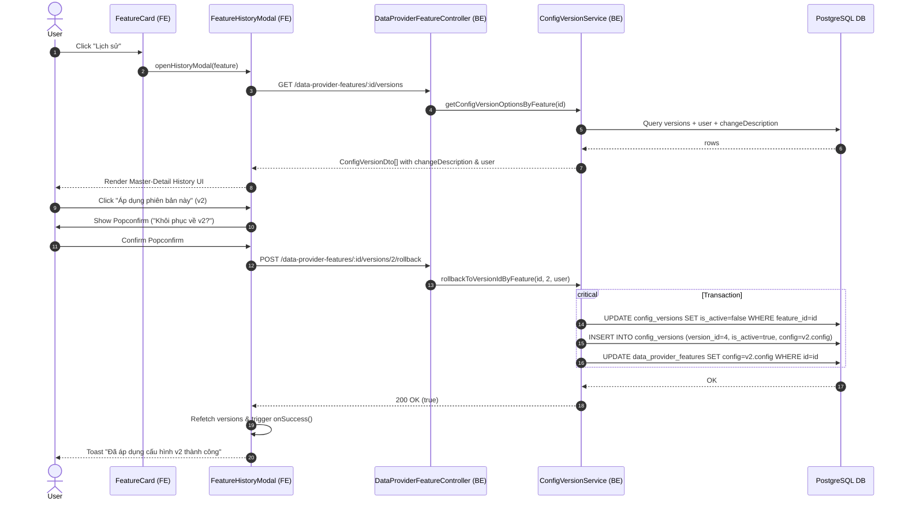

# Implementation Plan: Data Provider Feature History Modal & BE Synchronization

## Section 1. Current State

### 1.1 Verified Current Behavior & Evidence
- In [FeatureCard.tsx:L212-L218](file:///d:/Sources/Personal/only-one-fe/src/app/(root)/scraping/features/[dataProviderId]/components/FeatureCard.tsx#L212-L218), clicking the "Lịch sử" (History) button executes `onOpenModal(feature, 'config')`:
  ```tsx
  <CustomButton
      type="text"
      icon={<Icon icon="lucide:history" />}
      onClick={() => onOpenModal(feature, 'config')}
  >
      Lịch sử
  </CustomButton>
  ```
  This routes users to the general [FeatureSettingModal.tsx](file:///d:/Sources/Personal/only-one-fe/src/app/(root)/scraping/features/[dataProviderId]/components/FeatureSettingModal.tsx) on tab `'config'` where historical versions are only accessible via a small select input in the modal footer.
- In [ConfigVersionService.getConfigVersionOptionsByFeature](file:///d:/Sources/Personal/only-one-be/src/modules/data-provider/services/config-version.service.ts#L58-L80), the query builder selectively loads columns:
  ```typescript
  .select([
      'dataProviderConfigVersions.id',
      'dataProviderConfigVersions.versionId',
      'dataProviderConfigVersions.changeType',
      'dataProviderConfigVersions.isActive',
      'dataProviderConfigVersions.config',
      'dataProviderConfigVersions.createdAt',
  ])
  ```
  This omits `dataProviderConfigVersions.changeDescription`, `dataProviderConfigVersions.createdBy`, and all `user.*` columns (`firstName`, `lastName`, `email`, `userName`).
- In [ConfigVersionService.rollbackToVersionIdByFeature](file:///d:/Sources/Personal/only-one-be/src/modules/data-provider/services/config-version.service.ts#L82-L104), executing a rollback creates a new `ConfigVersionEntity` snapshot with `isActive: true`, but **never updates `DataProviderFeatureEntity.config`** in the `data_provider_features` table. Consequently, scraping feature runners executing `feature.config` still run the pre-rollback config.

### 1.2 Explicit List of Behaviors That Must Remain Unchanged
- Feature creation and updating flow via `FeatureSettingModal` (saving changes still increments version snapshots).
- Stateless testing (`POST /data-provider-features/test`) and Contextual testing (`POST /data-provider-features/:id/test`).
- Feature status switching (`PUT /data-provider-features/:id/switch-status/:status`).
- Existing endpoint URLs (`GET /data-provider-features/:id/versions`, `POST /data-provider-features/:id/versions/:versionId/rollback`).

---

## Section 2. Detailed Design

### 2.1 UI/UX Layout Concept & ASCII Wireframes

#### Component Hierarchy:
- `DataProviderFeaturesPage` (`page.tsx`)
  - `FeatureCard` (invokes `openHistoryModal(feature)`)
  - `FeatureHistoryModal` (`open`, `feature`, `onClose`, `onSuccess`)
    - Left Master Pane (Timeline / Version List)
    - Right Detail Pane (Config Viewer / JSON inspector / Diff & Apply Action Bar)

#### ASCII Wireframe: `FeatureHistoryModal`
```text
+--------------------------------------------------------------------------------------------------+
| [icon] Lịch sử chỉnh sửa: Scraping Config (generic)                       [v3 Active]  [X Đóng]   |
+-------------------------------------------------+------------------------------------------------+
| DANH SÁCH PHIÊN BẢN (3)                         | CHI TIẾT CẤU HÌNH: Version 2                  |
+-------------------------------------------------+------------------------------------------------+
| +---------------------------------------------+ | [!] Phiên bản lịch sử (Không kích hoạt)        |
| | v3 (Hiện tại)                  [Đang dùng]  | | Ghi chú: "Cập nhật selector giá sản phẩm"      |
| | By: Admin User • 24/08/2026 20:30           | | Tác giả: John Doe • 22/08/2026 15:45           |
| | Ghi chú: Rollback to version id: 2          | |                                              |
| +---------------------------------------------+ | +--------------------------------------------+ |
| +---------------------------------------------+ | | [Áp dụng phiên bản này]  [Copy JSON]       | |
| | v2 (Thủ công)                  [Xem chi tiết] | +--------------------------------------------+ |
| | By: John Doe • 22/08/2026 15:45             | | CẤU HÌNH JSON SNAPSHOT:                      | |
| | Ghi chú: Cập nhật selector giá sản phẩm     | | {                                            | |
| +---------------------------------------------+ | |   "selectors": {                           | |
| +---------------------------------------------+ | |     "title": "h1.product-title",           | |
| | v1 (AI tạo)                    [Xem chi tiết] | |     "price": "span.price-val"              | |
| | By: AI Assistant • 20/08/2026 10:00         | |   },                                         | |
| | Ghi chú: Initial configuration              | |   "pagination": { "type": "next_button" }   | |
| +---------------------------------------------+ | | }                                            | |
|                                                 | +--------------------------------------------+ |
+-------------------------------------------------+------------------------------------------------+
|                                                                                   [Đóng Modal]   |
+--------------------------------------------------------------------------------------------------+
```

### 2.2 5-State UI Matrix
1. **Loading State**: Skeleton cards on the left pane and spinning loader on the detail pane while `useCustomData` fetches versions.
2. **Empty State**: If `versions.length === 0`, render `CustomEmpty` with message: *"Chưa có lịch sử cấu hình cho tính năng này"*.
3. **Success / Inspection State**: Renders full version list on the left with active item highlighted; displays formatted JSON config, metadata tags, and action buttons on the right.
4. **Action / Rollback State**: Clicking "Áp dụng" opens `CustomPopconfirm` confirmation; on confirm, button switches to loading state (`isApplying = true`), triggers `POST /rollback`, and toasts success notification.
5. **Error State**: Toast notification on rollback error with descriptive server error message (`error?.message`).

### 2.3 Red-Team Sanity Check (Doubt-Driven Development)
- `CLAIM`: "Updating `DataProviderFeatureEntity.config` on rollback could conflict if someone else modified the config simultaneously."
- `DOUBT`: Can a race condition overwrite newer concurrent edits?
- `RECONCILE`: All rollback actions create an incremented `versionId = (latestVersion + 1)` and update the active feature in a single DB transaction (`dataSource.transaction`). The active snapshot is always guaranteed to match `DataProviderFeatureEntity.config`.

---

## Section 3. Implementation Architecture

### 3.1 Directory & File Scaffold
```text
only-one-fe/src/app/(root)/scraping/features/[dataProviderId]/
├── components/
│   ├── FeatureCard.tsx              [MODIFY] - Add onOpenHistoryModal prop & hook button
│   ├── FeatureHistoryModal.tsx       [NEW]    - Dedicated master-detail history & apply modal
│   ├── index.ts                     [MODIFY] - Export FeatureHistoryModal
│   ├── FeatureSettingModal.tsx      [MODIFY] - Keep setting modal focused
├── hooks.ts                         [MODIFY] - Add historyModalState & handlers
├── types.ts                         [MODIFY] - Add HistoryModalState type
└── page.tsx                         [MODIFY] - Render FeatureHistoryModal

only-one-be/src/modules/data-provider/
└── services/
    └── config-version.service.ts    [MODIFY] - Fix select query columns & atomic feature config update on rollback
```

### 3.2 Sequence Diagram



---

## Section 4. Implementation Code Examples

### 4.1 `[MODIFY]` `only-one-be/src/modules/data-provider/services/config-version.service.ts`
**Summary**: Select missing fields (`changeDescription`, `user.*`) and synchronize `DataProviderFeatureEntity.config` during rollback within an atomic transaction.

```typescript
// Symbols modified: getConfigVersionOptionsByFeature, rollbackToVersionIdByFeature

async getConfigVersionOptionsByFeature(featureId: string): Promise<ConfigVersionDto[]> {
    const dataProviderConfigVersions = await this.repository
        .createQueryBuilder('dataProviderConfigVersions')
        .leftJoinAndSelect('dataProviderConfigVersions.user', 'user')
        .where('dataProviderConfigVersions.featureId = :featureId', { featureId })
        .orderBy('dataProviderConfigVersions.versionId', 'DESC')
        .select([
            'dataProviderConfigVersions.id',
            'dataProviderConfigVersions.versionId',
            'dataProviderConfigVersions.changeType',
            'dataProviderConfigVersions.changeDescription',
            'dataProviderConfigVersions.createdBy',
            'dataProviderConfigVersions.isActive',
            'dataProviderConfigVersions.config',
            'dataProviderConfigVersions.createdAt',
            'user.id',
            'user.firstName',
            'user.lastName',
            'user.email',
            'user.userName',
        ])
        .getMany();

    if (!dataProviderConfigVersions?.length) {
        this.loggerService.warn(`No config versions found for feature ID: ${featureId}`);
        return [];
    }

    return this.mapEntityToDto(dataProviderConfigVersions) as ConfigVersionDto[];
}

async rollbackToVersionIdByFeature(featureId: string, versionId: number, user?: PayloadDto): Promise<boolean> {
    const targetVersion = await this.findOneByFilter({
        featureId,
        versionId,
    });

    if (!targetVersion) {
        throw new NotFoundException(`Config version ${versionId} not found for feature ID ${featureId}`);
    }

    if (targetVersion.isActive) return true;

    const requestCreate = new CreateConfigVersionRequestDto({
        featureId,
        isActive: true,
        changeType: ConfigVersionType.ROLLBACK,
        config: targetVersion.config,
        changeDescription: `Rollback to version id: ${versionId}`,
    });

    try {
        await this.dataSource.transaction(async (manager) => {
            const configVersionRepo = manager.getRepository(ConfigVersionEntity);
            const featureRepo = manager.getRepository(DataProviderFeatureEntity);

            // 1. Deactivate current active versions
            await configVersionRepo.update(
                { featureId, isActive: true },
                { isActive: false },
            );

            // 2. Insert new rollback snapshot
            const latestVersion = await configVersionRepo
                .createQueryBuilder('v')
                .where('v.featureId = :featureId', { featureId })
                .orderBy('v.versionId', 'DESC')
                .select(['v.versionId'])
                .getOne();

            const newVersionEntity = this.mapper.map(requestCreate, CreateConfigVersionRequestDto, ConfigVersionEntity);
            newVersionEntity.createdBy = user?.id;
            newVersionEntity.versionId = (latestVersion?.versionId ?? 0) + 1;
            await configVersionRepo.save(newVersionEntity);

            // 3. Synchronize feature entity config
            await featureRepo.update(featureId, {
                config: targetVersion.config,
                consecutiveFailures: 0,
                lastErrorMessage: null,
                lastErrorType: null,
            });
        });

        return true;
    } catch (error) {
        this.handleError(error);
    }
}
```

---

### 4.2 `[MODIFY]` `only-one-fe/src/app/(root)/scraping/features/[dataProviderId]/types.ts`
**Summary**: Add `HistoryModalState` interface.

```typescript
export interface HistoryModalState {
    open: boolean;
    feature: IDataProviderFeature | null;
}
```

---

### 4.3 `[MODIFY]` `only-one-fe/src/app/(root)/scraping/features/[dataProviderId]/hooks.ts`
**Summary**: Manage history modal state and provide open/close handlers.

```typescript
const [historyModalState, setHistoryModalState] = useState<HistoryModalState>({
    open: false,
    feature: null,
});

const openHistoryModal = useCallback((feature: IDataProviderFeature): void => {
    setHistoryModalState({ open: true, feature });
}, []);

const closeHistoryModal = useCallback((): void => {
    setHistoryModalState((prev) => ({ ...prev, open: false }));
}, []);
```

---

### 4.4 `[NEW]` `only-one-fe/src/app/(root)/scraping/features/[dataProviderId]/components/FeatureHistoryModal.tsx`
**Summary**: Render the Master-Detail History Modal with version timeline, description, JSON previewer, and Apply action.

```tsx
'use client';

import { useMemo, useState } from 'react';
import {
    CustomButton,
    CustomEmpty,
    CustomFlex,
    CustomModal,
    CustomPopconfirm,
    CustomSpin,
    CustomTag,
    CustomTypography,
    customNotification,
} from '@/components/custom-antd';
import { API_ENDPOINT } from '@/config';
import { ConfigVersionType, MessageType } from '@/enums';
import { useCustomData, useCustomMutationData } from '@/hooks';
import { formatDate } from '@/libs';
import { Icon } from '@iconify/react';
import { FEATURE_TYPE_METADATA } from '../constants';
import type { IConfigVersion, IDataProviderFeature } from '../types';

type FeatureHistoryModalProps = {
    open: boolean;
    feature: IDataProviderFeature | null;
    onClose: () => void;
    onSuccess: () => void;
};

export const FeatureHistoryModal = ({
    open,
    feature,
    onClose,
    onSuccess,
}: FeatureHistoryModalProps) => {
    const [selectedVersionId, setSelectedVersionId] = useState<number | undefined>();
    const [isApplying, setIsApplying] = useState<boolean>(false);
    const { handleCustomMutationData } = useCustomMutationData();

    const featureId = feature?.id || '';
    const meta = feature ? FEATURE_TYPE_METADATA[feature.type] : null;

    const { result, query } = useCustomData({
        url: API_ENDPOINT.DATA_PROVIDER_FEATURES.VERSIONS(featureId),
        enabled: Boolean(open && featureId),
    });

    const versions = useMemo(
        () => (result?.data?.data || []) as IConfigVersion[],
        [result],
    );

    const sortedVersions = useMemo(() => {
        return [...versions].sort((a, b) => b.versionId - a.versionId);
    }, [versions]);

    const activeVersion = useMemo(() => versions.find((v) => v.isActive), [versions]);

    const currentSelectedVersion = useMemo(() => {
        if (selectedVersionId !== undefined) {
            return sortedVersions.find((v) => v.versionId === selectedVersionId) || null;
        }
        return activeVersion || sortedVersions[0] || null;
    }, [selectedVersionId, sortedVersions, activeVersion]);

    const handleApply = (versionId: number) => {
        if (!featureId || !versionId) return;
        setIsApplying(true);
        handleCustomMutationData({
            method: 'post',
            url: API_ENDPOINT.DATA_PROVIDER_FEATURES.ROLLBACK(featureId, versionId),
            successNotification: () => {
                setIsApplying(false);
                query.refetch();
                onSuccess();
                return {
                    type: MessageType.SUCCESS,
                    message: `Đã áp dụng thành công cấu hình phiên bản v${versionId}`,
                };
            },
            errorNotification: (err) => {
                setIsApplying(false);
                return {
                    type: MessageType.ERROR,
                    message: 'Áp dụng phiên bản thất bại',
                    description: err?.message,
                };
            },
        });
    };

    const handleCopyConfig = () => {
        if (!currentSelectedVersion?.config) return;
        navigator.clipboard.writeText(JSON.stringify(currentSelectedVersion.config, null, 2));
        customNotification({
            type: MessageType.SUCCESS,
            message: 'Đã sao chép cấu hình JSON vào clipboard',
        });
    };

    // Render helper tags
    const renderChangeTypeTag = (type: ConfigVersionType) => {
        switch (type) {
            case ConfigVersionType.AI_GENERATED:
                return (
                    <CustomTag color="purple" className="flex items-center gap-1 m-0">
                        <Icon icon="lucide:sparkles" className="w-3 h-3" />
                        AI tạo
                    </CustomTag>
                );
            case ConfigVersionType.ROLLBACK:
                return (
                    <CustomTag color="orange" className="flex items-center gap-1 m-0">
                        <Icon icon="lucide:history" className="w-3 h-3" />
                        Khôi phục
                    </CustomTag>
                );
            case ConfigVersionType.MANUAL_EDIT:
            default:
                return (
                    <CustomTag color="blue" className="flex items-center gap-1 m-0">
                        <Icon icon="lucide:edit-3" className="w-3 h-3" />
                        Thủ công
                    </CustomTag>
                );
        }
    };

    const modalTitle = (
        <CustomFlex align="center" gap="middle" className="pr-6">
            <CustomFlex
                align="center"
                justify="center"
                className={`p-2 rounded-xl shrink-0 ${meta?.accentClass || 'text-hub-primary bg-hub-primary/10'}`}
            >
                <Icon icon="lucide:history" className="text-lg" />
            </CustomFlex>
            <CustomFlex vertical gap={2}>
                <CustomFlex align="center" gap="small">
                    <CustomTypography.Text strong className="text-base text-hub-title">
                        Lịch sử cấu hình: {meta?.label || feature?.type}
                    </CustomTypography.Text>
                    {feature?.service && (
                        <CustomTag className="font-mono text-xs m-0">{feature.service}</CustomTag>
                    )}
                </CustomFlex>
                <CustomTypography.Text type="secondary" className="text-xs">
                    Theo dõi lịch sử chỉnh sửa và khôi phục snapshot cấu hình trước đó
                </CustomTypography.Text>
            </CustomFlex>
        </CustomFlex>
    );

    return (
        <CustomModal
            open={open}
            title={modalTitle}
            width={1000}
            onCancel={onClose}
            footer={
                <CustomFlex justify="end">
                    <CustomButton onClick={onClose}>Đóng</CustomButton>
                </CustomFlex>
            }
        >
            {query.isLoading ? (
                <CustomFlex justify="center" align="center" className="py-20">
                    <CustomSpin tip="Đang tải lịch sử cấu hình..." />
                </CustomFlex>
            ) : sortedVersions.length === 0 ? (
                <CustomEmpty description="Chưa có phiên bản lịch sử nào cho tính năng này." />
            ) : (
                <CustomFlex gap="middle" className="min-h-[480px]">
                    {/* Left Pane: Version List */}
                    <CustomFlex
                        vertical
                        gap="small"
                        className="w-[360px] shrink-0 border-r border-gray-100 dark:border-gray-800 pr-3 overflow-y-auto max-h-[520px]"
                    >
                        <CustomTypography.Text strong className="text-xs text-hub-subtitle uppercase tracking-wider mb-1">
                            Danh sách phiên bản ({sortedVersions.length})
                        </CustomTypography.Text>
                        {sortedVersions.map((v) => {
                            const isSelected = (currentSelectedVersion?.versionId === v.versionId);
                            const authorName = v.user
                                ? `${v.user.firstName || ''} ${v.user.lastName || ''}`.trim() || v.user.email
                                : v.createdBy || 'Hệ thống';

                            return (
                                <div
                                    key={v.id || v.versionId}
                                    onClick={() => setSelectedVersionId(v.versionId)}
                                    className={`p-3 rounded-xl cursor-pointer transition-all duration-150 border ${
                                        isSelected
                                            ? 'border-hub-primary bg-hub-primary/5 shadow-xs'
                                            : 'border-gray-200/70 dark:border-gray-800 hover:border-hub-primary/40 hover:bg-gray-50/50 dark:hover:bg-gray-800/30'
                                    }`}
                                >
                                    <CustomFlex justify="space-between" align="center" className="mb-1.5">
                                        <CustomFlex align="center" gap="small">
                                            <span className="font-bold text-sm font-mono text-hub-title">
                                                v{v.versionId}
                                            </span>
                                            {v.isActive && (
                                                <CustomTag color="success" className="m-0 font-medium text-xs">
                                                    Đang dùng
                                                </CustomTag>
                                            )}
                                        </CustomFlex>
                                        {renderChangeTypeTag(v.changeType)}
                                    </CustomFlex>

                                    <CustomTypography.Paragraph
                                        ellipsis={{ rows: 2 }}
                                        className="!mb-2 text-xs text-hub-title"
                                    >
                                        {v.changeDescription || 'Chỉnh sửa cấu hình'}
                                    </CustomTypography.Paragraph>

                                    <CustomFlex justify="space-between" align="center" className="text-xs text-hub-subtitle">
                                        <span className="flex items-center gap-1 truncate max-w-[150px]">
                                            <Icon icon="lucide:user" className="w-3 h-3 shrink-0" />
                                            <span className="truncate">{authorName}</span>
                                        </span>
                                        <span className="flex items-center gap-1 shrink-0">
                                            <Icon icon="lucide:clock" className="w-3 h-3" />
                                            {formatDate(v.createdAt)}
                                        </span>
                                    </CustomFlex>
                                </div>
                            );
                        })}
                    </CustomFlex>

                    {/* Right Pane: Details & Config Viewer */}
                    <CustomFlex vertical className="flex-1 pl-2 max-h-[520px] overflow-y-auto" gap="middle">
                        {currentSelectedVersion ? (
                            <>
                                <CustomFlex justify="space-between" align="center" wrap gap="small">
                                    <CustomFlex vertical gap={2}>
                                        <CustomFlex align="center" gap="small">
                                            <CustomTypography.Title level={5} className="!mb-0 text-hub-title font-bold">
                                                Phiên bản v{currentSelectedVersion.versionId}
                                            </CustomTypography.Title>
                                            {currentSelectedVersion.isActive ? (
                                                <CustomTag color="success" className="font-medium m-0">
                                                    Đang áp dụng trên hệ thống
                                                </CustomTag>
                                            ) : (
                                                <CustomTag color="default" className="font-medium m-0">
                                                    Snapshot lịch sử
                                                </CustomTag>
                                            )}
                                        </CustomFlex>
                                        <CustomTypography.Text type="secondary" className="text-xs">
                                            Mô tả: {currentSelectedVersion.changeDescription || 'Không có mô tả chi tiết'}
                                        </CustomTypography.Text>
                                    </CustomFlex>

                                    <CustomFlex align="center" gap="small">
                                        <CustomButton
                                            icon={<Icon icon="lucide:copy" />}
                                            onClick={handleCopyConfig}
                                        >
                                            Copy JSON
                                        </CustomButton>
                                        {!currentSelectedVersion.isActive && (
                                            <CustomPopconfirm
                                                title={`Áp dụng cấu hình phiên bản v${currentSelectedVersion.versionId}?`}
                                                description="Cấu hình hiện tại sẽ được cập nhật và tạo snapshot mới."
                                                okText="Xác nhận áp dụng"
                                                cancelText="Hủy"
                                                onConfirm={() => handleApply(currentSelectedVersion.versionId)}
                                            >
                                                <CustomButton
                                                    type="primary"
                                                    icon={<Icon icon="lucide:rotate-ccw" />}
                                                    loading={isApplying}
                                                    className="bg-hub-primary"
                                                >
                                                    Áp dụng phiên bản này
                                                </CustomButton>
                                            </CustomPopconfirm>
                                        )}
                                    </CustomFlex>
                                </CustomFlex>

                                {/* JSON Snapshot Box */}
                                <div className="rounded-xl border border-gray-200 dark:border-gray-800 bg-gray-900 text-gray-100 p-4 font-mono text-xs overflow-auto max-h-[380px] shadow-inner">
                                    <pre className="m-0 leading-relaxed">
                                        {JSON.stringify(currentSelectedVersion.config || {}, null, 2)}
                                    </pre>
                                </div>
                            </>
                        ) : null}
                    </CustomFlex>
                </CustomFlex>
            )}
        </CustomModal>
    );
};
```

---

### 4.5 `[MODIFY]` `only-one-fe/src/app/(root)/scraping/features/[dataProviderId]/components/FeatureCard.tsx`
**Summary**: Update "Lịch sử" button to trigger `onOpenHistoryModal(feature)`.

```tsx
type FeatureCardProps = {
    feature: IDataProviderFeature;
    onOpenModal: (feature: IDataProviderFeature, tab: FeatureModalTab) => void;
    onOpenHistoryModal: (feature: IDataProviderFeature) => void;
    onSwitchStatus: (featureId: string, currentStatus: DataProviderFeatureStatus) => void;
};

// ... In JSX:
<CustomButton
    type="text"
    icon={<Icon icon="lucide:history" />}
    onClick={() => onOpenHistoryModal(feature)}
>
    Lịch sử
</CustomButton>
```

---

### 4.6 `[MODIFY]` `only-one-fe/src/app/(root)/scraping/features/[dataProviderId]/components/index.ts`
**Summary**: Export `FeatureHistoryModal`.

```typescript
export * from './CreateFeatureModal';
export * from './FeatureCard';
export * from './FeatureHistoryModal';
export * from './FeatureSettingModal';
export * from './FeatureTestTab';
export * from './ScrapingConfigForm';
export * from './SearchConfigForm';
```

---

### 4.7 `[MODIFY]` `only-one-fe/src/app/(root)/scraping/features/[dataProviderId]/page.tsx`
**Summary**: Pass `openHistoryModal` to `FeatureCard` and render `FeatureHistoryModal`.

```tsx
<FeatureCard
    feature={feature}
    onOpenModal={openFeatureModal}
    onOpenHistoryModal={openHistoryModal}
    onSwitchStatus={handleSwitchStatus}
/>

<FeatureHistoryModal
    open={historyModalState.open}
    feature={historyModalState.feature}
    onClose={closeHistoryModal}
    onSuccess={refetchAll}
/>
```

---

## Section 5. Test Cases

### 5.1 Test Scenarios (Gherkin BDD)

#### Scenario 1: Open History Modal and view version metadata
- **Objective**: Verify that clicking "Lịch sử" on a feature card opens the dedicated History modal with full change descriptions and authors.
- **Proposed Test**: `src/app/(root)/scraping/features/[dataProviderId]/_tests/FeatureHistoryModal.spec.tsx`
- **Gherkin**:
  ```gherkin
  GIVEN a data provider feature with 3 saved config versions
  WHEN the user clicks the "Lịch sử" button on the FeatureCard
  THEN the FeatureHistoryModal opens
  AND renders 3 version items with badges, change descriptions, and author names
  AND displays the formatted JSON configuration of the selected version in the right pane
  ```

#### Scenario 2: Apply historical configuration snapshot (Rollback)
- **Objective**: Verify applying an inactive version triggers rollback API and synchronizes feature config.
- **Proposed Test**: `src/modules/data-provider/_tests/config-version.service.spec.ts` & `FeatureHistoryModal.spec.tsx`
- **Gherkin**:
  ```gherkin
  GIVEN an inactive version v1 of feature F
  WHEN the user clicks "Áp dụng phiên bản này" on v1 and confirms the Popconfirm
  THEN a POST request is sent to /data-provider-features/:id/versions/1/rollback
  AND on backend, a new version snapshot is created with isActive=true
  AND the data_provider_features table config is updated to match v1.config
  AND the frontend displays a success toast notification and refetches the list
  ```

#### Scenario 3: Prevent applying already active version
- **Objective**: Ensure the active version cannot be rolled back onto itself.
- **Gherkin**:
  ```gherkin
  GIVEN the active version v3 is selected in the History modal
  THEN the "Áp dụng phiên bản này" button is hidden
  AND the tag "Đang áp dụng trên hệ thống" is shown
  ```

### 5.2 Verification Commands
- **Frontend Lint & Typecheck**:
  ```powershell
  npm run lint
  npm run build
  ```
- **Backend Lint & Test**:
  ```powershell
  npm run test
  npm run lint
  ```
