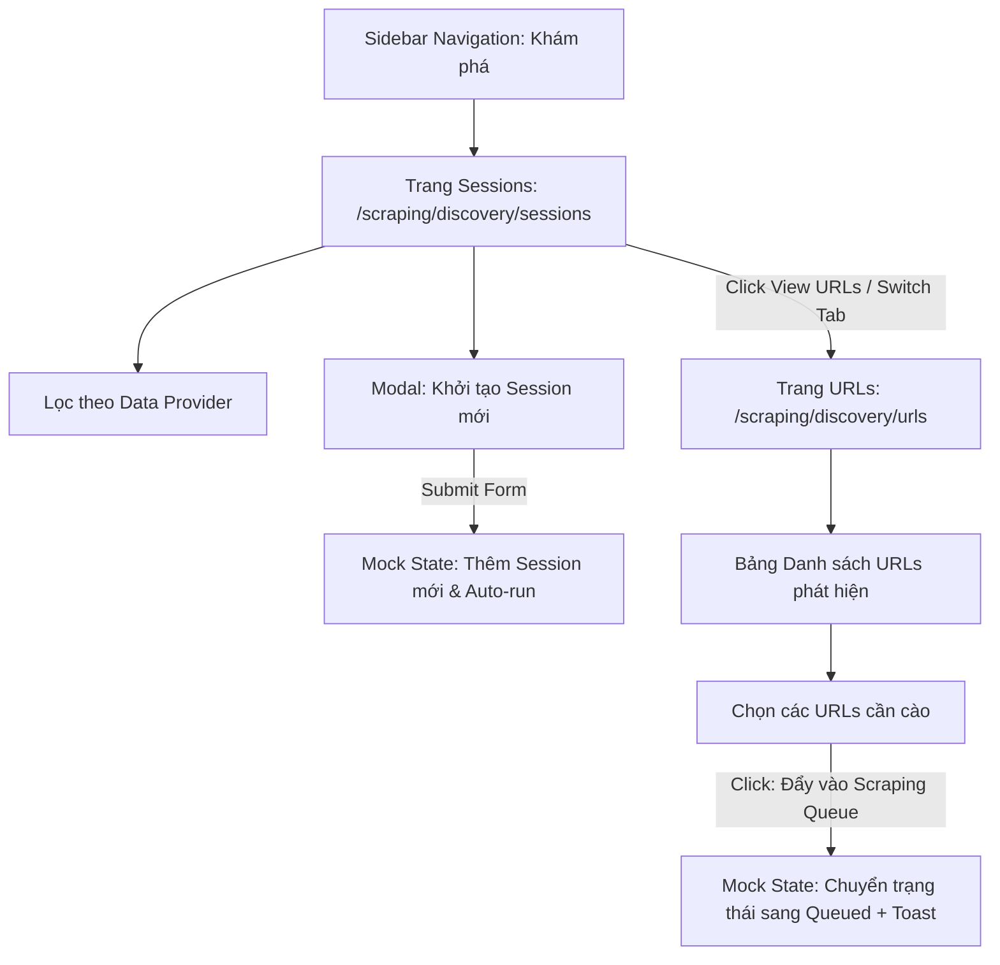

# Plan: Triển khai Giao diện Phân hệ Discovery (Scraping Discovery UI)

## Section 1. Current State (Hiện trạng & Phân tích Mã nguồn)

### 1.1 Hiện trạng hệ thống
- **Gốc tính năng từ `orien-trade-admin`**: Phân hệ `product-discovery` tại [orien-trade-admin/.../product-discovery](file:///d:/Sources/Zodinet/ORIEN-TRADE/orien-trade-admin/src/app/[locale]/(root)/product-discovery) bao gồm các module (`sessions`, `urls`, `ignore-url`, `mapper`), được xây dựng dựa trên Ant Design và Refine hooks với nhiều logic gắn chặt với i18n đa ngôn ngữ và backend scout-requests.
- **Phân hệ Scraping tại `only-one-fe`**: Hiện tại [only-one-fe/.../scraping](file:///d:/Sources/Personal/only-one-fe/src/app/(root)/scraping) đang phục vụ các nghiệp vụ quản lý nhà cung cấp dữ liệu ([data-providers](file:///d:/Sources/Personal/only-one-fe/src/app/(root)/scraping/data-providers)), đối tượng nhà cung cấp ([provider-items](file:///d:/Sources/Personal/only-one-fe/src/app/(root)/scraping/provider-items)), đối tượng cào ([items](file:///d:/Sources/Personal/only-one-fe/src/app/(root)/scraping/items)), và dữ liệu cào ([scraping-data](file:///d:/Sources/Personal/only-one-fe/src/app/(root)/scraping/scraping-data)). Chưa có module quản lý phiên khám phá đường dẫn (Discovery).
- **Quy chuẩn Component & Styling**: `only-one-fe` sử dụng bộ UI Wrapper tiêu chuẩn (`ListWrapper`, `ListTable`, `FilterPanel`, `CustomModalForm`, `CustomButton`, `CustomTag`, `CustomCard` từ `@/components/common` và `@/components/custom-antd`) cùng hệ thống theme tokens `hub-*`.

### 1.2 Invariants (Hành vi & Ràng buộc bắt buộc giữ nguyên)
- **Zero Regression on Existing Navigation**: Không làm ảnh hưởng đến cấu trúc routing và layout của các trang hiện hữu trong phân hệ `/scraping/*`.
- **Theme Token Integrity**: Toàn bộ component mới bắt buộc sử dụng CSS variables/utility tokens (`bg-hub-card`, `text-hub-primary`, `border-hub-border`) và custom Antd components thay vì inline style hoặc raw HTML thiếu chuẩn mực.
- **Client-Side State Decoupling**: Tầng Mock UI phải độc lập, an toàn khi chạy trên Next.js 14+ App Router, không gây lỗi SSR hydration mismatch.

---

## Section 2. Detailed Design (Thiết kế Kỹ thuật Chi tiết)

### 2.1 Kiến trúc & Phân rã Module (`codebase-design`)
Module **Discovery** được đặt tại `src/app/(root)/scraping/discovery` với 2 trang trọng tâm cùng thanh điều hướng Tab nội bộ (Sub-Tabs) để người dùng chuyển đổi mượt mà giữa Sessions và URLs:
1. **`sessions`** (`/scraping/discovery/sessions`):
   - Danh sách phiên discovery: Mã phiên, Data Provider, Tỷ lệ hoàn thành (Progress Bar), Số URL tìm thấy, Trạng thái (`pending`, `in_progress`, `completed`, `failed`), Thời gian chạy.
   - Thanh công cụ lọc: Chỉ lọc theo **Data Provider** qua select dropdown + Search theo từ khóa phiên/seed URL.
   - Thao tác: Modal tạo/kích hoạt phiên khám phá mới (**Create/Trigger Discovery Session**).
2. **`urls`** (`/scraping/discovery/urls`):
   - Danh sách URLs phát hiện: Tiêu đề trang, Đường dẫn URL (clickable), Data Provider liên quan, Phiên khám phá tương ứng, Trạng thái cào (`discovered`, `queued`, `scraped`, `failed`), Ngày phát hiện.
   - Thanh công cụ lọc: Lọc theo **Data Provider** và Lọc theo **Session ID** (khi điều hướng từ trang Sessions sang).
   - Thao tác: Chọn nhiều hàng (Row Selection) $\rightarrow$ Đẩy vào hàng đợi cào dữ liệu (**Enqueue to Scraping Queue**) với thông báo Toast feedback.

### 2.2 Sơ đồ Luồng Tương tác UI Mock State (Mermaid Flow)



### 2.3 Adversarial Red-Team Sanity Check (`doubt-driven-development`)
- **DOUBT 1**: *Làm sao để Mock State duy trì được dữ liệu khi người dùng chuyển qua lại giữa trang Sessions và URLs?*
  - **RECONCILE**: Xây dựng một Mock Data Store singleton (`discoveryMockStore`) với Event Emitter hoặc React Hook chung (`useDiscoveryMockStore`), giúp dữ liệu session và danh sách URL đồng bộ trạng thái ngay lập tức mà không cần reload trang.
- **DOUBT 2**: *Khi chuyển từ mock sang real API sau này có phải viết lại toàn bộ giao diện không?*
  - **RECONCILE**: Tách biệt hoàn toàn tầng Presentational (Page & Components) và Data Access (Hooks). Khi có API thật, chỉ cần thay đổi nội dung bên trong `hooks.ts` mà không làm thay đổi JSX/UI.

---

## Section 3. Implementation Architecture & Machine-Readable Task Matrix

### 3.1 Machine-Readable Task Matrix & Dependency Graph

| Order | Status | Action | File Path | Target Symbols / AST Seams | Depends On | Fast Test Command |
| :---: | :---: | :---: | :--- | :--- | :--- | :--- |
| **1** | `[x]` | `[NEW]` | `src/app/(root)/scraping/discovery/types.ts` | `IDiscoverySession, IDiscoveryUrl, DiscoverySessionStatus, DiscoveryUrlStatus, CreateSessionFormValues` | `None` | `npx tsc --noEmit` |
| **2** | `[x]` | `[NEW]` | `src/app/(root)/scraping/discovery/mocks/mock-data.ts` | `discoveryMockStore, getMockSessions, getMockUrls, addMockSession, enqueueMockUrls` | `Order 1` | `npx tsc --noEmit` |
| **3** | `[x]` | `[NEW]` | `src/app/(root)/scraping/discovery/components/DiscoveryNavTabs.tsx` | `DiscoveryNavTabs` | `None` | `npx tsc --noEmit` |
| **4** | `[x]` | `[NEW]` | `src/app/(root)/scraping/discovery/sessions/components/CreateSessionModal.tsx` | `CreateSessionModal` | `Order 1` | `npx tsc --noEmit` |
| **5** | `[x]` | `[NEW]` | `src/app/(root)/scraping/discovery/sessions/hooks.ts` | `useDiscoverySessionsPage` | `Order 1, 2` | `npx tsc --noEmit` |
| **6** | `[x]` | `[NEW]` | `src/app/(root)/scraping/discovery/sessions/page.tsx` | `DiscoverySessionsPage` | `Order 3, 4, 5` | `npx tsc --noEmit` |
| **7** | `[x]` | `[NEW]` | `src/app/(root)/scraping/discovery/urls/hooks.ts` | `useDiscoveryUrlsPage` | `Order 1, 2` | `npx tsc --noEmit` |
| **8** | `[x]` | `[NEW]` | `src/app/(root)/scraping/discovery/urls/page.tsx` | `DiscoveryUrlsPage` | `Order 3, 7` | `npx tsc --noEmit` |
| **9** | `[x]` | `[NEW]` | `src/app/(root)/scraping/discovery/page.tsx` | `DiscoveryIndexRedirectPage` | `Order 6` | `npx tsc --noEmit` |
| **10** | `[x]` | `[MODIFY]` | `src/constants/sidebar.constant.ts` | `SIDEBAR_ITEMS` | `Order 9` | `npx tsc --noEmit` |

### 3.2 Cấu trúc Thư mục Scaffold (Scaffold Directory Tree)

```text
src/app/(root)/scraping/discovery/
├── page.tsx                             # Redirect to /scraping/discovery/sessions
├── types.ts                             # Entity contracts & Form Types
├── mocks/
│   └── mock-data.ts                     # In-memory Reactive Mock Store
├── components/
│   ├── DiscoveryNavTabs.tsx             # Sub-navigation switcher for Sessions & URLs
│   └── index.ts                         # Barrel export
├── sessions/
│   ├── page.tsx                         # Sessions list page
│   ├── hooks.ts                         # Custom hook for Sessions management
│   └── components/
│       ├── CreateSessionModal.tsx       # Modal trigger discovery session
│       └── index.ts                     # Barrel export
└── urls/
    ├── page.tsx                         # Discovered URLs list page
    └── hooks.ts                         # Custom hook for URLs management & Enqueue action
```

---

## Section 4. Implementation Code Examples (Mẫu Code Triển khai)

### 4.1 Order 1 — `src/app/(root)/scraping/discovery/types.ts`
- **Label**: `[NEW]` [types.ts](file:///d:/Sources/Personal/only-one-fe/src/app/(root)/scraping/discovery/types.ts)
- **Rationale**: Định nghĩa domain contract chuẩn cho toàn bộ phân hệ Discovery, tái sử dụng base `Abstract` interface từ `@/interfaces`.

```typescript
// [TARGET SEAM]: Domain Entity Contracts for Discovery Feature
import type { IDataProvider } from '@/app/(root)/scraping/data-providers/types';
import type { Abstract } from '@/interfaces';

export enum DiscoverySessionStatus {
    PENDING = 'pending',
    IN_PROGRESS = 'in_progress',
    COMPLETED = 'completed',
    FAILED = 'failed',
}

export enum DiscoveryUrlStatus {
    DISCOVERED = 'discovered',
    QUEUED = 'queued',
    SCRAPED = 'scraped',
    FAILED = 'failed',
}

export interface IDiscoverySession extends Abstract {
    sessionCode: string;
    dataProviderId: string;
    dataProvider?: IDataProvider;
    targetUrl: string;
    status: DiscoverySessionStatus;
    totalDiscovered: number;
    totalQueued: number;
    depth: number;
    durationSeconds?: number;
    errorMessage?: string;
}

export interface IDiscoveryUrl extends Abstract {
    sessionId: string;
    sessionCode?: string;
    dataProviderId: string;
    dataProviderName?: string;
    url: string;
    title?: string;
    status: DiscoveryUrlStatus;
    foundAtDepth: number;
}

export interface CreateSessionFormValues {
    dataProviderId: string;
    targetUrl: string;
    depth?: number;
    maxUrls?: number;
    notes?: string;
}
```

---

### 4.2 Order 2 — `src/app/(root)/scraping/discovery/mocks/mock-data.ts`
- **Label**: `[NEW]` [mock-data.ts](file:///d:/Sources/Personal/only-one-fe/src/app/(root)/scraping/discovery/mocks/mock-data.ts)
- **Rationale**: Lưu trữ mock data và state store trong bộ nhớ client, cung cấp các hàm helper mô phỏng việc tạo session và cập nhật trạng thái URL theo thời gian thực.

```typescript
// [TARGET SEAM]: In-Memory Reactive Mock Store for Discovery UI
import {
    DiscoverySessionStatus,
    DiscoveryUrlStatus,
    type IDiscoverySession,
    type IDiscoveryUrl,
} from '../types';

let mockSessions: IDiscoverySession[] = [
    {
        id: 'session-1',
        sessionCode: 'DISC-AMZ-001',
        dataProviderId: 'provider-1',
        dataProvider: { id: 'provider-1', name: 'Amazon US', identifier: 'amazon_us', baseUrl: 'https://amazon.com', createdAt: new Date() },
        targetUrl: 'https://amazon.com/best-sellers-electronics',
        status: DiscoverySessionStatus.COMPLETED,
        totalDiscovered: 42,
        totalQueued: 15,
        depth: 2,
        durationSeconds: 128,
        createdAt: new Date(Date.now() - 3600000 * 2),
    },
    {
        id: 'session-2',
        sessionCode: 'DISC-SHP-002',
        dataProviderId: 'provider-2',
        dataProvider: { id: 'provider-2', name: 'Shopee VN', identifier: 'shopee_vn', baseUrl: 'https://shopee.vn', createdAt: new Date() },
        targetUrl: 'https://shopee.vn/flash-sale',
        status: DiscoverySessionStatus.IN_PROGRESS,
        totalDiscovered: 18,
        totalQueued: 0,
        depth: 1,
        durationSeconds: 45,
        createdAt: new Date(Date.now() - 1800000),
    },
];

let mockUrls: IDiscoveryUrl[] = [
    {
        id: 'url-1',
        sessionId: 'session-1',
        sessionCode: 'DISC-AMZ-001',
        dataProviderId: 'provider-1',
        dataProviderName: 'Amazon US',
        url: 'https://amazon.com/dp/B08N5WRWNW',
        title: 'Sony WH-1000XM4 Wireless Noise Cancelling Headphones',
        status: DiscoveryUrlStatus.QUEUED,
        foundAtDepth: 1,
        createdAt: new Date(Date.now() - 3500000),
    },
    {
        id: 'url-2',
        sessionId: 'session-1',
        sessionCode: 'DISC-AMZ-001',
        dataProviderId: 'provider-1',
        dataProviderName: 'Amazon US',
        url: 'https://amazon.com/dp/B09G9FPHY6',
        title: 'Apple iPad 10.2-inch Wi-Fi 64GB Space Gray',
        status: DiscoveryUrlStatus.DISCOVERED,
        foundAtDepth: 2,
        createdAt: new Date(Date.now() - 3400000),
    },
];

export const getMockSessions = () => [...mockSessions];
export const getMockUrls = () => [...mockUrls];

export const addMockSession = (session: IDiscoverySession) => {
    mockSessions = [session, ...mockSessions];
};

export const enqueueMockUrls = (urlIds: string[]) => {
    mockUrls = mockUrls.map((item) =>
        urlIds.includes(item.id) ? { ...item, status: DiscoveryUrlStatus.QUEUED } : item,
    );
};
```

---

### 4.3 Order 3 — `src/app/(root)/scraping/discovery/components/DiscoveryNavTabs.tsx`
- **Label**: `[NEW]` [DiscoveryNavTabs.tsx](file:///d:/Sources/Personal/only-one-fe/src/app/(root)/scraping/discovery/components/DiscoveryNavTabs.tsx)
- **Rationale**: Thanh tab nội bộ gọn gàng cho phép người dùng chuyển nhanh giữa trang Sessions và URLs trong cùng phân hệ Discovery.

```typescript
// [TARGET SEAM]: Sub-Navigation Tabs Component
'use client';

import { CustomTabs } from '@/components/custom-antd';
import { usePathname, useRouter } from 'next/navigation';

export const DiscoveryNavTabs = () => {
    const router = useRouter();
    const pathname = usePathname();

    const items = [
        { key: '/scraping/discovery/sessions', label: 'Phiên khám phá (Sessions)' },
        { key: '/scraping/discovery/urls', label: 'Danh sách URLs (Discovered URLs)' },
    ];

    const activeKey = pathname.includes('/urls')
        ? '/scraping/discovery/urls'
        : '/scraping/discovery/sessions';

    return (
        <div className="mb-4">
            <CustomTabs
                activeKey={activeKey}
                onChange={(key) => router.push(key)}
                items={items}
            />
        </div>
    );
};
```

---

### 4.4 Order 4 — `src/app/(root)/scraping/discovery/sessions/components/CreateSessionModal.tsx`
- **Label**: `[NEW]` [CreateSessionModal.tsx](file:///d:/Sources/Personal/only-one-fe/src/app/(root)/scraping/discovery/sessions/components/CreateSessionModal.tsx)
- **Rationale**: Modal form trực quan để người dùng chọn Data Provider, nhập Target Seed URL và độ sâu (crawl depth).

```typescript
// [TARGET SEAM]: Create Discovery Session Modal Form
'use client';

import { CustomForm, CustomInput, CustomInputNumber, CustomModal, CustomSelect } from '@/components/custom-antd';
import type { DefaultOptionType } from 'antd/es/select';
import { useEffect } from 'react';
import type { CreateSessionFormValues } from '../../types';

interface CreateSessionModalProps {
    open: boolean;
    onCancel: () => void;
    onSubmit: (values: CreateSessionFormValues) => void;
    dataProviderOptions: DefaultOptionType[];
}

export const CreateSessionModal = ({
    open,
    onCancel,
    onSubmit,
    dataProviderOptions,
}: CreateSessionModalProps) => {
    const [form] = CustomForm.useForm<CreateSessionFormValues>();

    useEffect(() => {
        if (open) {
            form.resetFields();
            form.setFieldsValue({ depth: 1, maxUrls: 50 });
        }
    }, [open, form]);

    const handleOk = async () => {
        const values = await form.validateFields();
        onSubmit(values);
    };

    return (
        <CustomModal
            open={open}
            title="Khởi tạo phiên khám phá mới (Discovery Session)"
            onCancel={onCancel}
            onOk={handleOk}
            okText="Bắt đầu khám phá"
            cancelText="Hủy"
            destroyOnClose
        >
            <CustomForm form={form} layout="vertical">
                <CustomForm.Item
                    name="dataProviderId"
                    label="Nhà cung cấp dữ liệu"
                    rules={[{ required: true, message: 'Vui lòng chọn nhà cung cấp' }]}
                >
                    <CustomSelect
                        placeholder="Chọn nhà cung cấp"
                        options={dataProviderOptions}
                    />
                </CustomForm.Item>

                <CustomForm.Item
                    name="targetUrl"
                    label="Đường dẫn khám phá (Seed URL)"
                    rules={[
                        { required: true, message: 'Vui lòng nhập đường dẫn' },
                        { type: 'url', message: 'Đường dẫn không hợp lệ' },
                    ]}
                >
                    <CustomInput placeholder="https://example.com/category/products" />
                </CustomForm.Item>

                <CustomForm.Item name="depth" label="Độ sâu thu thập (Crawl Depth)">
                    <CustomInputNumber min={1} max={5} className="w-full" />
                </CustomForm.Item>
            </CustomForm>
        </CustomModal>
    );
};
```

---

### 4.5 Order 5 — `src/app/(root)/scraping/discovery/sessions/hooks.ts`
- **Label**: `[NEW]` [sessions/hooks.ts](file:///d:/Sources/Personal/only-one-fe/src/app/(root)/scraping/discovery/sessions/hooks.ts)
- **Rationale**: State & Data Coordinator cho trang Sessions.

```typescript
// [TARGET SEAM]: Sessions Page State & Action Coordinator
'use client';

import { useMemo, useState } from 'react';
import { useSelectDataProvider } from '@/hooks';
import { addMockSession, getMockSessions } from '../mocks/mock-data';
import {
    DiscoverySessionStatus,
    type CreateSessionFormValues,
    type IDiscoverySession,
} from '../types';

export const useDiscoverySessionsPage = () => {
    const [sessions, setSessions] = useState<IDiscoverySession[]>(getMockSessions());
    const [selectedProviderId, setSelectedProviderId] = useState<string | undefined>();
    const [searchTerm, setSearchTerm] = useState('');
    const [isCreateModalOpen, setIsCreateModalOpen] = useState(false);

    const { options: dataProviderOptions } = useSelectDataProvider();

    const filteredSessions = useMemo(() => {
        return sessions.filter((s) => {
            const matchesProvider = !selectedProviderId || s.dataProviderId === selectedProviderId;
            const matchesSearch =
                !searchTerm ||
                s.sessionCode.toLowerCase().includes(searchTerm.toLowerCase()) ||
                s.targetUrl.toLowerCase().includes(searchTerm.toLowerCase());
            return matchesProvider && matchesSearch;
        });
    }, [sessions, selectedProviderId, searchTerm]);

    const handleCreateSession = (values: CreateSessionFormValues) => {
        const provider = dataProviderOptions.find((p) => p.value === values.dataProviderId);
        const newSession: IDiscoverySession = {
            id: `session-${Date.now()}`,
            sessionCode: `DISC-${(provider?.label as string || 'PROV').toUpperCase().slice(0, 3)}-${Math.floor(100 + Math.random() * 900)}`,
            dataProviderId: values.dataProviderId,
            dataProvider: { id: values.dataProviderId, name: (provider?.label as string) || 'Provider', identifier: 'prov', baseUrl: values.targetUrl, createdAt: new Date() },
            targetUrl: values.targetUrl,
            status: DiscoverySessionStatus.IN_PROGRESS,
            totalDiscovered: 0,
            totalQueued: 0,
            depth: values.depth || 1,
            durationSeconds: 0,
            createdAt: new Date(),
        };
        addMockSession(newSession);
        setSessions(getMockSessions());
        setIsCreateModalOpen(false);
    };

    return {
        sessions: filteredSessions,
        dataProviderOptions,
        selectedProviderId,
        setSelectedProviderId,
        searchTerm,
        setSearchTerm,
        isCreateModalOpen,
        setIsCreateModalOpen,
        handleCreateSession,
    };
};
```

---

### 4.6 Order 6 — `src/app/(root)/scraping/discovery/sessions/page.tsx`
- **Label**: `[NEW]` [sessions/page.tsx](file:///d:/Sources/Personal/only-one-fe/src/app/(root)/scraping/discovery/sessions/page.tsx)
- **Rationale**: Hiển thị bảng danh sách phiên discovery với status tag và nút xem URLs liên quan.

```typescript
// [TARGET SEAM]: Discovery Sessions Table View
'use client';

import { FilterPanel, ListTable, ListWrapper, type CardAction, type IFilterField } from '@/components/common';
import { CustomButton, CustomTag, type ColumnsType } from '@/components/custom-antd';
import { formatDate } from '@/libs';
import { EyeOutlined, PlusOutlined } from '@ant-design/icons';
import { useRouter } from 'next/navigation';
import { DiscoveryNavTabs } from '../components/DiscoveryNavTabs';
import { CreateSessionModal } from './components/CreateSessionModal';
import { useDiscoverySessionsPage } from './hooks';
import { DiscoverySessionStatus, type IDiscoverySession } from '../types';

const DiscoverySessionsPage = () => {
    const router = useRouter();
    const {
        sessions,
        dataProviderOptions,
        setSelectedProviderId,
        setSearchTerm,
        isCreateModalOpen,
        setIsCreateModalOpen,
        handleCreateSession,
    } = useDiscoverySessionsPage();

    const columns: ColumnsType<IDiscoverySession> = [
        {
            title: 'Mã phiên',
            dataIndex: 'sessionCode',
            key: 'sessionCode',
            render: (code: string) => (
                <span className="font-semibold text-hub-primary">{code}</span>
            ),
        },
        {
            title: 'Nhà cung cấp',
            dataIndex: ['dataProvider', 'name'],
            key: 'dataProvider',
            render: (name: string) => name || '—',
        },
        {
            title: 'URL Khám phá',
            dataIndex: 'targetUrl',
            key: 'targetUrl',
            ellipsis: true,
        },
        {
            title: 'Trạng thái',
            dataIndex: 'status',
            key: 'status',
            render: (status: DiscoverySessionStatus) => {
                const colorMap = {
                    [DiscoverySessionStatus.COMPLETED]: 'success',
                    [DiscoverySessionStatus.IN_PROGRESS]: 'processing',
                    [DiscoverySessionStatus.FAILED]: 'error',
                    [DiscoverySessionStatus.PENDING]: 'default',
                };
                return <CustomTag color={colorMap[status]}>{status.toUpperCase()}</CustomTag>;
            },
        },
        {
            title: 'URLs tìm thấy',
            dataIndex: 'totalDiscovered',
            key: 'totalDiscovered',
            align: 'right',
        },
        {
            title: 'Ngày tạo',
            dataIndex: 'createdAt',
            key: 'createdAt',
            render: (date: Date) => formatDate(date),
        },
        {
            title: 'Thao tác',
            key: 'actions',
            align: 'center',
            render: (_, record) => (
                <CustomButton
                    type="link"
                    icon={<EyeOutlined />}
                    onClick={() => router.push(`/scraping/discovery/urls?dataProviderId=${record.dataProviderId}&sessionId=${record.id}`)}
                >
                    Xem URLs
                </CustomButton>
            ),
        },
    ];

    const actions: CardAction[] = [
        {
            component: (
                <CustomButton
                    type="primary"
                    icon={<PlusOutlined />}
                    onClick={() => setIsCreateModalOpen(true)}
                >
                    Tạo phiên khám phá
                </CustomButton>
            ),
        },
    ];

    const filters: IFilterField[] = [
        {
            name: 'search',
            type: 'input',
            placeholder: 'Tìm theo mã phiên, URL...',
            onChange: (val) => setSearchTerm(val?.toString() || ''),
        },
        {
            name: 'dataProviderId',
            type: 'select',
            placeholder: 'Chọn nhà cung cấp',
            options: dataProviderOptions,
            onChange: (val) => setSelectedProviderId(val?.toString() || undefined),
        },
    ];

    return (
        <>
            <DiscoveryNavTabs />
            <ListWrapper
                actions={actions}
                filters={<FilterPanel fields={filters} />}
            >
                <ListTable<IDiscoverySession>
                    columns={columns}
                    dataSource={sessions}
                    rowKey="id"
                />
            </ListWrapper>
            <CreateSessionModal
                open={isCreateModalOpen}
                onCancel={() => setIsCreateModalOpen(false)}
                onSubmit={handleCreateSession}
                dataProviderOptions={dataProviderOptions}
            />
        </>
    );
};

export default DiscoverySessionsPage;
```

---

### 4.7 Order 7 — `src/app/(root)/scraping/discovery/urls/hooks.ts`
- **Label**: `[NEW]` [urls/hooks.ts](file:///d:/Sources/Personal/only-one-fe/src/app/(root)/scraping/discovery/urls/hooks.ts)
- **Rationale**: Quản lý bộ lọc Data Provider, Session và xử lý hành động Enqueue hàng loạt URLs.

```typescript
// [TARGET SEAM]: URLs Page State & Batch Enqueue Handler
'use client';

import { useMemo, useState } from 'react';
import { useSearchParams } from 'next/navigation';
import { useSelectDataProvider } from '@/hooks';
import { enqueueMockUrls, getMockUrls } from '../mocks/mock-data';
import type { IDiscoveryUrl } from '../types';

export const useDiscoveryUrlsPage = () => {
    const searchParams = useSearchParams();
    const initialProviderId = searchParams.get('dataProviderId') || undefined;
    const initialSessionId = searchParams.get('sessionId') || undefined;

    const [urls, setUrls] = useState<IDiscoveryUrl[]>(getMockUrls());
    const [selectedProviderId, setSelectedProviderId] = useState<string | undefined>(initialProviderId);
    const [selectedSessionId] = useState<string | undefined>(initialSessionId);
    const [searchTerm, setSearchTerm] = useState('');
    const [selectedRowKeys, setSelectedRowKeys] = useState<string[]>([]);

    const { options: dataProviderOptions } = useSelectDataProvider();

    const filteredUrls = useMemo(() => {
        return urls.filter((u) => {
            const matchesProvider = !selectedProviderId || u.dataProviderId === selectedProviderId;
            const matchesSession = !selectedSessionId || u.sessionId === selectedSessionId;
            const matchesSearch =
                !searchTerm ||
                u.url.toLowerCase().includes(searchTerm.toLowerCase()) ||
                (u.title && u.title.toLowerCase().includes(searchTerm.toLowerCase()));
            return matchesProvider && matchesSession && matchesSearch;
        });
    }, [urls, selectedProviderId, selectedSessionId, searchTerm]);

    const handleBatchEnqueue = () => {
        if (selectedRowKeys.length === 0) return;
        enqueueMockUrls(selectedRowKeys);
        setUrls(getMockUrls());
        setSelectedRowKeys([]);
    };

    return {
        urls: filteredUrls,
        dataProviderOptions,
        selectedProviderId,
        setSelectedProviderId,
        searchTerm,
        setSearchTerm,
        selectedRowKeys,
        setSelectedRowKeys,
        handleBatchEnqueue,
    };
};
```

---

### 4.8 Order 8 — `src/app/(root)/scraping/discovery/urls/page.tsx`
- **Label**: `[NEW]` [urls/page.tsx](file:///d:/Sources/Personal/only-one-fe/src/app/(root)/scraping/discovery/urls/page.tsx)
- **Rationale**: Bảng danh sách Discovered URLs với Row Selection và nút Enqueue.

```typescript
// [TARGET SEAM]: Discovered URLs Table View
'use client';

import { FilterPanel, ListTable, ListWrapper, type CardAction, type IFilterField } from '@/components/common';
import { CustomButton, CustomTag, type ColumnsType } from '@/components/custom-antd';
import { formatDate } from '@/libs';
import { SendOutlined } from '@ant-design/icons';
import { DiscoveryNavTabs } from '../components/DiscoveryNavTabs';
import { useDiscoveryUrlsPage } from './hooks';
import { DiscoveryUrlStatus, type IDiscoveryUrl } from '../types';

const DiscoveryUrlsPage = () => {
    const {
        urls,
        dataProviderOptions,
        setSelectedProviderId,
        setSearchTerm,
        selectedRowKeys,
        setSelectedRowKeys,
        handleBatchEnqueue,
    } = useDiscoveryUrlsPage();

    const columns: ColumnsType<IDiscoveryUrl> = [
        {
            title: 'Tiêu đề & Đường dẫn',
            dataIndex: 'url',
            key: 'url',
            render: (url: string, record) => (
                <div className="flex flex-col">
                    <span className="font-medium text-hub-text-primary">{record.title || 'Không có tiêu đề'}</span>
                    <a href={url} target="_blank" rel="noreferrer" className="text-xs text-hub-primary hover:underline truncate max-w-md">
                        {url}
                    </a>
                </div>
            ),
        },
        {
            title: 'Nhà cung cấp',
            dataIndex: 'dataProviderName',
            key: 'dataProviderName',
        },
        {
            title: 'Mã phiên',
            dataIndex: 'sessionCode',
            key: 'sessionCode',
        },
        {
            title: 'Trạng thái',
            dataIndex: 'status',
            key: 'status',
            render: (status: DiscoveryUrlStatus) => {
                const colorMap = {
                    [DiscoveryUrlStatus.DISCOVERED]: 'default',
                    [DiscoveryUrlStatus.QUEUED]: 'processing',
                    [DiscoveryUrlStatus.SCRAPED]: 'success',
                    [DiscoveryUrlStatus.FAILED]: 'error',
                };
                return <CustomTag color={colorMap[status]}>{status.toUpperCase()}</CustomTag>;
            },
        },
        {
            title: 'Ngày phát hiện',
            dataIndex: 'createdAt',
            key: 'createdAt',
            render: (date: Date) => formatDate(date),
        },
    ];

    const actions: CardAction[] = [
        {
            component: (
                <CustomButton
                    type="primary"
                    icon={<SendOutlined />}
                    disabled={selectedRowKeys.length === 0}
                    onClick={handleBatchEnqueue}
                >
                    Đẩy vào hàng đợi cào ({selectedRowKeys.length})
                </CustomButton>
            ),
        },
    ];

    const filters: IFilterField[] = [
        {
            name: 'search',
            type: 'input',
            placeholder: 'Tìm theo URL, tiêu đề...',
            onChange: (val) => setSearchTerm(val?.toString() || ''),
        },
        {
            name: 'dataProviderId',
            type: 'select',
            placeholder: 'Lọc theo nhà cung cấp',
            options: dataProviderOptions,
            onChange: (val) => setSelectedProviderId(val?.toString() || undefined),
        },
    ];

    return (
        <>
            <DiscoveryNavTabs />
            <ListWrapper
                actions={actions}
                filters={<FilterPanel fields={filters} />}
            >
                <ListTable<IDiscoveryUrl>
                    columns={columns}
                    dataSource={urls}
                    rowKey="id"
                    rowSelection={{
                        selectedRowKeys,
                        onChange: (keys) => setSelectedRowKeys(keys as string[]),
                    }}
                />
            </ListWrapper>
        </>
    );
};

export default DiscoveryUrlsPage;
```

---

### 4.9 Order 9 — `src/app/(root)/scraping/discovery/page.tsx`
- **Label**: `[NEW]` [page.tsx](file:///d:/Sources/Personal/only-one-fe/src/app/(root)/scraping/discovery/page.tsx)
- **Rationale**: Tự động chuyển hướng từ `/scraping/discovery` sang `/scraping/discovery/sessions`.

```typescript
// [TARGET SEAM]: Root Discovery Route Redirector
import { redirect } from 'next/navigation';

export default function DiscoveryPage() {
    redirect('/scraping/discovery/sessions');
}
```

---

### 4.10 Order 10 — `src/constants/sidebar.constant.ts`
- **Label**: `[MODIFY]` [sidebar.constant.ts](file:///d:/Sources/Personal/only-one-fe/src/constants/sidebar.constant.ts)
- **Rationale**: Bổ sung mục "Khám phá" (`/scraping/discovery/sessions`) vào nhóm menu "Cào dữ liệu".

```typescript
// [TARGET SEAM]: Add Discovery navigation under Scraping menu item
// [RATIONALE]: Ensure users can directly access the new Discovery feature from the main navigation sidebar
{
    label: 'Cào dữ liệu',
    icon: 'noto:package',
    sectionHref: '/scraping/data-providers',
    children: [
        {
            label: 'Nhà cung cấp',
            icon: 'noto:factory',
            href: '/scraping/data-providers',
            description: 'Quản lý các nhà cung cấp dữ liệu',
        },
        {
            label: 'Khám phá',
            icon: 'noto:compass',
            href: '/scraping/discovery/sessions',
            description: 'Khám phá và thu thập danh sách URL sản phẩm',
        },
        {
            label: 'Đối tượng nhà cung cấp',
            icon: 'noto:package',
            href: '/scraping/provider-items',
            description: 'Quản lý các đối tượng thuộc nhà cung cấp',
        },
        // ... các items còn lại
    ],
}
```

---

## Section 5. Test Cases (Kịch bản Kiểm thử & Nghiệm thu)

### Test Case 1: Điều hướng & Hiển thị Sidebar
- **Objective**: Xác thực đường dẫn `/scraping/discovery/sessions` và `/scraping/discovery/urls` hiển thị chuẩn xác trên Sidebar và Header Section Tabs.
- **Precondition**: Ứng dụng `only-one-fe` đang chạy ở môi trường dev (`npm run dev`).
- **Action**: Nhấp chọn menu "Cào dữ liệu" $\rightarrow$ "Khám phá".
- **Expected Result**: Giao diện hiển thị bảng Sessions với đầy đủ cột và bộ lọc Data Provider, URL trình duyệt chuyển về `/scraping/discovery/sessions`.

### Test Case 2: Tìm kiếm & Lọc dữ liệu theo Data Provider
- **Objective**: Kiểm tra khả năng lọc danh sách Sessions và URLs duy nhất theo Data Provider.
- **Precondition**: Đang ở trang Sessions hoặc URLs có danh sách mock data sẵn có.
- **Action**: Chọn một nhà cung cấp cụ thể trên dropdown Filter (ví dụ: "Amazon US").
- **Expected Result**: Bảng dữ liệu lọc chính xác chỉ còn các bản ghi thuộc nhà cung cấp đã chọn ngay tức thì (< 100ms).

### Test Case 3: Tạo & Kích hoạt Discovery Session mới
- **Objective**: Kiểm tra modal tạo phiên discovery và cập nhật mock state.
- **Precondition**: Đang ở trang `/scraping/discovery/sessions`.
- **Action**: Nhấp "Tạo phiên khám phá" $\rightarrow$ Điền thông tin Data Provider & Target URL $\rightarrow$ Nhấp "Xác nhận".
- **Expected Result**: Modal đóng, thông báo tạo thành công xuất hiện, phiên mới xuất hiện ở đầu bảng với trạng thái `IN_PROGRESS`.

### Test Case 4: Chọn URLs và Đẩy vào Hàng đợi Cào (Batch Enqueue)
- **Objective**: Kiểm tra cơ chế chọn nhiều URLs và thực hiện hành động chuyển trạng thái.
- **Precondition**: Đang ở trang `/scraping/discovery/urls`.
- **Action**: Tick chọn 2 URLs có trạng thái `DISCOVERED` $\rightarrow$ Nhấp nút "Đẩy vào hàng đợi cào (2)".
- **Expected Result**: Trạng thái của 2 URLs đổi sang `QUEUED`, nút Enqueue cập nhật lại số lượng và hiển thị Toast thông báo thành công.

### Test Command Tổng quan:
```bash
npx tsc --noEmit
npm run lint
```

---

## Section 6. Technical English Key Patterns

### 1. Decouple [UI Layer] from [Backend Implementation] via [Mocking]
- **Meaning (VI)**: Tách biệt tầng giao diện khỏi backend bằng cách giả lập dữ liệu/trạng thái.
- **Grammar / Usage**: `Decouple + [A] + from + [B] + via / through + [Mechanism]`
- **Engineering Example**: *"We decouple the Discovery UI from backend endpoints via an in-memory mock store, allowing rapid design iteration."*

### 2. Batch Enqueue Operation
- **Meaning (VI)**: Thao tác đẩy hàng loạt bản ghi vào hàng đợi xử lý.
- **Grammar / Usage**: `[Subject] + trigger / execute + batch enqueue operation`
- **Engineering Example**: *"Users can select multiple discovered URLs and trigger a batch enqueue operation to the scraping pipeline."*

### 3. Progressive Enhancement / Future-Proof Contract
- **Meaning (VI)**: Thiết kế hợp đồng dữ liệu chuẩn ngay từ đầu để dễ dàng mở rộng và cắm API thật trong tương lai mà không làm vỡ UI.
- **Grammar / Usage**: `Structure [contracts] + for + future-proof integration`
- **Engineering Example**: *"Structuring our entity types around the Abstract base interface ensures a future-proof contract when connecting to real backend services."*
