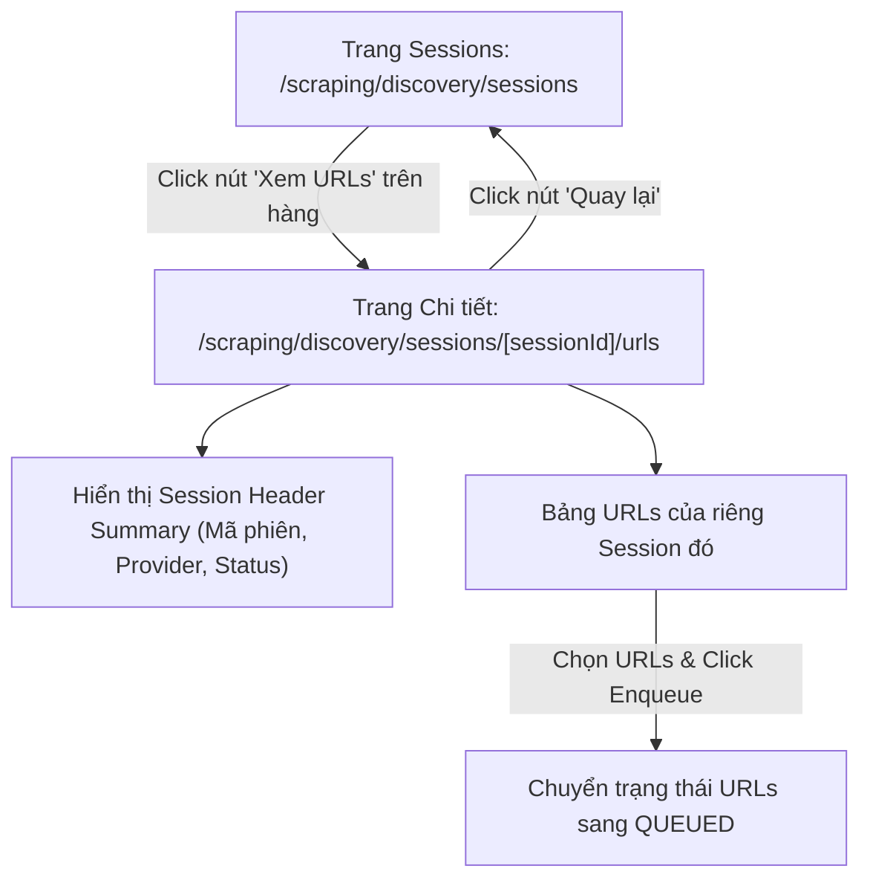

# Plan: Tái cấu trúc Nested Route URLs theo Session (/scraping/discovery/sessions/[sessionId]/urls)

## Section 1. Current State (Hiện trạng & Phân tích Mã nguồn)

### 1.1 Hiện trạng hệ thống
- **Cấu trúc Route hiện tại**: Phân hệ Discovery đang tổ chức 2 trang ngang cấp độc lập: `/scraping/discovery/sessions` và `/scraping/discovery/urls` kèm thanh `DiscoveryNavTabs`.
- **Vấn đề tồn tại**: Danh sách URLs về bản chất thuộc quyền sở hữu của từng Discovery Session cụ thể. Việc đặt ở cấp ngoài khiến người dùng khó phân biệt URLs của từng đợt khám phá và thiếu tiêu đề tóm tắt phiên cha khi xem chi tiết.
- **Mục tiêu tái cấu trúc**: Chuyển đổi trang URLs thành nested route động `/scraping/discovery/sessions/[sessionId]/urls`, hiển thị thông tin Session cha ở đầu trang kèm nút quay lại (`Back`), đồng thời dọn dẹp các route cấp ngoài không còn cần thiết.

### 1.2 Invariants (Hành vi & Ràng buộc bắt buộc giữ nguyên)
- **Data Integrity**: Các thao tác cập nhật trạng thái (Batch Enqueue) trên danh sách URLs của session phải đồng bộ chính xác với mock store.
- **Clean Routing**: Trang Sessions (`/scraping/discovery/sessions`) hoạt động độc lập và liền mạch, không còn phụ thuộc vào các sub-tabs cấp ngoài.
- **Theme Token & Component Consistency**: Toàn bộ UI mới trên trang chi tiết URLs phải tuân thủ chuẩn `custom-antd` và CSS variables `hub-*`.

---

## Section 2. Detailed Design (Thiết kế Kỹ thuật Chi tiết)

### 2.1 Kiến trúc Phân cấp & UX Flow
1. **Trang Danh sách Sessions** (`/scraping/discovery/sessions`):
   - Nút **"Xem URLs"** tại mỗi dòng trong bảng sẽ điều hướng người dùng tới `/scraping/discovery/sessions/${record.id}/urls`.
2. **Trang Chi tiết URLs theo Session** (`/scraping/discovery/sessions/[sessionId]/urls`):
   - **Header Card & Context Summary**:
     - Nút **"Quay lại danh sách phiên"** (Back to Sessions) với icon `<ArrowLeftOutlined />`.
     - Thông tin tóm tắt phiên cha: Mã phiên (`sessionCode`), Nhà cung cấp (`dataProvider.name`), Trạng thái (`status`), Tổng số URLs phát hiện (`totalDiscovered`), URL mục tiêu ban đầu (`targetUrl`).
   - **Bảng URLs & Hành động**:
     - Bảng dữ liệu chỉ nạp danh sách URLs có `sessionId === params.sessionId`.
     - Tìm kiếm theo từ khóa URL / Tiêu đề.
     - Checkbox chọn nhiều dòng và nút **"Đẩy vào hàng đợi cào" (Batch Enqueue)**.

### 2.2 Sơ đồ Luồng Điều hướng (Mermaid Flow)



---

## Section 3. Implementation Architecture & Machine-Readable Task Matrix

### 3.1 Machine-Readable Task Matrix & Dependency Graph

| Order | Status | Action | File Path | Target Symbols / AST Seams | Depends On | Fast Test Command |
| :---: | :---: | :---: | :--- | :--- | :--- | :--- |
| **1** | `[x]` | `[MODIFY]` | `src/app/(root)/scraping/discovery/mocks/mock-data.ts` | `getMockSessionById, getMockUrlsBySessionId` | `None` | `npx tsc --noEmit` |
| **2** | `[x]` | `[NEW]` | `src/app/(root)/scraping/discovery/sessions/[sessionId]/urls/hooks.ts` | `useDiscoverySessionUrlsPage` | `Order 1` | `npx tsc --noEmit` |
| **3** | `[x]` | `[NEW]` | `src/app/(root)/scraping/discovery/sessions/[sessionId]/urls/page.tsx` | `DiscoverySessionUrlsPage` | `Order 2` | `npx tsc --noEmit` |
| **4** | `[x]` | `[MODIFY]` | `src/app/(root)/scraping/discovery/sessions/page.tsx` | `DiscoverySessionsPage` | `Order 3` | `npx tsc --noEmit` |
| **5** | `[x]` | `[DELETE]` | `src/app/(root)/scraping/discovery/urls/page.tsx` | `DiscoveryUrlsPage` | `Order 4` | `npx tsc --noEmit` |
| **6** | `[x]` | `[DELETE]` | `src/app/(root)/scraping/discovery/urls/hooks.ts` | `useDiscoveryUrlsPage` | `Order 5` | `npx tsc --noEmit` |
| **7** | `[x]` | `[DELETE]` | `src/app/(root)/scraping/discovery/components/DiscoveryNavTabs.tsx` | `DiscoveryNavTabs` | `Order 4` | `npx tsc --noEmit` |
| **8** | `[x]` | `[DELETE]` | `src/app/(root)/scraping/discovery/components/index.ts` | `Barrel export` | `Order 7` | `npx tsc --noEmit` |

### 3.2 Cấu trúc Thư mục Sau Tái cấu trúc

```text
src/app/(root)/scraping/discovery/
├── page.tsx                                # Redirect to /scraping/discovery/sessions
├── types.ts                                # Entity contracts
├── mocks/
│   └── mock-data.ts                        # Mock store with session-by-id queries
└── sessions/
    ├── page.tsx                            # Sessions list page
    ├── hooks.ts                            # Sessions page hook
    ├── components/
    │   ├── CreateSessionModal.tsx          # Create session modal
    │   └── index.ts
    └── [sessionId]/
        └── urls/
            ├── page.tsx                    # Nested URLs detail page
            └── hooks.ts                    # Hook for session-scoped URLs
```

---

## Section 4. Implementation Code Examples (Mẫu Code Triển khai)

### 4.1 Order 1 — `src/app/(root)/scraping/discovery/mocks/mock-data.ts`
- **Label**: `[MODIFY]` [mock-data.ts](file:///d:/Sources/Personal/only-one-fe/src/app/(root)/scraping/discovery/mocks/mock-data.ts)
- **Rationale**: Bổ sung hàm lấy session theo ID và lấy danh sách URLs theo `sessionId`.

```typescript
// [TARGET SEAM]: Add session-scoped query helpers
export const getMockSessionById = (sessionId: string): IDiscoverySession | undefined => {
    return mockSessions.find((s) => s.id === sessionId);
};

export const getMockUrlsBySessionId = (sessionId: string): IDiscoveryUrl[] => {
    return mockUrls.filter((u) => u.sessionId === sessionId);
};
```

---

### 4.2 Order 2 — `src/app/(root)/scraping/discovery/sessions/[sessionId]/urls/hooks.ts`
- **Label**: `[NEW]` [hooks.ts](file:///d:/Sources/Personal/only-one-fe/src/app/(root)/scraping/discovery/sessions/%5BsessionId%5D/urls/hooks.ts)
- **Rationale**: Quản lý state của session cha, danh sách URLs của session đó, bộ lọc tìm kiếm và thao tác Batch Enqueue.

```typescript
// [TARGET SEAM]: Session Scoped URLs Hook
'use client';

import { useMemo, useState } from 'react';
import {
    enqueueMockUrls,
    getMockSessionById,
    getMockUrlsBySessionId,
} from '../../../mocks/mock-data';
import type { IDiscoverySession, IDiscoveryUrl } from '../../../types';

export const useDiscoverySessionUrlsPage = (sessionId: string) => {
    const session = useMemo<IDiscoverySession | undefined>(
        () => getMockSessionById(sessionId),
        [sessionId],
    );

    const [urls, setUrls] = useState<IDiscoveryUrl[]>(getMockUrlsBySessionId(sessionId));
    const [searchTerm, setSearchTerm] = useState('');
    const [selectedRowKeys, setSelectedRowKeys] = useState<string[]>([]);

    const filteredUrls = useMemo(() => {
        return urls.filter((u) => {
            const matchesSearch =
                !searchTerm ||
                u.url.toLowerCase().includes(searchTerm.toLowerCase()) ||
                (u.title && u.title.toLowerCase().includes(searchTerm.toLowerCase()));
            return matchesSearch;
        });
    }, [urls, searchTerm]);

    const handleBatchEnqueue = () => {
        if (selectedRowKeys.length === 0) return;
        enqueueMockUrls(selectedRowKeys);
        setUrls(getMockUrlsBySessionId(sessionId));
        setSelectedRowKeys([]);
    };

    return {
        session,
        urls: filteredUrls,
        searchTerm,
        setSearchTerm,
        selectedRowKeys,
        setSelectedRowKeys,
        handleBatchEnqueue,
    };
};
```

---

### 4.3 Order 3 — `src/app/(root)/scraping/discovery/sessions/[sessionId]/urls/page.tsx`
- **Label**: `[NEW]` [page.tsx](file:///d:/Sources/Personal/only-one-fe/src/app/(root)/scraping/discovery/sessions/%5BsessionId%5D/urls/page.tsx)
- **Rationale**: Trang hiển thị danh sách URLs của session cụ thể kèm Header tóm tắt và nút quay lại.

```typescript
// [TARGET SEAM]: Nested Session URLs Page Component
'use client';

import {
    FilterPanel,
    ListTable,
    ListWrapper,
    type CardAction,
    type IFilterField,
} from '@/components/common';
import {
    CustomButton,
    CustomCard,
    CustomDescriptions,
    CustomFlex,
    CustomSpace,
    CustomTag,
    CustomTypography,
    type ColumnsType,
} from '@/components/custom-antd';
import { formatDate } from '@/libs';
import { ArrowLeftOutlined, SendOutlined } from '@ant-design/icons';
import { useParams, useRouter } from 'next/navigation';
import { DiscoverySessionStatus, DiscoveryUrlStatus, type IDiscoveryUrl } from '../../../types';
import { useDiscoverySessionUrlsPage } from './hooks';

const DiscoverySessionUrlsPage = () => {
    const params = useParams();
    const router = useRouter();
    const sessionId = (params?.sessionId as string) || '';

    const {
        session,
        urls,
        setSearchTerm,
        selectedRowKeys,
        setSelectedRowKeys,
        handleBatchEnqueue,
    } = useDiscoverySessionUrlsPage(sessionId);

    const columns: ColumnsType<IDiscoveryUrl> = [
        {
            title: 'Tiêu đề & Đường dẫn',
            dataIndex: 'url',
            key: 'url',
            render: (url: string, record) => (
                <div className="flex flex-col">
                    <span className="font-medium text-hub-text-primary">
                        {record.title || 'Không có tiêu đề'}
                    </span>
                    <a
                        href={url}
                        target="_blank"
                        rel="noreferrer"
                        className="max-w-xl truncate text-xs text-hub-primary hover:underline"
                    >
                        {url}
                    </a>
                </div>
            ),
        },
        {
            title: 'Độ sâu phát hiện',
            dataIndex: 'foundAtDepth',
            key: 'foundAtDepth',
            align: 'center',
            width: '15%',
            render: (depth: number) => <CustomTag color="blue">Level {depth}</CustomTag>,
        },
        {
            title: 'Trạng thái',
            dataIndex: 'status',
            key: 'status',
            width: '15%',
            render: (status: DiscoveryUrlStatus) => {
                const colorMap = {
                    [DiscoveryUrlStatus.DISCOVERED]: 'default',
                    [DiscoveryUrlStatus.QUEUED]: 'processing',
                    [DiscoveryUrlStatus.SCRAPED]: 'success',
                    [DiscoveryUrlStatus.FAILED]: 'error',
                };
                return <CustomTag color={colorMap[status]}>{status.toUpperCase()}</CustomTag>;
            },
        },
        {
            title: 'Ngày phát hiện',
            dataIndex: 'createdAt',
            key: 'createdAt',
            width: '18%',
            render: (date: Date) => formatDate(date),
        },
    ];

    const actions: CardAction[] = [
        {
            component: (
                <CustomButton
                    type="primary"
                    icon={<SendOutlined />}
                    disabled={selectedRowKeys.length === 0}
                    onClick={handleBatchEnqueue}
                >
                    Đẩy vào hàng đợi cào ({selectedRowKeys.length})
                </CustomButton>
            ),
        },
    ];

    const filters: IFilterField[] = [
        {
            name: 'search',
            type: 'input',
            placeholder: 'Tìm theo URL, tiêu đề...',
            onChange: (val) => setSearchTerm(val?.toString() || ''),
        },
    ];

    const statusTagColorMap = {
        [DiscoverySessionStatus.COMPLETED]: 'success',
        [DiscoverySessionStatus.IN_PROGRESS]: 'processing',
        [DiscoverySessionStatus.FAILED]: 'error',
        [DiscoverySessionStatus.PENDING]: 'default',
    };

    return (
        <CustomSpace direction="vertical" size={16} className="w-full">
            <CustomCard className="border-hub-border bg-hub-card">
                <CustomFlex justify="space-between" align="center" className="mb-4">
                    <CustomSpace align="center" size={12}>
                        <CustomButton
                            icon={<ArrowLeftOutlined />}
                            onClick={() => router.push('/scraping/discovery/sessions')}
                        >
                            Quay lại danh sách phiên
                        </CustomButton>
                        <CustomTypography.Title level={4} className="!mb-0">
                            Chi tiết URLs: {session?.sessionCode || sessionId}
                        </CustomTypography.Title>
                    </CustomSpace>
                    {session && (
                        <CustomTag color={statusTagColorMap[session.status]}>
                            {session.status.toUpperCase()}
                        </CustomTag>
                    )}
                </CustomFlex>

                {session && (
                    <CustomDescriptions size="small" column={{ xs: 1, sm: 2, md: 4 }} bordered>
                        <CustomDescriptions.Item label="Nhà cung cấp">
                            {session.dataProvider?.name || '—'}
                        </CustomDescriptions.Item>
                        <CustomDescriptions.Item label="URL Khám phá ban đầu">
                            <span className="truncate max-w-xs inline-block" title={session.targetUrl}>
                                {session.targetUrl}
                            </span>
                        </CustomDescriptions.Item>
                        <CustomDescriptions.Item label="Tổng URLs tìm thấy">
                            <span className="font-semibold text-hub-primary">
                                {urls.length} URLs
                            </span>
                        </CustomDescriptions.Item>
                        <CustomDescriptions.Item label="Độ sâu (Depth)">
                            Level {session.depth}
                        </CustomDescriptions.Item>
                    </CustomDescriptions>
                )}
            </CustomCard>

            <ListWrapper
                actions={actions}
                filters={<FilterPanel fields={filters} />}
            >
                <ListTable<IDiscoveryUrl>
                    columns={columns}
                    tableProps={{
                        dataSource: urls,
                        rowKey: 'id',
                        rowSelection: {
                            selectedRowKeys,
                            onChange: (keys) => setSelectedRowKeys(keys as string[]),
                        },
                        pagination: { pageSize: 10, showSizeChanger: true },
                    }}
                />
            </ListWrapper>
        </CustomSpace>
    );
};

export default DiscoverySessionUrlsPage;
```

---

### 4.4 Order 4 — `src/app/(root)/scraping/discovery/sessions/page.tsx`
- **Label**: `[MODIFY]` [sessions/page.tsx](file:///d:/Sources/Personal/only-one-fe/src/app/(root)/scraping/discovery/sessions/page.tsx)
- **Rationale**: Cập nhật nút "Xem URLs" điều hướng tới `/scraping/discovery/sessions/${record.id}/urls` và loại bỏ component `DiscoveryNavTabs`.

```typescript
// [TARGET SEAM]: Update action link to nested URLs route
render: (_, record) => (
    <CustomButton
        type="link"
        icon={<EyeOutlined />}
        onClick={() =>
            router.push(
                `/scraping/discovery/sessions/${record.id}/urls`,
            )
        }
    >
        Xem URLs
    </CustomButton>
),
```

---

### 4.5 Order 5 & 6 & 7 & 8 — Dọn dẹp Files cũ không còn dùng
- **Label**: `[DELETE]` [urls/page.tsx](file:///d:/Sources/Personal/only-one-fe/src/app/(root)/scraping/discovery/urls/page.tsx)
- **Label**: `[DELETE]` [urls/hooks.ts](file:///d:/Sources/Personal/only-one-fe/src/app/(root)/scraping/discovery/urls/hooks.ts)
- **Label**: `[DELETE]` [components/DiscoveryNavTabs.tsx](file:///d:/Sources/Personal/only-one-fe/src/app/(root)/scraping/discovery/components/DiscoveryNavTabs.tsx)
- **Label**: `[DELETE]` [components/index.ts](file:///d:/Sources/Personal/only-one-fe/src/app/(root)/scraping/discovery/components/index.ts)
- **Rationale**: Loại bỏ mã nguồn thừa để giữ cấu trúc repository luôn tinh gọn, ngăn ngừa dead code.

---

## Section 5. Test Cases (Kịch bản Kiểm thử & Nghiệm thu)

### Test Case 1: Điều hướng Nested Route
- **Objective**: Xác thực khi bấm "Xem URLs" tại session có id `session-1`, hệ thống chuyển hướng chính xác đến `/scraping/discovery/sessions/session-1/urls`.
- **Precondition**: Đang ở trang danh sách sessions `/scraping/discovery/sessions`.
- **Action**: Bấm nút "Xem URLs" tại dòng `DISC-AMZ-001`.
- **Expected Result**: URL chuyển sang `/scraping/discovery/sessions/session-1/urls`, header hiển thị tóm tắt thông tin của `DISC-AMZ-001`.

### Test Case 2: Kiểm tra Phân lập Dữ liệu URLs theo Session
- **Objective**: Đảm bảo bảng URLs chỉ hiển thị các URL thuộc về session hiện tại.
- **Precondition**: `session-1` có 3 URLs (Sony Headphones, iPad, Echo Dot), `session-2` có 2 URLs (Tai nghe Bluetooth, Bàn phím cơ).
- **Action**: Xem URLs của `session-1`.
- **Expected Result**: Bảng hiển thị chính xác 3 URLs của Amazon, không lẫn URL của `session-2`.

### Test Case 3: Nút Quay lại (Back Navigation)
- **Objective**: Kiểm tra nút quay lại danh sách Sessions.
- **Precondition**: Đang ở trang `/scraping/discovery/sessions/session-1/urls`.
- **Action**: Bấm nút "Quay lại danh sách phiên".
- **Expected Result**: Hệ thống điều hướng quay trở lại `/scraping/discovery/sessions`.

### Test Case 4: Batch Enqueue trong phạm vi Session
- **Objective**: Chọn URLs trong session và đẩy vào hàng đợi.
- **Precondition**: Đang ở `/scraping/discovery/sessions/session-1/urls`.
- **Action**: Tick chọn 1 URL có trạng thái `DISCOVERED` $\rightarrow$ Bấm "Đẩy vào hàng đợi cào (1)".
- **Expected Result**: Trạng thái đổi sang `QUEUED`, cập nhật bảng ngay tức thì.

### Test Command Tổng quan:
```bash
npx tsc --noEmit
npm run prettier
npx eslint "src/app/(root)/scraping/discovery"
```

---

## Section 6. Technical English Key Patterns

### 1. Route Re-scoping
- **Meaning (VI)**: Tái định nghĩa phạm vi của route từ cấp toàn cục sang cấp phụ thuộc vào đối tượng cha.
- **Grammar / Usage**: `Re-scope [Resource route] + under + [Parent entity]`
- **Engineering Example**: *"We re-scoped the URLs route under `/sessions/[sessionId]/urls` to preserve session context."*

### 2. Contextual Summary Panel
- **Meaning (VI)**: Bảng tóm tắt ngữ cảnh đặt ở đầu trang hiển thị các thuộc tính cốt lõi của thực thể cha.
- **Grammar / Usage**: `Display + contextual summary panel + with [metadata fields]`
- **Engineering Example**: *"The top of the view features a contextual summary panel showing the active session's progress and target URL."*

### 3. Back-Navigation Seam
- **Meaning (VI)**: Điểm tiếp nối điều hướng cho phép người dùng quay lại danh sách cha mà không làm mất trạng thái.
- **Grammar / Usage**: `Integrate + back-navigation seam + via [router.push / breadcrumbs]`
- **Engineering Example**: *"Integrating a dedicated back-navigation seam provides a frictionless path back to the parent Sessions list."*
