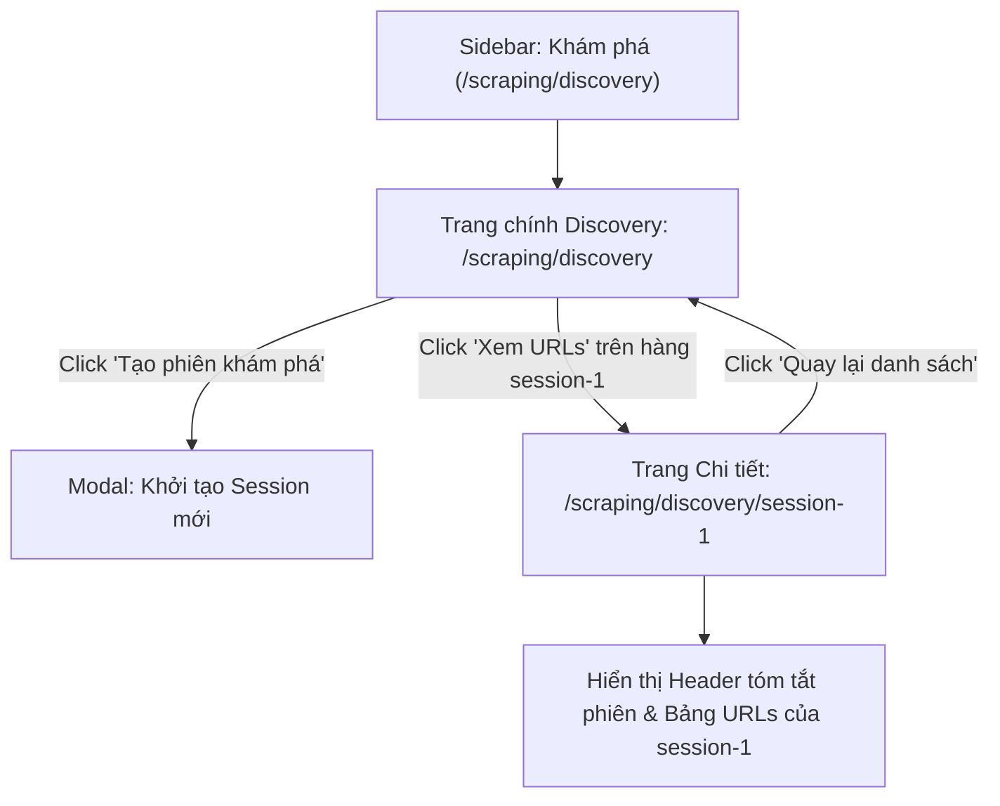

# Plan: Làm phẳng Định tuyến Discovery (/discovery & /discovery/[id])

## Section 1. Current State (Hiện trạng & Phân tích Mã nguồn)

### 1.1 Hiện trạng hệ thống
- **Cấu trúc Route hiện tại**: Phân hệ Discovery đang nằm lồng dưới tầng `/sessions` (`/scraping/discovery/sessions` và `/scraping/discovery/sessions/[sessionId]/urls`), trong khi file gốc `/scraping/discovery/page.tsx` chỉ làm nhiệm vụ redirect.
- **Vấn đề**: Cấu trúc này làm URL dài dòng và không tận dụng trực tiếp route gốc `/scraping/discovery`.
- **Mục tiêu**: Đưa danh sách Discovery Sessions lên trực tiếp `/scraping/discovery` và trang chi tiết URLs lên `/scraping/discovery/[id]`, dọn sạch thư mục trung gian `sessions/`.

### 1.2 Invariants (Hành vi & Ràng buộc bắt buộc giữ nguyên)
- **Zero Loss of Features**: Giữ nguyên toàn bộ tính năng lọc theo Data Provider, tìm kiếm, tạo phiên mới, xem danh sách URLs theo phiên, và thao tác Batch Enqueue.
- **Mock Store Continuity**: Tiếp tục sử dụng `mock-data.ts` làm Single Source of Truth cho mock state.
- **Clean RESTful URLs**: Route chính là `/scraping/discovery`, route chi tiết là `/scraping/discovery/[id]`.

---

## Section 2. Detailed Design (Thiết kế Kỹ thuật Chi tiết)

### 2.1 Cấu trúc Thư mục Mục tiêu
```text
src/app/(root)/scraping/discovery/
├── page.tsx                                # Main Discovery List Page (/scraping/discovery)
├── hooks.ts                                # Main Discovery List Hook
├── types.ts                                # Domain Types & Contracts
├── mocks/
│   └── mock-data.ts                        # Mock Store & Helpers
├── components/
│   ├── CreateSessionModal.tsx              # Modal create session
│   └── index.ts                            # Barrel export
└── [id]/
    ├── page.tsx                            # Session Detail & URLs Page (/scraping/discovery/[id])
    └── hooks.ts                            # Hook for Session Detail & URLs
```

### 2.2 Sơ đồ Luồng Điều hướng Tối giản (Mermaid Flow)



---

## Section 3. Implementation Architecture & Machine-Readable Task Matrix

### 3.1 Machine-Readable Task Matrix & Dependency Graph

| Order | Status | Action | File Path | Target Symbols / AST Seams | Depends On | Fast Test Command |
| :---: | :---: | :---: | :--- | :--- | :--- | :--- |
| **1** | `[x]` | `[NEW]` | `src/app/(root)/scraping/discovery/components/CreateSessionModal.tsx` | `CreateSessionModal` | `None` | `npx tsc --noEmit` |
| **2** | `[x]` | `[NEW]` | `src/app/(root)/scraping/discovery/components/index.ts` | `Barrel export` | `Order 1` | `npx tsc --noEmit` |
| **3** | `[x]` | `[NEW]` | `src/app/(root)/scraping/discovery/hooks.ts` | `useDiscoveryPage` | `None` | `npx tsc --noEmit` |
| **4** | `[x]` | `[MODIFY]` | `src/app/(root)/scraping/discovery/page.tsx` | `DiscoveryPage` | `Order 2, 3` | `npx tsc --noEmit` |
| **5** | `[x]` | `[NEW]` | `src/app/(root)/scraping/discovery/[id]/hooks.ts` | `useDiscoveryDetailPage` | `None` | `npx tsc --noEmit` |
| **6** | `[x]` | `[NEW]` | `src/app/(root)/scraping/discovery/[id]/page.tsx` | `DiscoveryDetailPage` | `Order 5` | `npx tsc --noEmit` |
| **7** | `[x]` | `[MODIFY]` | `src/constants/sidebar.constant.ts` | `SIDEBAR_ITEMS` | `Order 4` | `npx tsc --noEmit` |
| **8** | `[x]` | `[DELETE]` | `src/app/(root)/scraping/discovery/sessions` | `Legacy sessions directory` | `Order 4, 6` | `npx tsc --noEmit` |

---

## Section 4. Implementation Code Examples (Mẫu Code Triển khai)

### 4.1 Order 1 & 2 — Components (`CreateSessionModal.tsx` & `index.ts`)
- **Label**: `[NEW]` [CreateSessionModal.tsx](file:///d:/Sources/Personal/only-one-fe/src/app/(root)/scraping/discovery/components/CreateSessionModal.tsx)
- **Rationale**: Đặt modal tạo phiên khám phá trực tiếp tại thư mục components của discovery.

```typescript
// [TARGET SEAM]: Create Discovery Session Modal Form
'use client';

import {
    CustomForm,
    CustomInput,
    CustomInputNumber,
    CustomModal,
    CustomSelect,
    type CustomSelectProps,
} from '@/components/custom-antd';
import { useEffect } from 'react';
import type { CreateSessionFormValues } from '../types';

interface CreateSessionModalProps {
    open: boolean;
    onCancel: () => void;
    onSubmit: (values: CreateSessionFormValues) => void;
    dataProviderOptions?: CustomSelectProps['options'];
}

export const CreateSessionModal = ({
    open,
    onCancel,
    onSubmit,
    dataProviderOptions,
}: CreateSessionModalProps) => {
    const [form] = CustomForm.useForm<CreateSessionFormValues>();

    useEffect(() => {
        if (open) {
            form.resetFields();
            form.setFieldsValue({ depth: 1, maxUrls: 50 });
        }
    }, [open, form]);

    const handleOk = async () => {
        const values = await form.validateFields();
        onSubmit(values);
    };

    return (
        <CustomModal
            open={open}
            title="Khởi tạo phiên khám phá mới (Discovery Session)"
            onCancel={onCancel}
            onOk={handleOk}
            okText="Bắt đầu khám phá"
            cancelText="Hủy"
            destroyOnClose
        >
            <CustomForm form={form} layout="vertical">
                <CustomForm.Item
                    name="dataProviderId"
                    label="Nhà cung cấp dữ liệu"
                    rules={[{ required: true, message: 'Vui lòng chọn nhà cung cấp' }]}
                >
                    <CustomSelect
                        placeholder="Chọn nhà cung cấp"
                        options={dataProviderOptions}
                    />
                </CustomForm.Item>

                <CustomForm.Item
                    name="targetUrl"
                    label="Đường dẫn khám phá (Seed URL)"
                    rules={[
                        { required: true, message: 'Vui lòng nhập đường dẫn' },
                        { type: 'url', message: 'Đường dẫn không hợp lệ' },
                    ]}
                >
                    <CustomInput placeholder="https://example.com/category/products" />
                </CustomForm.Item>

                <CustomForm.Item name="depth" label="Độ sâu thu thập (Crawl Depth)">
                    <CustomInputNumber min={1} max={5} className="w-full" />
                </CustomForm.Item>
            </CustomForm>
        </CustomModal>
    );
};
```

---

### 4.2 Order 3 — Main Discovery Hook (`hooks.ts`)
- **Label**: `[NEW]` [hooks.ts](file:///d:/Sources/Personal/only-one-fe/src/app/(root)/scraping/discovery/hooks.ts)
- **Rationale**: Quản lý state cho trang chính `/scraping/discovery`.

```typescript
// [TARGET SEAM]: Discovery Main Page State Hook
'use client';

import { useSelectDataProvider } from '@/hooks';
import { useMemo, useState } from 'react';
import { addMockSession, getMockSessions } from './mocks/mock-data';
import {
    DiscoverySessionStatus,
    type CreateSessionFormValues,
    type IDiscoverySession,
} from './types';

export const useDiscoveryPage = () => {
    const [sessions, setSessions] = useState<IDiscoverySession[]>(getMockSessions());
    const [selectedProviderId, setSelectedProviderId] = useState<string | undefined>();
    const [searchTerm, setSearchTerm] = useState('');
    const [isCreateModalOpen, setIsCreateModalOpen] = useState(false);

    const { options: dataProviderOptions } = useSelectDataProvider();

    const filteredSessions = useMemo(() => {
        return sessions.filter((s) => {
            const matchesProvider =
                !selectedProviderId || s.dataProviderId === selectedProviderId;
            const matchesSearch =
                !searchTerm ||
                s.sessionCode.toLowerCase().includes(searchTerm.toLowerCase()) ||
                s.targetUrl.toLowerCase().includes(searchTerm.toLowerCase());
            return matchesProvider && matchesSearch;
        });
    }, [sessions, selectedProviderId, searchTerm]);

    const handleCreateSession = (values: CreateSessionFormValues) => {
        const provider = dataProviderOptions.find((p) => p.value === values.dataProviderId);
        const providerName = (provider?.label as string) || 'Provider';
        const newSession: IDiscoverySession = {
            id: `session-${Date.now()}`,
            sessionCode: `DISC-${providerName.toUpperCase().slice(0, 3)}-${Math.floor(100 + Math.random() * 900)}`,
            dataProviderId: values.dataProviderId,
            dataProvider: {
                id: values.dataProviderId,
                name: providerName,
                identifier: providerName.toLowerCase().replace(/\s+/g, '_'),
                baseUrl: values.targetUrl,
                createdAt: new Date(),
            },
            targetUrl: values.targetUrl,
            status: DiscoverySessionStatus.IN_PROGRESS,
            totalDiscovered: 0,
            totalQueued: 0,
            depth: values.depth || 1,
            durationSeconds: 0,
            createdAt: new Date(),
        };
        addMockSession(newSession);
        setSessions(getMockSessions());
        setIsCreateModalOpen(false);
    };

    return {
        sessions: filteredSessions,
        dataProviderOptions,
        selectedProviderId,
        setSelectedProviderId,
        searchTerm,
        setSearchTerm,
        isCreateModalOpen,
        setIsCreateModalOpen,
        handleCreateSession,
    };
};
```

---

### 4.3 Order 4 — Main Discovery Page (`page.tsx`)
- **Label**: `[MODIFY]` [page.tsx](file:///d:/Sources/Personal/only-one-fe/src/app/(root)/scraping/discovery/page.tsx)
- **Rationale**: Hiển thị bảng danh sách các phiên khám phá trực tiếp tại `/scraping/discovery`.

```typescript
// [TARGET SEAM]: Main Discovery Page Component
'use client';

import {
    FilterPanel,
    ListTable,
    ListWrapper,
    type CardAction,
    type IFilterField,
} from '@/components/common';
import {
    CustomButton,
    CustomTag,
    type ColumnsType,
} from '@/components/custom-antd';
import { formatDate } from '@/libs';
import { EyeOutlined, PlusOutlined } from '@ant-design/icons';
import { useRouter } from 'next/navigation';
import { CreateSessionModal } from './components/CreateSessionModal';
import { useDiscoveryPage } from './hooks';
import { DiscoverySessionStatus, type IDiscoverySession } from './types';

const DiscoveryPage = () => {
    const router = useRouter();
    const {
        sessions,
        dataProviderOptions,
        setSelectedProviderId,
        setSearchTerm,
        isCreateModalOpen,
        setIsCreateModalOpen,
        handleCreateSession,
    } = useDiscoveryPage();

    const columns: ColumnsType<IDiscoverySession> = [
        {
            title: 'Mã phiên',
            dataIndex: 'sessionCode',
            key: 'sessionCode',
            render: (code: string) => (
                <span className="font-semibold text-hub-primary">{code}</span>
            ),
        },
        {
            title: 'Nhà cung cấp',
            dataIndex: ['dataProvider', 'name'],
            key: 'dataProvider',
            render: (name: string) => name || '—',
        },
        {
            title: 'URL Khám phá',
            dataIndex: 'targetUrl',
            key: 'targetUrl',
            ellipsis: true,
        },
        {
            title: 'Trạng thái',
            dataIndex: 'status',
            key: 'status',
            render: (status: DiscoverySessionStatus) => {
                const colorMap = {
                    [DiscoverySessionStatus.COMPLETED]: 'success',
                    [DiscoverySessionStatus.IN_PROGRESS]: 'processing',
                    [DiscoverySessionStatus.FAILED]: 'error',
                    [DiscoverySessionStatus.PENDING]: 'default',
                };
                return <CustomTag color={colorMap[status]}>{status.toUpperCase()}</CustomTag>;
            },
        },
        {
            title: 'URLs tìm thấy',
            dataIndex: 'totalDiscovered',
            key: 'totalDiscovered',
            align: 'right',
        },
        {
            title: 'Ngày tạo',
            dataIndex: 'createdAt',
            key: 'createdAt',
            render: (date: Date) => formatDate(date),
        },
        {
            title: 'Thao tác',
            key: 'actions',
            align: 'center',
            render: (_, record) => (
                <CustomButton
                    type="link"
                    icon={<EyeOutlined />}
                    onClick={() => router.push(`/scraping/discovery/${record.id}`)}
                >
                    Xem URLs
                </CustomButton>
            ),
        },
    ];

    const actions: CardAction[] = [
        {
            component: (
                <CustomButton
                    type="primary"
                    icon={<PlusOutlined />}
                    onClick={() => setIsCreateModalOpen(true)}
                >
                    Tạo phiên khám phá
                </CustomButton>
            ),
        },
    ];

    const filters: IFilterField[] = [
        {
            name: 'search',
            type: 'input',
            placeholder: 'Tìm theo mã phiên, URL...',
            onChange: (val) => setSearchTerm(val?.toString() || ''),
        },
        {
            name: 'dataProviderId',
            type: 'select',
            placeholder: 'Chọn nhà cung cấp',
            options: dataProviderOptions,
            onChange: (val) => setSelectedProviderId(val?.toString() || undefined),
        },
    ];

    return (
        <>
            <ListWrapper
                actions={actions}
                filters={<FilterPanel fields={filters} />}
            >
                <ListTable<IDiscoverySession>
                    columns={columns}
                    tableProps={{
                        dataSource: sessions,
                        rowKey: 'id',
                        pagination: { pageSize: 10, showSizeChanger: true },
                    }}
                />
            </ListWrapper>
            <CreateSessionModal
                open={isCreateModalOpen}
                onCancel={() => setIsCreateModalOpen(false)}
                onSubmit={handleCreateSession}
                dataProviderOptions={dataProviderOptions}
            />
        </>
    );
};

export default DiscoveryPage;
```

---

### 4.4 Order 5 & 6 — Detail Page (`[id]/page.tsx` & `[id]/hooks.ts`)
- **Label**: `[NEW]` [page.tsx](file:///d:/Sources/Personal/only-one-fe/src/app/(root)/scraping/discovery/%5Bid%5D/page.tsx)
- **Rationale**: Hiển thị chi tiết phiên khám phá và danh sách URLs tại `/scraping/discovery/[id]`.

```typescript
// [TARGET SEAM]: Discovery Session Detail Page Component
'use client';

import {
    DiscoverySessionStatus,
    DiscoveryUrlStatus,
    type IDiscoveryUrl,
} from '@/app/(root)/scraping/discovery/types';
import {
    FilterPanel,
    ListTable,
    ListWrapper,
    type CardAction,
    type IFilterField,
} from '@/components/common';
import {
    CustomButton,
    CustomCard,
    CustomDescriptions,
    CustomFlex,
    CustomSpace,
    CustomTag,
    CustomTypography,
    type ColumnsType,
} from '@/components/custom-antd';
import { formatDate } from '@/libs';
import { ArrowLeftOutlined, SendOutlined } from '@ant-design/icons';
import { useParams, useRouter } from 'next/navigation';
import { useDiscoveryDetailPage } from './hooks';

const DiscoveryDetailPage = () => {
    const params = useParams();
    const router = useRouter();
    const id = (params?.id as string) || '';

    const {
        session,
        urls,
        setSearchTerm,
        selectedRowKeys,
        setSelectedRowKeys,
        handleBatchEnqueue,
    } = useDiscoveryDetailPage(id);

    const columns: ColumnsType<IDiscoveryUrl> = [
        {
            title: 'Tiêu đề & Đường dẫn',
            dataIndex: 'url',
            key: 'url',
            render: (url: string, record) => (
                <div className="flex flex-col">
                    <span className="font-medium text-hub-text-primary">
                        {record.title || 'Không có tiêu đề'}
                    </span>
                    <a
                        href={url}
                        target="_blank"
                        rel="noreferrer"
                        className="max-w-xl truncate text-xs text-hub-primary hover:underline"
                    >
                        {url}
                    </a>
                </div>
            ),
        },
        {
            title: 'Độ sâu phát hiện',
            dataIndex: 'foundAtDepth',
            key: 'foundAtDepth',
            align: 'center',
            width: '15%',
            render: (depth: number) => <CustomTag color="blue">Level {depth}</CustomTag>,
        },
        {
            title: 'Trạng thái',
            dataIndex: 'status',
            key: 'status',
            width: '15%',
            render: (status: DiscoveryUrlStatus) => {
                const colorMap = {
                    [DiscoveryUrlStatus.DISCOVERED]: 'default',
                    [DiscoveryUrlStatus.QUEUED]: 'processing',
                    [DiscoveryUrlStatus.SCRAPED]: 'success',
                    [DiscoveryUrlStatus.FAILED]: 'error',
                };
                return <CustomTag color={colorMap[status]}>{status.toUpperCase()}</CustomTag>;
            },
        },
        {
            title: 'Ngày phát hiện',
            dataIndex: 'createdAt',
            key: 'createdAt',
            width: '18%',
            render: (date: Date) => formatDate(date),
        },
    ];

    const actions: CardAction[] = [
        {
            component: (
                <CustomButton
                    type="primary"
                    icon={<SendOutlined />}
                    disabled={selectedRowKeys.length === 0}
                    onClick={handleBatchEnqueue}
                >
                    Đẩy vào hàng đợi cào ({selectedRowKeys.length})
                </CustomButton>
            ),
        },
    ];

    const filters: IFilterField[] = [
        {
            name: 'search',
            type: 'input',
            placeholder: 'Tìm theo URL, tiêu đề...',
            onChange: (val) => setSearchTerm(val?.toString() || ''),
        },
    ];

    const statusTagColorMap = {
        [DiscoverySessionStatus.COMPLETED]: 'success',
        [DiscoverySessionStatus.IN_PROGRESS]: 'processing',
        [DiscoverySessionStatus.FAILED]: 'error',
        [DiscoverySessionStatus.PENDING]: 'default',
    };

    return (
        <CustomSpace direction="vertical" size={16} className="w-full">
            <CustomCard className="border-hub-border bg-hub-card">
                <CustomFlex justify="space-between" align="center" className="mb-4">
                    <CustomSpace align="center" size={12}>
                        <CustomButton
                            icon={<ArrowLeftOutlined />}
                            onClick={() => router.push('/scraping/discovery')}
                        >
                            Quay lại danh sách
                        </CustomButton>
                        <CustomTypography.Title level={4} className="!mb-0">
                            Chi tiết phiên: {session?.sessionCode || id}
                        </CustomTypography.Title>
                    </CustomSpace>
                    {session && (
                        <CustomTag color={statusTagColorMap[session.status]}>
                            {session.status.toUpperCase()}
                        </CustomTag>
                    )}
                </CustomFlex>

                {session && (
                    <CustomDescriptions size="small" column={{ xs: 1, sm: 2, md: 4 }} bordered>
                        <CustomDescriptions.Item label="Nhà cung cấp">
                            {session.dataProvider?.name || '—'}
                        </CustomDescriptions.Item>
                        <CustomDescriptions.Item label="URL Khám phá ban đầu">
                            <span
                                className="inline-block max-w-xs truncate"
                                title={session.targetUrl}
                            >
                                {session.targetUrl}
                            </span>
                        </CustomDescriptions.Item>
                        <CustomDescriptions.Item label="Tổng URLs tìm thấy">
                            <span className="font-semibold text-hub-primary">
                                {urls.length} URLs
                            </span>
                        </CustomDescriptions.Item>
                        <CustomDescriptions.Item label="Độ sâu (Depth)">
                            Level {session.depth}
                        </CustomDescriptions.Item>
                    </CustomDescriptions>
                )}
            </CustomCard>

            <ListWrapper
                actions={actions}
                filters={<FilterPanel fields={filters} />}
            >
                <ListTable<IDiscoveryUrl>
                    columns={columns}
                    tableProps={{
                        dataSource: urls,
                        rowKey: 'id',
                        rowSelection: {
                            selectedRowKeys,
                            onChange: (keys) => setSelectedRowKeys(keys as string[]),
                        },
                        pagination: { pageSize: 10, showSizeChanger: true },
                    }}
                />
            </ListWrapper>
        </CustomSpace>
    );
};

export default DiscoveryDetailPage;
```

---

### 4.5 Order 7 — Sidebar Constant (`sidebar.constant.ts`)
- **Label**: `[MODIFY]` [sidebar.constant.ts](file:///d:/Sources/Personal/only-one-fe/src/constants/sidebar.constant.ts)
- **Rationale**: Đổi `href` menu "Khám phá" sang `/scraping/discovery`.

```typescript
// [TARGET SEAM]: Update Discovery sidebar item href
{
    label: 'Khám phá',
    icon: 'noto:compass',
    href: '/scraping/discovery',
    description: 'Khám phá và thu thập danh sách URL sản phẩm',
}
```

---

## Section 5. Test Cases (Kịch bản Kiểm thử & Nghiệm thu)

### Test Case 1: Truy cập Trực tiếp Root URL
- **Objective**: Xác thực khi truy cập `http://localhost:3000/scraping/discovery`, bảng danh sách phiên hiển thị ngay lập tức (không chuyển hướng).
- **Expected Result**: Trang hiển thị danh sách sessions, tiêu đề và bộ lọc Data Provider.

### Test Case 2: Điều hướng đến Trang Chi tiết `/[id]`
- **Objective**: Bấm "Xem URLs" tại phiên có id `session-1`.
- **Expected Result**: Trình duyệt chuyển sang `http://localhost:3000/scraping/discovery/session-1`, hiển thị Header tóm tắt phiên và danh sách URLs của `session-1`.

### Test Case 3: Nút Quay lại Trang Danh sách
- **Objective**: Bấm "Quay lại danh sách" tại trang chi tiết.
- **Expected Result**: Chuyển hướng quay về `http://localhost:3000/scraping/discovery`.

### Test Command:
```bash
npx tsc --noEmit
npm run prettier
npx eslint "src/app/(root)/scraping/discovery"
```

---

## Section 6. Technical English Key Patterns

### 1. Root Resource Exposition
- **Meaning (VI)**: Phơi bày danh sách thực thể chính trực tiếp tại đường dẫn gốc của module.
- **Engineering Example**: *"Root resource exposition at `/discovery` eliminates redirect overhead and simplifies client-side navigation."*

### 2. Standardized Slug Parameter
- **Meaning (VI)**: Sử dụng tham số định danh chuẩn `[id]` cho tuyến đường chi tiết.
- **Engineering Example**: *"Adopting `[id]` aligns our discovery detail view with standard Next.js App Router conventions."*
