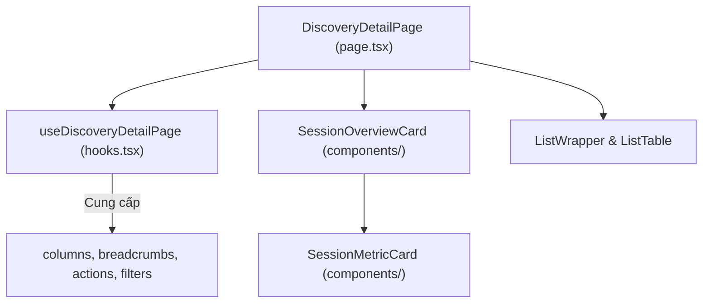

# Plan: Phân rã Module Chi tiết Discovery & Chuẩn hóa Custom Antd

## Section 1. Current State (Hiện trạng & Phân tích Mã nguồn)

### 1.1 Hiện trạng hệ thống
- **Tệp nguồn nguyên khối**: Tệp [discovery/[id]/page.tsx](file:///d:/Sources/Personal/only-one-fe/src/app/(root)/scraping/discovery/%5Bid%5D/page.tsx) dài gần 400 dòng, chứa toàn bộ JSX thẻ tổng quan, các thẻ chỉ số metric, và cấu hình bảng.
- **Sử dụng nhiều HTML thô**: Còn tồn tại các thẻ `div`, `span`, `a` với nhiều class Tailwind lồng ghép thay vì tận dụng các component `custom-antd` sẵn có theo quy tắc repository (`rules.md`).
- **Mục tiêu**:
  1. Phân rã thành các sub-components trong `discovery/[id]/components/` (`SessionOverviewCard.tsx`, `SessionMetricCard.tsx`, `index.ts`).
  2. Di chuyển toàn bộ cấu hình `columns`, `breadcrumbs`, `actions`, `filters` vào `hooks.tsx`.
  3. Rút gọn `page.tsx` thành thin presentation coordinator (< 50 dòng).
  4. Chuẩn hóa 100% sang `custom-antd` (`CustomCard`, `CustomFlex`, `CustomTypography`, `CustomDivider`, `CustomTag`, `CustomSpace`).

### 1.2 Invariants (Hành vi & Ràng buộc bắt buộc giữ nguyên)
- **Zero Loss of UX/Data**: Giữ nguyên toàn bộ nội dung dữ liệu, màu sắc trạng thái, icon và các thao tác người dùng (Batch Enqueue, Tìm kiếm, Breadcrumb).
- **Rule Compliance**: Tuân thủ tuyệt đối quy định không dùng raw HTML lồng nhau phức tạp khi đã có `custom-antd` primitives tương đương.

---

## Section 2. Detailed Design (Thiết kế Kỹ thuật Chi tiết)

### 2.1 Cấu trúc Thư mục Module Chi tiết
```text
src/app/(root)/scraping/discovery/[id]/
├── page.tsx                                # Thin View Orchestrator (< 50 dòng)
├── hooks.tsx                               # State, Columns, Breadcrumbs, Actions, Filters
└── components/
    ├── SessionMetricCard.tsx               # Reusable Metric KPI Card (100% custom-antd)
    ├── SessionOverviewCard.tsx             # Hero Session Overview Card
    └── index.ts                            # Barrel Export
```

### 2.2 Sơ đồ Kiến trúc Phân rã (Mermaid Architecture)



---

## Section 3. Implementation Architecture & Machine-Readable Task Matrix

### 3.1 Machine-Readable Task Matrix & Dependency Graph

| Order | Status | Action | File Path | Target Symbols / AST Seams | Depends On | Fast Test Command |
| :---: | :---: | :---: | :--- | :--- | :--- | :--- |
| **1** | `[x]` | `[NEW]` | `src/app/(root)/scraping/discovery/[id]/components/SessionMetricCard.tsx` | `SessionMetricCard` | `None` | `npx tsc --noEmit` |
| **2** | `[x]` | `[NEW]` | `src/app/(root)/scraping/discovery/[id]/components/SessionOverviewCard.tsx` | `SessionOverviewCard` | `Order 1` | `npx tsc --noEmit` |
| **3** | `[x]` | `[NEW]` | `src/app/(root)/scraping/discovery/[id]/components/index.ts` | `Barrel export` | `Order 1, 2` | `npx tsc --noEmit` |
| **4** | `[x]` | `[MODIFY]` | `src/app/(root)/scraping/discovery/[id]/hooks.tsx` | `useDiscoveryDetailPage` | `None` | `npx tsc --noEmit` |
| **5** | `[x]` | `[MODIFY]` | `src/app/(root)/scraping/discovery/[id]/page.tsx` | `DiscoveryDetailPage` | `Order 3, 4` | `npx tsc --noEmit` |

---

## Section 4. Implementation Code Examples (Mẫu Code Triển khai)

### 4.1 Order 1 — `src/app/(root)/scraping/discovery/[id]/components/SessionMetricCard.tsx`
- **Label**: `[NEW]` [SessionMetricCard.tsx](file:///d:/Sources/Personal/only-one-fe/src/app/(root)/scraping/discovery/%5Bid%5D/components/SessionMetricCard.tsx)
- **Rationale**: Thành phần thẻ chỉ số tái sử dụng chuẩn hóa 100% bằng `CustomFlex` và `CustomTypography`.

```typescript
// [TARGET SEAM]: Reusable Session Metric Card using Custom Antd
'use client';

import { CustomFlex, CustomTypography } from '@/components/custom-antd';
import type { ReactNode } from 'react';

interface SessionMetricCardProps {
    title: ReactNode;
    icon: ReactNode;
    children: ReactNode;
}

export const SessionMetricCard = ({
    title,
    icon,
    children,
}: SessionMetricCardProps) => {
    return (
        <CustomFlex
            vertical
            justify="space-between"
            className="h-full rounded-xl border border-hub-border/60 bg-hub-background/50 p-4 transition-all hover:border-hub-primary/40 hover:bg-hub-background"
        >
            <CustomFlex align="center" justify="space-between" className="mb-2">
                <CustomTypography.Text className="text-xs font-medium text-hub-subtitle">
                    {title}
                </CustomTypography.Text>
                {icon}
            </CustomFlex>
            {children}
        </CustomFlex>
    );
};
```

---

### 4.2 Order 2 & 3 — `src/app/(root)/scraping/discovery/[id]/components/SessionOverviewCard.tsx` & `index.ts`
- **Label**: `[NEW]` [SessionOverviewCard.tsx](file:///d:/Sources/Personal/only-one-fe/src/app/(root)/scraping/discovery/%5Bid%5D/components/SessionOverviewCard.tsx)
- **Rationale**: Khối Hero Overview Card chứa nhận diện phiên và lưới 4 metric cards chuẩn hóa.

```typescript
// [TARGET SEAM]: Session Overview Hero Card Component
'use client';

import {
    DiscoverySessionStatus,
    type IDiscoverySession,
} from '@/app/(root)/scraping/discovery/types';
import {
    CustomCard,
    CustomCol,
    CustomDivider,
    CustomFlex,
    CustomRow,
    CustomTag,
    CustomTypography,
} from '@/components/custom-antd';
import { formatDate } from '@/libs';
import { Icon } from '@iconify/react';
import { useMemo } from 'react';
import { SessionMetricCard } from './SessionMetricCard';

interface SessionOverviewCardProps {
    session?: IDiscoverySession;
    sessionId: string;
    urlsCount: number;
    queuedCount: number;
}

export const SessionOverviewCard = ({
    session,
    sessionId,
    urlsCount,
    queuedCount,
}: SessionOverviewCardProps) => {
    const statusMeta = useMemo(() => {
        switch (session?.status) {
            case DiscoverySessionStatus.COMPLETED:
                return {
                    icon: 'lucide:check-circle-2',
                    label: 'Hoàn thành',
                    bgClass: 'bg-emerald-500/10 text-emerald-600 dark:text-emerald-400',
                };
            case DiscoverySessionStatus.IN_PROGRESS:
                return {
                    icon: 'lucide:loader-2',
                    label: 'Đang khám phá',
                    bgClass: 'bg-blue-500/10 text-blue-600 dark:text-blue-400',
                };
            case DiscoverySessionStatus.FAILED:
                return {
                    icon: 'lucide:alert-circle',
                    label: 'Thất bại',
                    bgClass: 'bg-rose-500/10 text-rose-600 dark:text-rose-400',
                };
            default:
                return {
                    icon: 'lucide:clock',
                    label: 'Đang chờ',
                    bgClass: 'bg-slate-500/10 text-slate-600 dark:text-slate-400',
                };
        }
    }, [session?.status]);

    return (
        <CustomCard
            className="overflow-hidden rounded-2xl border-hub-border bg-hub-card shadow-sm"
            styles={{ body: { padding: '24px' } }}
        >
            <CustomFlex vertical gap={20}>
                {/* Header: Session Identity & Status */}
                <CustomFlex justify="space-between" align="center" wrap="wrap" gap={12}>
                    <CustomFlex align="center" gap={12}>
                        <CustomFlex
                            align="center"
                            justify="center"
                            className="h-12 w-12 rounded-xl bg-hub-primary/10 text-hub-primary shadow-inner"
                        >
                            <Icon icon="noto:compass" className="text-2xl" />
                        </CustomFlex>
                        <CustomFlex vertical gap={2}>
                            <CustomFlex align="center" gap={8}>
                                <CustomTypography.Title level={4} className="!mb-0 font-bold tracking-tight">
                                    {session?.sessionCode || sessionId}
                                </CustomTypography.Title>
                                <CustomTag color="blue" className="rounded-md font-mono text-xs font-semibold">
                                    SESSION
                                </CustomTag>
                            </CustomFlex>
                            <CustomTypography.Text type="secondary" className="text-xs text-hub-subtitle">
                                Khởi tạo lúc: {session?.createdAt ? formatDate(session.createdAt) : '—'}
                            </CustomTypography.Text>
                        </CustomFlex>
                    </CustomFlex>

                    {session && (
                        <CustomFlex
                            align="center"
                            gap={8}
                            className={`rounded-full px-3.5 py-1.5 text-xs font-semibold ${statusMeta.bgClass}`}
                        >
                            <Icon
                                icon={statusMeta.icon}
                                className={`text-sm ${session.status === DiscoverySessionStatus.IN_PROGRESS ? 'animate-spin' : ''}`}
                            />
                            <CustomTypography.Text className="text-xs font-semibold text-inherit">
                                {statusMeta.label}
                            </CustomTypography.Text>
                        </CustomFlex>
                    )}
                </CustomFlex>

                {/* Metric Cards Grid */}
                <CustomRow gutter={[16, 16]}>
                    {/* 1. Nhà cung cấp */}
                    <CustomCol xs={24} sm={12} lg={6}>
                        <SessionMetricCard
                            title="Nhà cung cấp"
                            icon={
                                <CustomFlex
                                    align="center"
                                    justify="center"
                                    className="h-7 w-7 rounded-lg bg-orange-500/10 text-orange-600 dark:text-orange-400"
                                >
                                    <Icon icon="noto:factory" className="text-sm" />
                                </CustomFlex>
                            }
                        >
                            <CustomFlex vertical gap={2}>
                                <CustomTypography.Text strong className="text-sm text-hub-title truncate">
                                    {session?.dataProvider?.name || '—'}
                                </CustomTypography.Text>
                                <CustomTypography.Text className="font-mono text-xs text-hub-subtitle">
                                    ID: {session?.dataProviderId || '—'}
                                </CustomTypography.Text>
                            </CustomFlex>
                        </SessionMetricCard>
                    </CustomCol>

                    {/* 2. URL Mục tiêu */}
                    <CustomCol xs={24} sm={12} lg={6}>
                        <SessionMetricCard
                            title="URL Khám phá ban đầu"
                            icon={
                                <CustomFlex
                                    align="center"
                                    justify="center"
                                    className="h-7 w-7 rounded-lg bg-blue-500/10 text-blue-600 dark:text-blue-400"
                                >
                                    <Icon icon="lucide:globe" className="text-sm" />
                                </CustomFlex>
                            }
                        >
                            <CustomFlex vertical gap={2}>
                                <a
                                    href={session?.targetUrl}
                                    target="_blank"
                                    rel="noreferrer"
                                    title={session?.targetUrl}
                                    className="text-xs font-medium text-hub-primary hover:underline truncate inline-flex items-center gap-1"
                                >
                                    <span className="truncate">{session?.targetUrl || '—'}</span>
                                    <Icon icon="lucide:external-link" className="w-3 h-3 shrink-0 opacity-70" />
                                </a>
                                <CustomTypography.Text className="text-[11px] text-hub-subtitle">
                                    Target seed URL
                                </CustomTypography.Text>
                            </CustomFlex>
                        </SessionMetricCard>
                    </CustomCol>

                    {/* 3. Tổng URLs phát hiện */}
                    <CustomCol xs={24} sm={12} lg={6}>
                        <SessionMetricCard
                            title="URLs Thu thập"
                            icon={
                                <CustomFlex
                                    align="center"
                                    justify="center"
                                    className="h-7 w-7 rounded-lg bg-emerald-500/10 text-emerald-600 dark:text-emerald-400"
                                >
                                    <Icon icon="lucide:link-2" className="text-sm" />
                                </CustomFlex>
                            }
                        >
                            <CustomFlex align="baseline" gap={8}>
                                <CustomTypography.Text className="text-2xl font-bold tracking-tight text-hub-title">
                                    {urlsCount}
                                </CustomTypography.Text>
                                <CustomTypography.Text className="text-xs text-hub-subtitle">
                                    ({queuedCount} đã enqueue)
                                </CustomTypography.Text>
                            </CustomFlex>
                        </SessionMetricCard>
                    </CustomCol>

                    {/* 4. Cấu hình & Thời gian */}
                    <CustomCol xs={24} sm={12} lg={6}>
                        <SessionMetricCard
                            title="Cấu hình phiên"
                            icon={
                                <CustomFlex
                                    align="center"
                                    justify="center"
                                    className="h-7 w-7 rounded-lg bg-purple-500/10 text-purple-600 dark:text-purple-400"
                                >
                                    <Icon icon="lucide:layers" className="text-sm" />
                                </CustomFlex>
                            }
                        >
                            <CustomFlex align="center" justify="space-between">
                                <CustomFlex vertical gap={1}>
                                    <CustomTypography.Text className="text-xs text-hub-subtitle">
                                        Độ sâu
                                    </CustomTypography.Text>
                                    <CustomTypography.Text strong className="text-sm text-hub-title">
                                        Level {session?.depth || 1}
                                    </CustomTypography.Text>
                                </CustomFlex>
                                <CustomDivider type="vertical" className="h-6 !my-0" />
                                <CustomFlex vertical gap={1}>
                                    <CustomTypography.Text className="text-xs text-hub-subtitle">
                                        Thời lượng
                                    </CustomTypography.Text>
                                    <CustomTypography.Text strong className="text-sm text-hub-title">
                                        {session?.durationSeconds || 0}s
                                    </CustomTypography.Text>
                                </CustomFlex>
                            </CustomFlex>
                        </SessionMetricCard>
                    </CustomCol>
                </CustomRow>
            </CustomFlex>
        </CustomCard>
    );
};
```

---

### 4.3 Order 4 — `src/app/(root)/scraping/discovery/[id]/hooks.ts`
- **Label**: `[MODIFY]` [hooks.ts](file:///d:/Sources/Personal/only-one-fe/src/app/(root)/scraping/discovery/%5Bid%5D/hooks.ts)
- **Rationale**: Đóng gói toàn bộ cấu hình `columns`, `breadcrumbs`, `actions`, `filters` vào hook.

```typescript
// [TARGET SEAM]: Full Discovery Detail Page Hook
'use client';

import {
    enqueueMockUrls,
    getMockSessionById,
    getMockUrlsBySessionId,
} from '@/app/(root)/scraping/discovery/mocks/mock-data';
import {
    DiscoveryUrlStatus,
    type IDiscoverySession,
    type IDiscoveryUrl,
} from '@/app/(root)/scraping/discovery/types';
import type { BreadcrumbItem, CardAction, IFilterField } from '@/components/common';
import {
    CustomButton,
    CustomFlex,
    CustomTag,
    CustomTypography,
    type ColumnsType,
} from '@/components/custom-antd';
import { formatDate } from '@/libs';
import { SendOutlined } from '@ant-design/icons';
import { Icon } from '@iconify/react';
import { useRouter } from 'next/navigation';
import { useMemo, useState } from 'react';

export const useDiscoveryDetailPage = (id: string) => {
    const router = useRouter();
    const session = useMemo<IDiscoverySession | undefined>(
        () => getMockSessionById(id),
        [id],
    );

    const [urls, setUrls] = useState<IDiscoveryUrl[]>(getMockUrlsBySessionId(id));
    const [searchTerm, setSearchTerm] = useState('');
    const [selectedRowKeys, setSelectedRowKeys] = useState<string[]>([]);

    const queuedCount = useMemo(
        () => urls.filter((u) => u.status === DiscoveryUrlStatus.QUEUED).length,
        [urls],
    );

    const filteredUrls = useMemo(() => {
        return urls.filter((u) => {
            const matchesSearch =
                !searchTerm ||
                u.url.toLowerCase().includes(searchTerm.toLowerCase()) ||
                (u.title && u.title.toLowerCase().includes(searchTerm.toLowerCase()));
            return matchesSearch;
        });
    }, [urls, searchTerm]);

    const handleBatchEnqueue = () => {
        if (selectedRowKeys.length === 0) return;
        enqueueMockUrls(selectedRowKeys);
        setUrls(getMockUrlsBySessionId(id));
        setSelectedRowKeys([]);
    };

    const breadcrumbs: BreadcrumbItem[] = useMemo(
        () => [
            {
                label: 'Khám phá',
                icon: <Icon icon="lucide:arrow-left" className="w-5 h-5" />,
                onClick: () => router.push('/scraping/discovery'),
            },
            {
                label: session?.sessionCode || id,
            },
        ],
        [session?.sessionCode, id, router],
    );

    const columns: ColumnsType<IDiscoveryUrl> = useMemo(
        () => [
            {
                title: 'Tiêu đề & Đường dẫn',
                dataIndex: 'url',
                key: 'url',
                render: (url: string, record) => (
                    <CustomFlex vertical gap={4}>
                        <CustomTypography.Text strong className="text-hub-title text-sm">
                            {record.title || 'Không có tiêu đề'}
                        </CustomTypography.Text>
                        <a
                            href={url}
                            target="_blank"
                            rel="noreferrer"
                            className="max-w-xl truncate text-xs text-hub-primary hover:underline inline-flex items-center gap-1.5"
                        >
                            <Icon icon="lucide:external-link" className="w-3.5 h-3.5 shrink-0 opacity-70" />
                            <span className="truncate">{url}</span>
                        </a>
                    </CustomFlex>
                ),
            },
            {
                title: 'Độ sâu phát hiện',
                dataIndex: 'foundAtDepth',
                key: 'foundAtDepth',
                align: 'center',
                width: '14%',
                render: (depth: number) => (
                    <CustomTag color="cyan" className="rounded-md font-mono text-xs px-2 py-0.5">
                        Level {depth}
                    </CustomTag>
                ),
            },
            {
                title: 'Trạng thái',
                dataIndex: 'status',
                key: 'status',
                width: '14%',
                render: (status: DiscoveryUrlStatus) => {
                    const colorMap = {
                        [DiscoveryUrlStatus.DISCOVERED]: 'default',
                        [DiscoveryUrlStatus.QUEUED]: 'processing',
                        [DiscoveryUrlStatus.SCRAPED]: 'success',
                        [DiscoveryUrlStatus.FAILED]: 'error',
                    };
                    return <CustomTag color={colorMap[status]}>{status.toUpperCase()}</CustomTag>;
                },
            },
            {
                title: 'Ngày phát hiện',
                dataIndex: 'createdAt',
                key: 'createdAt',
                width: '16%',
                render: (date: Date) => formatDate(date),
            },
        ],
        [],
    );

    const actions: CardAction[] = useMemo(
        () => [
            {
                component: (
                    <CustomButton
                        type="primary"
                        icon={<SendOutlined />}
                        disabled={selectedRowKeys.length === 0}
                        onClick={handleBatchEnqueue}
                    >
                        Đẩy vào hàng đợi cào ({selectedRowKeys.length})
                    </CustomButton>
                ),
            },
        ],
        [selectedRowKeys.length, handleBatchEnqueue],
    );

    const filters: IFilterField[] = useMemo(
        () => [
            {
                name: 'search',
                type: 'input',
                placeholder: 'Tìm kiếm theo URL hoặc tiêu đề...',
                onChange: (val) => setSearchTerm(val?.toString() || ''),
            },
        ],
        [],
    );

    return {
        session,
        urls: filteredUrls,
        queuedCount,
        selectedRowKeys,
        setSelectedRowKeys,
        breadcrumbs,
        columns,
        actions,
        filters,
    };
};
```

---

### 4.4 Order 5 — `src/app/(root)/scraping/discovery/[id]/page.tsx`
- **Label**: `[MODIFY]` [page.tsx](file:///d:/Sources/Personal/only-one-fe/src/app/(root)/scraping/discovery/%5Bid%5D/page.tsx)
- **Rationale**: Tối giản hóa thành thin orchestrator (< 50 dòng).

```typescript
// [TARGET SEAM]: Thin View Orchestrator Component
'use client';

import type { IDiscoveryUrl } from '@/app/(root)/scraping/discovery/types';
import { FilterPanel, ListTable, ListWrapper } from '@/components/common';
import { CustomSpace } from '@/components/custom-antd';
import { useParams } from 'next/navigation';
import { SessionOverviewCard } from './components';
import { useDiscoveryDetailPage } from './hooks';

const DiscoveryDetailPage = () => {
    const params = useParams();
    const id = (params?.id as string) || '';

    const {
        session,
        urls,
        queuedCount,
        selectedRowKeys,
        setSelectedRowKeys,
        breadcrumbs,
        columns,
        actions,
        filters,
    } = useDiscoveryDetailPage(id);

    return (
        <CustomSpace direction="vertical" size={16} className="w-full">
            <SessionOverviewCard
                session={session}
                sessionId={id}
                urlsCount={urls.length}
                queuedCount={queuedCount}
            />

            <ListWrapper
                breadcrumb={breadcrumbs}
                actions={actions}
                filters={<FilterPanel fields={filters} />}
            >
                <ListTable<IDiscoveryUrl>
                    columns={columns}
                    tableProps={{
                        dataSource: urls,
                        rowKey: 'id',
                        rowSelection: {
                            selectedRowKeys,
                            onChange: (keys) => setSelectedRowKeys(keys as string[]),
                        },
                        pagination: { pageSize: 10, showSizeChanger: true },
                    }}
                />
            </ListWrapper>
        </CustomSpace>
    );
};

export default DiscoveryDetailPage;
```

---

## Section 5. Test Cases (Kịch bản Kiểm thử & Nghiệm thu)

### Test Case 1: Kiểm thử Hiển thị Sub-Components
- **Objective**: Xác thực `SessionOverviewCard` và `SessionMetricCard` render chuẩn xác mà không có cảnh báo hydration.
- **Expected Result**: Header, các metric cards và bảng dữ liệu hiển thị mượt mà.

### Test Case 2: Kiểm thử Custom Antd Primitives
- **Objective**: Đảm bảo layout sử dụng 100% `CustomFlex`, `CustomTypography`, `CustomDivider`, `CustomCard`.
- **Expected Result**: Căn chỉnh chuẩn theme token, dark/light mode chuyển đổi hoàn hảo.

### Test Case 3: Thao tác Bảng dữ liệu & Batch Enqueue
- **Objective**: Chọn URLs và bấm Enqueue.
- **Expected Result**: Trạng thái cập nhật `QUEUED`, chỉ số `queuedCount` trên Hero Card nhảy số tương ứng.

### Test Command:
```bash
npx tsc --noEmit
npm run prettier
npx eslint "src/app/(root)/scraping/discovery"
```

---

## Section 6. Technical English Key Patterns

### 1. View Thinning & Separation of Concerns
- **Meaning (VI)**: Tinh gọn tầng view và phân tách rõ ràng giữa cấu hình hiển thị và cấu trúc component.
- **Engineering Example**: *"View thinning ensures that `page.tsx` strictly coordinates layout while `hooks.ts` encapsulates data setup."*

### 2. Compositional Component Decomposition
- **Meaning (VI)**: Phân rã component theo mô hình lắp ghép (composition) để dễ kiểm thử và tái sử dụng.
- **Engineering Example**: *"Applying compositional component decomposition allows individual metric cards to be rendered flexibly."*
