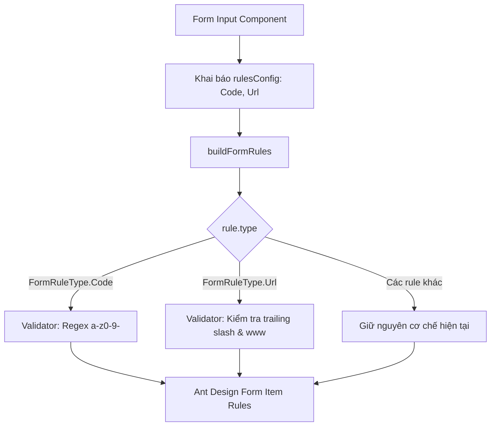

# Concept: Bổ sung Reusable Form Rule Types cho Code và Url

## 1. Problem & Goal (Vấn đề & Mục tiêu)
- **Problem**: 
  - Các logic kiểm tra hợp lệ thường gặp như kiểm tra định dạng mã (`code` / `identifier` - chỉ gồm chữ cái thường, số, gạch ngang `^[a-z0-9-]+$`) và đường dẫn (`url` - không kết thúc bằng `/`, không chứa `www.`) hiện đang phải viết dưới dạng hàm `validator` thủ công (`FormRuleType.Custom`) lặp lại ở nhiều component form.
  - Việc này làm code form dài dòng, khó bảo trì và thiếu tính nhất quán trong toàn bộ hệ thống.
- **Goal**: 
  - Mở rộng `FormRuleType` và `buildFormRules` trong `src/utilities/form-rules.ts` với 2 rule types chuẩn hóa:
    - `FormRuleType.Code = 'code'`
    - `FormRuleType.Url = 'url'`
  - Thay thế các đoạn code `FormRuleType.Custom` viết tay trong `DataProviderFormModal.tsx` và các form khác thành cú pháp khai báo rule ngắn gọn, chuẩn mực.

## 2. Scope Boundaries (Ranh giới Phạm vi)
- **In-Scope**:
  - Mở rộng `enum FormRuleType`:
    - `Code = 'code'`: Tự động kiểm tra định dạng mã (`/^[a-z0-9-]+$/`) với thông báo lỗi mặc định (cho phép tùy biến qua `message`).
    - `Url = 'url'`: Tự động kiểm tra định dạng URL (hỗ trợ các tùy chọn như `noTrailingSlash`, `noWww` với mặc định kích hoạt kiểm tra không kết thúc bằng `/` và không chứa `www.`).
  - Mở rộng type union `FormRuleConfig`:
    - `FormCodeRuleConfig`: `{ type: FormRuleType.Code; message?: string }`
    - `FormUrlRuleConfig`: `{ type: FormRuleType.Url; message?: string; noTrailingSlash?: boolean; noWww?: boolean }`
  - Cập nhật hàm `buildFormRules` trong `src/utilities/form-rules.ts` để map 2 type mới sang Ant Design Rule Objects.
  - Refactor `DataProviderFormModal.tsx` để sử dụng `FormRuleType.Code` và `FormRuleType.Url`.
- **Explicit Out-of-Scope**:
  - Không thay đổi hành vi của các rule types hiện hữu (`Max`, `Min`, `Email`, `Required`, `RequiredNumber`, `Custom`).
  - Không thay đổi API backend hoặc database schema.

## 3. Proposed Solution & Core Mechanism (Giải pháp Đề xuất & Cơ chế)
- **Core Mechanism**:
  - `FormRuleType.Code`:
    - Kiểm tra chuỗi theo biểu thức chính quy `/^[a-z0-9-]+$/`.
    - Thông báo lỗi mặc định: *"Chỉ được chứa chữ cái thường, số và dấu gạch ngang"*.
  - `FormRuleType.Url`:
    - Mặc định kiểm tra:
      - Không kết thúc bằng `/` (`/^.*[^/]$/` $\rightarrow$ *"URL không được kết thúc bằng /"*).
      - Không chứa `www.` (`/^(?!.*www\.).*$/` $\rightarrow$ *"URL không được chứa www"*).
    - Có thể cấu hình bật/tắt linh hoạt qua `noTrailingSlash` và `noWww`.

- **Workflow / Logic Flow**:
  1. Component Form khai báo `rulesConfig`:
     ```typescript
     rulesConfig={[
         { type: FormRuleType.Required, message: 'Vui lòng nhập mã' },
         { type: FormRuleType.Max, max: 20 },
         { type: FormRuleType.Code, message: 'Mã nhà cung cấp chỉ được chứa chữ cái thường, số và dấu gạch ngang' },
     ]}
     ```
  2. `buildFormRules` xử lý và trả về danh sách `Rule[]` chuẩn Ant Design.



- **UI / DX Wireframe**:
```typescript
// TRƯỚC ĐÂY (Verbose Custom Validator):
{
    type: FormRuleType.Custom,
    validator: (_, value) => {
        if (!value) return Promise.resolve();
        if (!/^[a-z0-9-]+$/.test(value)) {
            return Promise.reject('Mã nhà cung cấp chỉ được chứa chữ cái thường, số và dấu gạch ngang');
        }
        return Promise.resolve();
    }
}

// BÂY GIỜ (Clean & Declarative):
{
    type: FormRuleType.Code,
    message: 'Mã nhà cung cấp chỉ được chứa chữ cái thường, số và dấu gạch ngang',
}

{
    type: FormRuleType.Url,
}
```

## 4. Critical Risks & Edge Cases (Rủi ro & Kịch bản Biên)
- **Empty Value Safe Resolving**: Nếu `value` rỗng hoặc `undefined`, cả hai validator `code` và `url` phải trả về `Promise.resolve()` ngay để nhường quyền kiểm tra cho rule `Required`.
- **Backward Compatibility**: Giữ nguyên tính tương thích 100% với các rule hiện có trong toàn bộ codebase.
