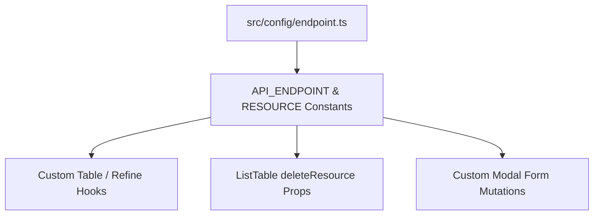

# Concept: Chuẩn hóa Toàn diện Constants Resource & API Endpoint

## 1. Problem & Goal (Vấn đề & Mục tiêu)
- **Problem**: 
  - Tại nhiều trang bảng danh sách và hook dữ liệu (`DataProviderPage`, `CloudDataItemPage`, `ItemsPage`, `UsersPage`, ...), thuộc tính `deleteResource` trong `<ListTable>` và `resource` trong `useCustomTable` / `useCustomModalForm` đang bị hardcode chuỗi string tự do (`"data-providers"`, `"cloud-data-items"`, ...).
  - Một số endpoint còn thiếu trong `src/config/endpoint.ts` (ví dụ: `CLOUD_DATA_ITEMS`), dẫn đến việc các module phải tự gõ chuỗi thô, vi phạm nguyên tắc Single Source of Truth của dự án.
- **Goal**: 
  - Hoàn thiện đầy đủ các định nghĩa endpoint còn thiếu trong `src/config/endpoint.ts` (như `CLOUD_DATA_ITEMS`).
  - Xây dựng hằng số `RESOURCE` (hoặc mở rộng `API_ENDPOINT` / `API_RESOURCE`) tại `src/config/` để quản lý tập trung 100% tên resource và base endpoint cho toàn bộ ứng dụng.
  - Áp dụng hằng số `RESOURCE` / `API_ENDPOINT` cho tất cả các vị trí `deleteResource` và `resource` trong toàn bộ `src/app/(root)`.

## 2. Scope Boundaries (Ranh giới Phạm vi)
- **In-Scope**:
  - Cập nhật `src/config/endpoint.ts`:
    - Bổ sung `CLOUD_DATA_ITEMS` (`BASE`, `ALL`, `DETAIL`, `UPLOAD`).
  - Định nghĩa tập trung `RESOURCE` / `API_RESOURCE` trong `src/config/` bao quát toàn bộ tài nguyên:
    - `DATA_PROVIDERS`, `DATA_PROVIDER_FEATURES`, `DATA_PROVIDER_ITEMS`, `ITEMS`, `SCRAPING_DATA`, `DISCOVERY_SESSIONS`, `DISCOVERY_URLS`.
    - `SCHEDULES`, `SCHEDULE_JOBS`, `SCHEDULE_JOB_EVENTS`.
    - `GOOGLE_DRIVE_FOLDERS`, `GOOGLE_DRIVE_FILES`.
    - `CLOUD_DATA_PROVIDERS`, `CLOUD_DATA_ITEMS`.
    - `SIMULATION_CONTEXTS`, `SIMULATION_ITEMS`.
    - `USERS`, `NOTIFICATIONS`, `SETTINGS`.
  - Thay thế toàn bộ các chuỗi hardcode `deleteResource="..."` trong các trang danh sách bằng hằng số tương ứng.
- **Explicit Out-of-Scope**:
  - Không thay đổi route URL trên Next.js App Router hoặc API backend.
  - Không thay đổi giao diện hoặc logic nghiệp vụ bảng ngoài việc refactor giá trị prop.

## 3. Proposed Solution & Core Mechanism (Giải pháp Đề xuất & Cơ chế)
- **Core Mechanism**:
  - `src/config/endpoint.ts` cung cấp Single Source of Truth cho các API URL paths.
  - Định nghĩa `RESOURCE` trỏ trực tiếp đến các `BASE` endpoint tương ứng:
    ```typescript
    export const RESOURCE = {
        DATA_PROVIDERS: API_ENDPOINT.DATA_PROVIDERS.BASE,
        DATA_PROVIDER_FEATURES: API_ENDPOINT.DATA_PROVIDER_FEATURES.BASE,
        DATA_PROVIDER_ITEMS: API_ENDPOINT.DATA_PROVIDER_ITEMS.BASE,
        ITEMS: API_ENDPOINT.ITEMS.BASE,
        SCRAPING_DATA: API_ENDPOINT.SCRAPING_DATA.BASE,
        DISCOVERY_SESSIONS: API_ENDPOINT.DISCOVERY_SESSIONS.BASE,
        DISCOVERY_URLS: API_ENDPOINT.DISCOVERY_URLS.BASE,
        SCHEDULES: API_ENDPOINT.SCHEDULES.BASE,
        SCHEDULE_JOBS: API_ENDPOINT.SCHEDULE_JOBS.BASE,
        SCHEDULE_JOB_EVENTS: API_ENDPOINT.SCHEDULE_JOB_EVENTS.BASE,
        GOOGLE_FOLDERS: API_ENDPOINT.GOOGLE_DRIVE.FOLDERS,
        GOOGLE_FILES: API_ENDPOINT.GOOGLE_DRIVE.FILES,
        CLOUD_DATA_PROVIDERS: API_ENDPOINT.CLOUD_DATA_PROVIDERS.BASE,
        CLOUD_DATA_ITEMS: API_ENDPOINT.CLOUD_DATA_ITEMS.BASE,
        SIMULATION_CONTEXTS: API_ENDPOINT.SIMULATION.CONTEXTS,
        SIMULATION_ITEMS: API_ENDPOINT.SIMULATION.ITEMS,
        USERS: API_ENDPOINT.USERS.BASE,
        NOTIFICATIONS: API_ENDPOINT.NOTIFICATIONS.BASE,
        SETTINGS: API_ENDPOINT.SETTINGS.BASE,
    } as const;
    ```
  - Tại các component `page.tsx`: `<ListTable deleteResource={RESOURCE.DATA_PROVIDERS} ... />` hoặc `API_ENDPOINT.DATA_PROVIDERS.BASE`.



## 4. Critical Risks & Edge Cases (Rủi ro & Kịch bản Biên)
- **Tránh sai lệch tên resource**: Đảm bảo tất cả các giá trị mapping trong `RESOURCE` trùng khớp 100% với resource path mà Refine Data Provider và backend API đang tiếp nhận.
- **Tuân thủ quy tắc import**: Import `RESOURCE` / `API_ENDPOINT` trực tiếp từ alias `@/config`.
