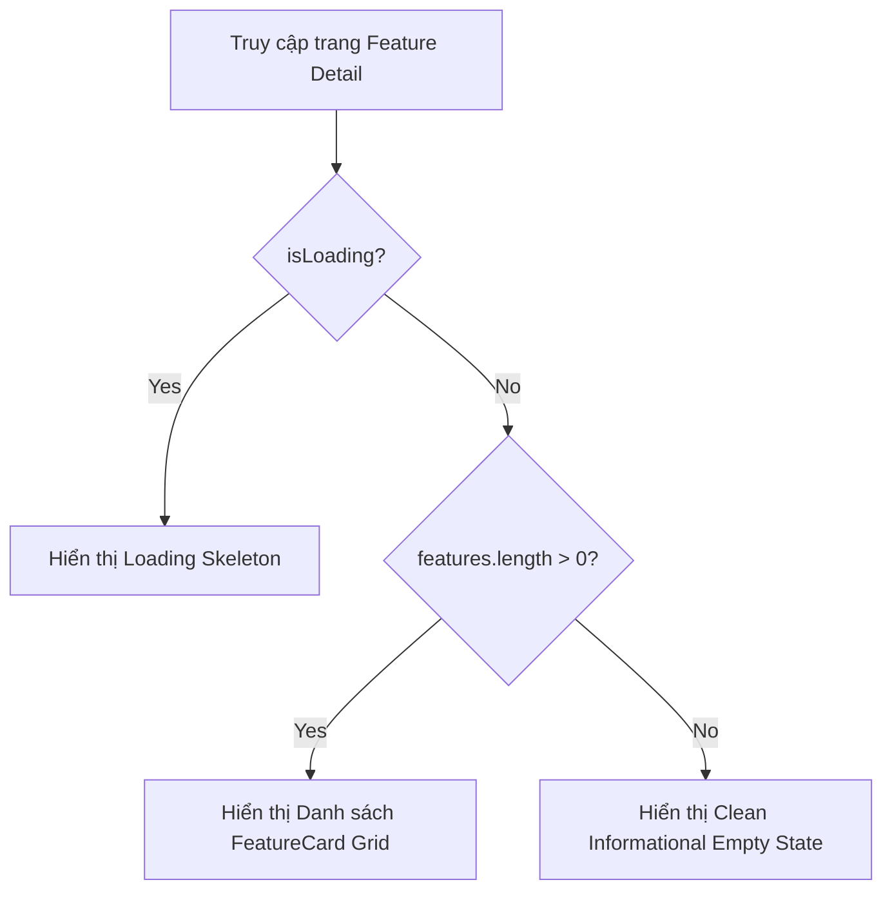

# Concept: Giao diện Empty State cho Trang Tính Năng Data Provider

## 1. Problem Statement & Root Need (Bối cảnh & Vấn đề Cốt lõi)
- **Core Business Problem**: Tại trang chi tiết tính năng của Data Provider (`/scraping/features/[dataProviderId]`), khi nhà cung cấp chưa có bất kỳ tính năng (feature) nào được cấu hình hoặc danh sách trả về rỗng (`features.length === 0`), giao diện đang render một khoảng trắng trống rỗng.
- **Target Audience & Core Value**: Quản trị viên hệ thống (Scraping Admin / Dev Ops). Cung cấp giao diện thông báo trạng thái rỗng (Informational Empty State) tinh gọn, đẹp mắt, đồng bộ với thiết kế toàn hệ thống mà không cần nút bấm thừa (do nút *"Thêm cài đặt"* đã luôn hiện diện trên thanh công cụ phía trên).

## 2. Scope Boundaries (Ranh giới Phạm vi)
- **In-Scope**:
  - Xử lý điều kiện hiển thị trạng thái `Empty State` khi `!isLoading && features.length === 0` tại `src/app/(root)/scraping/features/[dataProviderId]/page.tsx`.
  - Hiển thị giao diện thông báo rỗng tinh gọn với Icon (ví dụ `lucide:layers` / `lucide:folder-open` hoặc component `Empty` / `DataNotFound`), tiêu đề và mô tả giải thích rõ ràng.
  - Không render thêm button CTA bên trong vùng Empty State để tránh trùng lặp với nút *"Thêm cài đặt"* trên thanh Action của `ListWrapper`.
- **Explicit Out-of-Scope**:
  - Không thay đổi logic fetch API hoặc cấu trúc dữ liệu của hook `useDataProviderFeaturesPage`.
  - Không thay đổi schema hay backend endpoint.

## 3. Success Metrics (Thước đo Thành công / Definition of Done)
- **Zero Blank Screen**: 100% trường hợp `features.length === 0` (sau khi nạp xong dữ liệu) hiển thị giao diện Empty State hoàn chỉnh, thẩm mỹ và ăn khớp với Hub Theme.
- **Clean UI**: Giao diện tập trung, không trùng lặp các nút action, thông điệp ngắn gọn và dễ hiểu.
- **Zero Layout Shift / UI Glitch**: Chuyển đổi mượt mà giữa trạng thái `isLoading` (Skeleton/Spinner) $\rightarrow$ `Empty State` hoặc `Populated Grid`.

## 4. Proposed Solution & Core Mechanism (Phương pháp Giải quyết & Cơ chế Xử lý)

### 4.1. Explored Options & Trade-off Analysis (Các Phương án Đã Cân Nhắc)
| Option | Hướng tiếp cận | Ưu điểm (Pros) | Nhược điểm (Cons) | Độ phức tạp | Đánh giá |
| :--- | :--- | :--- | :--- | :--- | :--- |
| **Option 1: Antd / Custom Empty Component** | Sử dụng component `Empty` có sẵn của hệ thống với icon và description tùy chỉnh. | Nhanh, nhẹ, đồng bộ 100% với các trang khác trong hệ thống. | Thiết kế mặc định có thể hơi đơn giản nếu không bọc trong card nền. | Low | Khả thi và tiện dụng. |
| **Option 2 (Khuyến nghị): Clean Informational Empty Card** | Sử dụng component `DataNotFound` hoặc `Empty` bọc trong Card với Icon `lucide:layers` tinh tế, mô tả nhẹ nhàng, không có nút hành động. | Thẩm mỹ hiện đại theo phong cách Hub UI, kích thước cân đối, thông điệp rõ ràng. | Cần truyền props phù hợp (`title`, `message`, `icon`, không truyền `onRetry` hay `buttonText`). | Low | **Lựa chọn tối ưu nhất**. |

- **Chosen Strategy (Phương án Được Chọn)**: **Option 2 - Clean Informational Empty Card**. Khi `features.length === 0`, trang render `DataNotFound` (hoặc `Empty`) với icon `lucide:layers`, tiêu đề *"Chưa có tính năng nào"* và mô tả *"Nhà cung cấp này chưa được thiết lập tính năng thu thập dữ liệu nào. Vui lòng bấm 'Thêm cài đặt' ở góc trên để bắt đầu cấu hình."*, không kèm button trong vùng body.

### 4.2. Core Processing Flow (Luồng Xử lý / Chuyển trạng thái Chính)
- **Workflow / Logic Flow**:
  1. **Input / Trigger**: Hook `useDataProviderFeaturesPage` hoàn tất tải dữ liệu (`isLoading = false`), nhận về `features = []`.
  2. **Condition Check**: `features.length === 0` $\rightarrow$ Render Informational Empty State thay vì `CustomRow` chứa `FeatureCard`.
  3. **User Action**: Người dùng xem thông báo và có thể sử dụng nút dropdown *"Thêm cài đặt"* trên thanh tiêu đề của `ListWrapper` để thiết lập tính năng khi cần.



### 4.3. UI Wireframe / Visual Mockup (Mẫu Phác thảo Giao diện)
```text
+-------------------------------------------------------------------------------+
| [<] Danh sách nhà cung cấp / [ Tên Provider: Shopee Scraping ]                |
+-------------------------------------------------------------------------------+
| Các tính năng hoạt động                                   [ + Thêm cài đặt v ]|
| Quản lý trạng thái, cấu hình và lịch sử thực thi...                           |
+-------------------------------------------------------------------------------+
|                                                                               |
|   +-----------------------------------------------------------------------+   |
|   |                                                                       |   |
|   |                          [ (i) Layers Icon ]                          |   |
|   |                                                                       |   |
|   |                     Chưa có tính năng nào                             |   |
|   |   Nhà cung cấp này chưa được thiết lập tính năng thu thập dữ liệu     |   |
|   |   nào. Vui lòng sử dụng nút "Thêm cài đặt" phía trên để cấu hình.     |   |
|   |                                                                       |   |
|   +-----------------------------------------------------------------------+   |
|                                                                               |
+-------------------------------------------------------------------------------+
```

- **State Handling Matrix**:
  - **Loading State**: `ListWrapper` kích hoạt skeleton / spinner theo state `isLoading`.
  - **Empty State**: Hiển thị Card Empty State như mockup phía trên khi `features.length === 0` (không có button bên trong card).
  - **Populated State**: Hiển thị 2-column Grid các `FeatureCard` khi `features.length > 0`.

### 4.4. Critical Edge Cases & Risk Handling (Kịch bản Biên & Xử lý Rủi ro)
- **Data Provider Not Found (404)**: Nếu chính `provider` không tồn tại hoặc lỗi mạng, trang sẽ fallback về Not Found tương ứng.
- **All Features Deleted/Disabled**: Khi danh sách tính năng trở về rỗng, giao diện tự động chuyển về Empty State ngay lập tức.

## 5. Technical English Key Patterns
### 1. Informational Empty State (vs. Actionable Empty State)
- **Meaning (VI)**: Trạng thái rỗng thuần cung cấp thông tin (không nhúng nút bấm hành động trực tiếp).
- **Grammar / Usage**: `an informational empty state that guides users to existing navigation elements`.
- **Engineering Example**: *"We adopted an informational empty state without extra CTA buttons to prevent visual redundancy with the top-level action toolbar."*

### 2. Visual Redundancy Elimination
- **Meaning (VI)**: Loại bỏ sự dư thừa/trùng lặp thị giác trên giao diện.
- **Grammar / Usage**: `eliminate visual redundancy by [doing something]`.
- **Engineering Example**: *"Omitting the creation button from the empty container eliminates visual redundancy with the header dropdown."*
