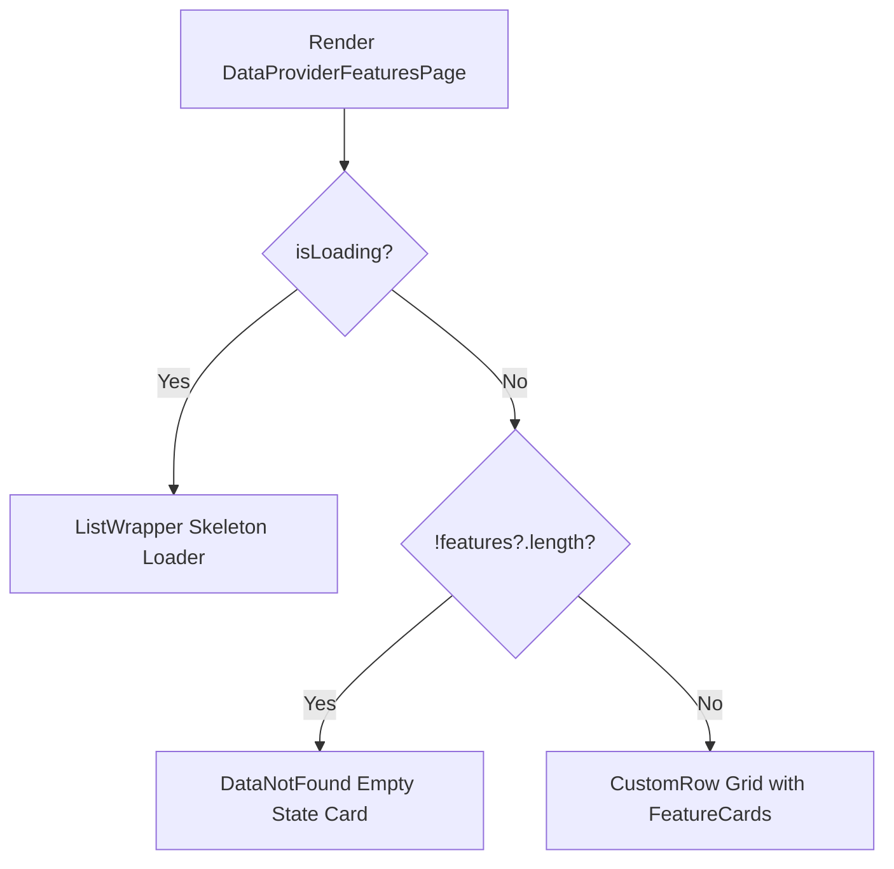

# Plan: Bổ sung Informational Empty State cho Trang Tính Năng Data Provider

## Section 1. Current State (Hiện trạng & Phân tích Mã nguồn)
- **Cơ chế hiện tại**: Trang `page.tsx` (`src/app/(root)/scraping/features/[dataProviderId]/page.tsx`) lấy danh sách tính năng qua `useDataProviderFeaturesPage`. Khi `isLoading` kết thúc và `!features?.length`, `page.tsx` vẫn render `CustomRow` chứa `features.map(...)`, dẫn đến toàn bộ phần thân trang trắng trơn, không có thông báo hay hướng dẫn cho quản trị viên.
- **Invariants**:
  - Giữ nguyên cấu trúc và hành vi của `ListWrapper`, `breadcrumbs`, `sectionTitle` và thanh `actions` (nút Dropdown *"Thêm cài đặt"*).
  - Giữ nguyên modal state (`FeatureSettingModal`, `FeatureHistoryModal`) và cơ chế quản lý trạng thái (`handleSwitchStatus`, `refetchAll`).
  - Không tạo thêm component mới nếu có thể tái sử dụng component `DataNotFound` từ `@/components/common`.

## Section 2. Detailed Design (Thiết kế Kỹ thuật Chi tiết)
- **Empty State Rendering Seam**: Tại `page.tsx`, sử dụng điều kiện `!features?.length`:
  - Nếu `!features?.length`: Render component `DataNotFound` được cấu hình với icon `lucide:layers`, tiêu đề *"Chưa có tính năng nào"*, thông điệp hướng dẫn quản trị viên sử dụng nút *"Thêm cài đặt"* phía trên, không truyền `onRetry`.
  - Nếu có dữ liệu features: Render `CustomRow` chứa danh sách `FeatureCard` như bình thường.
- **Tái sử dụng Design System**:
  - Tái sử dụng trực tiếp component `DataNotFound` có sẵn từ `@/components/common`.



## Section 3. Task Matrix & Dependency Graph

| Order | Status | Action | File Path | Target Symbols / AST Seams | Reused Existing Utilities / Helpers | Depends On | Fast Test Command |
| :---: | :---: | :---: | :--- | :--- | :--- | :--- | :--- |
| **1** | `[x]` | `[MODIFY]` | `src/app/(root)/scraping/features/[dataProviderId]/page.tsx` | `DataProviderFeaturesPage` (JSX Return Body) | `@/components/common` (`DataNotFound`) | `None` | `npm run lint` |

## Section 4. Code Changes (Unified Diff)

### 1. `[MODIFY]` `src/app/(root)/scraping/features/[dataProviderId]/page.tsx`
> **Action**: Import `DataNotFound` từ `@/components/common` và hiển thị `DataNotFound` khi `!features?.length`.

```diff
@@ -3,6 +3,7 @@
 import { ListWrapper, type BreadcrumbItem, type CardAction } from '@/components/common';
+import { DataNotFound } from '@/components/common';
 import {
     CustomButton,
     CustomCol,
@@ -147,17 +148,25 @@
         >
             <CustomSpace direction="vertical" size="large" className="w-full">
-                <CustomRow gutter={[24, 24]} className="w-full">
-                    {features.map((feature) => (
-                        <CustomCol key={feature.id} xs={24} lg={12} className="flex">
-                            <FeatureCard
-                                feature={feature}
-                                onOpenModal={openFeatureModal}
-                                onOpenHistoryModal={openHistoryModal}
-                                onSwitchStatus={handleSwitchStatus}
-                            />
-                        </CustomCol>
-                    ))}
-                </CustomRow>
+                {!features?.length ? (
+                    <DataNotFound
+                        icon="lucide:layers"
+                        title="Chưa có tính năng nào"
+                        message="Nhà cung cấp này chưa được thiết lập tính năng thu thập dữ liệu nào. Vui lòng sử dụng nút 'Thêm cài đặt' phía trên để bắt đầu cấu hình."
+                        className="py-12"
+                    />
+                ) : (
+                    <CustomRow gutter={[24, 24]} className="w-full">
+                        {features.map((feature) => (
+                            <CustomCol key={feature.id} xs={24} lg={12} className="flex">
+                                <FeatureCard
+                                    feature={feature}
+                                    onOpenModal={openFeatureModal}
+                                    onOpenHistoryModal={openHistoryModal}
+                                    onSwitchStatus={handleSwitchStatus}
+                                />
+                            </CustomCol>
+                        ))}
+                    </CustomRow>
+                )}

                 {modalState.open && modalState.feature && (
```

## Section 5. Test Cases & Verification
- **Automated Tests / Linter**:
  - `npm run lint`
- **Manual Verification**:
  1. Mở trình duyệt truy cập vào trang Data Provider chưa có feature nào (`features = []` hoặc `undefined`).
  2. Xác nhận hiển thị giao diện `DataNotFound` với icon `lucide:layers`, tiêu đề *"Chưa có tính năng nào"* và thông điệp hướng dẫn.
  3. Xác nhận nút dropdown *"Thêm cài đặt"* ở thanh toolbar vẫn hoạt động bình thường.
  4. Khi có ít nhất 1 feature, kiểm tra grid `FeatureCard` hiển thị chính xác như trước.
