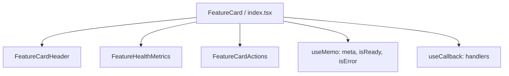

# Plan: Refactor Phân Rã & Tối Ưu Hóa FeatureCard (useMemo, useCallback & Sub-components)

## Section 1. Current State (Hiện trạng & Phân tích Mã nguồn)
- **Cơ chế hiện tại**: Component `FeatureCard.tsx` (~229 dòng) nằm trực tiếp dưới `components/`, tích hợp trực tiếp Header, Metrics Grid và Action Buttons trong một file duy nhất. Các hàm click handlers và tính toán format ngày tháng chưa được memoize.
- **Invariants**:
  - Dùng `type` cho component props (`type FeatureCardProps = { ... }`).
  - Sắp xếp props nhất quán: truyền trực tiếp entity `feature: IDataProviderFeature` cùng các cờ/callbacks liên quan (`meta`, `feature`, `isReady`, `onSwitchStatus`), đồng bộ với `FeatureHealthMetrics` và `FeatureModalHeader`.
  - Giữ nguyên 100% layout grid, visual styles, colors, hover effects, switch logic, và modal callbacks.
  - Barrel export tại `components/index.ts` đảm bảo [page.tsx](file:///d:/Sources/Personal/only-one-fe/src/app/(root)/scraping/features/[dataProviderId]/page.tsx) không cần thay đổi import path.

## Section 2. Detailed Design (Thiết kế Kỹ thuật Chi tiết)
- **Cấu trúc thư mục mới**:
  ```text
  src/app/(root)/scraping/features/[dataProviderId]/components/FeatureCard/
  ├── index.tsx (Container component chính - ~70 LOC)
  ├── FeatureCardHeader.tsx (Header, Title, Service, Switch)
  ├── FeatureHealthMetrics.tsx (2x2 Grid + Error Alert)
  └── FeatureCardActions.tsx (Action Buttons: Cấu hình, Thử nghiệm, Lịch sử)
  ```
- **Tối ưu hóa hiệu năng**:
  - `useMemo`: Memoize `meta`, `isReady`, `isError`, `formattedSuccessDate`, `formattedFailedDate`, `statusDotClass`, `failuresText`.
  - `useCallback`: Memoize `handleSwitchStatus`, `handleOpenConfig`, `handleOpenTest`, `handleOpenHistory`.



## Section 3. Task Matrix & Dependency Graph

| Order | Status | Action | File Path | Target Symbols / AST Seams | Reused Existing Utilities / Helpers | Depends On | Fast Test Command |
| :---: | :---: | :---: | :--- | :--- | :--- | :--- | :--- |
| **1** | `[x]` | `[NEW]` | `src/app/(root)/scraping/features/[dataProviderId]/components/FeatureCard/FeatureCardHeader.tsx` | `FeatureCardHeader` | `@/components/custom-antd` | `None` | `npm run lint` |
| **2** | `[x]` | `[NEW]` | `src/app/(root)/scraping/features/[dataProviderId]/components/FeatureCard/FeatureHealthMetrics.tsx` | `FeatureHealthMetrics` | `@/libs` (`formatDate`) | `None` | `npm run lint` |
| **3** | `[x]` | `[NEW]` | `src/app/(root)/scraping/features/[dataProviderId]/components/FeatureCard/FeatureCardActions.tsx` | `FeatureCardActions` | `@/components/custom-antd` | `None` | `npm run lint` |
| **4** | `[x]` | `[NEW]` | `src/app/(root)/scraping/features/[dataProviderId]/components/FeatureCard/index.tsx` | `FeatureCard` | Tích hợp sub-components, useMemo & useCallback | `Order 1, 2, 3` | `npm run lint` |
| **5** | `[x]` | `[DELETE]` | `src/app/(root)/scraping/features/[dataProviderId]/components/FeatureCard.tsx` | File cũ | Đã chuyển vào thư mục `FeatureCard/` | `Order 4` | `npm run lint` |
| **6** | `[x]` | `[MODIFY]` | `src/app/(root)/scraping/features/[dataProviderId]/components/index.ts` | Barrel Exports | Re-export `FeatureCard` từ thư mục con | `Order 4, 5` | `npm run lint` |

## Section 4. Code Changes (Unified Diff)

### 1. `[NEW]` `src/app/(root)/scraping/features/[dataProviderId]/components/FeatureCard/FeatureCardHeader.tsx`
> **Action**: Tạo sub-component presentational cho header của FeatureCard nhận `feature` entity.

```typescript
'use client';

import {
    CustomFlex,
    CustomSwitch,
    CustomTag,
    CustomTypography,
} from '@/components/custom-antd';
import { DataProviderFeatureStatus } from '@/enums';
import { Icon } from '@iconify/react';
import type { IFeatureTypeMetadata } from '../../constants';
import type { IDataProviderFeature } from '../../types';

type FeatureCardHeaderProps = {
    meta?: IFeatureTypeMetadata;
    feature: IDataProviderFeature;
    isReady: boolean;
    onSwitchStatus: () => void;
};

export const FeatureCardHeader = ({
    meta,
    feature,
    isReady,
    onSwitchStatus,
}: FeatureCardHeaderProps) => {
    const iconName = meta?.icon || 'lucide:cpu';
    const featureTitle = meta?.label || feature.type;
    const featureDescription = meta?.description || '';
    const accentColor = meta?.accentClass || 'text-hub-primary bg-hub-primary/10';

    return (
        <CustomFlex
            align="flex-start"
            justify="space-between"
            gap="middle"
            className="mb-4"
        >
            <CustomFlex align="center" gap="middle">
                <CustomFlex
                    align="center"
                    justify="center"
                    className={`p-3 rounded-xl shrink-0 ${accentColor}`}
                >
                    <Icon icon={iconName} className="w-6 h-6" />
                </CustomFlex>
                <CustomFlex vertical gap={2}>
                    <CustomFlex align="center" gap="small" wrap>
                        <CustomTypography.Title
                            level={5}
                            className="!mb-0 text-base !font-bold text-hub-title"
                        >
                            {featureTitle}
                        </CustomTypography.Title>
                        <CustomTag className="font-mono text-xs m-0">
                            {feature.service || 'generic'}
                        </CustomTag>
                    </CustomFlex>
                    <CustomTypography.Paragraph
                        type="secondary"
                        className="!mb-0 text-xs text-hub-subtitle mt-0.5"
                    >
                        {featureDescription}
                    </CustomTypography.Paragraph>
                </CustomFlex>
            </CustomFlex>

            <CustomFlex align="center" gap="small" className="shrink-0">
                <CustomSwitch
                    checked={isReady}
                    disabled={feature.status === DataProviderFeatureStatus.UNCONFIGURED}
                    onChange={onSwitchStatus}
                    checkedChildren="Bật"
                    unCheckedChildren="Tắt"
                />
            </CustomFlex>
        </CustomFlex>
    );
};
```

### 2. `[NEW]` `src/app/(root)/scraping/features/[dataProviderId]/components/FeatureCard/FeatureHealthMetrics.tsx`
> **Action**: Tạo sub-component presentational cho lưới 2x2 thông số sức khỏe.

```typescript
'use client';

import { useMemo } from 'react';
import {
    CustomCol,
    CustomFlex,
    CustomRow,
    CustomTypography,
} from '@/components/custom-antd';
import { formatDate } from '@/libs';
import { Icon } from '@iconify/react';
import type { IDataProviderFeature } from '../../types';

type FeatureHealthMetricsProps = {
    feature: IDataProviderFeature;
    isReady: boolean;
    isError: boolean;
};

export const FeatureHealthMetrics = ({
    feature,
    isReady,
    isError,
}: FeatureHealthMetricsProps) => {
    const formattedSuccessDate = useMemo(
        () => (feature.lastSuccessfulRunAt ? formatDate(feature.lastSuccessfulRunAt) : 'Chưa chạy'),
        [feature.lastSuccessfulRunAt],
    );

    const formattedFailedDate = useMemo(
        () => (feature.lastFailedRunAt ? formatDate(feature.lastFailedRunAt) : 'Chưa có lỗi'),
        [feature.lastFailedRunAt],
    );

    const statusDotClass = useMemo(() => {
        if (isReady) return 'bg-emerald-500 animate-pulse';
        if (isError) return 'bg-rose-500';
        return 'bg-slate-400';
    }, [isReady, isError]);

    const failuresText = useMemo(() => {
        if (feature.consecutiveFailures > 0) {
            return `${feature.consecutiveFailures} lỗi`;
        }
        return '0 (Ổn định)';
    }, [feature.consecutiveFailures]);

    return (
        <>
            <CustomRow
                gutter={[12, 12]}
                className="bg-hub-section/30 border border-hub-border/40 rounded-xl p-3.5 my-4 w-full"
            >
                <CustomCol span={12}>
                    <CustomTypography.Text
                        type="secondary"
                        className="text-xs text-hub-subtitle block"
                    >
                        Trạng thái
                    </CustomTypography.Text>
                    <CustomFlex align="center" gap={6} className="mt-1">
                        <span className={`w-2 h-2 rounded-full ${statusDotClass}`} />
                        <CustomTypography.Text strong className="text-xs text-hub-title">
                            {feature.status}
                        </CustomTypography.Text>
                    </CustomFlex>
                </CustomCol>

                <CustomCol span={12}>
                    <CustomTypography.Text
                        type="secondary"
                        className="text-xs text-hub-subtitle block"
                    >
                        Số lỗi liên tiếp
                    </CustomTypography.Text>
                    <CustomTypography.Text
                        strong
                        className={`text-xs mt-1 block ${
                            isError ? 'text-rose-500' : 'text-emerald-500'
                        }`}
                    >
                        {failuresText}
                    </CustomTypography.Text>
                </CustomCol>

                <CustomCol span={12}>
                    <CustomTypography.Text
                        type="secondary"
                        className="text-xs text-hub-subtitle block"
                    >
                        Chạy OK cuối
                    </CustomTypography.Text>
                    <CustomTypography.Text className="text-xs font-medium text-hub-title mt-1 block truncate">
                        {formattedSuccessDate}
                    </CustomTypography.Text>
                </CustomCol>

                <CustomCol span={12}>
                    <CustomTypography.Text
                        type="secondary"
                        className="text-xs text-hub-subtitle block"
                    >
                        Chạy lỗi cuối
                    </CustomTypography.Text>
                    <CustomTypography.Text className="text-xs font-medium text-hub-title mt-1 block truncate">
                        {formattedFailedDate}
                    </CustomTypography.Text>
                </CustomCol>
            </CustomRow>

            {feature.lastErrorMessage && (
                <CustomFlex
                    align="flex-start"
                    gap="small"
                    className="bg-rose-500/10 border border-rose-500/20 text-rose-600 dark:text-rose-400 text-xs rounded-lg p-2.5 mb-4"
                >
                    <Icon icon="lucide:alert-circle" className="w-4 h-4 shrink-0 mt-0.5" />
                    <CustomTypography.Text type="danger" className="text-xs line-clamp-2">
                        {feature.lastErrorMessage}
                    </CustomTypography.Text>
                </CustomFlex>
            )}
        </>
    );
};
```

### 3. `[NEW]` `src/app/(root)/scraping/features/[dataProviderId]/components/FeatureCard/FeatureCardActions.tsx`
> **Action**: Tạo sub-component presentational cho footer buttons.

```typescript
'use client';

import { CustomButton, CustomFlex } from '@/components/custom-antd';
import { Icon } from '@iconify/react';

type FeatureCardActionsProps = {
    onOpenConfig: () => void;
    onOpenTest: () => void;
    onOpenHistory: () => void;
};

export const FeatureCardActions = ({
    onOpenConfig,
    onOpenTest,
    onOpenHistory,
}: FeatureCardActionsProps) => {
    return (
        <CustomFlex
            align="center"
            justify="space-between"
            gap="small"
            className="pt-3 border-t border-hub-border/40 mt-auto w-full"
        >
            <CustomFlex align="center" gap="small">
                <CustomButton
                    type="primary"
                    icon={<Icon icon="lucide:settings" />}
                    onClick={onOpenConfig}
                >
                    Cấu hình
                </CustomButton>

                <CustomButton
                    icon={<Icon icon="lucide:flask-conical" />}
                    onClick={onOpenTest}
                >
                    Thử nghiệm
                </CustomButton>
            </CustomFlex>

            <CustomButton
                type="text"
                icon={<Icon icon="lucide:history" />}
                onClick={onOpenHistory}
            >
                Lịch sử
            </CustomButton>
        </CustomFlex>
    );
};
```

### 4. `[NEW]` `src/app/(root)/scraping/features/[dataProviderId]/components/FeatureCard/index.tsx`
> **Action**: Tạo component container chính cho FeatureCard với `type` cho props, `useMemo` và `useCallback`.

```typescript
'use client';

import { useCallback, useMemo } from 'react';
import { CustomCard, CustomFlex } from '@/components/custom-antd';
import { DataProviderFeatureStatus } from '@/enums';
import { FEATURE_TYPE_METADATA } from '../../constants';
import type { FeatureModalTab, IDataProviderFeature } from '../../types';
import { FeatureCardActions } from './FeatureCardActions';
import { FeatureCardHeader } from './FeatureCardHeader';
import { FeatureHealthMetrics } from './FeatureHealthMetrics';

export type FeatureCardProps = {
    feature: IDataProviderFeature;
    onOpenModal: (feature: IDataProviderFeature, tab: FeatureModalTab) => void;
    onOpenHistoryModal: (feature: IDataProviderFeature) => void;
    onSwitchStatus: (featureId: string, currentStatus: DataProviderFeatureStatus) => void;
};

export const FeatureCard = ({
    feature,
    onOpenModal,
    onOpenHistoryModal,
    onSwitchStatus,
}: FeatureCardProps) => {
    const meta = useMemo(() => FEATURE_TYPE_METADATA[feature.type], [feature.type]);

    const isReady = useMemo(
        () => feature.status === DataProviderFeatureStatus.READY,
        [feature.status],
    );

    const isError = useMemo(
        () => feature.status === DataProviderFeatureStatus.ERROR || feature.consecutiveFailures > 0,
        [feature.status, feature.consecutiveFailures],
    );

    const handleSwitchStatus = useCallback(
        () => onSwitchStatus(feature.id, feature.status),
        [onSwitchStatus, feature.id, feature.status],
    );

    const handleOpenConfig = useCallback(
        () => onOpenModal(feature, 'config'),
        [onOpenModal, feature],
    );

    const handleOpenTest = useCallback(
        () => onOpenModal(feature, 'test'),
        [onOpenModal, feature],
    );

    const handleOpenHistory = useCallback(
        () => onOpenHistoryModal(feature),
        [onOpenHistoryModal, feature],
    );

    return (
        <CustomCard
            className="hover:border-hub-primary/60 transition-all duration-200 shadow-sm hover:shadow-md h-full rounded-2xl"
            styles={{
                body: {
                    padding: '20px',
                    height: '100%',
                    display: 'flex',
                    flexDirection: 'column',
                    justifyContent: 'space-between',
                },
            }}
        >
            <CustomFlex vertical className="w-full">
                <FeatureCardHeader
                    meta={meta}
                    feature={feature}
                    isReady={isReady}
                    onSwitchStatus={handleSwitchStatus}
                />

                <FeatureHealthMetrics
                    feature={feature}
                    isReady={isReady}
                    isError={isError}
                />
            </CustomFlex>

            <FeatureCardActions
                onOpenConfig={handleOpenConfig}
                onOpenTest={handleOpenTest}
                onOpenHistory={handleOpenHistory}
            />
        </CustomCard>
    );
};
```

### 5. `[DELETE]` `src/app/(root)/scraping/features/[dataProviderId]/components/FeatureCard.tsx`
> **Action**: Xóa file `FeatureCard.tsx` đơn lẻ cũ.

### 6. `[MODIFY]` `src/app/(root)/scraping/features/[dataProviderId]/components/index.ts`
> **Action**: Re-export `FeatureCard` từ thư mục con `./FeatureCard`.

## Section 5. Test Cases & Verification
- **Automated Tests / Linter**:
  - `npx tsc --noEmit`
  - `npx eslint "src/app/(root)/scraping/features/[dataProviderId]/components/FeatureCard/**"`
- **Manual Verification**:
  1. Kiểm tra danh sách feature cards trên trang [page.tsx](file:///d:/Sources/Personal/only-one-fe/src/app/(root)/scraping/features/[dataProviderId]/page.tsx).
  2. Bật/tắt switch trạng thái: kiểm tra gọi hàm `onSwitchStatus` chính xác.
  3. Bấm các nút "Cấu hình", "Thử nghiệm", "Lịch sử": kiểm tra mở đúng modal và tab.
