# Plan: Refactor Phân Rã & Tối Ưu Hóa Các Components Quản Lý Tính Năng (Feature History, Test Tab & Config Forms)

## Section 1. Current State (Hiện trạng & Phân tích Mã nguồn)
- **Cơ chế hiện tại**: 4 components còn lại trong thư mục `components/` là các file đơn lẻ có độ dài lớn (300 - 430 LOC/file):
  - [FeatureHistoryModal.tsx](file:///d:/Sources/Personal/only-one-fe/src/app/(root)/scraping/features/[dataProviderId]/components/FeatureHistoryModal.tsx) (333 LOC): Chứa logic query versions, rollback mutation, state chọn version, danh sách snapshot bên trái và chi tiết snapshot bên phải.
  - [FeatureTestTab.tsx](file:///d:/Sources/Personal/only-one-fe/src/app/(root)/scraping/features/[dataProviderId]/components/FeatureTestTab.tsx) (318 LOC): Chứa form input kiểm thử động theo feature type (Scraping vs Search), mutation gọi API test stateless vs contextual, và panel render kết quả JSON.
  - [ScrapingConfigForm.tsx](file:///d:/Sources/Personal/only-one-fe/src/app/(root)/scraping/features/[dataProviderId]/components/ScrapingConfigForm.tsx) (422 LOC): Chứa toàn bộ 5 khối cấu hình cào dữ liệu, logic tính chênh lệch snapshot (`getDifferenceText`), và Monaco code editor.
  - [SearchConfigForm.tsx](file:///d:/Sources/Personal/only-one-fe/src/app/(root)/scraping/features/[dataProviderId]/components/SearchConfigForm.tsx) (350 LOC): Chứa các khối cấu hình tìm kiếm, logic tính chênh lệch snapshot và Monaco code editor.
- **Invariants**:
  - Dùng `type` alias cho component props (`type XProps = { ... }`).
  - Sắp xếp props nhất quán, truyền đúng context và form instance.
  - Tách các custom hooks chuyên trách quản lý side-effects vào `hooks/` (`useFeatureHistoryManager`, `useFeatureTestRunner`).
  - Tách helper `FormDiffLabel` dùng chung cho các config forms để xóa bỏ trùng lặp mã nguồn `getDifferenceText` / `renderLabel`.
  - Giữ nguyên 100% contracts API endpoints, form fields, initial values, validation rules và visual styling.
  - Barrel export tại [components/index.ts](file:///d:/Sources/Personal/only-one-fe/src/app/(root)/scraping/features/[dataProviderId]/components/index.ts) và [hooks/index.ts](file:///d:/Sources/Personal/only-one-fe/src/app/(root)/scraping/features/[dataProviderId]/hooks/index.ts) đảm bảo [page.tsx](file:///d:/Sources/Personal/only-one-fe/src/app/(root)/scraping/features/[dataProviderId]/page.tsx) và [feature.registry.ts](file:///d:/Sources/Personal/only-one-fe/src/app/(root)/scraping/features/[dataProviderId]/utils/feature.registry.ts) hoạt động trơn tru không cần sửa import path.

## Section 2. Detailed Design (Thiết kế Kỹ thuật Chi tiết)

### 2.1 Cấu trúc Thư mục Mới
```text
src/app/(root)/scraping/features/[dataProviderId]/
├── components/
│   ├── FeatureCard/ (Đã xong)
│   ├── FeatureSettingModal/ (Đã xong)
│   ├── FormDiffLabel.tsx (Shared helper cho diff labels trong config forms)
│   ├── FeatureHistoryModal/
│   │   ├── index.tsx (Container modal - ~70 LOC)
│   │   ├── VersionList.tsx (Left pane: danh sách snapshot versions)
│   │   └── VersionDetail.tsx (Right pane: chi tiết version, JSON box, rollback action)
│   ├── FeatureTestTab/
│   │   ├── index.tsx (Container tab - ~60 LOC)
│   │   ├── TestModeSelector.tsx (Segmented mode selector & description)
│   │   ├── TestInputSection.tsx (Dynamic test form inputs: URL/HTML/Query)
│   │   └── TestResultSection.tsx (Output result panel & error alert)
│   ├── ScrapingConfigForm/
│   │   ├── index.tsx (Form container & lifecycle - ~75 LOC)
│   │   ├── ScrapingBasicSection.tsx (Service & Main Content Selectors)
│   │   ├── ScrapingLimitsSection.tsx (Limits & Retry settings)
│   │   ├── ScrapingAdvancedSection.tsx (Advanced flags: stealth, bypass, etc.)
│   │   └── ScrapingCodeSection.tsx (Parser function generator code editor)
│   ├── SearchConfigForm/
│   │   ├── index.tsx (Form container & lifecycle - ~70 LOC)
│   │   ├── SearchUrlPatternSection.tsx (Service, URL Pattern, Query Placeholder, Max Results)
│   │   ├── SearchSelectorsSection.tsx (Content & Item Selectors)
│   │   └── SearchCodeSection.tsx (Search function generator code editor)
│   └── index.ts (Barrel export re-export tất cả components từ thư mục con)
└── hooks/
    ├── useDataProviderFeaturesPage.ts
    ├── useFeatureVersionManager.ts
    ├── useFeatureHistoryManager.ts (Query versions & Rollback mutation)
    ├── useFeatureTestRunner.ts (Stateless vs Contextual test executor)
    └── index.ts (Barrel export re-export tất cả hooks)
```

### 2.2 Sơ đồ Luồng Thành phần (Component Flow)

```mermaid
flowchart TD
    Page[DataProviderFeaturesPage] --> HistModal[FeatureHistoryModal / index.tsx]
    HistModal --> HistHook[useFeatureHistoryManager]
    HistModal --> VList[VersionList]
    HistModal --> VDetail[VersionDetail]

    SettingModal[FeatureSettingModal] --> TestTab[FeatureTestTab / index.tsx]
    TestTab --> TestHook[useFeatureTestRunner]
    TestTab --> TMode[TestModeSelector]
    TestTab --> TInput[TestInputSection]
    TestTab --> TResult[TestResultSection]

    SettingModal --> ScrapingForm[ScrapingConfigForm / index.tsx]
    ScrapingForm --> DiffLabel[FormDiffLabel Helper]
    ScrapingForm --> SBasic[ScrapingBasicSection]
    ScrapingForm --> SLimits[ScrapingLimitsSection]
    ScrapingForm --> SAdv[ScrapingAdvancedSection]
    ScrapingForm --> SCode[ScrapingCodeSection]

    SettingModal --> SearchForm[SearchConfigForm / index.tsx]
    SearchForm --> DiffLabel
    SearchForm --> SPattern[SearchUrlPatternSection]
    SearchForm --> SSelectors[SearchSelectorsSection]
    SearchForm --> SSearchCode[SearchCodeSection]
```


---

## Section 3. Task Matrix & Dependency Graph

| Order | Status | Action | File Path | Target Symbols / AST Seams | Reused Existing Utilities / Helpers | Depends On | Fast Test Command |
| :---: | :---: | :---: | :--- | :--- | :--- | :--- | :--- |
| **1** | `[x]` | `[NEW]` | `src/app/(root)/scraping/features/[dataProviderId]/components/FormDiffLabel.tsx` | `FormDiffLabel`, `renderFormLabel` | `@/components/custom-antd` | `None` | `npx tsc --noEmit` |
| **2** | `[x]` | `[NEW]` | `src/app/(root)/scraping/features/[dataProviderId]/hooks/useFeatureHistoryManager.ts` | `useFeatureHistoryManager` | `useCustomData`, `useCustomMutationData` | `None` | `npx tsc --noEmit` |
| **3** | `[x]` | `[NEW]` | `src/app/(root)/scraping/features/[dataProviderId]/components/FeatureHistoryModal/VersionList.tsx` | `VersionList` | `@/components/custom-antd`, `@/libs` (`formatDate`) | `None` | `npx tsc --noEmit` |
| **4** | `[x]` | `[NEW]` | `src/app/(root)/scraping/features/[dataProviderId]/components/FeatureHistoryModal/VersionDetail.tsx` | `VersionDetail` | `@/components/custom-antd` | `None` | `npx tsc --noEmit` |
| **5** | `[x]` | `[NEW]` | `src/app/(root)/scraping/features/[dataProviderId]/components/FeatureHistoryModal/index.tsx` | `FeatureHistoryModal` | Compose `VersionList`, `VersionDetail`, `useFeatureHistoryManager` | `Order 2, 3, 4` | `npx tsc --noEmit` |
| **6** | `[x]` | `[DELETE]` | `src/app/(root)/scraping/features/[dataProviderId]/components/FeatureHistoryModal.tsx` | File cũ | Đã chuyển vào thư mục `FeatureHistoryModal/` | `Order 5` | `npx tsc --noEmit` |
| **7** | `[x]` | `[NEW]` | `src/app/(root)/scraping/features/[dataProviderId]/hooks/useFeatureTestRunner.ts` | `useFeatureTestRunner` | `useCustomMutationData` | `None` | `npx tsc --noEmit` |
| **8** | `[x]` | `[NEW]` | `src/app/(root)/scraping/features/[dataProviderId]/components/FeatureTestTab/TestModeSelector.tsx` | `TestModeSelector` | `@/components/custom-antd` | `None` | `npx tsc --noEmit` |
| **9** | `[x]` | `[NEW]` | `src/app/(root)/scraping/features/[dataProviderId]/components/FeatureTestTab/TestInputSection.tsx` | `TestInputSection` | `@/components/custom-antd` | `None` | `npx tsc --noEmit` |
| **10** | `[x]` | `[NEW]` | `src/app/(root)/scraping/features/[dataProviderId]/components/FeatureTestTab/TestResultSection.tsx` | `TestResultSection` | `@/components/common` (`CodeDisplay`), `@/components/custom-antd` | `None` | `npx tsc --noEmit` |
| **11** | `[x]` | `[NEW]` | `src/app/(root)/scraping/features/[dataProviderId]/components/FeatureTestTab/index.tsx` | `FeatureTestTab` | Compose `TestModeSelector`, `TestInputSection`, `TestResultSection`, `useFeatureTestRunner` | `Order 7, 8, 9, 10` | `npx tsc --noEmit` |
| **12** | `[x]` | `[DELETE]` | `src/app/(root)/scraping/features/[dataProviderId]/components/FeatureTestTab.tsx` | File cũ | Đã chuyển vào thư mục `FeatureTestTab/` | `Order 11` | `npx tsc --noEmit` |
| **13** | `[x]` | `[NEW]` | `src/app/(root)/scraping/features/[dataProviderId]/components/ScrapingConfigForm/ScrapingBasicSection.tsx` | `ScrapingBasicSection` | `FormDiffLabel`, `@/components/custom-antd` | `Order 1` | `npx tsc --noEmit` |
| **14** | `[x]` | `[NEW]` | `src/app/(root)/scraping/features/[dataProviderId]/components/ScrapingConfigForm/ScrapingLimitsSection.tsx` | `ScrapingLimitsSection` | `FormDiffLabel`, `@/components/custom-antd` | `Order 1` | `npx tsc --noEmit` |
| **15** | `[x]` | `[NEW]` | `src/app/(root)/scraping/features/[dataProviderId]/components/ScrapingAdvancedSection.tsx` | `ScrapingAdvancedSection` | `FormDiffLabel`, `@/components/custom-antd` | `Order 1` | `npx tsc --noEmit` |
| **16** | `[x]` | `[NEW]` | `src/app/(root)/scraping/features/[dataProviderId]/components/ScrapingConfigForm/ScrapingCodeSection.tsx` | `ScrapingCodeSection` | `FormDiffLabel`, `@/components/common` (`CodeDisplay`) | `Order 1` | `npx tsc --noEmit` |
| **17** | `[x]` | `[NEW]` | `src/app/(root)/scraping/features/[dataProviderId]/components/ScrapingConfigForm/index.tsx` | `ScrapingConfigForm` | Compose Scraping sub-sections & handle submit | `Order 13, 14, 15, 16` | `npx tsc --noEmit` |
| **18** | `[x]` | `[DELETE]` | `src/app/(root)/scraping/features/[dataProviderId]/components/ScrapingConfigForm.tsx` | File cũ | Đã chuyển vào thư mục `ScrapingConfigForm/` | `Order 17` | `npx tsc --noEmit` |
| **19** | `[x]` | `[NEW]` | `src/app/(root)/scraping/features/[dataProviderId]/components/SearchConfigForm/SearchUrlPatternSection.tsx` | `SearchUrlPatternSection` | `FormDiffLabel`, `@/components/custom-antd` | `Order 1` | `npx tsc --noEmit` |
| **20** | `[x]` | `[NEW]` | `src/app/(root)/scraping/features/[dataProviderId]/components/SearchConfigForm/SearchSelectorsSection.tsx` | `SearchSelectorsSection` | `FormDiffLabel`, `@/components/custom-antd` | `Order 1` | `npx tsc --noEmit` |
| **21** | `[x]` | `[NEW]` | `src/app/(root)/scraping/features/[dataProviderId]/components/SearchConfigForm/SearchCodeSection.tsx` | `SearchCodeSection` | `FormDiffLabel`, `@/components/common` (`CodeDisplay`) | `Order 1` | `npx tsc --noEmit` |
| **22** | `[x]` | `[NEW]` | `src/app/(root)/scraping/features/[dataProviderId]/components/SearchConfigForm/index.tsx` | `SearchConfigForm` | Compose Search sub-sections & handle submit | `Order 19, 20, 21` | `npx tsc --noEmit` |
| **23** | `[x]` | `[DELETE]` | `src/app/(root)/scraping/features/[dataProviderId]/components/SearchConfigForm.tsx` | File cũ | Đã chuyển vào thư mục `SearchConfigForm/` | `Order 22` | `npx tsc --noEmit` |
| **24** | `[x]` | `[MODIFY]` | `src/app/(root)/scraping/features/[dataProviderId]/components/index.ts` | Barrel Exports | Re-export `FormDiffLabel` và 4 modules thư mục | `Order 5, 11, 17, 22` | `npx tsc --noEmit` |
| **25** | `[x]` | `[MODIFY]` | `src/app/(root)/scraping/features/[dataProviderId]/hooks/index.ts` | Barrel Exports | Re-export `useFeatureHistoryManager`, `useFeatureTestRunner` | `Order 2, 7` | `npx tsc --noEmit` |

---

## Section 4. Code Changes (Unified Diff)

### 1. `[NEW]` `src/app/(root)/scraping/features/[dataProviderId]/components/FormDiffLabel.tsx`
> **Action**: Tạo reusable helper tính chênh lệch giữa phiên bản snapshot và hiện tại, hiển thị warning tag nếu có khác biệt.

```typescript
'use client';

import React from 'react';
import { CustomFlex, CustomTag } from '@/components/custom-antd';
import { ScraperServiceEnum } from '@/enums';
import type { IConfigVersion, IDataProviderFeature } from '../types';

export type FormDiffLabelProps = {
    label: string;
    fieldKey: string;
    isViewingHistory?: boolean;
    feature: IDataProviderFeature;
    selectedVersion?: IConfigVersion | null;
};

export const getDifferenceText = (
    fieldKey: string,
    isViewingHistory?: boolean,
    feature?: IDataProviderFeature,
    selectedVersion?: IConfigVersion | null,
): string | null => {
    if (!isViewingHistory || !feature) return null;

    if (fieldKey === 'service') {
        const currentService = feature.service || ScraperServiceEnum.GENERIC;
        const snapshotService = selectedVersion?.config?.service || ScraperServiceEnum.GENERIC;
        return currentService !== snapshotService ? `Hiện tại: ${currentService}` : null;
    }

    const currentConfig = (feature.config || {}) as Record<string, any>;
    const snapshotConfig = (selectedVersion?.config || {}) as Record<string, any>;

    const currentVal = currentConfig[fieldKey];
    const snapshotVal = snapshotConfig[fieldKey];

    if (currentVal === snapshotVal) return null;

    if (typeof currentVal === 'boolean' || typeof snapshotVal === 'boolean') {
        return Boolean(currentVal) !== Boolean(snapshotVal)
            ? currentVal
                ? 'Hiện tại: Bật'
                : 'Hiện tại: Tắt'
            : null;
    }

    if (currentVal === undefined && snapshotVal === undefined) return null;

    return currentVal ? `Hiện tại: ${currentVal}` : 'Hiện tại: Trống';
};

export const FormDiffLabel: React.FC<FormDiffLabelProps> = ({
    label,
    fieldKey,
    isViewingHistory,
    feature,
    selectedVersion,
}) => {
    const diffText = getDifferenceText(fieldKey, isViewingHistory, feature, selectedVersion);
    if (!diffText) return <>{label}</>;

    return (
        <CustomFlex align="center" gap="small">
            <span>{label}</span>
            <CustomTag color="warning" className="text-[10px] px-1.5 py-0 font-normal m-0">
                {diffText}
            </CustomTag>
        </CustomFlex>
    );
};
```

---

### 2. `[NEW]` `src/app/(root)/scraping/features/[dataProviderId]/hooks/useFeatureHistoryManager.ts`
> **Action**: Tạo custom hook quản lý query lịch sử cấu hình và mutation rollback snapshot.

```typescript
'use client';

import { useCallback, useMemo, useState } from 'react';
import { customNotification } from '@/components/custom-antd';
import { API_ENDPOINT } from '@/config';
import { MessageType } from '@/enums';
import { useCustomData, useCustomMutationData } from '@/hooks';
import { FEATURE_TYPE_METADATA } from '../constants';
import type { IConfigVersion, IDataProviderFeature } from '../types';

export type UseFeatureHistoryManagerProps = {
    open: boolean;
    feature: IDataProviderFeature | null;
    onSuccess: () => void;
};

export const useFeatureHistoryManager = ({
    open,
    feature,
    onSuccess,
}: UseFeatureHistoryManagerProps) => {
    const [selectedVersionId, setSelectedVersionId] = useState<number | undefined>();
    const [isApplying, setIsApplying] = useState<boolean>(false);
    const { handleCustomMutationData } = useCustomMutationData();

    const featureId = feature?.id || '';
    const meta = useMemo(
        () => (feature ? FEATURE_TYPE_METADATA[feature.type] : null),
        [feature],
    );

    const { result, query } = useCustomData({
        url: API_ENDPOINT.DATA_PROVIDER_FEATURES.VERSIONS(featureId),
        enabled: Boolean(open && featureId),
    });

    const versions = useMemo(() => (result?.data?.data || []) as IConfigVersion[], [result]);

    const sortedVersions = useMemo(() => {
        return [...versions].sort((a, b) => b.versionId - a.versionId);
    }, [versions]);

    const activeVersion = useMemo(() => versions.find((v) => v.isActive), [versions]);

    const currentSelectedVersion = useMemo(() => {
        if (selectedVersionId !== undefined) {
            return sortedVersions.find((v) => v.versionId === selectedVersionId) || null;
        }
        return activeVersion || sortedVersions[0] || null;
    }, [selectedVersionId, sortedVersions, activeVersion]);

    const handleApply = useCallback(
        (versionId: number) => {
            if (!featureId || !versionId) return;
            setIsApplying(true);
            handleCustomMutationData({
                method: 'post',
                url: API_ENDPOINT.DATA_PROVIDER_FEATURES.ROLLBACK(featureId, versionId),
                successNotification: () => {
                    setIsApplying(false);
                    query.refetch();
                    onSuccess();
                    return {
                        type: MessageType.SUCCESS,
                        message: `Đã áp dụng thành công cấu hình phiên bản v${versionId}`,
                    };
                },
                errorNotification: (err) => {
                    setIsApplying(false);
                    return {
                        type: MessageType.ERROR,
                        message: 'Áp dụng phiên bản thất bại',
                        description: err?.message,
                    };
                },
            });
        },
        [featureId, handleCustomMutationData, query, onSuccess],
    );

    const handleCopyConfig = useCallback(() => {
        if (!currentSelectedVersion?.config) return;
        navigator.clipboard.writeText(JSON.stringify(currentSelectedVersion.config, null, 2));
        customNotification.success({
            message: 'Đã sao chép cấu hình JSON vào clipboard',
        });
    }, [currentSelectedVersion]);

    return {
        meta,
        sortedVersions,
        currentSelectedVersion,
        isApplying,
        isLoading: query.isLoading,
        setSelectedVersionId,
        handleApply,
        handleCopyConfig,
    };
};
```

---

### 3. `[NEW]` `src/app/(root)/scraping/features/[dataProviderId]/components/FeatureHistoryModal/VersionList.tsx`
> **Action**: Tạo sub-component presentational cho danh sách phiên bản lịch sử (left pane).

```typescript
'use client';

import { useCallback } from 'react';
import { CustomFlex, CustomTag, CustomTypography } from '@/components/custom-antd';
import { ConfigVersionType } from '@/enums';
import { formatDate } from '@/libs';
import { Icon } from '@iconify/react';
import type { IConfigVersion } from '../../types';

export type VersionListProps = {
    sortedVersions: IConfigVersion[];
    currentSelectedVersion: IConfigVersion | null;
    onSelectVersion: (versionId: number) => void;
};

export const VersionList = ({
    sortedVersions,
    currentSelectedVersion,
    onSelectVersion,
}: VersionListProps) => {
    const renderChangeTypeTag = useCallback((type: ConfigVersionType) => {
        switch (type) {
            case ConfigVersionType.AI_GENERATED:
                return (
                    <CustomTag color="purple" className="flex items-center gap-1 m-0">
                        <Icon icon="lucide:sparkles" className="w-3 h-3" />
                        AI tạo
                    </CustomTag>
                );
            case ConfigVersionType.ROLLBACK:
                return (
                    <CustomTag color="orange" className="flex items-center gap-1 m-0">
                        <Icon icon="lucide:history" className="w-3 h-3" />
                        Khôi phục
                    </CustomTag>
                );
            case ConfigVersionType.MANUAL_EDIT:
            default:
                return (
                    <CustomTag color="blue" className="flex items-center gap-1 m-0">
                        <Icon icon="lucide:edit-3" className="w-3 h-3" />
                        Thủ công
                    </CustomTag>
                );
        }
    }, []);

    return (
        <CustomFlex
            vertical
            gap="small"
            className="w-[360px] shrink-0 border-r border-gray-100 dark:border-gray-800 pr-3 overflow-y-auto max-h-[520px]"
        >
            <CustomTypography.Text
                strong
                className="text-xs text-hub-subtitle uppercase tracking-wider mb-1"
            >
                Danh sách phiên bản ({sortedVersions.length})
            </CustomTypography.Text>
            {sortedVersions.map((v) => {
                const isSelected = currentSelectedVersion?.versionId === v.versionId;
                const authorName = v.user
                    ? `${v.user.firstName || ''} ${v.user.lastName || ''}`.trim() || v.user.email
                    : v.createdBy || 'Hệ thống';

                return (
                    <div
                        key={v.id || v.versionId}
                        onClick={() => onSelectVersion(v.versionId)}
                        className={`p-3 rounded-xl cursor-pointer transition-all duration-150 border ${
                            isSelected
                                ? 'border-hub-primary bg-hub-primary/5 shadow-xs'
                                : 'border-gray-200/70 dark:border-gray-800 hover:border-hub-primary/40 hover:bg-gray-50/50 dark:hover:bg-gray-800/30'
                        }`}
                    >
                        <CustomFlex justify="space-between" align="center" className="mb-1.5">
                            <CustomFlex align="center" gap="small">
                                <span className="font-bold text-sm font-mono text-hub-title">
                                    v{v.versionId}
                                </span>
                                {v.isActive && (
                                    <CustomTag color="success" className="m-0 font-medium text-xs">
                                        Đang dùng
                                    </CustomTag>
                                )}
                            </CustomFlex>
                            {renderChangeTypeTag(v.changeType)}
                        </CustomFlex>

                        <CustomTypography.Paragraph
                            ellipsis={{ rows: 2 }}
                            className="!mb-2 text-xs text-hub-title"
                        >
                            {v.changeDescription || 'Chỉnh sửa cấu hình'}
                        </CustomTypography.Paragraph>

                        <CustomFlex
                            justify="space-between"
                            align="center"
                            className="text-xs text-hub-subtitle"
                        >
                            <span className="flex items-center gap-1 truncate max-w-[150px]">
                                <Icon icon="lucide:user" className="w-3 h-3 shrink-0" />
                                <span className="truncate">{authorName}</span>
                            </span>
                            <span className="flex items-center gap-1 shrink-0">
                                <Icon icon="lucide:clock" className="w-3 h-3" />
                                {formatDate(v.createdAt)}
                            </span>
                        </CustomFlex>
                    </div>
                );
            })}
        </CustomFlex>
    );
};
```

---

### 4. `[NEW]` `src/app/(root)/scraping/features/[dataProviderId]/components/FeatureHistoryModal/VersionDetail.tsx`
> **Action**: Tạo sub-component chi tiết phiên bản (right pane).

```typescript
'use client';

import {
    CustomButton,
    CustomFlex,
    CustomPopconfirm,
    CustomTag,
    CustomTypography,
} from '@/components/custom-antd';
import { Icon } from '@iconify/react';
import type { IConfigVersion } from '../../types';

export type VersionDetailProps = {
    currentSelectedVersion: IConfigVersion | null;
    isApplying: boolean;
    onApply: (versionId: number) => void;
    onCopyConfig: () => void;
};

export const VersionDetail = ({
    currentSelectedVersion,
    isApplying,
    onApply,
    onCopyConfig,
}: VersionDetailProps) => {
    if (!currentSelectedVersion) return null;

    return (
        <CustomFlex vertical className="flex-1 pl-2 max-h-[520px] overflow-y-auto" gap="middle">
            <CustomFlex justify="space-between" align="center" wrap gap="small">
                <CustomFlex vertical gap={2}>
                    <CustomFlex align="center" gap="small">
                        <CustomTypography.Title level={5} className="!mb-0 text-hub-title font-bold">
                            Phiên bản v{currentSelectedVersion.versionId}
                        </CustomTypography.Title>
                        {currentSelectedVersion.isActive ? (
                            <CustomTag color="success" className="font-medium m-0">
                                Đang áp dụng trên hệ thống
                            </CustomTag>
                        ) : (
                            <CustomTag color="default" className="font-medium m-0">
                                Snapshot lịch sử
                            </CustomTag>
                        )}
                    </CustomFlex>
                    <CustomTypography.Text type="secondary" className="text-xs">
                        Mô tả: {currentSelectedVersion.changeDescription || 'Không có mô tả chi tiết'}
                    </CustomTypography.Text>
                </CustomFlex>

                <CustomFlex align="center" gap="small">
                    <CustomButton icon={<Icon icon="lucide:copy" />} onClick={onCopyConfig}>
                        Copy JSON
                    </CustomButton>
                    {!currentSelectedVersion.isActive && (
                        <CustomPopconfirm
                            title={`Áp dụng cấu hình phiên bản v${currentSelectedVersion.versionId}?`}
                            description="Cấu hình hiện tại sẽ được cập nhật và tạo snapshot mới."
                            okText="Xác nhận áp dụng"
                            cancelText="Hủy"
                            onConfirm={() => onApply(currentSelectedVersion.versionId)}
                        >
                            <CustomButton
                                type="primary"
                                icon={<Icon icon="lucide:rotate-ccw" />}
                                loading={isApplying}
                                className="bg-hub-primary"
                            >
                                Áp dụng phiên bản này
                            </CustomButton>
                        </CustomPopconfirm>
                    )}
                </CustomFlex>
            </CustomFlex>

            {/* JSON Snapshot Box */}
            <div className="rounded-xl border border-gray-200 dark:border-gray-800 bg-gray-900 text-gray-100 p-4 font-mono text-xs overflow-auto max-h-[380px] shadow-inner">
                <pre className="m-0 leading-relaxed">
                    {JSON.stringify(currentSelectedVersion.config || {}, null, 2)}
                </pre>
            </div>
        </CustomFlex>
    );
};
```

---

### 5. `[NEW]` `src/app/(root)/scraping/features/[dataProviderId]/components/FeatureHistoryModal/index.tsx`
> **Action**: Tạo component container chính `FeatureHistoryModal` tích hợp hook và sub-components.

```typescript
'use client';

import {
    CustomButton,
    CustomEmpty,
    CustomFlex,
    CustomModal,
    CustomSpin,
    CustomTag,
    CustomTypography,
} from '@/components/custom-antd';
import { Icon } from '@iconify/react';
import { useFeatureHistoryManager } from '../../hooks';
import type { IDataProviderFeature } from '../../types';
import { VersionDetail } from './VersionDetail';
import { VersionList } from './VersionList';

export type FeatureHistoryModalProps = {
    open: boolean;
    feature: IDataProviderFeature | null;
    onClose: () => void;
    onSuccess: () => void;
};

export const FeatureHistoryModal = ({
    open,
    feature,
    onClose,
    onSuccess,
}: FeatureHistoryModalProps) => {
    const {
        meta,
        sortedVersions,
        currentSelectedVersion,
        isApplying,
        isLoading,
        setSelectedVersionId,
        handleApply,
        handleCopyConfig,
    } = useFeatureHistoryManager({ open, feature, onSuccess });

    const modalTitle = (
        <CustomFlex align="center" gap="middle" className="pr-6">
            <CustomFlex
                align="center"
                justify="center"
                className={`p-2 rounded-xl shrink-0 ${
                    meta?.accentClass || 'text-hub-primary bg-hub-primary/10'
                }`}
            >
                <Icon icon="lucide:history" className="text-lg" />
            </CustomFlex>
            <CustomFlex vertical gap={2}>
                <CustomFlex align="center" gap="small">
                    <CustomTypography.Text strong className="text-base text-hub-title">
                        Lịch sử cấu hình: {meta?.label || feature?.type}
                    </CustomTypography.Text>
                    {feature?.service && (
                        <CustomTag className="font-mono text-xs m-0">{feature.service}</CustomTag>
                    )}
                </CustomFlex>
                <CustomTypography.Text type="secondary" className="text-xs">
                    Theo dõi lịch sử chỉnh sửa và khôi phục snapshot cấu hình trước đó
                </CustomTypography.Text>
            </CustomFlex>
        </CustomFlex>
    );

    return (
        <CustomModal
            open={open}
            title={modalTitle}
            width={1000}
            onCancel={onClose}
            footer={
                <CustomFlex justify="end">
                    <CustomButton onClick={onClose}>Đóng</CustomButton>
                </CustomFlex>
            }
        >
            {isLoading ? (
                <CustomFlex justify="center" align="center" className="py-20">
                    <CustomSpin tip="Đang tải lịch sử cấu hình..." />
                </CustomFlex>
            ) : sortedVersions.length === 0 ? (
                <CustomEmpty description="Chưa có phiên bản lịch sử nào cho tính năng này." />
            ) : (
                <CustomFlex gap="middle" className="min-h-[480px]">
                    <VersionList
                        sortedVersions={sortedVersions}
                        currentSelectedVersion={currentSelectedVersion}
                        onSelectVersion={setSelectedVersionId}
                    />

                    <VersionDetail
                        currentSelectedVersion={currentSelectedVersion}
                        isApplying={isApplying}
                        onApply={handleApply}
                        onCopyConfig={handleCopyConfig}
                    />
                </CustomFlex>
            )}
        </CustomModal>
    );
};
```

---

### 6. `[NEW]` `src/app/(root)/scraping/features/[dataProviderId]/hooks/useFeatureTestRunner.ts`
> **Action**: Tạo custom hook quản lý state và mutation chạy test stateless/contextual.

```typescript
'use client';

import { useCallback, useMemo, useState } from 'react';
import { DataProviderFeatureType, MessageType } from '@/enums';
import { useCustomMutationData } from '@/hooks';
import type { IDataProviderFeature } from '../types';

export type UseFeatureTestRunnerProps = {
    feature: IDataProviderFeature;
};

export const useFeatureTestRunner = ({ feature }: UseFeatureTestRunnerProps) => {
    const [testResult, setTestResult] = useState<any>(null);
    const [isLoading, setIsLoading] = useState<boolean>(false);
    const [errorMessage, setErrorMessage] = useState<string | null>(null);
    const [isTestHtmlContent, setIsTestHtmlContent] = useState<boolean>(false);
    const [testMode, setTestMode] = useState<'stateless' | 'contextual'>('stateless');

    const { handleCustomMutationData } = useCustomMutationData();

    const isScraping = useMemo(
        () => feature.type === DataProviderFeatureType.SCRAPING,
        [feature.type],
    );

    const handleRunStatelessTest = useCallback(
        (values: any): void => {
            const inputPayload: Record<string, any> = {};
            if (isScraping) {
                inputPayload.url = values.testUrl;
                if (isTestHtmlContent) {
                    inputPayload.htmlContentString = values.htmlContentString;
                }
            } else {
                inputPayload.query = values.testQuery || 'ao-thun';
            }

            handleCustomMutationData({
                method: 'post',
                url: 'data-provider-features/test',
                values: {
                    type: feature.type,
                    service: feature.service || 'generic',
                    config: feature.config || {},
                    input: inputPayload,
                },
                successNotification: (res) => {
                    setIsLoading(false);
                    const data = res?.data?.data || res?.data;
                    setTestResult(data);
                    return {
                        type: MessageType.SUCCESS,
                        message: 'Thử nghiệm Stateless thành công',
                    };
                },
                errorNotification: (err) => {
                    setIsLoading(false);
                    setErrorMessage(err?.message || 'Đã xảy ra lỗi khi thử nghiệm');
                    return {
                        type: MessageType.ERROR,
                        message: 'Thử nghiệm thất bại',
                        description: err?.message,
                    };
                },
            });
        },
        [isScraping, isTestHtmlContent, feature, handleCustomMutationData],
    );

    const handleRunContextualTest = useCallback(
        (values: any): void => {
            const inputPayload: Record<string, any> = {};
            if (isScraping && values.testUrl) {
                inputPayload.url = values.testUrl;
            } else if (!isScraping && values.testQuery) {
                inputPayload.query = values.testQuery;
            }

            handleCustomMutationData({
                method: 'post',
                url: `data-provider-features/${feature.id}/test`,
                values: {
                    input: inputPayload,
                },
                successNotification: (res) => {
                    setIsLoading(false);
                    const data = res?.data?.data || res?.data;
                    setTestResult(data);
                    return {
                        type: MessageType.SUCCESS,
                        message: 'Thử nghiệm Contextual thành công',
                    };
                },
                errorNotification: (err) => {
                    setIsLoading(false);
                    setErrorMessage(err?.message || 'Đã xảy ra lỗi khi thử nghiệm contextual');
                    return {
                        type: MessageType.ERROR,
                        message: 'Thử nghiệm thất bại',
                        description: err?.message,
                    };
                },
            });
        },
        [isScraping, feature.id, handleCustomMutationData],
    );

    const handleRunTest = useCallback(
        async (formValues: any): Promise<void> => {
            setIsLoading(true);
            setErrorMessage(null);

            if (testMode === 'stateless') {
                handleRunStatelessTest(formValues);
            } else {
                handleRunContextualTest(formValues);
            }
        },
        [testMode, handleRunStatelessTest, handleRunContextualTest],
    );

    return {
        isScraping,
        testMode,
        testResult,
        isLoading,
        errorMessage,
        isTestHtmlContent,
        setTestMode,
        setIsTestHtmlContent,
        handleRunTest,
    };
};
```

---

### 7. `[NEW]` `src/app/(root)/scraping/features/[dataProviderId]/components/FeatureTestTab/TestModeSelector.tsx`
> **Action**: Tạo sub-component lựa chọn chế độ chạy test.

```typescript
'use client';

import {
    CustomFlex,
    CustomSegmented,
    CustomTypography,
} from '@/components/custom-antd';
import { Icon } from '@iconify/react';

export type TestModeSelectorProps = {
    testMode: 'stateless' | 'contextual';
    onChangeMode: (mode: 'stateless' | 'contextual') => void;
};

export const TestModeSelector = ({ testMode, onChangeMode }: TestModeSelectorProps) => {
    return (
        <CustomFlex
            vertical
            className="bg-hub-section/20 border border-hub-border/60 rounded-xl p-4"
        >
            <CustomFlex
                align="center"
                justify="space-between"
                gap="middle"
                className="w-full flex-wrap"
            >
                <CustomFlex vertical gap={2}>
                    <CustomFlex align="center" gap="small">
                        <Icon icon="lucide:flask-conical" className="text-hub-primary" />
                        <CustomTypography.Text strong className="text-sm text-hub-title">
                            Chế độ thử nghiệm
                        </CustomTypography.Text>
                    </CustomFlex>
                    <CustomTypography.Paragraph
                        type="secondary"
                        className="!mb-0 text-xs text-hub-subtitle"
                    >
                        {testMode === 'stateless'
                            ? 'Stateless Sandbox: Chạy trực tiếp cấu hình với input tùy chỉnh độc lập.'
                            : 'Contextual Test: Chạy cấu hình đã lưu trên backend với provider hiện tại.'}
                    </CustomTypography.Paragraph>
                </CustomFlex>

                <CustomSegmented
                    value={testMode}
                    onChange={(value) => onChangeMode(value as 'stateless' | 'contextual')}
                    options={[
                        { label: 'Stateless Sandbox', value: 'stateless' },
                        { label: 'Contextual Test', value: 'contextual' },
                    ]}
                />
            </CustomFlex>
        </CustomFlex>
    );
};
```

---

### 8. `[NEW]` `src/app/(root)/scraping/features/[dataProviderId]/components/FeatureTestTab/TestInputSection.tsx`
> **Action**: Tạo sub-component form nhập liệu test đầu vào.

```typescript
'use client';

import {
    CustomButton,
    CustomCol,
    CustomFlex,
    CustomForm,
    CustomInput,
    CustomRow,
    CustomSpace,
    CustomSwitch,
    CustomTypography,
    type FormInstance,
} from '@/components/custom-antd';
import { DEFAULT_HTML_CONTENT_STRING } from '@/constants';
import { Icon } from '@iconify/react';

export type TestInputSectionProps = {
    isScraping: boolean;
    isTestHtmlContent: boolean;
    isLoading: boolean;
    form: FormInstance;
    onToggleTestHtmlContent: (checked: boolean) => void;
    onRunTest: () => void;
};

export const TestInputSection = ({
    isScraping,
    isTestHtmlContent,
    isLoading,
    form,
    onToggleTestHtmlContent,
    onRunTest,
}: TestInputSectionProps) => {
    return (
        <CustomForm
            form={form}
            layout="vertical"
            initialValues={{
                testUrl: '',
                testQuery: 'ao-thun',
                htmlContentString: DEFAULT_HTML_CONTENT_STRING,
            }}
        >
            <CustomFlex
                vertical
                gap="middle"
                className="bg-hub-section/20 border border-hub-border/60 rounded-xl p-4 w-full"
            >
                <CustomFlex align="center" gap="small">
                    <Icon icon="lucide:terminal" className="text-hub-primary" />
                    <CustomTypography.Text strong className="text-sm text-hub-title">
                        Dữ liệu đầu vào thử nghiệm (Test Payload)
                    </CustomTypography.Text>
                </CustomFlex>

                {isScraping ? (
                    <CustomSpace direction="vertical" size="small" className="w-full">
                        <CustomRow gutter={[16, 12]}>
                            <CustomCol xs={24} md={18}>
                                <CustomForm.Item
                                    name="testUrl"
                                    label="URL thử nghiệm"
                                    rules={[
                                        {
                                            required: !isTestHtmlContent,
                                            message: 'Vui lòng nhập URL thử nghiệm',
                                        },
                                    ]}
                                >
                                    <CustomInput placeholder="https://example.com/product/123" />
                                </CustomForm.Item>
                            </CustomCol>

                            <CustomCol xs={24} md={6}>
                                <CustomFlex
                                    align="center"
                                    justify="space-between"
                                    className="p-3 rounded-lg bg-hub-card border border-hub-border/50 mt-1 sm:mt-7"
                                >
                                    <CustomTypography.Text className="text-xs text-hub-title font-medium">
                                        Test bằng HTML
                                    </CustomTypography.Text>
                                    <CustomSwitch
                                        checked={isTestHtmlContent}
                                        onChange={onToggleTestHtmlContent}
                                    />
                                </CustomFlex>
                            </CustomCol>
                        </CustomRow>

                        {isTestHtmlContent && (
                            <CustomForm.Item
                                name="htmlContentString"
                                label="Chuỗi HTML giả lập"
                            >
                                <CustomInput.TextArea
                                    rows={6}
                                    placeholder="<html><body>...</body></html>"
                                />
                            </CustomForm.Item>
                        )}
                    </CustomSpace>
                ) : (
                    <CustomForm.Item
                        name="testQuery"
                        label="Từ khóa tìm kiếm (Query)"
                        rules={[{ required: true, message: 'Vui lòng nhập từ khóa tìm kiếm' }]}
                    >
                        <CustomInput placeholder="Ví dụ: ao-thun, iphone-15" />
                    </CustomForm.Item>
                )}

                <CustomFlex justify="end">
                    <CustomButton
                        type="primary"
                        loading={isLoading}
                        onClick={onRunTest}
                        icon={<Icon icon="lucide:play" />}
                    >
                        Chạy thử nghiệm
                    </CustomButton>
                </CustomFlex>
            </CustomFlex>
        </CustomForm>
    );
};
```

---

### 9. `[NEW]` `src/app/(root)/scraping/features/[dataProviderId]/components/FeatureTestTab/TestResultSection.tsx`
> **Action**: Tạo sub-component hiển thị kết quả đầu ra của phiên test.

```typescript
'use client';

import { CodeDisplay } from '@/components/common';
import {
    CustomAlert,
    CustomEmpty,
    CustomFlex,
    CustomTag,
    CustomTypography,
} from '@/components/custom-antd';
import { Icon } from '@iconify/react';

export type TestResultSectionProps = {
    testResult: any;
    errorMessage: string | null;
};

export const TestResultSection = ({ testResult, errorMessage }: TestResultSectionProps) => {
    return (
        <>
            {errorMessage && (
                <CustomAlert
                    type="error"
                    title="Thử nghiệm phát sinh lỗi"
                    description={errorMessage}
                    className="rounded-xl border-rose-500/20 bg-rose-500/10"
                />
            )}

            <CustomFlex
                vertical
                className="bg-hub-section/20 border border-hub-border/60 rounded-xl p-4 w-full"
            >
                <CustomFlex align="center" justify="space-between" className="mb-3 w-full">
                    <CustomFlex align="center" gap="small">
                        <Icon icon="lucide:code" className="text-hub-primary" />
                        <CustomTypography.Text strong className="text-sm text-hub-title">
                            Kết quả trích xuất (Execution Output)
                        </CustomTypography.Text>
                    </CustomFlex>
                    {testResult && (
                        <CustomTag color="success" className="font-medium m-0">
                            Thành công
                        </CustomTag>
                    )}
                </CustomFlex>

                {testResult ? (
                    <CodeDisplay language="json" code={JSON.stringify(testResult, null, 2)} />
                ) : (
                    <CustomEmpty
                        description={
                            <CustomTypography.Text type="secondary" className="text-xs">
                                Chưa có dữ liệu kết quả. Nhập URL/Query và nhấn &ldquo;Chạy thử
                                nghiệm&rdquo; để xem kết quả.
                            </CustomTypography.Text>
                        }
                        className="p-6 border border-dashed border-hub-border/60 rounded-lg bg-hub-card/50 my-0"
                    />
                )}
            </CustomFlex>
        </>
    );
};
```

---

### 10. `[NEW]` `src/app/(root)/scraping/features/[dataProviderId]/components/FeatureTestTab/index.tsx`
> **Action**: Tạo container chính cho `FeatureTestTab`.

```typescript
'use client';

import { useCallback } from 'react';
import { CustomForm, CustomSpace } from '@/components/custom-antd';
import { useFeatureTestRunner } from '../../hooks';
import type { IDataProviderFeature } from '../../types';
import { TestInputSection } from './TestInputSection';
import { TestModeSelector } from './TestModeSelector';
import { TestResultSection } from './TestResultSection';

export type FeatureTestTabProps = {
    feature: IDataProviderFeature;
};

export const FeatureTestTab = ({ feature }: FeatureTestTabProps) => {
    const [form] = CustomForm.useForm();
    const {
        isScraping,
        testMode,
        testResult,
        isLoading,
        errorMessage,
        isTestHtmlContent,
        setTestMode,
        setIsTestHtmlContent,
        handleRunTest,
    } = useFeatureTestRunner({ feature });

    const onFormSubmit = useCallback(async () => {
        try {
            const values = await form.validateFields();
            await handleRunTest(values);
        } catch (error) {
            console.error('Validation error running test:', error);
        }
    }, [form, handleRunTest]);

    return (
        <CustomSpace direction="vertical" size="middle" className="w-full">
            <TestModeSelector testMode={testMode} onChangeMode={setTestMode} />

            <TestInputSection
                isScraping={isScraping}
                isTestHtmlContent={isTestHtmlContent}
                isLoading={isLoading}
                form={form}
                onToggleTestHtmlContent={setIsTestHtmlContent}
                onRunTest={onFormSubmit}
            />

            <TestResultSection testResult={testResult} errorMessage={errorMessage} />
        </CustomSpace>
    );
};
```

---

### 11. `[NEW]` `src/app/(root)/scraping/features/[dataProviderId]/components/ScrapingConfigForm/ScrapingBasicSection.tsx`
> **Action**: Tạo sub-component cho phần Service Engine, Main Content Selector, Wait Selector và Custom User-Agent.

```typescript
'use client';

import {
    CustomCol,
    CustomFlex,
    CustomForm,
    CustomInput,
    CustomRow,
    CustomSelect,
    CustomTypography,
} from '@/components/custom-antd';
import { ScraperServiceEnum } from '@/enums';
import { Icon } from '@iconify/react';
import { FormDiffLabel } from '../FormDiffLabel';
import type { IConfigVersion, IDataProviderFeature } from '../../types';

export type ScrapingBasicSectionProps = {
    isViewingHistory?: boolean;
    feature: IDataProviderFeature;
    selectedVersion?: IConfigVersion | null;
    onServiceChange: (service: string) => void;
};

export const ScrapingBasicSection = ({
    isViewingHistory,
    feature,
    selectedVersion,
    onServiceChange,
}: ScrapingBasicSectionProps) => {
    return (
        <CustomFlex
            vertical
            className="bg-hub-section/20 border border-hub-border/60 rounded-xl p-4"
        >
            <CustomFlex align="center" gap="small" className="mb-3">
                <Icon icon="lucide:settings-2" className="text-hub-primary shrink-0" />
                <CustomTypography.Text strong className="text-sm text-hub-title">
                    Cấu hình chung & Selectors
                </CustomTypography.Text>
            </CustomFlex>
            <CustomRow gutter={[16, 12]}>
                <CustomCol xs={24} md={12}>
                    <CustomForm.Item
                        name="service"
                        label={
                            <FormDiffLabel
                                label="Service Engine"
                                fieldKey="service"
                                isViewingHistory={isViewingHistory}
                                feature={feature}
                                selectedVersion={selectedVersion}
                            />
                        }
                        rules={[{ required: true, message: 'Vui lòng chọn engine' }]}
                    >
                        <CustomSelect
                            onChange={onServiceChange}
                            options={[
                                { label: 'API Scraper', value: ScraperServiceEnum.API },
                                {
                                    label: 'Generic HTML Parser',
                                    value: ScraperServiceEnum.GENERIC,
                                },
                                {
                                    label: 'Local Folder Scraper',
                                    value: ScraperServiceEnum.LOCAL,
                                },
                            ]}
                        />
                    </CustomForm.Item>
                </CustomCol>

                <CustomCol xs={24} md={12}>
                    <CustomForm.Item
                        name="mainContentSelector"
                        label={
                            <FormDiffLabel
                                label="Selector nội dung chính"
                                fieldKey="mainContentSelector"
                                isViewingHistory={isViewingHistory}
                                feature={feature}
                                selectedVersion={selectedVersion}
                            />
                        }
                    >
                        <CustomInput placeholder="Ví dụ: #product-detail, .item-list" />
                    </CustomForm.Item>
                </CustomCol>

                <CustomCol xs={24} md={12}>
                    <CustomForm.Item
                        name="waitForSelector"
                        label={
                            <FormDiffLabel
                                label="Selector chờ (Wait for selector)"
                                fieldKey="waitForSelector"
                                isViewingHistory={isViewingHistory}
                                feature={feature}
                                selectedVersion={selectedVersion}
                            />
                        }
                    >
                        <CustomInput placeholder="Ví dụ: .price-tag, #loaded" />
                    </CustomForm.Item>
                </CustomCol>

                <CustomCol xs={24} md={12}>
                    <CustomForm.Item
                        name="userAgent"
                        label={
                            <FormDiffLabel
                                label="User Agent tùy chỉnh"
                                fieldKey="userAgent"
                                isViewingHistory={isViewingHistory}
                                feature={feature}
                                selectedVersion={selectedVersion}
                            />
                        }
                    >
                        <CustomInput placeholder="Mozilla/5.0..." />
                    </CustomForm.Item>
                </CustomCol>
            </CustomRow>
        </CustomFlex>
    );
};
```

---

### 12. `[NEW]` `src/app/(root)/scraping/features/[dataProviderId]/components/ScrapingConfigForm/ScrapingLimitsSection.tsx`
> **Action**: Tạo sub-component cho phần Limits & Retry settings.

```typescript
'use client';

import {
    CustomCol,
    CustomFlex,
    CustomForm,
    CustomInputNumber,
    CustomRow,
    CustomTypography,
} from '@/components/custom-antd';
import { Icon } from '@iconify/react';
import { FormDiffLabel } from '../FormDiffLabel';
import type { IConfigVersion, IDataProviderFeature } from '../../types';

export type ScrapingLimitsSectionProps = {
    isViewingHistory?: boolean;
    feature: IDataProviderFeature;
    selectedVersion?: IConfigVersion | null;
};

export const ScrapingLimitsSection = ({
    isViewingHistory,
    feature,
    selectedVersion,
}: ScrapingLimitsSectionProps) => {
    return (
        <CustomFlex
            vertical
            className="bg-hub-section/20 border border-hub-border/60 rounded-xl p-4"
        >
            <CustomFlex align="center" gap="small" className="mb-3">
                <Icon icon="lucide:repeat" className="text-hub-primary shrink-0" />
                <CustomTypography.Text strong className="text-sm text-hub-title">
                    Giới hạn & Thử lại
                </CustomTypography.Text>
            </CustomFlex>
            <CustomRow gutter={[16, 12]}>
                <CustomCol xs={24} sm={8}>
                    <CustomForm.Item
                        name="maxResults"
                        label={
                            <FormDiffLabel
                                label="Số kết quả tối đa"
                                fieldKey="maxResults"
                                isViewingHistory={isViewingHistory}
                                feature={feature}
                                selectedVersion={selectedVersion}
                            />
                        }
                    >
                        <CustomInputNumber min={1} className="w-full" placeholder="10" />
                    </CustomForm.Item>
                </CustomCol>

                <CustomCol xs={24} sm={8}>
                    <CustomForm.Item
                        name="retryDelay"
                        label={
                            <FormDiffLabel
                                label="Delay retry (ms)"
                                fieldKey="retryDelay"
                                isViewingHistory={isViewingHistory}
                                feature={feature}
                                selectedVersion={selectedVersion}
                            />
                        }
                    >
                        <CustomInputNumber min={0} className="w-full" placeholder="1000" />
                    </CustomForm.Item>
                </CustomCol>

                <CustomCol xs={24} sm={8}>
                    <CustomForm.Item
                        name="retryAttempts"
                        label={
                            <FormDiffLabel
                                label="Số lần thử lại"
                                fieldKey="retryAttempts"
                                isViewingHistory={isViewingHistory}
                                feature={feature}
                                selectedVersion={selectedVersion}
                            />
                        }
                    >
                        <CustomInputNumber min={0} className="w-full" placeholder="3" />
                    </CustomForm.Item>
                </CustomCol>
            </CustomRow>
        </CustomFlex>
    );
};
```

---

### 13. `[NEW]` `src/app/(root)/scraping/features/[dataProviderId]/components/ScrapingConfigForm/ScrapingAdvancedSection.tsx`
> **Action**: Tạo sub-component cho phần Tùy chọn nâng cao (`isGetParentElement`, `stealthMode`, `cloudflareBypass`).

```typescript
'use client';

import {
    CustomCol,
    CustomFlex,
    CustomForm,
    CustomRow,
    CustomSwitch,
    CustomTypography,
} from '@/components/custom-antd';
import { Icon } from '@iconify/react';
import { FormDiffLabel } from '../FormDiffLabel';
import type { IConfigVersion, IDataProviderFeature } from '../../types';

export type ScrapingAdvancedSectionProps = {
    isViewingHistory?: boolean;
    feature: IDataProviderFeature;
    selectedVersion?: IConfigVersion | null;
};

export const ScrapingAdvancedSection = ({
    isViewingHistory,
    feature,
    selectedVersion,
}: ScrapingAdvancedSectionProps) => {
    return (
        <CustomFlex
            vertical
            className="bg-hub-section/20 border border-hub-border/60 rounded-xl p-4"
        >
            <CustomFlex align="center" gap="small" className="mb-3">
                <Icon icon="lucide:shield-check" className="text-hub-primary shrink-0" />
                <CustomTypography.Text strong className="text-sm text-hub-title">
                    Tùy chọn nâng cao
                </CustomTypography.Text>
            </CustomFlex>
            <CustomRow gutter={[12, 12]}>
                <CustomCol xs={24} sm={8}>
                    <CustomFlex
                        align="center"
                        justify="space-between"
                        className="p-3 rounded-lg bg-hub-card border border-hub-border/50"
                    >
                        <CustomTypography.Text className="text-sm text-hub-title font-medium">
                            <FormDiffLabel
                                label="Lấy phần tử cha"
                                fieldKey="isGetParentElement"
                                isViewingHistory={isViewingHistory}
                                feature={feature}
                                selectedVersion={selectedVersion}
                            />
                        </CustomTypography.Text>
                        <CustomForm.Item name="isGetParentElement" valuePropName="checked" noStyle>
                            <CustomSwitch />
                        </CustomForm.Item>
                    </CustomFlex>
                </CustomCol>

                <CustomCol xs={24} sm={8}>
                    <CustomFlex
                        align="center"
                        justify="space-between"
                        className="p-3 rounded-lg bg-hub-card border border-hub-border/50"
                    >
                        <CustomTypography.Text className="text-sm text-hub-title font-medium">
                            <FormDiffLabel
                                label="Stealth Mode"
                                fieldKey="stealthMode"
                                isViewingHistory={isViewingHistory}
                                feature={feature}
                                selectedVersion={selectedVersion}
                            />
                        </CustomTypography.Text>
                        <CustomForm.Item name="stealthMode" valuePropName="checked" noStyle>
                            <CustomSwitch />
                        </CustomForm.Item>
                    </CustomFlex>
                </CustomCol>

                <CustomCol xs={24} sm={8}>
                    <CustomFlex
                        align="center"
                        justify="space-between"
                        className="p-3 rounded-lg bg-hub-card border border-hub-border/50"
                    >
                        <CustomTypography.Text className="text-sm text-hub-title font-medium">
                            <FormDiffLabel
                                label="Vượt Cloudflare"
                                fieldKey="cloudflareBypass"
                                isViewingHistory={isViewingHistory}
                                feature={feature}
                                selectedVersion={selectedVersion}
                            />
                        </CustomTypography.Text>
                        <CustomForm.Item name="cloudflareBypass" valuePropName="checked" noStyle>
                            <CustomSwitch />
                        </CustomForm.Item>
                    </CustomFlex>
                </CustomCol>
            </CustomRow>
        </CustomFlex>
    );
};
```

---

### 14. `[NEW]` `src/app/(root)/scraping/features/[dataProviderId]/components/ScrapingConfigForm/ScrapingCodeSection.tsx`
> **Action**: Tạo sub-component Monaco code editor cho hàm parser generator.

```typescript
'use client';

import { CodeDisplay } from '@/components/common';
import {
    CustomFlex,
    CustomForm,
    CustomTypography,
    type FormInstance,
} from '@/components/custom-antd';
import { Icon } from '@iconify/react';
import { FormDiffLabel } from '../FormDiffLabel';
import type { IConfigVersion, IDataProviderFeature } from '../../types';

export type ScrapingCodeSectionProps = {
    form: FormInstance;
    functionGenerator?: string;
    isViewingHistory?: boolean;
    feature: IDataProviderFeature;
    selectedVersion?: IConfigVersion | null;
};

export const ScrapingCodeSection = ({
    form,
    functionGenerator,
    isViewingHistory,
    feature,
    selectedVersion,
}: ScrapingCodeSectionProps) => {
    return (
        <CustomFlex
            vertical
            className="bg-hub-section/20 border border-hub-border/60 rounded-xl p-4"
        >
            <CustomFlex align="center" gap="small" className="mb-3">
                <Icon icon="lucide:code-2" className="text-hub-primary shrink-0" />
                <CustomTypography.Text strong className="text-sm text-hub-title">
                    <FormDiffLabel
                        label="Mã nguồn Hàm Parser (functionGenerator)"
                        fieldKey="functionGenerator"
                        isViewingHistory={isViewingHistory}
                        feature={feature}
                        selectedVersion={selectedVersion}
                    />
                </CustomTypography.Text>
            </CustomFlex>
            <CustomForm.Item
                name="functionGenerator"
                rules={[{ required: true, message: 'Vui lòng nhập nội dung hàm parser' }]}
            >
                <CodeDisplay
                    isDisplayLanguage
                    language="javascript"
                    code={functionGenerator || ''}
                    onCodeChange={(newCode: string): void => {
                        form.setFieldValue('functionGenerator', newCode);
                    }}
                />
            </CustomForm.Item>
        </CustomFlex>
    );
};
```

---

### 15. `[NEW]` `src/app/(root)/scraping/features/[dataProviderId]/components/ScrapingConfigForm/index.tsx`
> **Action**: Tạo container chính cho `ScrapingConfigForm`.

```typescript
'use client';

import { useCallback, useEffect, useMemo, useState } from 'react';
import {
    CustomFlex,
    CustomForm,
    CustomInput,
    CustomTypography,
    type FormInstance,
} from '@/components/custom-antd';
import { DEFAULT_API_FUNCTION_GENERATOR, DEFAULT_PARSER_FUNCTION_GENERATOR } from '@/constants';
import { MessageType, ScraperServiceEnum } from '@/enums';
import { useCustomMutationData } from '@/hooks';
import { Icon } from '@iconify/react';
import type { IConfigVersion, IDataProviderFeature } from '../../types';
import { ScrapingAdvancedSection } from './ScrapingAdvancedSection';
import { ScrapingBasicSection } from './ScrapingBasicSection';
import { ScrapingCodeSection } from './ScrapingCodeSection';
import { ScrapingLimitsSection } from './ScrapingLimitsSection';

export type ScrapingConfigFormProps = {
    feature: IDataProviderFeature;
    form?: FormInstance;
    isViewingHistory?: boolean;
    selectedVersion?: IConfigVersion | null;
    onClose: () => void;
    onSuccess: () => void;
    setIsSaving?: (loading: boolean) => void;
};

export const ScrapingConfigForm = ({
    feature,
    form: externalForm,
    isViewingHistory,
    selectedVersion,
    onClose,
    onSuccess,
    setIsSaving: externalSetIsSaving,
}: ScrapingConfigFormProps) => {
    const [internalForm] = CustomForm.useForm();
    const form = externalForm || internalForm;

    const [isSaving, setIsSaving] = useState<boolean>(false);

    const isDraft = useMemo(() => !feature.id, [feature.id]);
    const functionGenerator = CustomForm.useWatch('functionGenerator', form);

    const { handleCustomMutationData } = useCustomMutationData();

    useEffect(() => {
        externalSetIsSaving?.(isSaving);
    }, [isSaving, externalSetIsSaving]);

    useEffect(() => {
        const config = selectedVersion?.config || feature.config || {};
        const service =
            selectedVersion?.config?.service || feature.service || ScraperServiceEnum.GENERIC;

        form.setFieldsValue({
            service,
            changeDescription: '',
            functionGenerator: config.functionGenerator || DEFAULT_PARSER_FUNCTION_GENERATOR,
            mainContentSelector: config.mainContentSelector || '',
            waitForSelector: config.waitForSelector || '',
            userAgent: config.userAgent || '',
            maxResults: config.maxResults ?? 10,
            retryDelay: config.retryDelay ?? 1000,
            retryAttempts: config.retryAttempts ?? 3,
            isGetParentElement: config.isGetParentElement ?? false,
            stealthMode: config.stealthMode ?? false,
            cloudflareBypass: config.cloudflareBypass ?? false,
            javascriptEnabled: config.javascriptEnabled ?? true,
            imagesEnabled: config.imagesEnabled ?? false,
            cssEnabled: config.cssEnabled ?? false,
        });
    }, [feature, selectedVersion, form]);

    const handleServiceChange = useCallback(
        (service: string) => {
            switch (service) {
                case ScraperServiceEnum.API:
                    form.setFieldValue('functionGenerator', DEFAULT_API_FUNCTION_GENERATOR);
                    break;
                case ScraperServiceEnum.GENERIC:
                    form.setFieldValue('functionGenerator', DEFAULT_PARSER_FUNCTION_GENERATOR);
                    break;
                default:
                    break;
            }
        },
        [form],
    );

    const handleSave = useCallback(
        async (values: any): Promise<void> => {
            setIsSaving(true);

            const { service, changeDescription, ...configValues } = values;

            const method = isDraft ? 'post' : 'put';
            const endpoint = isDraft
                ? `data-provider-features/data-providers/${feature.dataProviderId}`
                : `data-provider-features/${feature.id}`;

            const payload: Record<string, any> = {
                config: configValues,
                service: service || ScraperServiceEnum.GENERIC,
            };

            if (!isDraft) {
                payload.changeDescription = changeDescription || 'Cập nhật cấu hình cào';
            } else {
                payload.type = feature.type;
            }

            try {
                handleCustomMutationData({
                    method,
                    url: endpoint,
                    values: payload,
                    successNotification: () => {
                        setIsSaving(false);
                        onSuccess();
                        onClose();

                        return {
                            type: MessageType.SUCCESS,
                            message: isDraft
                                ? 'Khởi tạo và lưu cấu hình cào thành công'
                                : 'Lưu cấu hình cào thành công',
                        };
                    },
                    errorNotification: (error) => {
                        setIsSaving(false);

                        return {
                            type: MessageType.ERROR,
                            description: error?.message,
                            message: isDraft
                                ? 'Khởi tạo cấu hình thất bại'
                                : 'Lưu cấu hình thất bại',
                        };
                    },
                });
            } finally {
                setIsSaving(false);
            }
        },
        [isDraft, feature, handleCustomMutationData, onSuccess, onClose],
    );

    return (
        <CustomForm form={form} layout="vertical" onFinish={handleSave}>
            <CustomFlex vertical gap="middle" className="w-full">
                <ScrapingBasicSection
                    isViewingHistory={isViewingHistory}
                    feature={feature}
                    selectedVersion={selectedVersion}
                    onServiceChange={handleServiceChange}
                />

                <ScrapingLimitsSection
                    isViewingHistory={isViewingHistory}
                    feature={feature}
                    selectedVersion={selectedVersion}
                />

                <ScrapingAdvancedSection
                    isViewingHistory={isViewingHistory}
                    feature={feature}
                    selectedVersion={selectedVersion}
                />

                <ScrapingCodeSection
                    form={form}
                    functionGenerator={functionGenerator}
                    isViewingHistory={isViewingHistory}
                    feature={feature}
                    selectedVersion={selectedVersion}
                />

                {!isDraft && (
                    <CustomFlex
                        vertical
                        className="bg-hub-section/20 border border-hub-border/60 rounded-xl p-4"
                    >
                        <CustomFlex align="center" gap="small" className="mb-2">
                            <Icon icon="lucide:file-text" className="text-hub-primary shrink-0" />
                            <CustomTypography.Text strong className="text-sm text-hub-title">
                                Mô tả thay đổi phiên bản (Change Log)
                            </CustomTypography.Text>
                        </CustomFlex>
                        <CustomForm.Item name="changeDescription" className="!mb-0">
                            <CustomInput placeholder="Ví dụ: Cập nhật selector giá mới theo layout..." />
                        </CustomForm.Item>
                    </CustomFlex>
                )}
            </CustomFlex>
        </CustomForm>
    );
};
```

---

### 16. `[NEW]` `src/app/(root)/scraping/features/[dataProviderId]/components/SearchConfigForm/SearchUrlPatternSection.tsx`
> **Action**: Tạo sub-component URL Pattern & Query Placeholder cho Search Form.

```typescript
'use client';

import {
    CustomCol,
    CustomFlex,
    CustomForm,
    CustomInput,
    CustomInputNumber,
    CustomRow,
    CustomSelect,
    CustomTypography,
} from '@/components/custom-antd';
import { ScraperServiceEnum } from '@/enums';
import { Icon } from '@iconify/react';
import { FormDiffLabel } from '../FormDiffLabel';
import type { IConfigVersion, IDataProviderFeature } from '../../types';

export type SearchUrlPatternSectionProps = {
    isViewingHistory?: boolean;
    feature: IDataProviderFeature;
    selectedVersion?: IConfigVersion | null;
};

export const SearchUrlPatternSection = ({
    isViewingHistory,
    feature,
    selectedVersion,
}: SearchUrlPatternSectionProps) => {
    return (
        <CustomFlex
            vertical
            className="bg-hub-section/20 border border-hub-border/60 rounded-xl p-4"
        >
            <CustomFlex align="center" gap="small" className="mb-3">
                <Icon icon="lucide:search" className="text-hub-primary shrink-0" />
                <CustomTypography.Text strong className="text-sm text-hub-title">
                    Cấu hình đường dẫn tìm kiếm
                </CustomTypography.Text>
            </CustomFlex>
            <CustomRow gutter={[16, 12]}>
                <CustomCol xs={24} md={12}>
                    <CustomForm.Item
                        name="service"
                        label={
                            <FormDiffLabel
                                label="Service Engine"
                                fieldKey="service"
                                isViewingHistory={isViewingHistory}
                                feature={feature}
                                selectedVersion={selectedVersion}
                            />
                        }
                        rules={[{ required: true, message: 'Vui lòng chọn engine' }]}
                    >
                        <CustomSelect
                            options={[
                                {
                                    label: 'Generic HTML Parser',
                                    value: ScraperServiceEnum.GENERIC,
                                },
                                { label: 'Puppeteer Headless', value: 'puppeteer' },
                            ]}
                        />
                    </CustomForm.Item>
                </CustomCol>

                <CustomCol xs={24} md={12}>
                    <CustomForm.Item
                        name="searchUrlPattern"
                        label={
                            <FormDiffLabel
                                label="Mẫu URL tìm kiếm (Search URL Pattern)"
                                fieldKey="searchUrlPattern"
                                isViewingHistory={isViewingHistory}
                                feature={feature}
                                selectedVersion={selectedVersion}
                            />
                        }
                        rules={[
                            {
                                required: true,
                                message: 'Vui lòng nhập mẫu URL tìm kiếm',
                            },
                        ]}
                    >
                        <CustomInput placeholder="Ví dụ: https://example.com/search?q={query}" />
                    </CustomForm.Item>
                </CustomCol>

                <CustomCol xs={24} md={12}>
                    <CustomForm.Item
                        name="queryPlaceholder"
                        label={
                            <FormDiffLabel
                                label="Placeholder từ khóa"
                                fieldKey="queryPlaceholder"
                                isViewingHistory={isViewingHistory}
                                feature={feature}
                                selectedVersion={selectedVersion}
                            />
                        }
                    >
                        <CustomInput placeholder="{query}" />
                    </CustomForm.Item>
                </CustomCol>

                <CustomCol xs={24} md={12}>
                    <CustomForm.Item
                        name="maxResults"
                        label={
                            <FormDiffLabel
                                label="Số kết quả tối đa"
                                fieldKey="maxResults"
                                isViewingHistory={isViewingHistory}
                                feature={feature}
                                selectedVersion={selectedVersion}
                            />
                        }
                    >
                        <CustomInputNumber min={1} className="w-full" placeholder="10" />
                    </CustomForm.Item>
                </CustomCol>
            </CustomRow>
        </CustomFlex>
    );
};
```

---

### 17. `[NEW]` `src/app/(root)/scraping/features/[dataProviderId]/components/SearchConfigForm/SearchSelectorsSection.tsx`
> **Action**: Tạo sub-component Selectors cho Search Form.

```typescript
'use client';

import {
    CustomCol,
    CustomFlex,
    CustomForm,
    CustomInput,
    CustomRow,
    CustomSwitch,
    CustomTypography,
} from '@/components/custom-antd';
import { Icon } from '@iconify/react';
import { FormDiffLabel } from '../FormDiffLabel';
import type { IConfigVersion, IDataProviderFeature } from '../../types';

export type SearchSelectorsSectionProps = {
    isViewingHistory?: boolean;
    feature: IDataProviderFeature;
    selectedVersion?: IConfigVersion | null;
};

export const SearchSelectorsSection = ({
    isViewingHistory,
    feature,
    selectedVersion,
}: SearchSelectorsSectionProps) => {
    return (
        <CustomFlex
            vertical
            className="bg-hub-section/20 border border-hub-border/60 rounded-xl p-4"
        >
            <CustomFlex align="center" gap="small" className="mb-3">
                <Icon icon="lucide:sliders" className="text-hub-primary shrink-0" />
                <CustomTypography.Text strong className="text-sm text-hub-title">
                    Bộ chọn (Selectors) & Tùy chọn
                </CustomTypography.Text>
            </CustomFlex>
            <CustomRow gutter={[16, 12]}>
                <CustomCol xs={24} md={12}>
                    <CustomForm.Item
                        name="mainContentSelector"
                        label={
                            <FormDiffLabel
                                label="Selector vùng chứa kết quả"
                                fieldKey="mainContentSelector"
                                isViewingHistory={isViewingHistory}
                                feature={feature}
                                selectedVersion={selectedVersion}
                            />
                        }
                    >
                        <CustomInput placeholder="Ví dụ: #search-results, .products-grid" />
                    </CustomForm.Item>
                </CustomCol>

                <CustomCol xs={24} md={12}>
                    <CustomForm.Item
                        name="resultSelector"
                        label={
                            <FormDiffLabel
                                label="Selector từng phần tử kết quả"
                                fieldKey="resultSelector"
                                isViewingHistory={isViewingHistory}
                                feature={feature}
                                selectedVersion={selectedVersion}
                            />
                        }
                    >
                        <CustomInput placeholder="Ví dụ: .product-item, article.card" />
                    </CustomForm.Item>
                </CustomCol>

                <CustomCol xs={24}>
                    <CustomFlex
                        align="center"
                        justify="space-between"
                        className="p-3 rounded-lg bg-hub-card border border-hub-border/50"
                    >
                        <CustomTypography.Text className="text-sm text-hub-title font-medium">
                            <FormDiffLabel
                                label="Lấy phần tử cha"
                                fieldKey="isGetParentElement"
                                isViewingHistory={isViewingHistory}
                                feature={feature}
                                selectedVersion={selectedVersion}
                            />
                        </CustomTypography.Text>
                        <CustomForm.Item
                            name="isGetParentElement"
                            valuePropName="checked"
                            noStyle
                        >
                            <CustomSwitch />
                        </CustomForm.Item>
                    </CustomFlex>
                </CustomCol>
            </CustomRow>
        </CustomFlex>
    );
};
```

---

### 18. `[NEW]` `src/app/(root)/scraping/features/[dataProviderId]/components/SearchConfigForm/SearchCodeSection.tsx`
> **Action**: Tạo sub-component Monaco code editor cho Search Function Generator.

```typescript
'use client';

import { CodeDisplay } from '@/components/common';
import {
    CustomFlex,
    CustomForm,
    CustomTypography,
    type FormInstance,
} from '@/components/custom-antd';
import { Icon } from '@iconify/react';
import { FormDiffLabel } from '../FormDiffLabel';
import type { IConfigVersion, IDataProviderFeature } from '../../types';

export type SearchCodeSectionProps = {
    form: FormInstance;
    functionGenerator?: string;
    isViewingHistory?: boolean;
    feature: IDataProviderFeature;
    selectedVersion?: IConfigVersion | null;
};

export const SearchCodeSection = ({
    form,
    functionGenerator,
    isViewingHistory,
    feature,
    selectedVersion,
}: SearchCodeSectionProps) => {
    return (
        <CustomFlex
            vertical
            className="bg-hub-section/20 border border-hub-border/60 rounded-xl p-4"
        >
            <CustomFlex align="center" gap="small" className="mb-3">
                <Icon icon="lucide:code-2" className="text-hub-primary shrink-0" />
                <CustomTypography.Text strong className="text-sm text-hub-title">
                    <FormDiffLabel
                        label="Mã nguồn Hàm Tìm kiếm (functionGenerator)"
                        fieldKey="functionGenerator"
                        isViewingHistory={isViewingHistory}
                        feature={feature}
                        selectedVersion={selectedVersion}
                    />
                </CustomTypography.Text>
            </CustomFlex>
            <CustomForm.Item
                name="functionGenerator"
                rules={[{ required: true, message: 'Vui lòng nhập nội dung hàm tìm kiếm' }]}
            >
                <CodeDisplay
                    isDisplayLanguage
                    language="javascript"
                    code={functionGenerator || ''}
                    onCodeChange={(newCode: string): void => {
                        form.setFieldValue('functionGenerator', newCode);
                    }}
                />
            </CustomForm.Item>
        </CustomFlex>
    );
};
```

---

### 19. `[NEW]` `src/app/(root)/scraping/features/[dataProviderId]/components/SearchConfigForm/index.tsx`
> **Action**: Tạo container chính cho `SearchConfigForm`.

```typescript
'use client';

import { useCallback, useEffect, useMemo, useState } from 'react';
import {
    CustomFlex,
    CustomForm,
    CustomInput,
    CustomTypography,
    type FormInstance,
} from '@/components/custom-antd';
import { DEFAULT_SEARCH_FUNCTION_GENERATOR } from '@/constants';
import { MessageType, ScraperServiceEnum } from '@/enums';
import { useCustomMutationData } from '@/hooks';
import { Icon } from '@iconify/react';
import type { IConfigVersion, IDataProviderFeature } from '../../types';
import { SearchCodeSection } from './SearchCodeSection';
import { SearchSelectorsSection } from './SearchSelectorsSection';
import { SearchUrlPatternSection } from './SearchUrlPatternSection';

export type SearchConfigFormProps = {
    feature: IDataProviderFeature;
    form?: FormInstance;
    selectedVersion?: IConfigVersion | null;
    isViewingHistory?: boolean;
    onClose: () => void;
    onSuccess: () => void;
    setIsSaving?: (loading: boolean) => void;
};

export const SearchConfigForm = ({
    feature,
    form: externalForm,
    selectedVersion,
    isViewingHistory,
    onClose,
    onSuccess,
    setIsSaving: externalSetIsSaving,
}: SearchConfigFormProps) => {
    const [internalForm] = CustomForm.useForm();
    const form = externalForm || internalForm;

    const [isSaving, setIsSaving] = useState<boolean>(false);

    const isDraft = useMemo(() => !feature.id, [feature.id]);
    const functionGenerator = CustomForm.useWatch('functionGenerator', form);

    const { handleCustomMutationData } = useCustomMutationData();

    useEffect(() => {
        externalSetIsSaving?.(isSaving);
    }, [isSaving, externalSetIsSaving]);

    useEffect(() => {
        const config = selectedVersion?.config || feature.config || {};
        const service =
            selectedVersion?.config?.service || feature.service || ScraperServiceEnum.GENERIC;

        form.setFieldsValue({
            service,
            changeDescription: '',
            searchUrlPattern: config.searchUrlPattern || '',
            queryPlaceholder: config.queryPlaceholder || '{query}',
            mainContentSelector: config.mainContentSelector || '',
            resultSelector: config.resultSelector || '',
            maxResults: config.maxResults ?? 10,
            isGetParentElement: config.isGetParentElement ?? false,
            functionGenerator: config.functionGenerator || DEFAULT_SEARCH_FUNCTION_GENERATOR,
        });
    }, [feature, selectedVersion, form]);

    const handleSave = useCallback(
        async (values: any): Promise<void> => {
            setIsSaving(true);

            const { service, changeDescription, ...configValues } = values;

            const method = isDraft ? 'post' : 'put';
            const endpoint = isDraft
                ? `data-provider-features/data-providers/${feature.dataProviderId}`
                : `data-provider-features/${feature.id}`;

            const payload: Record<string, any> = {
                config: configValues,
                service: service || ScraperServiceEnum.GENERIC,
            };

            if (!isDraft) {
                payload.changeDescription = changeDescription || 'Cập nhật cấu hình tìm kiếm';
            } else {
                payload.type = feature.type;
            }

            try {
                handleCustomMutationData({
                    method,
                    url: endpoint,
                    values: payload,
                    successNotification: () => {
                        setIsSaving(false);
                        onSuccess();
                        onClose();

                        return {
                            type: MessageType.SUCCESS,
                            message: isDraft
                                ? 'Khởi tạo và lưu cấu hình tìm kiếm thành công'
                                : 'Lưu cấu hình tìm kiếm thành công',
                        };
                    },
                    errorNotification: (error) => {
                        setIsSaving(false);

                        return {
                            type: MessageType.ERROR,
                            description: error?.message,
                            message: isDraft
                                ? 'Khởi tạo cấu hình thất bại'
                                : 'Lưu cấu hình thất bại',
                        };
                    },
                });
            } finally {
                setIsSaving(false);
            }
        },
        [isDraft, feature, handleCustomMutationData, onSuccess, onClose],
    );

    return (
        <CustomForm form={form} layout="vertical" onFinish={handleSave}>
            <CustomFlex vertical gap="middle" className="w-full">
                <SearchUrlPatternSection
                    isViewingHistory={isViewingHistory}
                    feature={feature}
                    selectedVersion={selectedVersion}
                />

                <SearchSelectorsSection
                    isViewingHistory={isViewingHistory}
                    feature={feature}
                    selectedVersion={selectedVersion}
                />

                <SearchCodeSection
                    form={form}
                    functionGenerator={functionGenerator}
                    isViewingHistory={isViewingHistory}
                    feature={feature}
                    selectedVersion={selectedVersion}
                />

                {!isDraft && (
                    <CustomFlex
                        vertical
                        className="bg-hub-section/20 border border-hub-border/60 rounded-xl p-4"
                    >
                        <CustomFlex align="center" gap="small" className="mb-2">
                            <Icon icon="lucide:file-text" className="text-hub-primary shrink-0" />
                            <CustomTypography.Text strong className="text-sm text-hub-title">
                                Mô tả thay đổi phiên bản (Change Log)
                            </CustomTypography.Text>
                        </CustomFlex>
                        <CustomForm.Item name="changeDescription" className="!mb-0">
                            <CustomInput placeholder="Ví dụ: Cập nhật URL pattern tìm kiếm mới..." />
                        </CustomForm.Item>
                    </CustomFlex>
                )}
            </CustomFlex>
        </CustomForm>
    );
};
```

---

### 20. `[DELETE]` 4 File Component Đơn Lẻ Cũ
- `src/app/(root)/scraping/features/[dataProviderId]/components/FeatureHistoryModal.tsx`
- `src/app/(root)/scraping/features/[dataProviderId]/components/FeatureTestTab.tsx`
- `src/app/(root)/scraping/features/[dataProviderId]/components/ScrapingConfigForm.tsx`
- `src/app/(root)/scraping/features/[dataProviderId]/components/SearchConfigForm.tsx`

---

### 21. `[MODIFY]` `src/app/(root)/scraping/features/[dataProviderId]/components/index.ts`
> **Action**: Cập nhật Barrel export xuất khẩu `FormDiffLabel` và 4 module thư mục.

```diff
@@ -1,7 +1,8 @@
 export * from './FeatureCard';
+export * from './FormDiffLabel';
 export * from './FeatureHistoryModal';
 export * from './FeatureSettingModal';
 export * from './FeatureTestTab';
 export * from './ScrapingConfigForm';
 export * from './SearchConfigForm';
```

---

### 22. `[MODIFY]` `src/app/(root)/scraping/features/[dataProviderId]/hooks/index.ts`
> **Action**: Cập nhật Barrel export cho 2 hooks mới.

```diff
@@ -1,3 +1,5 @@
 export * from './useDataProviderFeaturesPage';
+export * from './useFeatureHistoryManager';
+export * from './useFeatureTestRunner';
 export * from './useFeatureVersionManager';
```

---

## Section 5. Test Cases & Verification
- **Automated Tests / Linter**:
  - `npx tsc --noEmit`
  - ESLint check trên toàn bộ các components và hooks trong module `[dataProviderId]`.
- **Manual Verification**:
  1. Mở modal **Lịch sử**: Kiểm tra danh sách snapshot, chuyển đổi giữa các phiên bản, bấm **Copy JSON**, kiểm tra popconfirm và chạy **Áp dụng phiên bản này (Rollback)**.
  2. Mở modal **Cài đặt** $\rightarrow$ Tab **Thử nghiệm**: Chuyển chế độ Stateless / Contextual, nhập URL / HTML string / Query và nhấn **Chạy thử nghiệm** $\rightarrow$ Kiểm tra hiển thị alert & JSON output.
  3. Mở modal **Cài đặt** $\rightarrow$ Tab **Cấu hình (Scraping)**: Kiểm tra các input, switch, Monaco code editor, đổi Service engine xem có set default parser function không, và submit form.
  4. Mở modal **Cài đặt** $\rightarrow$ Tab **Cấu hình (Search)**: Kiểm tra các input, switch, Monaco code editor và submit form.
