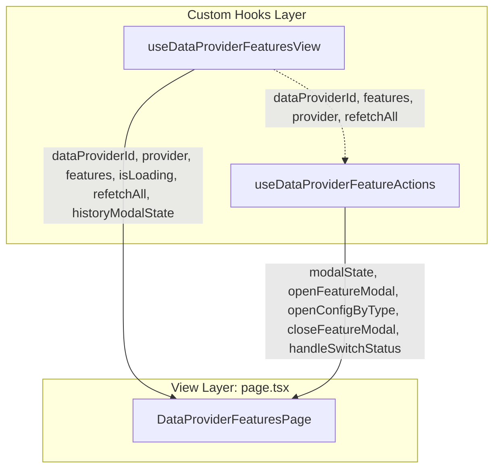

# Concept: Tái Cấu Trúc Phân Rã Thành 2 Hooks Độc Lập (View & Actions) & Loại Bỏ `useDataProviderFeaturesPage`

## 1. Problem & Goal (Vấn đề & Mục tiêu)
- **Problem**: Hook `useDataProviderFeaturesPage` ban đầu là một monolithic hook gộp chung cả truy vấn dữ liệu lẫn các hành động tác vụ. Việc giữ lại facade wrapper `useDataProviderFeaturesPage` không còn cần thiết khi trang [page.tsx](file:///d:/Sources/Personal/only-one-fe/src/app/(root)/scraping/features/[dataProviderId]/page.tsx) có thể sử dụng trực tiếp 2 hooks chuyên biệt rõ ràng.
- **Goal**:
  1. Tạo 2 hooks chuyên trách:
     - **`useDataProviderFeaturesView`**: Logic truy vấn dữ liệu (`provider`, `features`, `isLoading`, `refetchAll`) và quản lý modal xem lịch sử (`historyModalState`, `openHistoryModal`, `closeHistoryModal`).
     - **`useDataProviderFeatureActions`**: Logic tác vụ tạo mới draft, modal cấu hình/thử nghiệm (`modalState`, `openFeatureModal`, `openConfigByType`, `closeFeatureModal`), và mutation cập nhật trạng thái `handleSwitchStatus`.
  2. **Xóa bỏ hoàn toàn** hook thừa `useDataProviderFeaturesPage.ts`.
  3. Cập nhật [page.tsx](file:///d:/Sources/Personal/only-one-fe/src/app/(root)/scraping/features/[dataProviderId]/page.tsx) để gọi trực tiếp 2 hooks trên và `useRouter()`.

---

## 2. Scope Boundaries (Ranh giới Phạm vi)

### In-Scope (Bắt buộc thực hiện)
- **2 Hooks Mới**:
  - `hooks/useDataProviderFeaturesView.ts`
  - `hooks/useDataProviderFeatureActions.ts`
- **Xóa Hook Cũ**:
  - Xóa `hooks/useDataProviderFeaturesPage.ts`.
- **Cập nhật Page**:
  - `page.tsx`: Import và sử dụng trực tiếp `useDataProviderFeaturesView` & `useDataProviderFeatureActions`, sử dụng `useRouter()` từ `next/navigation`.
- **Barrel Exports**:
  - Cập nhật `hooks/index.ts`.

### Explicit Out-of-Scope (Chủ đích không làm)
- Không thay đổi giao diện UI hay hành vi logic của các modal/components.

---

## 3. Proposed Architecture & Data Flow

### 3.1 Cấu trúc thư mục
```text
src/app/(root)/scraping/features/[dataProviderId]/
├── hooks/
│   ├── useDataProviderFeaturesView.ts    # [NEW] Logic hiển thị & data queries & history modal
│   ├── useDataProviderFeatureActions.ts   # [NEW] Logic tác vụ tạo, edit, switch status
│   ├── useFeatureHistoryManager.ts       # (Đã có)
│   ├── useFeatureTestRunner.ts           # (Đã có)
│   ├── useFeatureVersionManager.ts       # (Đã có)
│   └── index.ts                          # Barrel export (loại bỏ useDataProviderFeaturesPage)
└── page.tsx                              # [MODIFY] Sử dụng trực tiếp 2 hooks mới
```

### 3.2 Sơ đồ Luồng Tương tác


---

## 4. Definition of Done (Tiêu chuẩn Hoàn thành)
- Xóa bỏ hoàn toàn `useDataProviderFeaturesPage.ts`.
- Tạo `useDataProviderFeaturesView.ts` và `useDataProviderFeatureActions.ts` chuẩn type, memoized.
- [page.tsx](file:///d:/Sources/Personal/only-one-fe/src/app/(root)/scraping/features/[dataProviderId]/page.tsx) kết nối trực tiếp 2 hooks, clean code.
- `npx tsc --noEmit` và `eslint` đạt 0 lỗi.
