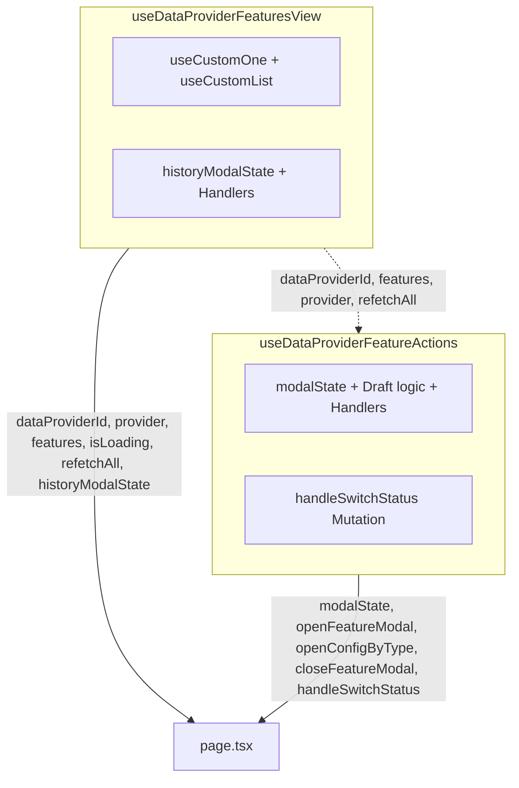

# Plan: Phân Rã Thành 2 Hooks Chuyên Trách (View & Actions) & Xóa Bỏ Hook Cũ `useDataProviderFeaturesPage`

## Section 1. Current State (Hiện trạng & Phân tích Mã nguồn)
- **Cơ chế hiện tại**: Hook [useDataProviderFeaturesPage.ts](file:///d:/Sources/Personal/only-one-fe/src/app/(root)/scraping/features/[dataProviderId]/hooks/useDataProviderFeaturesPage.ts) (147 LOC) là monolithic hook gộp chung toàn bộ logic truy vấn dữ liệu lẫn các hành động tác vụ.
- **Invariants**:
  - Tách thành đúng 2 hooks độc lập:
    1. **`useDataProviderFeaturesView`**: Logic truy vấn dữ liệu (`provider`, `features`, `isLoading`, `refetchAll`) và modal Lịch sử (`historyModalState`, `openHistoryModal`, `closeHistoryModal`).
    2. **`useDataProviderFeatureActions`**: Logic tác vụ tạo/draft, modal cấu hình/thử nghiệm (`modalState`, `openFeatureModal`, `openConfigByType`, `closeFeatureModal`), và mutation `handleSwitchStatus`.
  - **Xóa bỏ hoàn toàn** hook thừa `useDataProviderFeaturesPage.ts`.
  - Cập nhật [page.tsx](file:///d:/Sources/Personal/only-one-fe/src/app/(root)/scraping/features/[dataProviderId]/page.tsx) để sử dụng trực tiếp 2 hooks trên và `useRouter()`.
  - Dùng `type` alias cho options/props của hook.
  - Sử dụng `useCallback` cho toàn bộ handler functions.

## Section 2. Detailed Design (Thiết kế Kỹ thuật Chi tiết)

### 2.1 Cấu trúc Thư mục Mới
```text
src/app/(root)/scraping/features/[dataProviderId]/
├── hooks/
│   ├── useDataProviderFeaturesView.ts     # [NEW] Logic hiển thị, queries & history modal
│   ├── useDataProviderFeatureActions.ts    # [NEW] Logic tác vụ tạo, edit, switch status & setting modal
│   ├── useFeatureHistoryManager.ts        # (Đã có)
│   ├── useFeatureTestRunner.ts            # (Đã có)
│   ├── useFeatureVersionManager.ts        # (Đã có)
│   └── index.ts                           # Barrel export (xuất khẩu 2 hooks mới)
└── page.tsx                               # [MODIFY] Sử dụng trực tiếp 2 hooks mới & useRouter
```

### 2.2 Sơ đồ Luồng Tương tác (Architecture Diagram)


---

## Section 3. Task Matrix & Dependency Graph

| Order | Status | Action | File Path | Target Symbols / AST Seams | Reused Existing Utilities / Helpers | Depends On | Fast Test Command |
| :---: | :---: | :---: | :--- | :--- | :--- | :--- | :--- |
| **1** | `[x]` | `[NEW]` | `src/app/(root)/scraping/features/[dataProviderId]/hooks/useDataProviderFeaturesView.ts` | `useDataProviderFeaturesView` | `useCustomOne`, `useCustomList` | `None` | `npx tsc --noEmit` |
| **2** | `[x]` | `[NEW]` | `src/app/(root)/scraping/features/[dataProviderId]/hooks/useDataProviderFeatureActions.ts` | `useDataProviderFeatureActions` | `useCustomMutationData` | `None` | `npx tsc --noEmit` |
| **3** | `[x]` | `[DELETE]` | `src/app/(root)/scraping/features/[dataProviderId]/hooks/useDataProviderFeaturesPage.ts` | File cũ | Đã phân rã thành 2 hooks riêng | `Order 1, 2` | `npx tsc --noEmit` |
| **4** | `[x]` | `[MODIFY]` | `src/app/(root)/scraping/features/[dataProviderId]/hooks/index.ts` | Barrel Exports | Re-export `useDataProviderFeaturesView`, `useDataProviderFeatureActions` | `Order 1, 2, 3` | `npx tsc --noEmit` |
| **5** | `[x]` | `[MODIFY]` | `src/app/(root)/scraping/features/[dataProviderId]/page.tsx` | `DataProviderFeaturesPage` | Sử dụng trực tiếp `useDataProviderFeaturesView`, `useDataProviderFeatureActions`, `useRouter` | `Order 4` | `npx tsc --noEmit` |

---

## Section 4. Code Changes (Unified Diff)

### 1. `[NEW]` `src/app/(root)/scraping/features/[dataProviderId]/hooks/useDataProviderFeaturesView.ts`
> **Action**: Tạo hook quản lý toàn bộ logic hiển thị: queries dữ liệu (`provider`, `features`), trạng thái `isLoading`, `refetchAll` và modal Lịch sử `historyModalState`.

```typescript
'use client';

import { useCallback, useState } from 'react';
import { useParams } from 'next/navigation';
import type { IDataProvider } from '@/app/(root)/scraping/data-providers/types';
import { API_ENDPOINT } from '@/config';
import { useCustomList, useCustomOne } from '@/hooks';
import type { HistoryModalState, IDataProviderFeature } from '../types';

export const useDataProviderFeaturesView = () => {
    const params = useParams();
    const dataProviderId = (params?.dataProviderId as string) || '';

    // 1. Query Data Provider details
    const { query: providerQuery, data: provider } = useCustomOne<IDataProvider>({
        resource: API_ENDPOINT.DATA_PROVIDERS.BASE,
        id: dataProviderId,
        enabled: Boolean(dataProviderId),
    });

    // 2. Query all Features for this provider
    const { query: featuresQuery, data: features = [] } = useCustomList<IDataProviderFeature>({
        resource: API_ENDPOINT.DATA_PROVIDER_FEATURES.BY_PROVIDER(dataProviderId),
        queryOptions: {
            enabled: Boolean(dataProviderId),
        },
        transform: (list) => (list && list.length > 0 ? list : provider?.features || []),
    });

    // 3. History Modal State
    const [historyModalState, setHistoryModalState] = useState<HistoryModalState>({
        open: false,
        feature: null,
    });

    const openHistoryModal = useCallback((feature: IDataProviderFeature): void => {
        setHistoryModalState({ open: true, feature });
    }, []);

    const closeHistoryModal = useCallback((): void => {
        setHistoryModalState((prev) => ({ ...prev, open: false }));
    }, []);

    const refetchAll = useCallback(async (): Promise<void> => {
        await Promise.all([providerQuery.refetch(), featuresQuery.refetch()]);
    }, [providerQuery, featuresQuery]);

    return {
        dataProviderId,
        provider,
        features,
        isLoading: providerQuery.isLoading || featuresQuery.isLoading,
        historyModalState,
        openHistoryModal,
        closeHistoryModal,
        refetchAll,
    };
};
```

---

### 2. `[NEW]` `src/app/(root)/scraping/features/[dataProviderId]/hooks/useDataProviderFeatureActions.ts`
> **Action**: Tạo hook quản lý toàn bộ logic tác vụ: tạo draft feature, mở modal cấu hình/thử nghiệm `modalState`, và mutation đổi trạng thái `handleSwitchStatus`.

```typescript
'use client';

import { useCallback, useState } from 'react';
import type { IDataProvider } from '@/app/(root)/scraping/data-providers/types';
import {
    DataProviderFeatureStatus,
    DataProviderFeatureType,
    MessageType,
    ScraperServiceEnum,
} from '@/enums';
import { useCustomMutationData } from '@/hooks';
import type {
    FeatureModalState,
    FeatureModalTab,
    IDataProviderFeature,
} from '../types';

export type UseDataProviderFeatureActionsProps = {
    dataProviderId: string;
    features: IDataProviderFeature[];
    provider?: IDataProvider;
    refetchAll: () => Promise<void>;
};

export const useDataProviderFeatureActions = ({
    dataProviderId,
    features,
    provider,
    refetchAll,
}: UseDataProviderFeatureActionsProps) => {
    const [modalState, setModalState] = useState<FeatureModalState>({
        open: false,
        feature: null,
        activeTab: 'config',
    });

    const { handleCustomMutationData } = useCustomMutationData();

    const handleSwitchStatus = useCallback(
        (featureId: string, currentStatus: DataProviderFeatureStatus): void => {
            const nextStatus =
                currentStatus === DataProviderFeatureStatus.READY
                    ? DataProviderFeatureStatus.DISABLED
                    : DataProviderFeatureStatus.READY;

            handleCustomMutationData({
                method: 'put',
                url: `data-provider-features/${featureId}/switch-status/${nextStatus}`,
                successNotification: () => {
                    refetchAll();
                    return {
                        type: MessageType.SUCCESS,
                        message: 'Cập nhật trạng thái thành công',
                    };
                },
                errorNotification: (error) => ({
                    type: MessageType.ERROR,
                    message: 'Cập nhật trạng thái thất bại',
                    description: error?.message,
                }),
            });
        },
        [handleCustomMutationData, refetchAll],
    );

    const openFeatureModal = useCallback(
        (feature: IDataProviderFeature, tab: FeatureModalTab = 'config'): void => {
            setModalState({ open: true, feature, activeTab: tab });
        },
        [],
    );

    const openConfigByType = useCallback(
        (type: DataProviderFeatureType): void => {
            const existing = features.find((f) => f.type === type);
            if (existing) {
                setModalState({ open: true, feature: existing, activeTab: 'config' });
                return;
            }

            const draftFeature: IDataProviderFeature = {
                id: '',
                dataProviderId,
                type,
                service: ScraperServiceEnum.GENERIC,
                status: DataProviderFeatureStatus.UNCONFIGURED,
                consecutiveFailures: 0,
                config: {},
                createdAt: new Date(),
                updatedAt: new Date(),
                deletedAt: null,
                dataProvider: provider,
            };
            setModalState({ open: true, feature: draftFeature, activeTab: 'config' });
        },
        [features, dataProviderId, provider],
    );

    const closeFeatureModal = useCallback((): void => {
        setModalState((prev) => ({ ...prev, open: false }));
    }, []);

    return {
        modalState,
        setModalState,
        openFeatureModal,
        openConfigByType,
        closeFeatureModal,
        handleSwitchStatus,
    };
};
```

---

### 3. `[DELETE]` `src/app/(root)/scraping/features/[dataProviderId]/hooks/useDataProviderFeaturesPage.ts`
> **Action**: Xóa bỏ file hook nguyên khối cũ.

---

### 4. `[MODIFY]` `src/app/(root)/scraping/features/[dataProviderId]/hooks/index.ts`
> **Action**: Xuất khẩu 2 hooks mới và gỡ bỏ `useDataProviderFeaturesPage`.

```diff
@@ -1,4 +1,5 @@
-export * from './useDataProviderFeaturesPage';
+export * from './useDataProviderFeatureActions';
+export * from './useDataProviderFeaturesView';
 export * from './useFeatureHistoryManager';
 export * from './useFeatureTestRunner';
 export * from './useFeatureVersionManager';
```

---

### 5. `[MODIFY]` `src/app/(root)/scraping/features/[dataProviderId]/page.tsx`
> **Action**: Cập nhật trang sử dụng trực tiếp `useDataProviderFeaturesView`, `useDataProviderFeatureActions`, và `useRouter`.

```diff
@@ -1,6 +1,8 @@
 'use client';
 
+import { useMemo } from 'react';
+import { useRouter } from 'next/navigation';
 import {
     DataNotFound,
     ListWrapper,
@@ -19,8 +20,7 @@
 import { DataProviderFeatureType } from '@/enums';
 import { Icon } from '@iconify/react';
-import { useMemo } from 'react';
 import { FEATURE_TYPE_METADATA } from './constants';
 import { FeatureCard, FeatureHistoryModal, FeatureSettingModal } from './components';
-import { useDataProviderFeaturesPage } from './hooks';
+import { useDataProviderFeatureActions, useDataProviderFeaturesView } from './hooks';
 import type { FeatureModalTab } from './types';
 
 const DataProviderFeaturesPage = () => {
+    const router = useRouter();
+    const {
+        dataProviderId,
+        provider,
+        features,
+        isLoading,
+        historyModalState,
+        openHistoryModal,
+        closeHistoryModal,
+        refetchAll,
+    } = useDataProviderFeaturesView();
+
+    const {
+        modalState,
+        setModalState,
+        openFeatureModal,
+        openConfigByType,
+        closeFeatureModal,
+        handleSwitchStatus,
+    } = useDataProviderFeatureActions({
+        dataProviderId,
+        features,
+        provider,
+        refetchAll,
+    });
-    const {
-        router,
-        provider,
-        features,
-        isLoading,
-        modalState,
-        historyModalState,
-        refetchAll,
-        setModalState,
-        openFeatureModal,
-        openHistoryModal,
-        closeHistoryModal,
-        openConfigByType,
-        closeFeatureModal,
-        handleSwitchStatus,
-    } = useDataProviderFeaturesPage();
```

---

## Section 5. Test Cases & Verification
- **Automated Tests / Linter**:
  - `npx tsc --noEmit`
  - `eslint` check trên `hooks/**` và `page.tsx`.
- **Manual Verification**:
  1. Mở trang `/scraping/features/[dataProviderId]`: Kiểm tra danh sách tính năng và provider hiển thị đầy đủ.
  2. Bấm nút switch bật/tắt: Kiểm tra gọi `handleSwitchStatus` và cập nhật lại dữ liệu.
  3. Bấm "Thêm cài đặt" $\rightarrow$ Chọn feature chưa tạo: Mở draft modal cấu hình.
  4. Bấm "Thêm cài đặt" $\rightarrow$ Chọn feature đã tạo: Mở modal cấu hình với feature hiện tại.
  5. Bấm "Lịch sử": Mở và đóng modal lịch sử bình thường.
