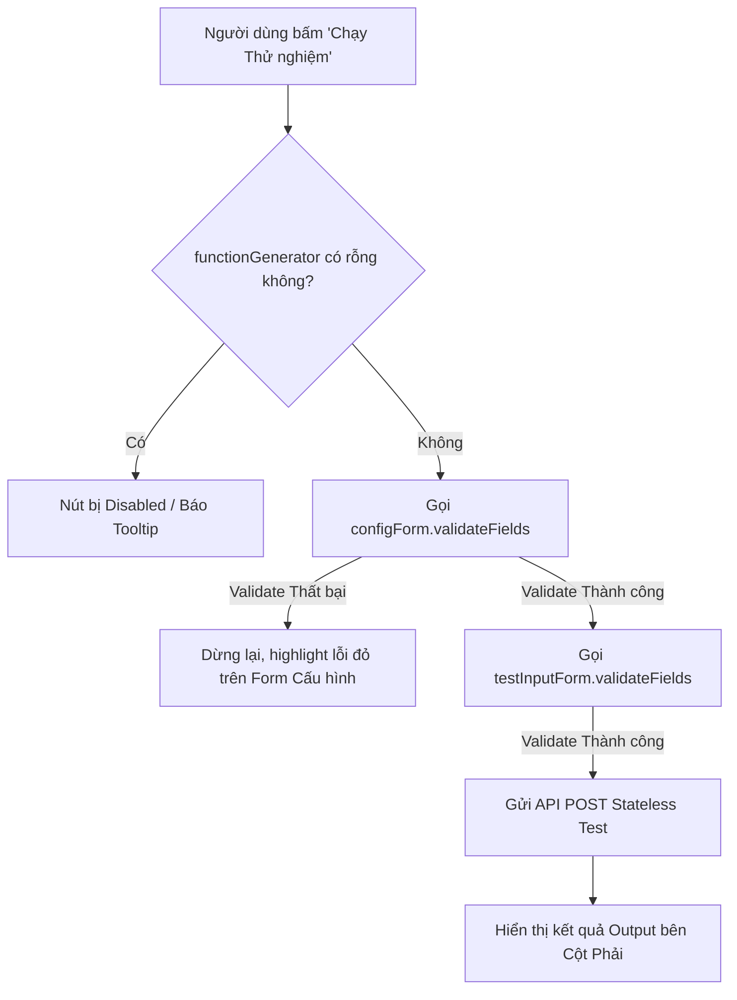

# Concept: Xử lý Ràng buộc Form Validation, Hàm Generator & Bố cục Nút Footer trong Feature Modal

## 1. Problem & Goal (Vấn đề & Mục tiêu)
- **Problem**: 
  1. Khi trường `functionGenerator` (hàm trích xuất / tìm kiếm) bên Form cấu hình đang để trống, nút "Chạy thử nghiệm" bên Sandbox vẫn bấm được, dẫn đến lỗi runtime hoặc request vô nghĩa gửi lên server.
  2. Khi form cấu hình bên trái đang có lỗi validate (ví dụ: thiếu URL mẫu bắt buộc, sai định dạng), người dùng vẫn bấm chạy test được khiến kết quả test không nhất quán.
  3. Cụm nút thao tác chính ("Lưu cấu hình", "Hủy") trong Footer chưa được căn chỉnh cố định tuyệt đối về phía góc phải trong mọi trường hợp (đặc biệt khi không có dropdown Version).
- **Goal**: 
  1. Tự động `disabled` nút "Chạy thử nghiệm" kèm tooltip nhắc nhở khi `functionGenerator` bị rỗng hoặc chưa có biểu mẫu cấu hình.
  2. Bắt buộc kích hoạt `configForm.validateFields()` thành công trước khi cho phép thực thi runner test.
  3. Đảm bảo cụm nút "Khôi phục", "Lưu cấu hình", "Hủy" luôn nằm sát lề phải của Footer Modal.

## 2. Scope Boundaries (Ranh giới Phạm vi)
- **In-Scope**:
  - **Dynamic Test Button Disabled State**: Lắng nghe trường `functionGenerator` của `configForm` bằng `CustomForm.useWatch('functionGenerator', configForm)`. Nếu rỗng $\rightarrow$ `disabled` nút "Chạy thử nghiệm" + bọc `CustomTooltip` thông báo.
  - **Cross-Form Pre-Test Validation**: Khi bấm "Chạy thử nghiệm", thực hiện `await configForm.validateFields()` trước; nếu fail validation thì dừng lại và hiển thị lỗi trên form cấu hình; nếu pass mới tiếp tục chạy test payload.
  - **Footer Right-Alignment Layout**: Căn chỉnh Flexbox trong `FeatureModalFooter` đảm bảo nhóm nút hành động chính luôn được neo về góc phải (`justify-end` / `ml-auto`).
- **Explicit Out-of-Scope**:
  - Thay đổi logic kiểm thử trên backend API.
  - Sửa đổi các rule validation nghiệp vụ hiện có trong `ScrapingConfigForm` / `SearchConfigForm`.

## 3. Proposed Solution & Core Mechanism (Giải pháp Đề xuất & Cơ chế)

### 3.1. Cơ chế Hoạt động (Core Mechanism)
1. **Lắng nghe Live `functionGenerator`**:
   - Truyền `configForm` vào `TestInputSection`.
   - Sử dụng `const functionGenerator = CustomForm.useWatch('functionGenerator', configForm);`
   - Tính toán `const isFunctionGeneratorEmpty = !functionGenerator || !functionGenerator.trim();`
   - Gán `disabled={isLoading || isFunctionGeneratorEmpty}` cho nút "Chạy thử nghiệm".
2. **Kích hoạt Cross-Form Validation**:
   - Khi người dùng bấm "Chạy thử nghiệm":
     ```ts
     const onFormSubmit = async () => {
         try {
             // 1. Validate Form Cấu hình (bên trái) trước
             if (configForm) {
                 await configForm.validateFields();
             }
             // 2. Validate Form Test Input (bên phải)
             const testInputValues = await form.validateFields();
             // 3. Thực thi Test Runner
             await handleRunTest(testInputValues);
         } catch (error) {
             // Form tự động highlight lỗi các field không hợp lệ
             console.error('Validation error before test execution:', error);
         }
     };
     ```
3. **Căn lề Footer Modal**:
   - Thiết lập cấu trúc Flexbox: Cụm bên trái (Version Select) và Cụm bên phải (`ml-auto flex items-center gap-2` chứa nút Khôi phục, Lưu cấu hình, Hủy).

### 3.2. Sơ đồ Luồng Kiểm tra trước khi Test (Logic Flow)


### 3.3. UI Wireframe (Bố cục Footer & Nút Test)
```text
┌────────────────────────────────────────────────────────────────────────────────────────────────────────┐
│ [CỘT TRÁI: FORM CẤU HÌNH]                          │ [CỘT PHẢI: TEST SANDBOX]                          │
│ • URL Mẫu: [ * Bắt buộc nhập ]                     │ • URL Test: [ https://...                      ]  │
│ • functionGenerator: [ async function extract... ] │                                                   │
│                                                    │   [ 🚀 Chạy Thử nghiệm (Enabled khi có code) ]    │
├────────────────────────────────────────────────────┴───────────────────────────────────────────────────┤
│ [ Dropdown Version (nếu có) ]                      (Trống)            [ Khôi phục ] [ Lưu ] [ Hủy ]     │
│ <---------------- Góc trái ---------------->                          <--------- Góc phải --------->   │
└────────────────────────────────────────────────────────────────────────────────────────────────────────┘
```

## 4. Critical Risks & Edge Cases (Rủi ro & Kịch bản Biên)
- **Draft Mode Không Có Field Cần Validate**: Khi tạo mới, chỉ những trường có rules bắt buộc (như `urlPattern` hay `baseUrl`) mới cần validate, tránh chặn test bởi các trường tùy chọn.
- **Scroll to First Error Field**: Khi `configForm.validateFields()` phát hiện lỗi, form bên trái sẽ tự động scroll đến trường lỗi đầu tiên để người dùng dễ nhận biết lý do chưa thể chạy test.
