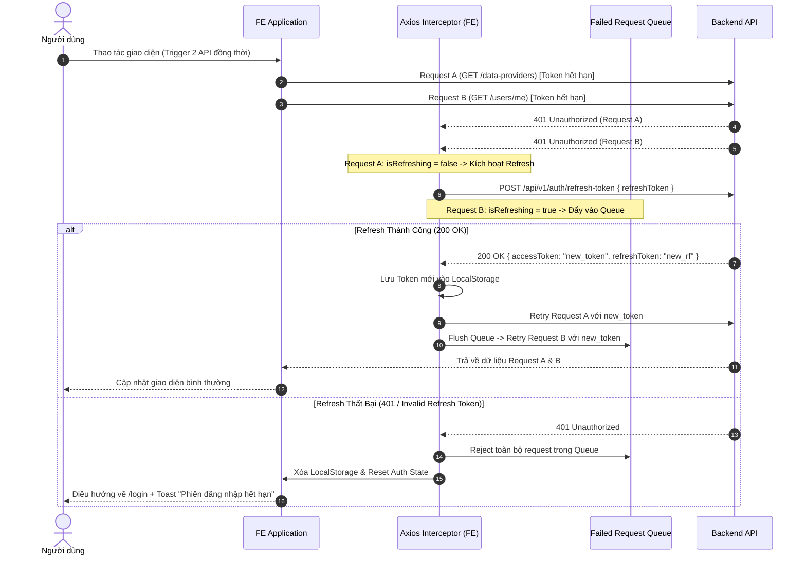

# Concept: Silent Refresh Token & Auto-Logout Mechanism

## 1. Problem & Goal (Vấn đề & Mục tiêu)

### Problem (Vấn đề & Điểm nghẽn Hiện tại)
- **Bối cảnh & Điểm kích hoạt**: Khi phiên đăng nhập của người dùng hết hạn (`accessToken` JWT hết hiệu lực) hoặc không hợp lệ, Backend (`only-one-be`) trả về lỗi `401 Unauthorized` qua `JwtAuthGuard` trên các request API (ví dụ: `GET /api/v1/data-providers`).
- **Hiện tượng & Khiếm khuyết kỹ thuật**: Frontend (`only-one-fe`) không bắt mã lỗi `401` để tự động làm mới phiên làm việc (silent refresh) hoặc tự động đăng xuất (auto-logout). Người dùng vẫn ở lại trang với UI bị lỗi dữ liệu hoặc trống rỗng, không có thông báo điều hướng rõ ràng.
- **Nguyên nhân cốt lõi (Root Cause)**:
  - Phía **Frontend**: HTTP Client (Axios / Refine `dataProvider`) chưa có **Response Interceptor** để xử lý tập trung mã lỗi `401`, chưa có cơ chế giữ hàng đợi request (Queue) để lấy `accessToken` mới qua `refreshToken`, và chưa kích hoạt `authProvider.logout` khi phiên hoàn toàn vô hiệu.
  - Phía **Backend**: Controller [auth.controller.ts](file:///d:/Sources/PERSONAL/only-one-be/src/modules/auth/controllers/auth.controller.ts#L36-L45) hiện có decorator `@Auth()` trên endpoint `refresh-token`. Nếu `@Auth()` sử dụng cùng guard kiểm tra `accessToken`, client sẽ bị chặn ngay khi gọi refresh lúc token đã hết hạn.
- **Tác động (Impact / Blast Radius)**: Trải nghiệm người dùng bị đứt gãy, người dùng không thể tiếp tục thao tác nếu không tự reload hoặc mở lại trang đăng nhập.

### Goal (Mục tiêu Kỹ thuật Cần đạt)
- **Mục tiêu cốt lõi**: Xây dựng cơ chế **Silent Refresh Token tự động** và **Fallback Auto-Logout** liền mạch (Seamless UX) khi `accessToken` hết hạn, đảm bảo các request đang chờ được retry thành công mà không làm gián đoạn người dùng.
- **Tiêu chí nghiệm thu (Acceptance Criteria)**:
  - **Tự động làm mới phiên (Silent Refresh)**: Khi gặp mã lỗi `401`, hệ thống tự động gọi API `/api/v1/auth/refresh-token` với `refreshToken` được lưu trữ.
  - **Chống Race Condition (Concurrent 401 Mutex/Queue)**: Khi nhiều request đồng thời gặp `401`, chỉ duy nhất 1 request `refresh-token` được bắn đi; tất cả các request khác được đưa vào hàng đợi chờ và tự động retry ngay sau khi có token mới.
  - **Fallback Logout an toàn**: Nếu không có `refreshToken`, hoặc request `refresh-token` trả về lỗi (400/401/hết hạn), hệ thống tự động xóa sạch token/state trong storage, gọi `authProvider.logout` và điều hướng về trang `/login` kèm thông báo lý do hết hạn phiên.
  - **Chống lặp vô hạn (Infinite Loop Prevention)**: Bản thân request gọi `refresh-token` không bao giờ được phép trigger interceptor refresh lại chính nó.

---

## 2. Scope Boundaries (Ranh giới Phạm vi)

- **In-Scope**:
  - **Frontend (`only-one-fe`)**:
    - Thiết lập / Nâng cấp **Axios Response Interceptor** tập trung xử lý lỗi `401`.
    - Xây dựng cơ chế Mutex (`isRefreshing` flag) + Request Queue (`failedQueue`) để gom và retry các request bị gián đoạn.
    - Tích hợp với Storage (LocalStorage / SessionStorage) để cập nhật cặp token (`accessToken`, `refreshToken`).
    - Tích hợp điều hướng Fallback với Refine `authProvider` (xóa storage, reset cache và redirect về `/login`).
  - **Backend (`only-one-be`)**:
    - Rà soát và cấu hình lại endpoint `POST /api/v1/auth/refresh-token` (loại bỏ `@Auth()` dùng `accessToken` guard hoặc chuyển sang guard chuyên dụng nhận diện `refreshToken`).
- **Explicit Out-of-Scope**:
  - Chuyển đổi toàn bộ kiến trúc xác thực sang HttpOnly Cookie hoặc OAuth2/SSO bên thứ ba (Google, Github...).
  - Tính năng quản lý đa phiên đăng nhập / thu hồi token theo từng thiết bị (device session revocation list).
  - Thay đổi thuật toán sinh và ký JWT token phía Backend.

---

## 3. Proposed Solution & Core Mechanism (Giải pháp Đề xuất & Cơ chế)

### Core Mechanism
Hệ thống sử dụng mô hình **Interceptor-Driven Silent Refresh with Promise Queue**:
1. Request gặp lỗi `401` $\rightarrow$ Interceptor kiểm tra xem có phải request đến từ `/refresh-token` hay không:
   - Nếu là `/refresh-token`: Hủy toàn bộ hàng đợi, xóa storage, thực hiện Hard Logout $\rightarrow$ redirect về `/login`.
2. Nếu là request thông thường và chưa có tiến trình refresh nào đang chạy (`!isRefreshing`):
   - Đặt cờ `isRefreshing = true`.
   - Gọi `POST /api/v1/auth/refresh-token` với `refreshToken`.
   - Các request 401 đến sau trong thời gian này sẽ được đóng gói thành Promise và đưa vào `failedQueue`.
3. Khi refresh thành công:
   - Cập nhật `accessToken` mới vào Storage và cấu hình Default Header.
   - Giải phóng `failedQueue` bằng cách retry tất cả request với token mới.
   - Đặt lại `isRefreshing = false`.
4. Khi refresh thất bại:
   - Reject tất cả Promise trong `failedQueue`.
   - Xóa token khỏi Storage.
   - Kích hoạt Logout và chuyển hướng về `/login`.

### Workflow / Logic Flow (Sequence Diagram)



### UI Wireframe & Notification Handling

```text
+-------------------------------------------------------------------------+
| [Only One Dashboard]                                 (User Avatar)      |
+-------------------------------------------------------------------------+
|                                                                         |
| (Kịch bản Silent Refresh thành công: Người dùng không thấy gián đoạn)    |
|                                                                         |
|-------------------------------------------------------------------------|
| (Kịch bản Refresh thất bại -> Chuyển về Login)                          |
|                                                                         |
|                                                                         |
|                  +-----------------------------------+                  |
|                  |              LOGIN                |                  |
|                  |                                   |                  |
|                  | [!] Phiên làm việc đã hết hạn.    | <--- Toast/Alert |
|                  |     Vui lòng đăng nhập lại.       |                  |
|                  |                                   |                  |
|                  | Username: [ admin               ] |                  |
|                  | Password: [ *******             ] |                  |
|                  |                                   |                  |
|                  |           [ Đăng nhập ]           |                  |
|                  +-----------------------------------+                  |
|                                                                         |
+-------------------------------------------------------------------------+
```

---

## 4. Critical Risks & Edge Cases (Rủi ro & Kịch bản Biên)

1. **Rủi ro Decorator `@Auth()` trên Backend**:
   - *Rủi ro*: [auth.controller.ts](file:///d:/Sources/PERSONAL/only-one-be/src/modules/auth/controllers/auth.controller.ts#L36) đang gắn `@Auth()` trên endpoint `refresh-token`. Nếu `@Auth()` yêu cầu `accessToken` còn hiệu lực thì client sẽ nhận tiếp `401` khi cố gọi refresh.
   - *Giải pháp*: Trong bước planning/implementation, kiểm tra và gỡ bỏ `@Auth()` khỏi endpoint `refresh-token` hoặc sử dụng guard riêng xác thực `refreshToken`.
2. **Kịch bản Vòng lặp Vô hạn (Infinite Refresh Loop)**:
   - *Rủi ro*: Nếu API `refresh-token` bị lỗi và lại bị interceptor bắt `401` rồi lại gọi refresh tiếp.
   - *Giải pháp*: Đặt cờ kiểm tra URL của request bị lỗi; nếu URL chứa `refresh-token`, lập tức bypass interceptor và trigger hard logout.
3. **Đồng bộ Đa Tab (Multi-Tab Concurrency)**:
   - *Rủi ro*: Người dùng mở nhiều tab, 1 tab đã refresh token và cập nhật LocalStorage nhưng tab khác vẫn giữ token cũ trong memory.
   - *Giải pháp*: Lắng nghe `window.addEventListener('storage')` hoặc luôn lấy token mới nhất từ LocalStorage trước khi retry các request trong queue.
