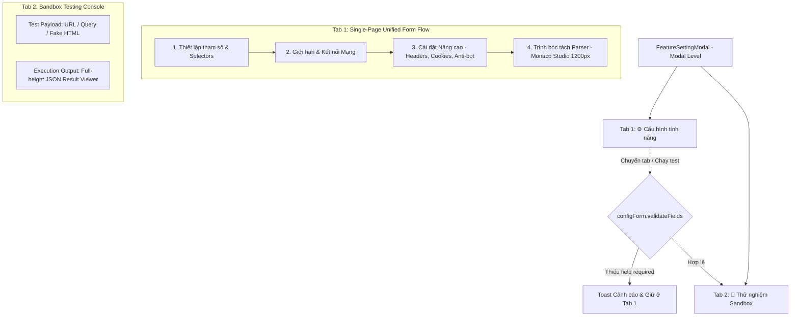

# Concept: Tái cấu trúc FeatureSettingModal sang Modal-Level Tabs (Loại bỏ Tab con trong Form Cấu hình)

## 1. Problem & Goal (Vấn đề & Mục tiêu)

### Problem (Vấn đề & Điểm nghẽn Hiện tại)
- **Bối cảnh & Điểm kích hoạt**: Modal cấu hình tính năng cào/tìm kiếm (`FeatureSettingModal`) đang chia đôi 2 cột cố định song song hoặc chia nhỏ form cấu hình thành các tab con (`CustomTabs` bên trong form), khiến trải nghiệm cấu hình bị gián đoạn, người dùng không bao quát được toàn bộ trường thông tin.
- **Hiện tượng & Khiếm khuyết kỹ thuật**:
  - Việc chia tab nhỏ bên trong form cấu hình buộc người dùng phải click chuyển qua lại giữa các tab để xem hoặc điền các trường cơ bản và nâng cao.
  - Bố cục 2 cột cũ làm Monaco Editor và kết quả kiểm thử JSON bị thu hẹp ngang (~600px).
- **Nguyên nhân cốt lõi (Root Cause)**: Chưa tách biệt ranh giới cấp cao giữa **Soạn thảo Cấu hình (Configuration)** và **Kiểm thử Dữ liệu (Testing/Sandbox)** ở cấp Modal, dẫn đến việc phải lạm dụng các tab con bên trong form để tiết kiệm diện tích.
- **Tác động (Impact / Blast Radius)**: Thao tác cấu hình bị vụn vặt, khó quan sát tổng thể các tham số của một feature.

### Goal (Mục tiêu Kỹ thuật Cần đạt)
- **Mục tiêu cốt lõi**:
  1. **Loại bỏ 100% các tab con bên trong Form Cấu hình**: `ScrapingConfigForm` và `SearchConfigForm` sẽ là **1 giao diện Form duy nhất (Single-Page Form Flow)**, hiển thị tuần tự, trực quan từ trên xuống dưới trên toàn bộ bề ngang 1300px của Modal.
  2. **Chỉ có duy nhất 2 Tab cấp cao ở cấp Modal (`FeatureSettingModal`)**:
     - `[ ⚙️ Cấu hình tính năng ]`: Toàn bộ form cấu hình 1 trang thoáng đãng, các khối phân định độc lập rõ ràng (Selectors $\rightarrow$ Giới hạn & Mạng $\rightarrow$ Monaco Studio rộng 1200px).
     - `[ 🧪 Thử nghiệm Sandbox ]`: Bảng kiểm thử độc lập (Cột trái: Test Payload Input / Cột phải: Output JSON Result Viewer rộng rãi).
  3. **Cơ chế Cross-Tab Pre-flight Validation**: Khi người dùng click chuyển sang Tab `Thử nghiệm Sandbox` hoặc bấm `Chạy thử nghiệm`, hệ thống tự động kiểm tra tính hợp lệ của `configForm` (các trường bắt buộc như service, selector, parser code...). Nếu thiếu trường bắt buộc, cảnh báo Toast và giữ nguyên tại Tab Cấu hình để người dùng hoàn thiện.
- **Tiêu chí nghiệm thu (Acceptance Criteria)**:
  - Form cấu hình không còn bất kỳ tab con nào; tất cả các section (Tham số trích xuất, Giới hạn & Mạng, Cài đặt nâng cao, Monaco Editor) hiển thị liền mạch trên 1 trang duy nhất.
  - Modal có đúng 2 tab cấp cao: `Cấu hình tính năng` và `Thử nghiệm Sandbox`.
  - Khi form cấu hình chưa đủ các trường required, hệ thống chặn chuyển sang tab Thử nghiệm và hiển thị thông báo hướng dẫn rõ ràng.
  - Form state được duy trì xuyên suốt giữa 2 tab modal mà không bị mất dữ liệu.

---

## 2. Scope Boundaries (Ranh giới Phạm vi)

- **In-Scope**:
  - Tái cấu trúc `FeatureSettingModal/index.tsx`: Quản lý 2 Tab cấp cao (`config` | `test`) kèm cơ chế interceptor validate trước khi chuyển tab.
  - Tái cấu trúc `ScrapingConfigForm/index.tsx` và `SearchConfigForm/index.tsx`: **Tháo gỡ hoàn toàn `CustomTabs` bên trong form**, chuyển thành 1 luồng Form duy nhất với các Card/Section phân minh rõ ràng.
  - Tái cấu trúc `FeatureTestTab/index.tsx`: Tận dụng toàn màn hình modal để chia 40:60 giữa Test Input và Test Result JSON.
  - Giữ nguyên `changeDescription` tại `FeatureModalFooter`.
- **Explicit Out-of-Scope**:
  - Không thay đổi schema dữ liệu, API endpoints `/data-provider-features/*`.
  - Không thay đổi logic chạy sandbox parser backend.

---

## 3. Proposed Solution & Core Mechanism (Giải pháp Đề xuất & Cơ chế)

### Core Mechanism



### UI Wireframe Chi tiết

```text
┌──────────────────────────────────────────────────────────────────────────────────────────────────────────┐
│ [Icon] Cấu hình: SCRAPING_DETAIL   [Shopee / Generic]               [v2 Active] [09:30 10/09]  [Bật/Tắt]  │
├──────────────────────────────────────────────────────────────────────────────────────────────────────────┤
│  [ ⚙️ Cấu hình tính năng ]   [ 🧪 Thử nghiệm Sandbox (Test) ]                                             │
├──────────────────────────────────────────────────────────────────────────────────────────────────────────┤
│ TAB 1: FORM CẤU HÌNH LIỀN MẠCH (SINGLE-PAGE FLOW - 1300PX)                                               │
│ ╭─── 1. THIẾT LẬP THAM SỐ CÀO (SELECTORS) ─────────────────────────────────────────────────────────────╮ │
│ │ Service Engine: [ Generic Selector ▼ ]                                                               │ │
│ │ Main Content Selector: [ .product-detail__content ]     Wait For Selector: [ .price-amount ]         │ │
│ ╰──────────────────────────────────────────────────────────────────────────────────────────────────────╯ │
│ ╭─── 2. GIỚI HẠN & KẾT NỐI MẠNG (LIMITS & NETWORK) ────────────────────────────────────────────────────╮ │
│ │ Max Results: [ 50 ]   Timeout: [ 30000ms ]   Retry Attempts: [ 3 ]   Retry Delay: [ 1000ms ]         │ │
│ ╰──────────────────────────────────────────────────────────────────────────────────────────────────────╯ │
│ ╭─── 3. CÀI ĐẶT NÂNG CAO (ADVANCED & ANTI-BOT) ────────────────────────────────────────────────────────╮ │
│ │ User-Agent: [ Mozilla/5.0... ]                                                                       │ │
│ │ Headers JSON: [ { ... } ]               Cookies JSON: [ [ ... ] ]                                    │ │
│ │ [x] Stealth Mode   [x] Cloudflare Bypass   [x] Javascript Enabled   [ ] Images Enabled               │ │
│ ╰──────────────────────────────────────────────────────────────────────────────────────────────────────╯ │
│ ╭─── 4. TRÌNH BÓC TÁCH DỮ LIỆU (MONACO EDITOR STUDIO - 1200PX RỘNG RÃI) ───────────────────────────────╮ │
│ │ [JavaScript] functionGenerator                                                 [Format] [Reset Code] │ │
│ │ ┌──────────────────────────────────────────────────────────────────────────────────────────────────┐ │ │
│ │ │ async function parser(ctx) {                                                                     │ │ │
│ │ │   const $ = ctx.$;                                                                               │ │ │
│ │ │   return $('div.item').map(...);                                                                 │ │ │
│ │ │ }                                                                                                │ │ │
│ │ └──────────────────────────────────────────────────────────────────────────────────────────────────┘ │ │
│ ╰──────────────────────────────────────────────────────────────────────────────────────────────────────╯ │
├──────────────────────────────────────────────────────────────────────────────────────────────────────────┤
│ Phiên bản: [ Version 2 - Thủ công ▼ ] [ ↺ Khôi phục ]        Ghi chú: [ Nhập lý do thay đổi... ] [Lưu] [Hủy]│
└──────────────────────────────────────────────────────────────────────────────────────────────────────────┘
```

---

## 4. Critical Risks & Edge Cases (Rủi ro & Kịch bản Biên)
- **Validation UX**: Khi validate thất bại lúc người dùng cố gắng chuyển sang Tab Test, form tự động scroll và focus đến input đầu tiên bị thiếu để người dùng sửa ngay lập tức.
- **Persistent State**: Không sử dụng conditional unmount (`destroyInactiveTabPane: false`), đảm bảo khi đang chạy test ở Tab 2, toàn bộ giá trị form ở Tab 1 được bảo toàn 100%.
