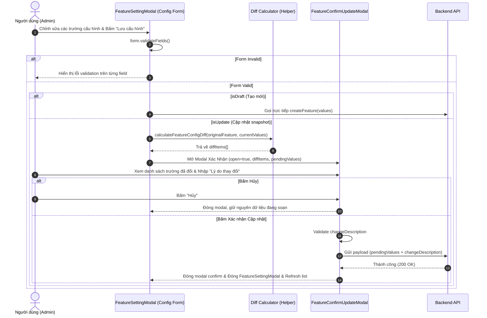

# Concept: Chuẩn Hóa Loading Cho CustomModal & Luồng Modal Xác Nhận Cập Nhật Cấu Hình Kèm Diff (Review Changes)

## 1. Problem & Goal (Vấn đề & Mục tiêu)

### Problem (Vấn đề & Điểm nghẽn Hiện tại)

#### Vấn đề 1: Thiếu cơ chế Loading tập trung trong `CustomModal`
- **Bối cảnh & Điểm kích hoạt**: Tại các modal phức tạp như [FeatureSettingModal](file:///Users/kiem/Sources/PERSONAL/only-one-fe/src/app/(root)/scraping/features/components/FeatureSettingModal/index.tsx), khi cần hiển thị trạng thái loading toàn modal (chờ fetch detail, test feature, chuyển đổi phiên bản...), lập trình viên phải tự truyền `modalRender` kèm [CustomSpin](file:///Users/kiem/Sources/PERSONAL/only-one-fe/src/components/custom-antd/custom-spin/index.tsx) và ghi đè inline CSS class `[&_.ant-spin-container]:w-full [&_.ant-spin-container]:h-full`.
- **Hiện tượng & Khiếm khuyết kỹ thuật**: Gây lặp code (boilerplate), không đồng nhất giữa các modal trong dự án, dễ phát sinh lỗi vỡ layout flex/scroll của modal body khi bọc `CustomSpin` không đúng cách.
- **Nguyên nhân cốt lõi (Root Cause)**: [CustomModal](file:///Users/kiem/Sources/PERSONAL/only-one-fe/src/components/custom-antd/custom-modal/index.tsx) chưa hỗ trợ các props tiêu chuẩn (`loading`, `spinning`, `loadingTip`) ở tầng component common.
- **Tác động (Impact)**: Giảm tính tái sử dụng, tăng chi phí bảo trì và rủi ro hồi quy UI.

#### Vấn đề 2: Trải nghiệm nhập Change Log tĩnh và thiếu cơ chế Review Diff trước khi Update
- **Bối cảnh & Điểm kích hoạt**: Trong [ScrapingConfigTab](file:///Users/kiem/Sources/PERSONAL/only-one-fe/src/app/(root)/scraping/features/components/ScrapingConfigTab/index.tsx) và [SearchConfigTab](file:///Users/kiem/Sources/PERSONAL/only-one-fe/src/app/(root)/scraping/features/components/SearchConfigTab/index.tsx), component [FeatureChangeLogSection](file:///Users/kiem/Sources/PERSONAL/only-one-fe/src/app/(root)/scraping/features/components/ConfigFormCommon/FeatureChangeLogSection.tsx) đang được đặt cố định ở cuối form cấu hình.
- **Hiện tượng & Khiếm khuyết kỹ thuật**: 
  - Người dùng phải cuộn xuống tận đáy form để nhập lý do thay đổi trước khi bấm nút "Lưu cấu hình" ở footer.
  - Người dùng không có cái nhìn tổng quan (visual diff) về những trường dữ liệu / selector / headers / limit nào thực sự đã bị thay đổi so với phiên bản hiện tại trước khi ghi đè hoặc tạo snapshot mới.
  - Nguy cơ lưu nhầm thông số sai mà không được cảnh báo/xác nhận lại (accidental override).
- **Nguyên nhân cốt lõi (Root Cause)**: Luồng submit form đang đi trực tiếp từ `form.submit()` vào mutation API mà thiếu một bước Review / Confirmation Step trung gian để tính toán delta/diff và nhập metadata lý do thay đổi.
- **Tác động (Impact)**: Trải nghiệm người dùng (UX) rời rạc, thiếu an toàn khi quản lý cấu hình scraping nhạy cảm trong môi trường production.

---

### Goal (Mục tiêu Kỹ thuật Cần đạt)

- **Mục tiêu cốt lõi**:
  1. Nâng cấp [CustomModal](file:///Users/kiem/Sources/PERSONAL/only-one-fe/src/components/custom-antd/custom-modal/index.tsx) hỗ trợ sẵn cơ chế loading tích hợp qua props `loading` / `spinning` và `loadingTip`, loại bỏ hoàn toàn việc bọc thủ công `modalRender` ở các modal tiêu thụ.
  2. Tái cấu trúc luồng cập nhật cấu hình tính năng: Gỡ bỏ `FeatureChangeLogSection` tĩnh ở tab cấu hình; chuyển sang luồng **Update Confirmation Modal (Review Changes & Diff)** xuất hiện sau khi người dùng bấm "Lưu cấu hình", hiển thị trực quan các trường thay đổi (Old Value vs New Value) và yêu cầu nhập lý do thay đổi trước khi gửi API.

- **Tiêu chí nghiệm thu (Acceptance Criteria)**:
  - `CustomModal`: Khi truyền `loading={true}` (hoặc `spinning={true}`), toàn bộ modal hoặc modal body được bọc `CustomSpin` mượt mà, giữ nguyên responsive, full height/width và chặn tương tác nút bấm / keyboard esc khi đang loading.
  - [FeatureSettingModal](file:///Users/kiem/Sources/PERSONAL/only-one-fe/src/app/(root)/scraping/features/components/FeatureSettingModal/index.tsx): Đã loại bỏ đoạn custom `modalRender` thủ công và sử dụng trực tiếp prop từ `CustomModal`.
  - Form Config ([ScrapingConfigTab](file:///Users/kiem/Sources/PERSONAL/only-one-fe/src/app/(root)/scraping/features/components/ScrapingConfigTab/index.tsx) & [SearchConfigTab](file:///Users/kiem/Sources/PERSONAL/only-one-fe/src/app/(root)/scraping/features/components/SearchConfigTab/index.tsx)): Không còn hiển thị khối `FeatureChangeLogSection` cố định ở cuối form.
  - Luồng Submit Cập nhật:
    - Khi bấm "Lưu cấu hình": Thực hiện validation form hiện tại. Nếu hợp lệ:
      - Nếu là **Draft / Tạo mới**: Thực hiện lưu trực tiếp (không yêu cầu diff modal hoặc hiển thị modal tạo mới đơn giản).
      - Nếu là **Update (Đã có feature ID)**: Mở modal `FeatureConfirmUpdateModal`.
  - Modal Xác nhận (`FeatureConfirmUpdateModal`):
    - Hiển thị danh sách các trường thay đổi (Diff Summary): Tên trường, Giá trị cũ $\rightarrow$ Giá trị mới (hỗ trợ hiển thị dạng tag, text, hoặc code diff tóm tắt).
    - Trường hợp không có thay đổi nào giữa form và dữ liệu gốc: Hiển thị Empty/Notice "Không phát hiện thay đổi so với phiên bản hiện tại" và disable nút xác nhận (hoặc cảnh báo).
    - Form nhập lý do thay đổi (`changeDescription` / Reason): Bắt buộc (Required validation).
    - Hai nút hành động: "Xác nhận cập nhật" (kích hoạt mutation API thực tế) và "Hủy / Tiếp tục chỉnh sửa" (đóng modal confirm, giữ nguyên form).

---

## 2. Scope Boundaries (Ranh giới Phạm vi)

### In-Scope
- Nâng cấp [CustomModal](file:///Users/kiem/Sources/PERSONAL/only-one-fe/src/components/custom-antd/custom-modal/index.tsx) nhận thêm `loading?: boolean`, `spinning?: boolean`, `loadingTip?: ReactNode`.
- Refactor [FeatureSettingModal](file:///Users/kiem/Sources/PERSONAL/only-one-fe/src/app/(root)/scraping/features/components/FeatureSettingModal/index.tsx) sử dụng prop loading mới của `CustomModal`.
- Xóa bỏ `FeatureChangeLogSection` khỏi [ScrapingConfigTab](file:///Users/kiem/Sources/PERSONAL/only-one-fe/src/app/(root)/scraping/features/components/ScrapingConfigTab/index.tsx) và [SearchConfigTab](file:///Users/kiem/Sources/PERSONAL/only-one-fe/src/app/(root)/scraping/features/components/SearchConfigTab/index.tsx).
- Xây dựng utility tính toán diff giữa form values và original feature values (`calculateFeatureConfigDiff`).
- Xây dựng component `FeatureConfirmUpdateModal` (hoặc `FeatureUpdateReviewModal`) hiển thị UI Diff và Form nhập `changeDescription`.
- Tích hợp modal xác nhận vào luồng submit của `FeatureSettingModal` / `useFeatureSettingModal`.

### Explicit Out-of-Scope
- Thay đổi cấu trúc API backend (`data-provider-feature.controller.ts` / DTOs). Payload gửi lên backend vẫn giữ nguyên định dạng gồm các trường cấu hình và `changeDescription`.
- Sửa đổi cơ chế lưu snapshot / rollback ở backend.
- Thay đổi logic kiểm thử (tab "Kiểm thử" / `FeatureTestTab`).

---

## 3. Proposed Solution & Core Mechanism (Giải pháp Đề xuất & Cơ chế)

### So sánh các Phương án Kiến trúc (Architecture Options)

| Tiêu chí | Phương án 1: Direct State Hook (Khuyên dùng) | Phương án 2: Imperative Modal Service (`Modal.confirm`) |
| :--- | :--- | :--- |
| **Cơ chế** | Sử dụng declarative React state trong `FeatureSettingModal` để quản lý hiển thị `FeatureConfirmUpdateModal`, truyền trực tiếp `pendingValues` và `diffList`. | Dùng custom Promise-based imperative dialog (`useModal` / `Modal.confirm` của Antd) để mở popup và resolve kết quả. |
| **Ưu điểm** | - Dễ customize giao diện Diff phong phú (syntax highlight, badges, tables).<br>- Tương thích hoàn toàn với Design System và Ant Design Form context.<br>- Type-safe, dễ debug và test. | - Code tại trigger point ngắn gọn (`await confirmUpdate(...)`). |
| **Nhược điểm** | - Cần khai báo thêm component state trong container modal. | - Khó kiểm soát layout phức tạp, animation, responsive và form validation bên trong modal confirm của Antd standard dialog. |
| **Độ phức tạp** | Thấp - Trung bình | Trung bình - Cao |
| **Đánh giá** | **Lựa chọn tối ưu (Recommended)** | Không khuyến khích cho UI diff phức tạp |

---

### Cơ chế Vận hành Cốt lõi (Core Mechanism)



---

### Thiết kế Giao diện (ASCII UI Wireframes)

#### 1. CustomModal với Loading Tích Hợp
```text
+-------------------------------------------------------------------------+
| [Icon] Tiêu đề Modal                                              [X]   |
+-------------------------------------------------------------------------+
|                                                                         |
|                          /=================\                            |
|                          |    [SPINNER]    |                            |
|                          |  Đang tải dữ... |                            |
|                          \=================/                            |
|                                                                         |
+-------------------------------------------------------------------------+
| [Footer Buttons]                                                        |
+-------------------------------------------------------------------------+
```

#### 2. FeatureConfirmUpdateModal (Review Changes & Reason)
```text
+-------------------------------------------------------------------------+
| [Icon: file-diff] Xác nhận Cập nhật Cấu hình & Phiên bản          [X]   |
+-------------------------------------------------------------------------+
| Vui lòng kiểm tra lại các thông tin đã thay đổi trước khi lưu snapshot: |
|                                                                         |
| +---------------------------------------------------------------------+ |
| | THÔNG TIN THAY ĐỔI (3 mục đã sửa đổi)                               | |
| +---------------------------------------------------------------------+ |
| | 1. Browser Settings > Chờ Selector (waitSelector)                  | |
| |    [-] Cũ: .old-product-item                                        | |
| |    [+] Mới: .new-product-grid-item                                  | |
| |---------------------------------------------------------------------| |
| | 2. Limits > Timeout (ms)                                            | |
| |    [-] Cũ: 15000                                                    | |
| |    [+] Mới: 30000                                                    | |
| |---------------------------------------------------------------------| |
| | 3. Headers                                                          | |
| |    [+] Thêm header mới: Authorization: Bearer ***                   | |
| +---------------------------------------------------------------------+ |
|                                                                         |
| (*) Lý do thay đổi phiên bản (Change Log):                              |
| +---------------------------------------------------------------------+ |
| | [Icon: pen] Cập nhật selector theo giao diện mới của website...     | |
| +---------------------------------------------------------------------+ |
|                                                                         |
+-------------------------------------------------------------------------+
|                                            [ Hủy ]  [ Lưu & Cập nhật ]  |
+-------------------------------------------------------------------------+
```

---

### UI State Handling Matrix

| Trạng thái | Điều kiện kích hoạt | Hành vi UI & Tương tác |
| :--- | :--- | :--- |
| **No Changes (Diff rỗng)** | Form values hoàn toàn trùng khớp với initial values của feature | Hiển thị Info Alert "Không có thay đổi nào được phát hiện". Nút "Lưu & Cập nhật" bị disable hoặc cảnh báo người dùng. |
| **Has Changes (Có Diff)** | Ít nhất 1 trường cấu hình khác giá trị gốc | Hiển thị bảng danh sách diff dạng group (theo Section) kèm badge màu sắc (Đỏ: Giá trị cũ, Xanh lá: Giá trị mới). Cho phép nhập `changeDescription`. |
| **Submitting / Loading** | Người dùng bấm "Lưu & Cập nhật" trong modal confirm | Hiển thị loading spinner trên nút submit của modal confirm, vô hiệu hóa nút Hủy / nút Close để tránh double submit. |
| **Validation Error** | Người dùng bỏ trống trường "Lý do thay đổi" | Báo đỏ trường input "Vui lòng nhập lý do thay đổi phiên bản". Focus vào ô input. |

---

## 4. Critical Risks & Edge Cases (Rủi ro & Kịch bản Biên)

1. **So sánh Diff cho kiểu dữ liệu phức tạp (Object, Array, JSON script, Headers list)**:
   - *Rủi ro*: Thứ tự key trong headers object hoặc khoảng trắng/dòng trống trong JSON code generator có thể gây false-positive diff (báo có thay đổi dù nội dung không đổi).
   - *Giải pháp*: Chuẩn hóa (normalize / trim / sorted key comparison) trước khi so sánh equality; hiển thị diff thân thiện cho headers/cookies dạng list thay vì in nguyên cả JSON string thô.
2. **Quản lý Loading State 2 cấp (Modal chính & Modal Confirm)**:
   - *Rủi ro*: Khi modal confirm đang loading gọi API, nếu modal chính đóng trước có thể gây unmounted state warning hoặc mất dấu thông báo lỗi nếu API fail.
   - *Giải pháp*: Modal confirm gọi hàm `onConfirm(changeDescription)` từ hook/parent, parent giữ loading và chỉ đóng cả 2 modal khi API trả về thành công (success notification).
3. **Phím Esc và Mask Closable khi đang Loading**:
   - *Rủi ro*: Người dùng bấm phím Esc hoặc click bên ngoài mask làm đóng modal trong lúc request cập nhật đang xử lý ngầm.
   - *Giải pháp*: `CustomModal` tự động vô hiệu hóa `closable`, `keyboard={false}`, `maskClosable={false}` khi `loading` hoặc `spinning` mang giá trị `true`.
