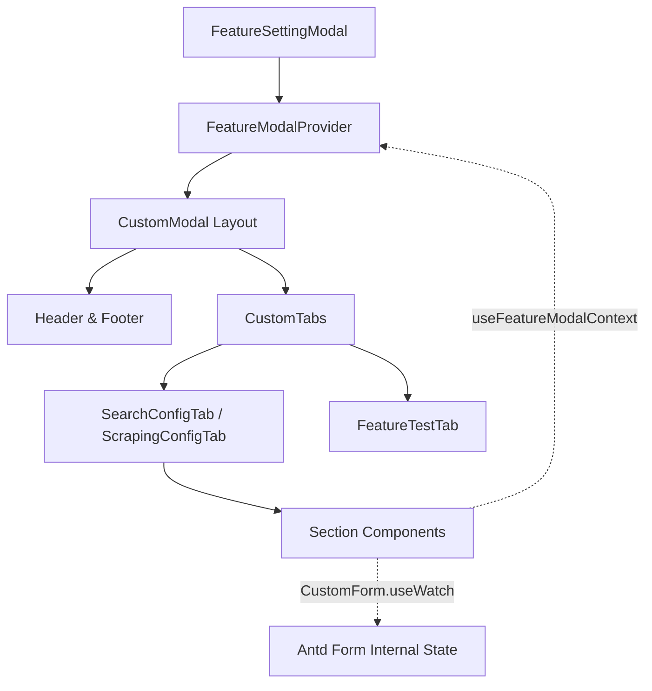

# Concept: Tối ưu Cơ chế Truyền Props & State Management trong FeatureSettingModal

## 1. Problem & Goal (Vấn đề & Mục tiêu)

### Problem (Vấn đề & Điểm nghẽn Hiện tại)
- **Bối cảnh & Điểm kích hoạt**: Cụm modal cấu hình tính năng `FeatureSettingModal` chứa nhiều tab (`SearchConfigTab`, `ScrapingConfigTab`, `FeatureTestTab`...) và phân cấp thành nhiều Section con (`FeatureAdvancedSection`, `FeatureCodeSection`, `FeatureLimitsSection`, `SearchSelectorsSection`, `SearchUrlPatternSection`...).
- **Hiện tượng & Khiếm khuyết kỹ thuật**: Tình trạng **Props Drilling** nghiêm trọng qua 3-4 tầng component. Tab cha đang phải `CustomForm.useWatch` hàng loạt trường (`service`, `headers`, `cookies`, `functionGenerator`) rồi truyền prop xuống dưới, đồng thời truyền liên tục các metadata props (`feature`, `form`, `selectedVersion`, `isViewingHistory`, `onClose`, `onSuccess`, `onSaveForm`...).
- **Nguyên nhân cốt lõi (Root Cause)**:
  - Thiếu một **Scoped React Context** (`FeatureModalContext`) gắn liền với vòng đời của Modal để chia sẻ metadata và controller state.
  - Phụ thuộc vào việc watch tập trung ở component cha thay vì để các component con tự subscribe vào Form state thông qua Antd Form hooks (`useWatch`, `useFormInstance`).
- **Tác động (Impact / Blast Radius)**:
  - Boilerplate code cao và cồng kềnh: Khi cần bổ sung hoặc sửa đổi props chung (như permissions, read-only mode, revision status...), phải sửa đổi interface và JSX trên hàng loạt file.
  - Tăng nguy cơ re-render không cần thiết trên toàn bộ cây component con khi một giá trị form thay đổi ở cấp Tab cha.
  - Khó bảo trì và mở rộng khi thêm các tab tính năng mới.

### Goal (Mục tiêu Kỹ thuật Cần đạt)
- **Mục tiêu cốt lõi**: Loại bỏ triệt để props drilling trong `FeatureSettingModal` và các component con bằng mô hình **Hybrid Context + Decentralized Form Binding**.
- **Tiêu chí nghiệm thu (Acceptance Criteria)**:
  - Xây dựng `FeatureModalContext` và custom hook `useFeatureModalContext()` bao bọc toàn bộ nội dung của modal.
  - Đơn giản hóa `FeatureConfigFormProps`, loại bỏ việc truyền lặp đi lặp lại các metadata props (`feature`, `selectedVersion`, `isViewingHistory`, `form`...) qua nhiều tầng component.
  - Chuyển đổi các Section con (`FeatureAdvancedSection`, `FeatureCodeSection`...) sang cơ chế tự lắng nghe form field (`useWatch`) và sử dụng context chung.
  - Đảm bảo 100% tính năng hiện tại (lưu cấu hình, chuyển đổi version, xem diff, rollback, validate form, đổi service template) hoạt động trơn tru, không có regression.

## 2. Scope Boundaries (Ranh giới Phạm vi)
- **In-Scope**:
  - Tạo `FeatureModalContext` (Provider, Context Types, Hook) trong phạm vi module `scraping/features`.
  - Refactor `FeatureSettingModal`, `SearchConfigTab`, `ScrapingConfigTab` và các Section con trong `ConfigFormCommon` và các thư mục tab liên quan.
  - Chuẩn hóa việc sử dụng `CustomForm.useWatch` và `CustomForm.useFormInstance` trong các Section.
- **Explicit Out-of-Scope**:
  - Không thay đổi schema dữ liệu, API contracts hoặc backend payload.
  - Không thay đổi business logic kiểm tra service (`checkService`) hoặc logic lưu trữ versioning.
  - Không refactor các modal khác ngoài cụm `FeatureSettingModal`.

## 3. Proposed Solution & Core Mechanism (Giải pháp Đề xuất & Cơ chế)
- **Core Mechanism**:
  1. **Scoped Metadata Context (`FeatureModalContext`)**:
     - Cung cấp dữ liệu tĩnh/metadata và các action handlers:
       ```typescript
       interface FeatureModalContextValue {
         feature: IDataProviderFeature;
         form: FormInstance;
         selectedVersion: IConfigVersion | null;
         isViewingHistory: boolean;
         isDraft: boolean;
         isSaving: boolean;
         isReadOnly: boolean;
         onClose: () => void;
         onSuccess: () => void;
         onSaveForm: (values: any) => Promise<void>;
       }
       ```
  2. **Decentralized Form State Subscription**:
     - Thay vì Tab cha watch `service`, `headers`, `cookies` rồi truyền xuống, từng Section con tự gọi `CustomForm.useWatch` đối với các field nó phụ thuộc (hoặc qua helper hook `useCurrentService()`).
     - Tối ưu hóa rendering: Thay đổi `headers` chỉ trigger render `FeatureAdvancedSection`, không ảnh hưởng tới `FeatureLimitsSection` hay `FeatureCodeSection`.

- **Workflow / Logic Flow**:


- **UI Wireframe / Component Hierarchy (ASCII)**:
```text
+---------------------------------------------------------------+
| FeatureModalProvider (Context: feature, form, version, state) |
|  +---------------------------------------------------------+  |
|  | FeatureModalHeader                                      |  |
|  | Tabs: [ Cấu hình tính năng ] [ Thử nghiệm Sandbox ]     |  |
|  +---------------------------------------------------------+  |
|  | Tab Content (ConfigComponent / FeatureTestTab)          |  |
|  |   +-- SearchUrlPatternSection (reads context & service) |  |
|  |   +-- SearchSelectorsSection  (reads context & service) |  |
|  |   +-- FeatureLimitsSection    (reads context & service) |  |
|  |   +-- FeatureAdvancedSection  (reads context & headers) |  |
|  |   +-- FeatureCodeSection      (reads context & code)    |  |
|  +---------------------------------------------------------+  |
|  | FeatureModalFooter (reads context loading/draft state)  |  |
|  +---------------------------------------------------------+  |
+---------------------------------------------------------------+
```

## 4. Critical Risks & Edge Cases (Rủi ro & Kịch bản Biên)
- **Form Instance Unavailability**: Nếu một Section render ngoài `CustomForm` mà gọi `useWatch` hoặc `useFormInstance`, có thể gây lỗi runtime. Cần đảm bảo `CustomForm` bao bọc các Section đúng thứ tự.
- **Initial Values & Service Template Reset**: Khi người dùng đổi service type, form reset template. Đảm bảo luồng xử lý `handleServiceChange` trong `useFeatureConfigForm` vẫn hoạt động chính xác khi không truyền qua props.
- **Strict Typing for Context**: Đảm bảo typing TypeScript chặt chẽ, throw error rõ ràng nếu hook `useFeatureModalContext()` bị gọi ngoài `FeatureModalProvider`.
