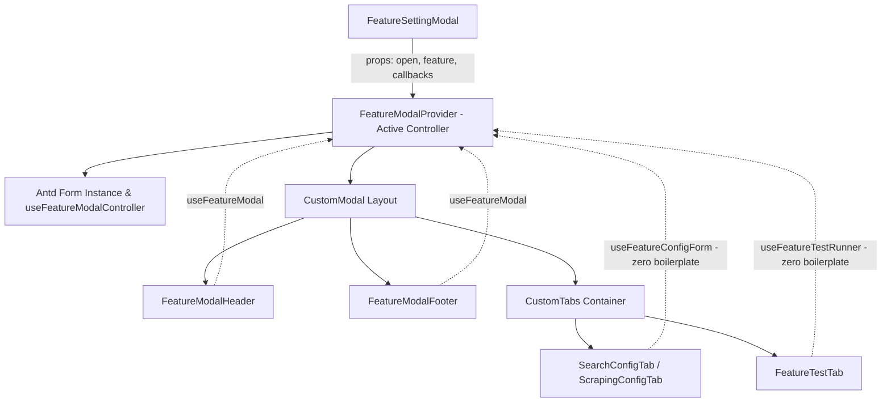

# Concept: Hợp nhất Kiến trúc Feature Modal với Unified Context Facade & Context-Aware Hooks

## 1. Problem & Goal (Vấn đề & Mục tiêu)

### Problem (Vấn đề & Điểm nghẽn Hiện tại)
- **Bối cảnh & Điểm kích hoạt**: Module `scraping/features` hiện đang duy trì đồng thời cả **React Context** (`FeatureModalContext`) lẫn các **Custom Hooks** rời rạc (`useFeatureModalController`, `useFeatureConfigForm`, `useFeatureTestRunner`, `useCurrentService`).
- **Hiện tượng & Khiếm khuyết kỹ thuật**:
  - `FeatureSettingModal` phải đóng vai trò "cầu nối thủ công": gọi controller hook $\rightarrow$ nhặt ra 15+ biến $\rightarrow$ đóng gói thành `contextValue` $\rightarrow$ truyền vào `FeatureModalProvider`.
  - Các Tab con (`SearchConfigTab`, `ScrapingConfigTab`) dù đã nằm trong Context nhưng vẫn phải gọi `useFeatureConfigForm({...})` và truyền lặp lại 8-10 tham số (`feature`, `form`, `selectedVersion`, `onClose`, `onSuccess`...).
  - Tương tự, `FeatureTestTab` vẫn phải truyền thủ công `{ feature, configForm }` vào `useFeatureTestRunner`.
- **Nguyên nhân cốt lõi (Root Cause)**:
  - `FeatureModalProvider` hiện tại là một **Passive Provider** (thùng chứa thụ động), chưa chủ động quản lý vòng đời và controller của Modal.
  - Các sub-hooks chưa **Context-Aware**, vẫn được thiết kế độc lập đòi hỏi caller phải truyền toàn bộ dependencies từ ngoài vào.
- **Tác động (Impact / Blast Radius)**:
  - Logic bị phân mảnh giữa hook và context, gây khó hiểu cho dev mới ("khi nào dùng hook, khi nào dùng context?").
  - Boilerplate code cao ở các Tab cấu hình, vi phạm nguyên lý DRY (Don't Repeat Yourself).

### Goal (Mục tiêu Kỹ thuật Cần đạt)
- **Mục tiêu cốt lõi**: Hợp nhất toàn bộ vòng đời và logic của Feature Modal vào mô hình **Active Domain Provider & Context-Aware Hooks**, xóa bỏ hoàn toàn sự phân mảnh và boilerplate cấu hình.
- **Tiêu chí nghiệm thu (Acceptance Criteria)**:
  - `FeatureModalProvider` trở thành Active Provider: tự khởi tạo Antd Form instance và controller actions bên trong.
  - `FeatureSettingModal` trở thành một Presentation Wrapper siêu mỏng, chỉ cần bọc `<FeatureModalProvider {...props}>`.
  - `useFeatureConfigForm()` và `useFeatureTestRunner()` trở thành **Context-Aware Hooks**: tự động lấy dữ liệu từ context, Tab con gọi hook với 0 tham số cấu hình thừa.
  - Cung cấp hook facade `useFeatureModal()` hợp nhất cả context metadata, controller actions và helper `currentService`.
  - Đảm bảo 100% tính năng (lưu cấu hình, test sandbox, xem diff, version rollback, switch engine) hoạt động chính xác, 0 lỗi TypeScript và ESLint.

---

## 2. Scope Boundaries (Ranh giới Phạm vi)

- **In-Scope**:
  - Nâng cấp `FeatureModalProvider` và `FeatureModalContext` để tự đóng gói `useFeatureModalController`.
  - Refactor `useFeatureConfigForm` và `useFeatureTestRunner` để tự động đọc context khi không truyền params.
  - Hợp nhất hook tiện ích `useCurrentService` vào `useFeatureModal()` / context value.
  - Tinh giản tối đa mã nguồn trong `FeatureSettingModal`, `SearchConfigTab`, `ScrapingConfigTab`, `FeatureTestTab`.
- **Explicit Out-of-Scope**:
  - Không thay đổi API contracts, backend endpoints hoặc schema database.
  - Không thay đổi business logic lõi (`checkService`, `buildFeatureMutationPayload`, `calculateFeatureConfigDiff`).
  - Không can thiệp vào các module ngoài `scraping/features`.

---

## 3. Proposed Solution & Core Mechanism (Giải pháp Đề xuất & Cơ chế)

### Core Mechanism: Active Domain Provider & Context-Aware Hooks

1. **Active Domain Provider (`FeatureModalProvider`)**:
   - Provider nhận trực tiếp `FeatureModalProviderProps` (gồm `open`, `feature`, `isSwitchingStatus`, `onClose`, `onSuccess`, `onSwitchStatus`).
   - Tự khởi tạo `const [form] = CustomForm.useForm()`, gọi `useFeatureModalController`, và cung cấp toàn bộ dữ liệu cần thiết qua context.
   - Hỗ trợ đầy đủ cleanup tự động khi unmount.

2. **Context-Aware Sub-Hooks**:
   - `useFeatureConfigForm<TValues>(options?: Partial<UseFeatureConfigFormOptions<TValues>>)`:
     - Tự động lấy `feature`, `form`, `selectedVersion`, `onClose`, `onSuccess`, `onSaveForm` từ Context.
     - Caller tại `SearchConfigTab` hoặc `ScrapingConfigTab` chỉ cần truyền các options đặc thù của riêng tab đó (như `featureLabel`, `defaultTargetConfig`, `extraInitialValues`).
   - `useFeatureTestRunner(options?: Partial<UseFeatureTestRunnerProps>)`:
     - Tự động kết nối với `feature` và `form` từ Context.

3. **Unified Hook Facade (`useFeatureModal`)**:
   - Thay thế việc gọi nhiều hooks nhỏ bằng 1 hook thống nhất:
     ```typescript
     const {
       feature,
       form,
       currentService,
       selectedVersion,
       isViewingHistory,
       isDraft,
       isSaving,
       isRollingBack,
       handleRollback,
       setSelectedVersionId,
     } = useFeatureModal();
     ```

### Architecture & Data Flow



### Component Hierarchy (ASCII)

```text
+-------------------------------------------------------------------------------+
| FeatureSettingModal (Wrapper mỏng)                                            |
|  +-------------------------------------------------------------------------+  |
|  | FeatureModalProvider (Active Domain Controller: Form + Actions + State) |  |
|  |  +-------------------------------------------------------------------+  |  |
|  |  | CustomModal                                                       |  |  |
|  |  |  +-- FeatureModalHeader (useFeatureModal)                         |  |  |
|  |  |  +-- CustomTabs                                                   |  |  |
|  |  |  |    +-- SearchConfigTab / ScrapingConfigTab                     |  |  |
|  |  |  |    |    +-- useFeatureConfigForm() [Auto Context Connected]    |  |  |
|  |  |  |    |    +-- Sub Sections (UrlPattern, Limits, Advanced, Code)  |  |  |
|  |  |  |    +-- FeatureTestTab                                          |  |  |
|  |  |  |         +-- useFeatureTestRunner() [Auto Context Connected]    |  |  |
|  |  |  +-- FeatureModalFooter (useFeatureModal)                         |  |  |
|  |  |  +-- FeatureConfirmUpdateModal (useFeatureModal)                  |  |  |
|  |  +-------------------------------------------------------------------+  |  |
|  +-------------------------------------------------------------------------+  |
+-------------------------------------------------------------------------------+
```

---

## 4. Critical Risks & Edge Cases (Rủi ro & Kịch bản Biên)

- **Provider Boundary Safety**: Đảm bảo throw error rõ ràng và tường minh khi bất kỳ hook nào (`useFeatureModal`, `useFeatureConfigForm`, `useFeatureTestRunner`) bị gọi ngoài `FeatureModalProvider`.
- **Custom Overrides Compatibility**: Cho phép truyền optional params vào `useFeatureConfigForm` hoặc `useFeatureTestRunner` nếu trong tương lai có một component con muốn override lại `form` hoặc `feature`.
- **Memoization of Context Value**: Bọc `contextValue` trong `useMemo` bên trong `FeatureModalProvider` với danh sách dependencies chính xác để tránh re-render thừa.
