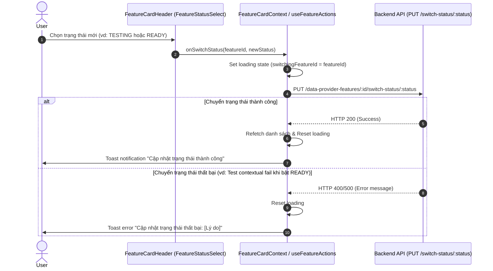

# Concept: Feature Card Status Select & State Transition Control

## 1. Problem & Goal (Vấn đề & Mục tiêu)

### Problem (Vấn đề & Điểm nghẽn Hiện tại)
- **Bối cảnh & Điểm kích hoạt**: Tại component header của Feature Card (`FeatureCardHeader.tsx`) trong trang quản lý tính năng Scraper (`scraping/features/[dataProviderId]`).
- **Hiện tượng & Khiếm khuyết kỹ thuật**:
  - `FeatureCardHeader` đang sử dụng `CustomSwitch` nhị phân (`Bật` / `Tắt`), chỉ cho phép chuyển đổi qua lại giữa 2 trạng thái `READY` và `DISABLED`.
  - Trong khi đó, domain enum `DataProviderFeatureStatus` gồm **5 trạng thái**: `UNCONFIGURED`, `TESTING`, `READY`, `ERROR`, `DISABLED`.
  - `FeatureModalHeader` và các action context liên quan đang gán cứng luồng `onSwitchStatus` theo kiểu toggle đảo nhị phân: nếu đang là `READY` thì chuyển sang `DISABLED`, ngược lại luôn cố chuyển thành `READY`.
- **Nguyên nhân cốt lõi (Root Cause)**: Thiết kế giao diện (UI) chưa đồng bộ với mô hình máy trạng thái (State Machine) của Backend. Việc dùng Switch nhị phân che giấu các trạng thái quan trọng như `TESTING` (chế độ chạy thử nghiệm) và không hỗ trợ người dùng chuyển đổi chủ động giữa các trạng thái khả dụng.
- **Tác động (Impact / Blast Radius)**:
  - Người dùng không thể chuyển một Feature sang trạng thái `TESTING` từ giao diện thẻ.
  - Khi Feature gặp sự cố (`ERROR`), giao diện Switch không phản ánh đúng hành động khả thi tiếp theo.
  - Người dùng thiếu cái nhìn toàn diện về vòng đời hoạt động (Lifecycle) của tính năng.

### Goal (Mục tiêu Kỹ thuật Cần đạt)
- **Mục tiêu cốt lõi**: Thay thế `CustomSwitch` nhị phân ở `FeatureCardHeader` (và đồng bộ tại `FeatureModalHeader`) bằng **Status Select / Dropdown Badge**, cho phép người dùng chuyển trạng thái linh hoạt theo danh sách trạng thái cho phép.
- **Tiêu chí nghiệm thu (Acceptance Criteria)**:
  1. **Trực quan & Nhất quán**: Component Status hiển thị rõ trạng thái hiện tại kèm màu sắc badge chuẩn (`READY` xanh lá, `TESTING` vàng cam, `DISABLED` xám, `ERROR` đỏ, `UNCONFIGURED` xám nhạt).
  2. **Kiểm soát State Transition**: Cho phép người dùng chuyển đổi sang các trạng thái chủ động (`READY`, `TESTING`, `DISABLED`).
  3. **Xử lý Trạng thái Khóa / Disabled**: Khi Feature ở trạng thái `UNCONFIGURED` hoặc đang trong quá trình chuyển đổi (`isSwitchingStatus`), Dropdown/Select phải ở trạng thái disabled kèm loading indicator.
  4. **Tích hợp API Seamless**: Tích hợp gọi endpoint `PUT /data-provider-features/:id/switch-status/:status` và xử lý thông báo thành công / thất bại mượt mà.

---

## 2. Scope Boundaries (Ranh giới Phạm vi)

### In-Scope
- Chuyển đổi component điều khiển trạng thái tại `FeatureCardHeader` từ `CustomSwitch` sang `FeatureStatusSelect` (Dropdown/Select Badge).
- Cập nhật handler và interface trong `FeatureCardContext` và `useFeatureActions` để hỗ trợ truyền tham số `targetStatus: DataProviderFeatureStatus` thay vì toggle tự động.
- Cập nhật đồng bộ tại `FeatureModalHeader` (nếu đang dùng chung cơ chế switch status).
- Định nghĩa constants mapping màu sắc, icon, và nhãn hiển thị cho từng `DataProviderFeatureStatus`.

### Explicit Out-of-Scope
- Không can thiệp hoặc sửa đổi logic xác thực `runner.testContextual()` ở tầng Backend NestJS.
- Không thay đổi cấu trúc bảng cơ sở dữ liệu `DataProviderFeatureEntity`.

---

## 3. Proposed Solution & Core Mechanism (Giải pháp Đề xuất & Cơ chế)

### 3.1. Phân loại Trạng thái & State Transition Matrix

| Trạng thái | Nguồn gốc (Origin) | Cho phép User chọn? | Ý nghĩa & Hành vi |
| :--- | :--- | :---: | :--- |
| **`UNCONFIGURED`** | Khởi tạo hệ thống | ❌ Không | Chưa thiết lập config (bắt buộc cấu hình trước khi kích hoạt) |
| **`TESTING`** | User / Hệ thống |  Có | Chạy thử nghiệm trong môi trường Sandbox/Staging |
| **`READY`** | User / Hệ thống |  Có | Kích hoạt chính thức (Backend sẽ tự chạy `testContextual` kiểm tra) |
| **`DISABLED`** | User |  Có | Tạm ngưng hoạt động của tính năng |
| **`ERROR`** | Circuit Breaker BE | ❌ Không | Hệ thống tự ngắt khi gặp lỗi nghiêm trọng (User có thể chuyển về `TESTING` hoặc `READY` để retry) |

### 3.2. Thiết kế Giao diện (UI Wireframe)

#### Layout Header của Feature Card:
```text
┌─────────────────────────────────────────────────────────────────────────────┐
│ [Icon] Data Extraction                                        [ READY ▾ ]   │
│        Dịch vụ trích xuất dữ liệu sản phẩm                                  │
└─────────────────────────────────────────────────────────────────────────────┘
```

#### Menu khi Người dùng mở Dropdown Status:
```text
┌─────────────────────────────────────────────────────────────────────────────┐
│ 🟢 Sẵn sàng hoạt động (READY)                                              │
│ 🟡 Chạy thử nghiệm (TESTING)                                               │
│ ⚪ Tạm ngưng hoạt động (DISABLED)                                           │
└─────────────────────────────────────────────────────────────────────────────┘
```

### 3.3. Luồng Xử lý Dữ liệu (Data Flow)



---

## 4. Critical Risks & Edge Cases (Rủi ro & Kịch bản Biên)

1. **Độ trễ khi chuyển sang `READY`**:
   - Khi chọn `READY`, Backend thực thi kiểm thử contextual trực tiếp với Provider Scraper, có thể mất từ 1 đến 5 giây.
   - **Giải pháp**: Hiển thị loading spinner trực tiếp trên Status Badge/Select và vô hiệu hóa các thao tác lặp lại (debounce/loading lock) trong lúc request đang xử lý.
2. **Feature chưa cấu hình (`UNCONFIGURED`)**:
   - Không cho phép chọn trạng thái từ dropdown khi config chưa được tạo hợp lệ.
   - **Giải pháp**: Hiển thị Badge `Chưa cấu hình` dạng disabled, có tooltip hướng dẫn người dùng nhấn "Cấu hình" trước.
3. **Rollback UI khi API báo lỗi**:
   - Nếu API trả về lỗi (ví dụ không đạt điều kiện test contextual), Select giữ nguyên giá trị trạng thái cũ của feature thay vì cập nhật lạc quan (optimistic) sai lệch.
