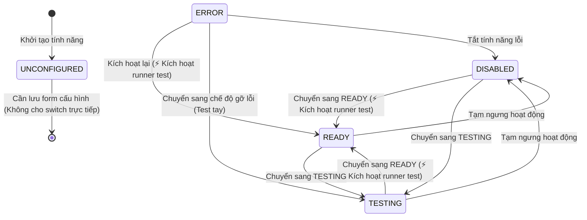

# Concept: Đồng bộ hóa Feature Status Constants & State Transition Matrix theo Backend, Nâng Cấp UI & Bổ Sung Modal Xác Nhận (Confirmation Modal)

## 1. Problem & Goal (Vấn đề & Mục tiêu)

### Problem (Vấn đề & Điểm nghẽn Hiện tại)
- **Bối cảnh & Điểm kích hoạt**: Trên giao diện quản lý tính năng Scraper (`/scraping/features`), người dùng thao tác chuyển đổi trạng thái tính năng thông qua component `FeatureStatusSelect`.
- **Hiện tượng & Khiếm khuyết kỹ thuật**:
  - Tệp [feature-status.constants.ts](file:///d:/Sources/Personal/only-one-fe/src/app/(root)/scraping/features/constants/feature-status.constants.ts) sử dụng cấu hình tĩnh với cờ phẳng `selectable: boolean` và mảng cố định `SELECTABLE_FEATURE_STATUSES = [READY, TESTING, DISABLED]`.
  - Cấu hình này **không phản ánh đúng State Machine** tại Backend [data-provider-feature.service.ts:L153-L201](file:///d:/Sources/PERSONAL/only-one-be/src/modules/data-provider/services/data-provider-feature.service.ts#L153-L201) trong hàm `switchStatus(id, status)`.
  - Component [FeatureStatusSelect.tsx](file:///d:/Sources/Personal/only-one-fe/src/app/(root)/scraping/features/components/FeatureStatusSelect.tsx) phải tự chắp vá logic hardcoded (`if (status === ERROR) list.unshift(...)`, `if (isUnconfigured) ...`) và vẫn render tùy chọn không hợp lệ hoặc gây nhầm lẫn khi người dùng click lại chính trạng thái hiện tại.
  - **Thiếu cơ chế xác nhận (Confirmation Guard)**: Thao tác chuyển trạng thái hiện tại diễn ra ngay khi click item trên dropdown mà không có bước xác nhận. Điều này tiềm ẩn rủi ro:
    - Vô tình click nhầm làm tạm dừng tính năng đang hoạt động (`DISABLED`).
    - Vô tình kích hoạt chạy runner test nặng (`READY`) làm nghẽn tài nguyên hoặc phát sinh lỗi không mong muốn.
  - **Khiếm khuyết UI/UX**: Component `FeatureStatusSelect` hiện tại là một Ant Design Select cơ bản, giao diện đơn điệu, thiếu chiều sâu, không có hiệu ứng trực quan sinh động (status dot tĩnh, không có badge/pill phân cấp thị giác, thiếu tooltip giải thích ngữ cảnh).
- **Nguyên nhân cốt lõi (Root Cause)**:
  - Thiếu mô hình **State Transition Matrix (FSM - Finite State Machine)** tập trung ở tầng Constants của Frontend.
  - Cấu hình `FeatureStatusDefinition` chưa đóng gói đầy đủ các metadata cần thiết: danh sách trạng thái đích hợp lệ (`allowedTransitions`), nhãn hành động ngữ cảnh (`actionLabel`), mô tả gợi ý (`description`), chỉ báo hành vi kiểm thử (`requiresRunnerTest`), và nội dung thông điệp xác nhận (`confirmContent`).
  - Chưa có Modal xác nhận chuyển đổi trạng thái chuyên dụng (`FeatureStatusConfirmModal`).
- **Tác động (Impact / Blast Radius)**:
  - Người dùng có thể vô tình thao tác nhầm làm gián đoạn luồng cào dữ liệu hoặc kích hoạt kiểm thử ngoài ý muốn.
  - Lỗi HTTP 400 xảy ra nếu gọi sai luồng chuyển đổi trạng thái của Backend.

---

### Goal (Mục tiêu Kỹ thuật & Trải Nghiệm Người Dùng)
- **Mục tiêu cốt lõi**:
  1. Tái cấu trúc [feature-status.constants.ts](file:///d:/Sources/Personal/only-one-fe/src/app/(root)/scraping/features/constants/feature-status.constants.ts) thành Single Source of Truth định nghĩa đầy đủ quy tắc chuyển đổi trạng thái và metadata trực quan khớp 100% với Backend.
  2. Nâng cấp toàn diện **Giao diện & Trải nghiệm (UI/UX)** của `FeatureStatusSelect` theo phong cách **Modern Dashboard / Premium Glass-Pill**.
  3. Xây dựng cơ chế **Confirmation Modal (`FeatureStatusConfirmModal`)** bảo vệ an toàn cho các thao tác chuyển trạng thái quan trọng.
- **Tiêu chí nghiệm thu (Acceptance Criteria)**:
  - [x] **Transition Matrix Khớp BE**: Xây dựng ma trận chuyển đổi trạng thái `FEATURE_STATUS_TRANSITIONS` phản ánh đúng các ràng buộc chuyển trạng thái của Backend.
  - [x] **Helper Function**: Cung cấp hàm tiện ích `getAllowedStatusTransitions(currentStatus)` và `canTransitionTo(fromStatus, toStatus)` có type-safe tuyệt đối.
  - [x] **Metadata Đầy Đủ**: Mở rộng `FeatureStatusDefinition` bổ sung: `description`, `actionLabel`, `badgeVariant`, `requiresRunnerTest: boolean`, `confirmConfig` (tiêu đề, cảnh báo, chú thích tác động).
  - [x] **UI Premium Pill Trigger**:
    - Thiết kế nút trigger dạng **Status Pill** sang trọng với background tint và viền mềm mại tương ứng với từng trạng thái.
    - **Pulsing Indicator Dot**: Hiệu ứng ping/glow nhẹ cho trạng thái đang chạy (`READY`, `TESTING`, `ERROR`).
  - [x] **Custom Dropdown Menu Cao Cấp**:
    - Phân tách rõ trạng thái hiện tại (Active State) và các trạng thái chuyển đổi khả dụng.
    - Từng tùy chọn có Icon sắc nét, Tiêu đề hành động, và Sub-label giải thích (VD: *"⚡ Kiểm thử kết nối tự động"* khi chọn `READY`).
  - [x] **Modal Xác Nhận Chuyên Dụng (FeatureStatusConfirmModal)**:
    - Khi người dùng chọn trạng thái mới, hiển thị Modal xác nhận trực quan.
    - Hiển thị sơ đồ chuyển đổi `[Trạng thái hiện tại]` $\rightarrow$ `[Trạng thái mục tiêu]` với Pill Badges.
    - Cảnh báo rõ ràng tác động của thao tác (VD: *"Hệ thống sẽ chạy kiểm thử live runner trước khi kích hoạt"* hoặc *"Tạm dừng tính năng sẽ ngừng thu thập dữ liệu"*).
    - Tích hợp nút `[Hủy bỏ]` và `[Xác nhận Chuyển đổi]` có loading spinner khi Backend đang thực thi.
  - [x] **Tương Thích Ngược (Zero Regression)**: Bảo toàn 100% tính năng hiển thị màu/icon ở các component khác.

---

## 2. Scope Boundaries (Ranh giới Phạm vi)

### In-Scope (Thuộc phạm vi triển khai)
- **Tầng Dữ liệu & Constants**:
  - Tái cấu trúc [feature-status.constants.ts](file:///d:/Sources/Personal/only-one-fe/src/app/(root)/scraping/features/constants/feature-status.constants.ts): `FEATURE_STATUS_TRANSITIONS`, `FeatureStatusDefinition`, `getAllowedStatusTransitions`, `canTransitionTo`.
  - Cập nhật barrel export [constants/index.ts](file:///d:/Sources/Personal/only-one-fe/src/app/(root)/scraping/features/constants/index.ts).
- **Tầng Giao diện (UI/UX Component)**:
  - Tái thiết kế [FeatureStatusSelect.tsx](file:///d:/Sources/Personal/only-one-fe/src/app/(root)/scraping/features/components/FeatureStatusSelect.tsx) thành component tương tác cao cấp (Custom Pill Trigger + Dropdown Menu phong phú).
  - Xây dựng component mới **`FeatureStatusConfirmModal.tsx`** xử lý xác nhận chuyển trạng thái an toàn.
  - Tối ưu hiển thị tại [FeatureCardHeader.tsx](file:///d:/Sources/Personal/only-one-fe/src/app/(root)/scraping/features/components/FeatureCardDetail/FeatureCardHeader.tsx).

### Explicit Out-of-Scope (Nằm ngoài phạm vi)
- Thay đổi logic nội bộ tại Backend [data-provider-feature.service.ts](file:///d:/Sources/PERSONAL/only-one-be/src/modules/data-provider/services/data-provider-feature.service.ts) (Backend giữ nguyên làm chuẩn logic).
- Thay đổi schema API endpoint `PATCH /data-provider/features/:id/status`.
- Đổi layout của các Tab chi tiết khác trong Feature (Form Cấu hình, Lịch sử, Test Runner).

---

## 3. Phân Tích Kỹ Thuật & Kiến Trúc State Machine

### Ma Trận Chuyển Đổi Trạng Thái Backend (FSM Matrix)



| Trạng thái hiện tại (`from`) | Các trạng thái đích hợp lệ (`to`) | Hành vi phụ (Side Effect) & Ý nghĩa UX |
| :--- | :--- | :--- |
| `UNCONFIGURED` | `[]` (Không cho phép) | Disabled trigger + Tooltip nhắc nhở cấu hình |
| `READY` | `[TESTING, DISABLED]` | Chuyển sang chế độ chạy thử hoặc tạm ngưng |
| `TESTING` | `[READY, DISABLED]` | Khi chọn `READY` hiển thị badge `⚡ Chạy kiểm thử tự động` |
| `DISABLED` | `[READY, TESTING]` | Khi chọn `READY` hiển thị badge `⚡ Chạy kiểm thử tự động` |
| `ERROR` | `[READY, TESTING, DISABLED]` | Retry kiểm thử (`READY`), hoặc đưa về `TESTING` để fix |

---

## 4. Thiết Kế Giao Diện Mới (Visual UI/UX Redesign)

### 1. Bảng Phối Màu Hiện Đại (Visual Palette Tokens)

| Trạng thái | Tone màu | Badge Background / Border | Dot Pulse Class | Icon |
| :--- | :--- | :--- | :--- | :--- |
| **READY** | Emerald (Xanh ngọc) | `bg-emerald-500/10 border-emerald-500/30 text-emerald-600 dark:text-emerald-400` | `bg-emerald-500 shadow-[0_0_8px_rgba(16,185,129,0.6)]` | `lucide:check-circle-2` |
| **TESTING** | Amber (Vàng hổ phách) | `bg-amber-500/10 border-amber-500/30 text-amber-600 dark:text-amber-400` | `bg-amber-500 animate-pulse` | `lucide:flask-conical` |
| **DISABLED** | Slate (Xám thanh lịch) | `bg-slate-500/10 border-slate-500/20 text-slate-500 dark:text-slate-400` | `bg-slate-400` | `lucide:pause-circle` |
| **ERROR** | Rose (Đỏ cảnh báo) | `bg-rose-500/10 border-rose-500/30 text-rose-600 dark:text-rose-400` | `bg-rose-500 shadow-[0_0_8px_rgba(244,63,94,0.6)]` | `lucide:alert-triangle` |
| **UNCONFIGURED** | Muted Slate | `bg-slate-100 dark:bg-slate-800 border-dashed border-slate-300 dark:border-slate-700 text-slate-400` | `bg-slate-300 dark:bg-slate-600` | `lucide:settings-2` |

---

### 2. Mockup Giao Diện Dropdown Chi Tiết (ASCII UI Mockup)

```text
=============================================================================
1. TRẠNG THÁI HIỆN TẠI: READY (Sẵn sàng hoạt động)
=============================================================================
Trigger Button:
[ (🟢) Sẵn sàng hoạt động                                         (▼) ]
  ^-- Background: Emerald Tint (10%), Viền: Emerald Border, Glow nhẹ

Khi Click mở Dropdown Menu:
+---------------------------------------------------------------------------+
| TRẠNG THÁI HIỆN TẠI                                                       |
|   (🟢) Sẵn sàng hoạt động                               ✓ Đang kích hoạt  |
|---------------------------------------------------------------------------|
| CHUYỂN ĐỔI TRẠNG THÁI                                                     |
|   (🟡) Chạy thử nghiệm                                                    |
|        Cho phép chạy scraper trong chế độ thử nghiệm nội bộ               |
|                                                                           |
|   (⚪) Tạm ngưng hoạt động                                                |
|        Tạm dừng tính năng, không nhận thêm yêu cầu scraping               |
+---------------------------------------------------------------------------+
```

---

### 3. Mockup Modal Xác Nhận (FeatureStatusConfirmModal ASCII Wireframe)

```text
+---------------------------------------------------------------------------+
|  [⚡] Xác nhận Chuyển đổi Trạng thái Tính năng                        (X) |
+---------------------------------------------------------------------------+
|                                                                           |
|   Thay đổi trạng thái cho tính năng: "Thu thập chi tiết sản phẩm"         |
|                                                                           |
|   +-----------------------+           +-------------------------------+   |
|   | (🔴) Sự cố / Lỗi       |   --->    | (🟢) Sẵn sàng hoạt động        |   |
|   +-----------------------+           +-------------------------------+   |
|     (Trạng thái hiện tại)               (Trạng thái mục tiêu)             |
|                                                                           |
|   +-------------------------------------------------------------------+   |
|   | ⚡ Cảnh báo / Lưu ý kỹ thuật:                                      |   |
|   | Hệ thống sẽ tự động kích hoạt Runner Kiểm thử (testContextual)    |   |
|   | để kiểm tra tính hợp lệ của cấu hình trước khi kích hoạt.         |   |
|   | Quá trình này có thể mất từ 2-5 giây.                             |   |
|   +-------------------------------------------------------------------+   |
|                                                                           |
|                                     [ Hủy bỏ ]   [ (⚡) Xác nhận Chuyển ] |
+---------------------------------------------------------------------------+
```

---

## 5. Cấu Trúc Constants & Helper Kỹ Thuật Dự Kiến

```typescript
// 1. Ma trận chuyển đổi trạng thái (FSM)
export const FEATURE_STATUS_TRANSITIONS: Record<
    DataProviderFeatureStatus,
    readonly DataProviderFeatureStatus[]
> = {
    [DataProviderFeatureStatus.UNCONFIGURED]: [],
    [DataProviderFeatureStatus.READY]: [
        DataProviderFeatureStatus.TESTING,
        DataProviderFeatureStatus.DISABLED,
    ],
    [DataProviderFeatureStatus.TESTING]: [
        DataProviderFeatureStatus.READY,
        DataProviderFeatureStatus.DISABLED,
    ],
    [DataProviderFeatureStatus.DISABLED]: [
        DataProviderFeatureStatus.READY,
        DataProviderFeatureStatus.TESTING,
    ],
    [DataProviderFeatureStatus.ERROR]: [
        DataProviderFeatureStatus.READY,
        DataProviderFeatureStatus.TESTING,
        DataProviderFeatureStatus.DISABLED,
    ],
} as const;

// 2. Định nghĩa cấu hình trực quan, UX & Modal Confirm
export type FeatureStatusDefinition = {
    status: DataProviderFeatureStatus;
    label: string;
    actionLabel: string;
    description: string;
    tagColor: 'success' | 'warning' | 'default' | 'error';
    dotClass: string;
    pulseClass: string;
    pillClass: string;
    icon: string;
    requiresRunnerTest?: boolean;
    confirmTitle?: string;
    confirmMessage?: string;
};

// 3. Helper Functions chuẩn Type-Safe
export const isTransitionAllowed = (
    currentStatus: DataProviderFeatureStatus,
    targetStatus: DataProviderFeatureStatus,
): boolean => {
    if (currentStatus === targetStatus) return false;
    return FEATURE_STATUS_TRANSITIONS[currentStatus]?.includes(targetStatus) ?? false;
};

export const getAvailableTargetStatuses = (
    currentStatus: DataProviderFeatureStatus,
): DataProviderFeatureStatus[] => {
    return (FEATURE_STATUS_TRANSITIONS[currentStatus] || []) as DataProviderFeatureStatus[];
};
```

---

## 6. Critical Risks & Edge Cases (Rủi ro & Kịch bản Biên)

1. **UX Loading & Runner Latency trong Modal Confirm**:
   - Khi người dùng nhấn "Xác nhận Chuyển" trong Modal, nút chuyển sang trạng thái loading (`loading = true`, `disabled = true`), ngăn người dùng đóng modal hoặc submit nhiều lần.
   - Khi Backend trả về kết quả (thành công hoặc thất bại), tự động đóng modal và hiển thị Toast Notification thích hợp.
2. **Hủy thao tác mượt mà**:
   - Người dùng bấm "Hủy bỏ" hoặc click ngoài overlay sẽ đóng modal ngay lập tức mà không gửi request nào lên server.
3. **Hiển thị nhất quán trên Responsive Layout**:
   - Modal có chiều rộng chuẩn (`width={480}`), padding và layout thoáng đãng, các Pill badges tự co giãn theo kích thước chữ.
