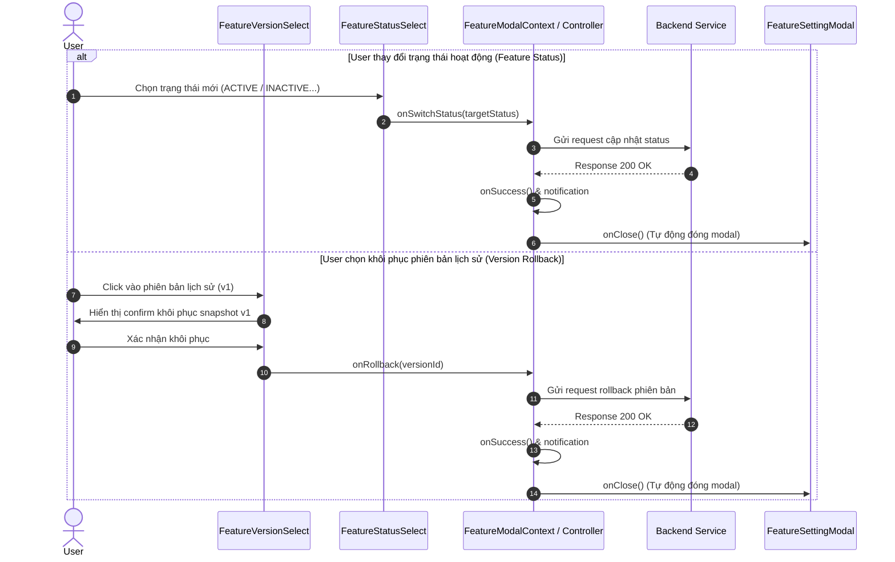

# Concept: Redesign Feature Version Select & Streamline Feature Modal Footer

## 1. Problem & Goal (Vấn đề & Mục tiêu)

### Problem (Vấn đề & Điểm nghẽn Hiện tại)
- **Bối cảnh & Điểm kích hoạt**: Trong [FeatureModalFooter.tsx](file:///d:/Sources/Personal/only-one-fe/src/app/(root)/scraping/features/components/FeatureSettingModal/FeatureModalFooter.tsx), người dùng thao tác quản lý phiên bản (Version Select) và trạng thái hoạt động (Feature Status) của cấu hình Scraping/Search feature.
- **Hiện tượng & Khiếm khuyết kỹ thuật**:
  - Phần chọn phiên bản đang sử dụng `CustomSelect` cơ bản dạng ô input thông thường, thiếu tính trực quan và không đồng bộ ngôn ngữ thiết kế (Pill/Badge Trigger + Rich Dropdown) với [FeatureStatusSelect](file:///d:/Sources/Personal/only-one-fe/src/app/(root)/scraping/features/components/FeatureStatusSelect/index.tsx) nằm ngay cạnh.
  - Quy trình khôi phục phiên bản bị rườm rà 2 bước: Người dùng phải chọn version ở Select bên trái, sau đó di chuột sang góc phải ấn nút "Khôi phục" + xác nhận Popconfirm.
  - Sau khi chuyển đổi trạng thái (`onSwitchStatus`) hoặc khôi phục phiên bản (`onRollback`), modal không tự động đóng, yêu cầu người dùng phải tự bấm "Hủy" hoặc "X" để thoát.
- **Nguyên nhân cốt lõi (Root Cause)**: Thiết kế cũ tách biệt State preview của Select với hành động Rollback, đồng thời thiếu callback đóng modal sau khi hoàn tất các mutation actions tức thì.
- **Tác động (Impact / Blast Radius)**: Giao diện footer bất đối xứng về thẩm mỹ, trải nghiệm thao tác bị rời rạc và tốn nhiều click của người dùng.

### Goal (Mục tiêu Kỹ thuật Cần đạt)
- **Mục tiêu cốt lõi**:
  - Xây dựng component `FeatureVersionSelect` với phong cách thiết kế Trigger pill/badge cao cấp và Dropdown menu hiển thị đầy đủ metadata (author, created date, changeType tag, status tag), đồng bộ 100% với `FeatureStatusSelect`.
  - Loại bỏ nút "Khôi phục" đơn lẻ và Popconfirm ở góc phải footer; chuyển hành động chọn/khôi phục phiên bản trực tiếp vào từng option trong dropdown menu.
  - Tự động đóng modal (`onClose()`) ngay khi thao tác đổi trạng thái (Feature Status) hoặc chuyển/khôi phục phiên bản (Version Rollback) thành công.
- **Tiêu chí nghiệm thu (Acceptance Criteria)**:
  - `FeatureVersionSelect` có chiều cao `40px` (`!h-[40px]`), bo góc, màu sắc phân biệt rõ giữa phiên bản đang áp dụng (Active) và các bản snapshot lịch sử (History).
  - Menu dropdown hiển thị danh sách phiên bản sắp xếp giảm dần, phân nhóm rõ ràng (Phiên bản hiện tại vs Lịch sử phiên bản), click chọn một bản snapshot lịch sử sẽ kích hoạt rollback (kèm xác nhận bảo vệ dữ liệu).
  - Không còn nút "Khôi phục" dư thừa ở cụm action bên phải footer.
  - Cả 2 action: Chuyển trạng thái feature và Rollback phiên bản khi API phản hồi thành công (`success`) đều tự động gọi `onClose()` để đóng modal.

---

## 2. Scope Boundaries (Ranh giới Phạm vi)

- **In-Scope**:
  - Tạo mới component `FeatureVersionSelect` (hoặc tái cấu trúc trong thư mục `FeatureVersionSelect/` tương tự kiến trúc của `FeatureStatusSelect`).
  - Cập nhật [FeatureModalFooter.tsx](file:///d:/Sources/Personal/only-one-fe/src/app/(root)/scraping/features/components/FeatureSettingModal/FeatureModalFooter.tsx): thay `CustomSelect` bằng `FeatureVersionSelect`, gỡ bỏ nút `Khôi phục`.
  - Cập nhật luồng xử lý trong `useFeatureModalController` / `FeatureModalContext`: tích hợp gọi `onClose()` sau khi `onSwitchStatus` hoặc `handleRollback` hoàn tất thành công.
- **Explicit Out-of-Scope**:
  - Không thay đổi logic form submit ("Lưu cấu hình").
  - Không thay đổi schema API backend của versions và switch status.
  - Không chỉnh sửa các tab khác như Sandbox Test.

---

## 3. Proposed Solution & Core Mechanism (Giải pháp Đề xuất & Cơ chế)

### Solution Options Comparison

| Tiêu chí | Phương án 1 (Recommended): Rich Pill Dropdown & Direct Rollback Confirmation | Phương án 2: Minimal Popover với Table History |
| :--- | :--- | :--- |
| **Mô tả** | Thiết kế `FeatureVersionSelect` đồng bộ với `FeatureStatusSelect` gồm Trigger Button pill + Dropdown Menu có Custom Popconfirm / Modal xác nhận khi click vào version lịch sử. | Dùng Popover mở một mini table liệt kê các version và cột action khôi phục. |
| **Ưu điểm** | - Đồng bộ visual 1:1 với `FeatureStatusSelect`.<br>- Footer cực kỳ gọn gàng, thanh thoát.<br>- Thao tác nhanh, trực quan. | - Hiển thị được nhiều cột thông tin chi tiết. |
| **Nhược điểm** | - Cần xử lý cẩn thận Popconfirm / Sub-action lồng trong Dropdown Menu. | - Giao diện nặng nề, không ăn khớp với phong cách thiết kế pill hiện tại của footer. |
| **Độ phức tạp** | Thấp - Trung bình. | Trung bình. |

---

### UI Wireframes & Layout Hierarchy

#### 1. Footer Layout Wireframe
```text
+-------------------------------------------------------------------------------------------------------+
|  [ 🕒 Current Version (v2) ▾ ]  [ 🟢 Sẵn sàng hoạt động ▾ ]             [ 💾 Lưu cấu hình ]  [ Hủy ]  |
+-------------------------------------------------------------------------------------------------------+
```

#### 2. FeatureVersionSelect Dropdown Menu Wireframe
```text
+-----------------------------------------------------------------+
| PHIÊN BẢN ĐANG ÁP DỤNG                                          |
| +-------------------------------------------------------------+ |
| | [🕒 v2]  Thủ công - 12/09/2026 13:45 (Admin)  [Đang áp dụng] | |
| +-------------------------------------------------------------+ |
| --------------------------------------------------------------- |
| LỊCH SỬ PHIÊN BẢN (CLICK ĐỂ KHÔI PHỤC)                          |
| +-------------------------------------------------------------+ |
| | [✨ v1]  AI tạo - 11/09/2026 10:20 (System)       [Khôi phục] | |
| +-------------------------------------------------------------+ |
+-----------------------------------------------------------------+
```

---

### Logic & Data Flow



---

## 4. Critical Risks & Edge Cases (Rủi ro & Kịch bản Biên)

1. **Race Conditions / Double Action**:
   - Khi đang thực hiện rollback hoặc switch status (`isLoading` / `isSwitchingStatus = true`), cần disable toàn bộ các trigger ở footer để tránh người dùng click lặp lại.
2. **Xử lý Error State**:
   - Nếu API switch status hoặc rollback thất bại, hệ thống hiển thị thông báo lỗi và **KHÔNG** đóng modal để người dùng có thể thử lại hoặc tiếp tục điều chỉnh cấu hình.
3. **Chỉ có 1 phiên bản duy nhất**:
   - Nếu feature chỉ có 1 version duy nhất (`versions.length <= 1`), Trigger vẫn hiển thị phiên bản hiện tại nhưng dropdown ở trạng thái disabled hoặc không mở menu history.
