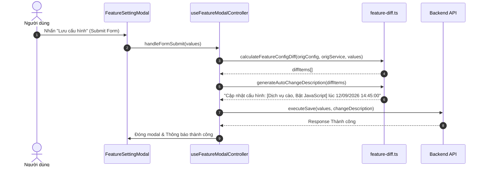

# Concept: Tự động tạo Change Description & Bỏ qua Modal Xác nhận Cập nhật Feature

## 1. Problem & Goal (Vấn đề & Mục tiêu)

### Problem (Vấn đề & Điểm nghẽn Hiện tại)
- **Bối cảnh & Điểm kích hoạt**: Khi người dùng chỉnh sửa cấu hình của một Feature trong `FeatureSettingModal` và nhấn nút "Lưu cấu hình".
- **Hiện tượng & Khiếm khuyết kỹ thuật**: Hệ thống hiện tại ngắt quãng luồng thao tác bằng cách mở thêm một modal trung gian (`FeatureConfirmUpdateModal`) để bắt người dùng xem lại diff và tự tay nhập lý do thay đổi (`changeDescription`). Điều này tạo thêm friction (bước phụ thừa) và làm giảm tốc độ thao tác của người dùng.
- **Nguyên nhân cốt lõi (Root Cause)**: Luồng lưu form đang phụ thuộc vào `setIsConfirmOpen(true)` và chờ submit từ `FeatureChangeLogForm` trong modal xác nhận.
- **Tác động (Impact / Blast Radius)**: Gây tốn thêm click và thời gian thao tác. UI/UX cồng kềnh với 2 tầng modal lồng nhau.

### Goal (Mục tiêu Kỹ thuật Cần đạt)
- **Mục tiêu cốt lõi**: Bỏ hoàn toàn modal xác nhận `FeatureConfirmUpdateModal`. Khi nhấn "Lưu cấu hình", hệ thống tự động so sánh diff các trường đã thay đổi, tự động tạo chuỗi `changeDescription` kèm timestamp và gọi API lưu trực tiếp.
- **Tiêu chí nghiệm thu (Acceptance Criteria)**:
  - Khi nhấn "Lưu cấu hình" (Update Feature), API lưu snapshot được kích hoạt ngay lập tức mà không mở thêm modal phụ.
  - `changeDescription` được tự động sinh theo format:
    - Trường hợp có thay đổi: `Cập nhật cấu hình: [Tên trường 1, Tên trường 2, ...] lúc DD/MM/YYYY HH:mm:ss`.
    - Trường hợp không có thay đổi: `Cập nhật cấu hình lúc DD/MM/YYYY HH:mm:ss`.
  - Nhãn hiển thị của các trường thay đổi được lấy từ `FIELD_METADATA` trong `feature-diff.ts`.
  - Loại bỏ hoàn toàn component `FeatureConfirmUpdateModal` và các state/props không còn sử dụng (`isConfirmOpen`, `handleCancelConfirm`, `handleConfirmUpdate`, `pendingValues`, `diffItems`) khỏi controller và context.

---

## 2. Scope Boundaries (Ranh giới Phạm vi)

- **In-Scope**:
  - Xây dựng hàm helper `generateAutoChangeDescription(diffs: IFeatureDiffItem[], timestamp?: string | Date): string` trong `feature-diff.ts`.
  - Cập nhật `useFeatureModalController.ts`: trong `handleFormSubmit`, tính toán diffs $\rightarrow$ sinh `changeDescription` $\rightarrow$ gọi thẳng `executeSave(values, changeDescription)`.
  - Xóa component `FeatureConfirmUpdateModal` (xóa thư mục component, cập nhật index export, gỡ khỏi `FeatureSettingModal` và `FeatureModalContext`).
- **Explicit Out-of-Scope**:
  - Không thay đổi logic khởi tạo bản nháp (`isDraft`) - bản nháp vốn không cần `changeDescription`.
  - Không thay đổi cấu trúc bảng lưu Snapshot/Version ở Backend (`only-one-be`).
  - Không thay đổi màn hình lịch sử phiên bản (`FeatureHistoryDrawer`).

---

## 3. Proposed Solution & Core Mechanism (Giải pháp Đề xuất & Cơ chế)

### Core Mechanism & Data Flow

### Format Chi Tiết của `changeDescription`
- Sử dụng format thời gian chuẩn từ `DATE_FORMAT_TIME` (`DD/MM/YYYY HH:mm:ss`):
  - **Có trường thay đổi**:  
    `Cập nhật cấu hình: [Tên trường 1, Tên trường 2] lúc DD/MM/YYYY HH:mm:ss`  
    *(Ví dụ: `Cập nhật cấu hình: [Selector nội dung chính, Bật JavaScript] lúc 12/09/2026 14:45:30`)*
  - **Không có trường thay đổi**:  
    `Cập nhật cấu hình lúc DD/MM/YYYY HH:mm:ss`

---

## 4. Critical Risks & Edge Cases (Rủi ro & Kịch bản Biên)

1. **Khởi tạo bản nháp (Draft Mode)**:
   - Bản nháp gọi `executeSave(values)` trực tiếp mà không cần `changeDescription`.
2. **Nhiều trường thay đổi cùng lúc**:
   - Ghép danh sách tên trường bằng dấu phẩy theo thứ tự từ `FIELD_METADATA`.
3. **Timezone & Định dạng ngày giờ**:
   - Sử dụng `dayjs().format(DATE_FORMAT_TIME)` đồng nhất với toàn bộ hệ thống frontend.
