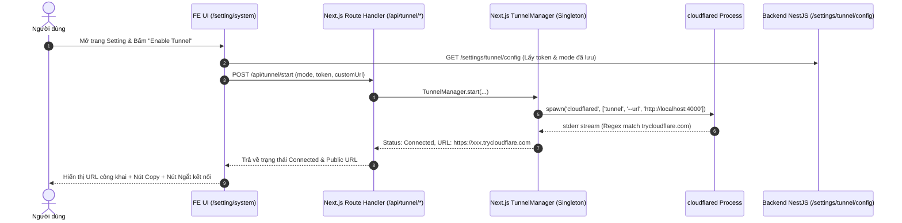

# Concept: Quản lý Cloudflare Tunnel & Endpoint (FE Runtime + Dedicated BE Config API)

## 1. Problem & Goal (Vấn đề & Mục tiêu)

### Problem (Vấn đề & Điểm nghẽn Hiện tại)
- **Bối cảnh & Điểm kích hoạt**: Người dùng cần mở public Frontend (`only-one-fe`) ra Internet (tương tự 9Router) để truy cập ứng dụng web từ xa.
- **Hiện tượng & Khiếm khuyết kỹ thuật**: Trang Setting (`/setting`) chưa có khu vực quản lý Endpoint/Tunnel; Backend chưa có API chuyên biệt (có Swagger DTO, class-validator) để quản lý cấu hình Tunnel.
- **Nguyên nhân cốt lõi (Root Cause)**: Chưa có cơ chế khởi chạy `cloudflared` trỏ vào cổng Frontend trên Node.js runtime của Next.js và chưa có module/endpoint chuyên trách trên Backend NestJS để quản lý cấu hình Tunnel của người dùng.
- **Tác động (Impact / Blast Radius)**: Không thể truy cập ứng dụng web từ xa nếu không cấu hình thủ công cổng mạng bên ngoài.

### Goal (Mục tiêu Kỹ thuật Cần đạt)
- **Mục tiêu cốt lõi**:
  1. **Frontend (`only-one-fe`)**: Xây dựng thẻ "Application & Tunnel Endpoint" trong trang `/setting/system`, quản lý trực tiếp tiến trình Cloudflare Tunnel ngay trên máy chủ Node.js của Next.js (forward port FE).
  2. **Backend (`only-one-be`)**: Cung cấp các API chuyên biệt (`GET /settings/tunnel/config` và `PUT /settings/tunnel/config`) với validation và Swagger DTO đầy đủ để lưu trữ cấu hình theo từng User.
- **Tiêu chí nghiệm thu (Acceptance Criteria)**:
  - **Local Endpoint Row**: Hiển thị chính xác URL Local của Frontend (`http://localhost:<PORT>`) kèm nút Copy to Clipboard.
  - **Tunnel Row & Control**: Nút bật/tắt (`Enable` / `Ngắt kết nối`) tương tác trực tiếp với Route Handler của Next.js (`/api/tunnel/...`).
  - **Reverse Proxy**: Next.js tự động chuyển tiếp các request `/api/v1/*` về Backend local qua cấu hình `rewrites()` sẵn có.
  - **Dedicated Backend API**: Endpoints `GET/PUT /settings/tunnel/config` trên NestJS có Swagger document, validate DTO bằng `class-validator`, lưu trữ cấu hình an toàn trên DB.

---

## 2. Scope Boundaries (Ranh giới Phạm vi)

### In-Scope
- **Frontend (`only-one-fe`)**:
  - Module `src/server/tunnel/tunnel-manager.ts`: Singleton quản lý child process `cloudflared` trên Node.js runtime của Next.js.
  - Next.js Route Handlers: `GET /api/tunnel/status`, `POST /api/tunnel/start`, `POST /api/tunnel/stop`.
  - Component Card `ApiEndpointCard` và Modal `TunnelConfigModal` tại `/setting/system`.
  - Gọi API Backend `GET/PUT /settings/tunnel/config` để lưu và đồng bộ cấu hình.
- **Backend (`only-one-be`)**:
  - DTOs: `SaveTunnelConfigRequestDto`, `TunnelConfigDto`, enum `TunnelModeEnum`.
  - Controller Endpoints: `GET /settings/tunnel/config`, `PUT /settings/tunnel/config` tích hợp `@Auth()` và `@User()`.
  - Service methods: Lấy và lưu cấu hình tunnel cho user trong `SettingService`.

### Explicit Out-of-Scope
- Tailscale hoặc nhà cung cấp tunnel khác ngoài Cloudflare.
- Tự động can thiệp cài đặt package quản trị của hệ điều hành.

---

## 3. Proposed Solution & Core Mechanism (Giải pháp Đề xuất & Cơ chế)

### Core Mechanism
1. **Frontend Runtime (Next.js Server)**:
   - Sử dụng singleton `TunnelManager` (`globalThis.__tunnelManager`) để giữ trạng thái tiến trình `cloudflared` ổn định xuyên suốt các request.
   - Khi nhận lệnh Start:
     - **Quick Tunnel**: Chạy `cloudflared tunnel --url http://localhost:${PORT}` $\rightarrow$ Bắt regex stderr lấy URL `https://*.trycloudflare.com`.
     - **Fixed Named Tunnel**: Chạy `cloudflared tunnel run --token <TOKEN>` $\rightarrow$ Gán Custom Public URL đã lưu.
   - Khi nhận lệnh Stop: Gửi tín hiệu `SIGTERM` / `SIGKILL` để giải phóng tiến trình và cổng.
2. **Backend Persistence (NestJS)**:
   - Cung cấp API chuyên biệt `/settings/tunnel/config` với DTO rõ ràng.
   - Lưu cấu hình vào bảng `settings` theo `userId` và constant key `CLOUDFLARE_TUNNEL_CONFIG`.

### Logic Flow Diagram

---

## 4. Critical Risks & Edge Cases (Rủi ro & Kịch bản Biên)

1. **Dev Fast Refresh / HMR làm mất reference tiến trình**:
   - *Rủi ro*: Next.js dev server re-evaluate module khi sửa code làm mất biến instance cục bộ.
   - *Giải pháp*: Lưu instance `TunnelManager` vào `globalThis.__tunnelManager`.
2. **Thiếu lệnh `cloudflared`**:
   - *Rủi ro*: Máy chủ chưa cài đặt CLI `cloudflared`.
   - *Giải pháp*: Kiểm tra command existence (`which cloudflared`) trước khi spawn; trả về lỗi rõ ràng.
3. **Dọn dẹp Process khi tắt Next.js**:
   - *Rủi ro*: `cloudflared` chạy ngầm sau khi dừng `npm run dev`.
   - *Giải pháp*: Đăng ký listener `process.on('SIGINT')`, `process.on('SIGTERM')`, `process.on('exit')` để tự động kill child process.
