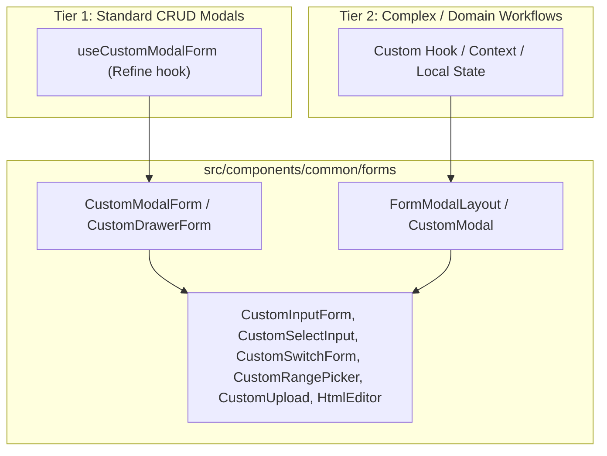

# Concept: Chuẩn hóa Modal và Form toàn ứng dụng theo Common Forms

## 1. Problem & Goal (Vấn đề & Mục tiêu)

### Problem (Vấn đề & Điểm nghẽn Hiện tại)
- **Bối cảnh & Điểm kích hoạt**: Hệ thống frontend `only-one-fe` đã phát triển bộ component form/modal dùng chung tại `src/components/common/forms` (`CustomModalForm`, `CustomDrawerForm`, `CustomInputForm`, `CustomSelectInput`, `CustomSwitchForm`, `FormModalLayout`, `CustomRangePicker`, `CustomUpload`). Tuy nhiên, nhiều màn hình trong `src/app` được phát triển ở các giai đoạn khác nhau nên sử dụng các cách tiếp cận phân mảnh.
- **Hiện tượng & Khiếm khuyết kỹ thuật**:
  - Trùng lặp mã nguồn: Nhiều modal tự khai báo lại footer, nút submit, skeleton loading, logic reset form khi đóng/mở.
  - Sử dụng trực tiếp các widget nguyên thủy của Ant Design (`Form.Item`, `Input`, `Select`) thay vì các wrapper atomic chuẩn hóa trong `src/components/common/forms`.
  - UI/UX thiếu đồng bộ về spacing, responsive (mobile vs desktop width), error message layout và visual hierarchy.
- **Nguyên nhân cốt lõi (Root Cause)**: Thiếu quy chuẩn thống nhất bắt buộc khi triển khai form/modal trên toàn bộ các route `src/app/(root)/*`.
- **Tác động (Impact / Blast Radius)**: Tăng chi phí bảo trì khi thay đổi theme/design tokens, trải nghiệm người dùng không đồng nhất giữa các module, và tiềm ẩn lỗi rò rỉ state form cũ khi đóng modal.

### Goal (Mục tiêu Kỹ thuật Cần đạt)
- **Mục tiêu cốt lõi**: Chuẩn hóa toàn bộ modal và form trên tất cả các route của ứng dụng (`src/app/(root)`) theo kiến trúc phân tầng (Layered Standard Approach) dựa trên `src/components/common/forms`.
- **Tiêu chí nghiệm thu (Acceptance Criteria)**:
  - **Standard CRUD Modals**: 100% các modal thêm/sửa tiêu chuẩn sử dụng `CustomModalForm` (hoặc `CustomDrawerForm`) tích hợp cùng `useCustomModalForm` từ Refine và các atomic input fields (`CustomInputForm`, `CustomSelectInput`, `CustomSwitchForm`,...).
  - **Complex / Multi-Step Modals**: Các modal nghiệp vụ đặc thù (như `FeatureSettingModal`, `CreateSessionModal`, `ProcessScrapeData`, `TunnelConfigModal`, `FolderModal`) được bọc bởi `FormModalLayout` hoặc `CustomModal` chuẩn, các trường dữ liệu bên trong chuyển đổi sang atomic form widgets.
  - **Form Validation & Reset**: Tự động reset form state khi đóng (`destroyOnClose: true`), hiển thị skeleton khi loading record, hỗ trợ dynamic rules validation (`rulesConfig`).
  - **Zero Regression**: Giữ nguyên 100% logic nghiệp vụ, payload data structure gửi lên backend API, và các workflow hiện có (như diff editor, test runner).

---

## 2. Scope Boundaries (Ranh giới Phạm vi)

### In-Scope
- **Module Scraping**:
  - `scraping/data-providers`: `DataProviderFormModal`
  - `scraping/provider-items`: `ProviderItemFormModal`
  - `scraping/items`: `ItemFormModal`, `ImportData`
  - `scraping/scraping-data`: `ProcessScrapeData`
  - `scraping/discovery`: `CreateSessionModal`
  - `scraping/features`: `FeatureSettingModal` (chuẩn hóa các tab config form với atomic fields), `FeatureHistoryModal` (đồng bộ layout/footer)
- **Module Setting**:
  - `setting/users`: `UserFormModal`
  - `setting/system`: `TunnelConfigModal`, `ApiEndpointCard`
- **Module Simulation**:
  - `simulation/items`: `SimulationItemFormModal`
  - `simulation/contexts`: `SimulationContextFormModal`
- **Module Schedule**:
  - `schedule/executions`: `ScheduleExecutionFormModal`, `ViewScheduleJobList`
  - `schedule/job-events`: `ViewJobEvent`
- **Module Google & Cloud**:
  - `google/drive/folders`: `FolderModal`, `SyncGoogleDrive`
  - `google/drive/photos`: `SyncLocal`, `SyncGoogleDrive`

### Explicit Out-of-Scope
- Không thay đổi schema hoặc contract dữ liệu giữa FE và Backend API.
- Không thay đổi cơ chế logic đặc thù bên trong của scraping test runner (`FeatureTestTab`) hoặc code diff logic (`feature-diff.ts`).
- Không rewrite hoàn toàn luồng quản lý phiên bản (config versioning state) thành CRUD đơn giản nếu nó đang cần custom lifecycle.

---

## 3. Proposed Solution & Core Mechanism (Giải pháp Đề xuất & Cơ chế)

### Core Mechanism: Layered Standard Architecture

Hệ thống form và modal được phân chia rõ ràng thành 2 tầng xử lý:



1. **Tier 1 - Standard CRUD Pattern**:
   - Sử dụng hook `useCustomModalForm` từ `@/hooks` để quản lý `modalProps`, `formProps`, `mode` (`create` / `edit`), `saveButtonProps`, và tự động sync data mutation qua Refine data provider.
   - Sử dụng component `CustomModalForm` với prop `createInitialValues`, `modalForm`, tự động render responsive modal, skeleton loader và footer action buttons.
2. **Tier 2 - Complex / Custom Flow Pattern**:
   - Sử dụng `FormModalLayout` hoặc `CustomModal` chuẩn hóa footer/header.
   - Các form con bên trong sử dụng toàn bộ hệ thống atomic inputs từ `src/components/common/forms` để đảm bảo styling và form rules (`rulesConfig={[{ type: FormRuleType.Required }]}`).

### UI Wireframe & Layout Quy chuẩn

```text
+-----------------------------------------------------------------------+
|  [Icon] Tiêu đề Modal (Mode: Tạo mới / Chỉnh sửa / Cấu hình)     [X]  |
+-----------------------------------------------------------------------+
|  +-- Loading State (Khi fetch edit record) ------------------------+  |
|  |  [=== Skeleton Paragraph: 6-8 rows ===]                          |  |
|  +------------------------------------------------------------------+  |
|                                                                       |
|  +-- Active Form Layout (Vertical, Spacing: mb-4) -----------------+  |
|  |  Label 1 (*)                                                     |  |
|  |  [ CustomInputForm / CustomSelectInput ]                         |  |
|  |  Error Validation Message (khi trigger error)                    |  |
|  |                                                                  |  |
|  |  Label 2                                                         |  |
|  |  [ CustomSwitchForm / CustomUpload / CustomRangePicker ]         |  |
|  +------------------------------------------------------------------+  |
+-----------------------------------------------------------------------+
|                                           [ Nút Hủy ]  [ Nút Lưu (Primary) ] |
+-----------------------------------------------------------------------+
```

---

## 4. Critical Risks & Edge Cases (Rủi ro & Kịch bản Biên)

1. **Form Value Parsing & Type Casting**:
   - *Rủi ro*: Một số modal đang nhận/trả về kiểu dữ liệu JSON Object hoặc Array (như `payload` dạng chuỗi JSON hoặc mảng options).
   - *Giải pháp*: Giữ nguyên các hàm transformer (`JSON.stringify` / `JSON.parse` hoặc `transformValues`) trước khi submit lên server.
2. **State Leakage khi Đóng Modal mà chưa Lưu**:
   - *Rủi ro*: Dữ liệu vừa nhập dở dang còn lưu lại khi mở lại modal tạo mới.
   - *Giải pháp*: `CustomModalForm` đã kích hoạt sẵn `destroyOnClose: true` và `useEffect` reset form khi `open === false`.
3. **Complex Dynamic Validation**:
   - *Rủi ro*: Form động trong `DynamicFeatureConfigForm` cần validate theo JSON schema hoặc schema config.
   - *Giải pháp*: Tích hợp dynamic form validation rules qua `rulesConfig` của `CustomInputForm` / `CustomSelectInput`.
