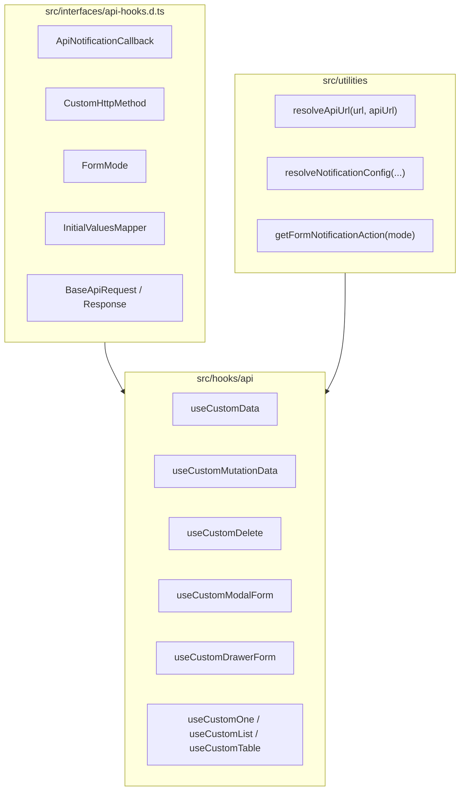

# Concept: Cải tiến & Chuẩn hóa API Hooks, Common Interfaces và Utilities

## 1. Problem & Goal (Vấn đề & Mục tiêu)

### Problem (Vấn đề & Điểm nghẽn Hiện tại)
- **Bối cảnh & Điểm kích hoạt**: Thư mục `src/hooks/api` chứa 12 hooks xử lý tương tác dữ liệu (`useCustomMutationData`, `useCustomData`, `useCustomDelete`, `useCustomModalForm`, `useCustomDrawerForm`, `useCustomList`, `useCustomOne`, `useCustomTable`, `useCustomSelect`, ...).
- **Hiện tượng & Khiếm khuyết kỹ thuật**:
  - **Trùng lặp kiểu (Type Duplication)**: Các định nghĩa `errorNotification`, `successNotification` callback, HTTP methods (`'get' | 'post' | 'put' | 'delete' | 'patch'`), `FormMode` (`'create' | 'edit' | 'clone'`), `InitialValuesMapper` bị khai báo lặp lại ở nhiều file hook khác nhau.
  - **Trùng lặp logic xử lý (Code Duplication)**:
    - Logic nối URL (`url.startsWith('http') || url.startsWith('/') ? url : ...`) lặp lại ở `useCustomData`, `useCustomMutationData`, `useCustomDelete`.
    - Logic map Notification action (`FORM_NOTIFICATION_ACTION`) và xử lý fallback thông báo lặp lại giữa `useCustomModalForm` và `useCustomDrawerForm`.
  - **Tổ chức thư mục (Organization)**: `src/interfaces` và `src/utilities` chưa gom nhóm các contract chung về API hook và utilities hỗ trợ xử lý endpoint/thông báo.
- **Nguyên nhân cốt lõi (Root Cause)**: Các hook được phát triển độc lập theo từng giai đoạn tính năng mà chưa được trích xuất (extract) lớp trừu tượng dùng chung cho type definitions và helper utilities.
- **Tác động (Impact / Blast Radius)**: Khó bảo trì, khi cập nhật notification hoặc format URL phải sửa nhiều nơi, nguy cơ lệch chuẩn type giữa các module.

### Goal (Mục tiêu Kỹ thuật Cần đạt)
- **Mục tiêu cốt lõi**: Trích xuất toàn bộ interface và utility trùng lặp ra `src/interfaces` và `src/utilities`, tái cấu trúc `src/hooks/api` đồng bộ và tinh gọn, đảm bảo **100% backward compatibility** cho các component/page đang dùng.
- **Tiêu chí nghiệm thu (Acceptance Criteria)**:
  - Định nghĩa tập trung `src/interfaces/api-hooks.d.ts` (hoặc `hooks.d.ts` / mở rộng `common.d.ts`) chứa: `ApiNotificationCallback`, `ApiNotificationConfig`, `CustomHttpMethod`, `FormMode`, `InitialValuesMapper`, `BaseApiHookRequest`, `BaseApiMutationResponse`.
  - Tạo utility `src/utilities/api.ts` chứa `resolveApiUrl`, `resolveNotificationConfig`.
  - Làm sạch và tái sử dụng trong toàn bộ `src/hooks/api/*`.
  - Chạy `tsc --noEmit` và `eslint` pass 100% với 0 errors.

---

## 2. Scope Boundaries (Ranh giới Phạm vi)

### In-Scope:
1. **Interface Layer (`src/interfaces`)**:
   - Khởi tạo/cập nhật `src/interfaces/api-hooks.d.ts` (hoặc xuất qua `src/interfaces/index.ts`).
   - Định nghĩa các interface và generic type dùng chung: `ApiNotificationCallback`, `ApiNotificationConfig`, `CustomHttpMethod`, `FormMode`, `InitialValuesMapper`, `BaseFormHookProps`.
2. **Utility Layer (`src/utilities`)**:
   - Thêm `src/utilities/api.ts` (hoặc bổ sung vào `src/utilities/notification.ts` và `src/utilities/index.ts`):
     - `resolveApiUrl(url: string, apiUrl: string): string`
     - `getFormNotificationAction(mode: FormMode): NotificationAction`
3. **Hooks Layer (`src/hooks/api`)**:
   - Tinh gọn `useCustomData.ts`, `useCustomMutationData.ts`, `useCustomDelete.ts`, `useCustomModalForm.ts`, `useCustomDrawerForm.ts`, `useCustomOne.ts`, `useCustomList.ts`, `useCustomTable.ts`, `useCustomSelect.ts`.
   - Giữ nguyên toàn bộ public interface/return signature của các hook để không ảnh hưởng đến bất kỳ page nào đang sử dụng.

### Explicit Out-of-Scope:
- Thay đổi logic nghiệp vụ bên trong các pages/components gọi hook.
- Viết lại Refine Core / Ant Design wrappers thành thư viện mới.

---

## 3. Solution Architecture & Comparison (Kiến trúc Giải pháp)

### Phương án 1: Trích xuất Common Interfaces & Utilities (Recommended)
- **Cơ chế**:
  - Định nghĩa các contract dùng chung tại `src/interfaces/api-hooks.d.ts`.
  - Tạo các helper hàm thuần túy (pure functions) tại `src/utilities/api.ts` và `src/utilities/notification.ts`.
  - Refactor từng hook trong `src/hooks/api/` import và kế thừa từ các common types/utils này.
- **Ưu điểm**:
  - Tách biệt rõ ràng (Separation of Concerns).
  - Giữ nguyên cấu trúc hook hiện tại, độ rủi ro (blast radius) cực thấp.
  - Tăng cường khả năng tái sử dụng type và helper cho các hook mới sau này.
- **Nhược điểm**: Cần rà soát cẩn thận type import giữa các file.

### Phương án 2: Xây dựng Hook Factory & Abstract Base Hook
- **Cơ chế**: Tạo `useBaseForm<T>()` chung làm nền tảng cho cả `useCustomModalForm` và `useCustomDrawerForm`.
- **Ưu điểm**: Giảm số dòng code trùng lặp tối đa.
- **Nhược điểm**: Tăng độ phức tạp của generic type (Refine `useModalForm` và `useDrawerForm` có generics khác nhau), có nguy cơ lỗi type inference khi form Ant Design nhận props.

$\rightarrow$ **Lựa chọn: Phương án 1 (Recommended)** đảm bảo tính ổn định, tường minh và an toàn tối đa cho codebase.

---

## 4. Core Mechanism & Data Flow (Cơ chế Cốt lõi)

---

## 5. Critical Risks & Edge Cases (Rủi ro & Kịch bản Biên)
1. **Type Breaking Changes**: Thay đổi interface name có thể làm gãy các file đang import `type { ... }` từ `@/hooks`.
   - *Chiến lược*: Re-export toàn bộ types cũ (alias hoặc identical type export) từ `src/hooks/api` và `src/hooks/index.ts` để đảm bảo tương thích 100%.
2. **Circular Dependencies**: Import qua lại giữa `src/utilities` và `src/hooks`.
   - *Chiến lược*: `src/interfaces` chỉ chứa pure types (.d.ts hoặc type exports); `src/utilities` không import từ `src/hooks`; `src/hooks` import từ `src/interfaces` và `src/utilities`.
