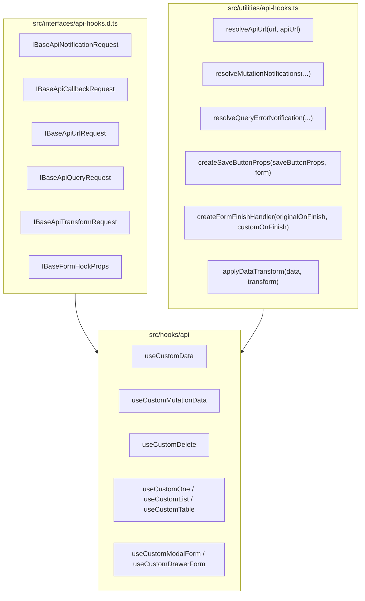

# Concept: Xây dựng hệ thống Base Common Interfaces và Common Utilities cho API Hooks

## 1. Problem & Goal (Vấn đề & Mục tiêu)

### Problem (Vấn đề & Điểm nghẽn Hiện tại)
- **Bối cảnh & Điểm kích hoạt**: Trong thư mục `src/hooks/api`, tất cả các request/response interfaces và các đoạn code tiện ích (`useCustomData`, `useCustomMutationData`, `useCustomDelete`, `useCustomOne`, `useCustomList`, `useCustomTable`, `useCustomModalForm`, `useCustomDrawerForm`) đều tự định nghĩa lặp lại các trường thuộc tính và các hàm xử lý phụ trợ.
- **Hiện tượng & Khiếm khuyết kỹ thuật**:
  - **Trùng lặp trường thông báo & thông điệp (Notification Fields)**: Các trường `resource`, `errorMessage`, `successMessage`, `errorNotification`, `successNotification` xuất hiện ở 8+ interfaces.
  - **Trùng lặp callback xử lý (Callback Fields)**: `onSuccess?: (data: TData) => void | Promise<void>`, `onError?: (error: HttpError) => void | Promise<void>` lặp lại ở mọi mutation/action requests.
  - **Trùng lặp logic xử lý truy vấn (Query Logic Duplication)**:
    - Xử lý fallback `errorNotification` khi load dữ liệu (`action: NotificationAction.Load`) lặp lại ở `useCustomData`, `useCustomOne`, `useCustomList`, `useCustomTable`.
    - Logic wrap `onFinish` (kết hợp `onFinish` tùy chỉnh và `originalOnFinish`) lặp lại y hệt giữa `useCustomModalForm` và `useCustomDrawerForm`.
    - Logic tạo `saveButtonProps` với `form.submit()` lặp lại giữa `useCustomModalForm` và `useCustomDrawerForm`.
    - Logic transform dữ liệu từ `rawData` sang `transformedData` lặp lại ở `useCustomOne`, `useCustomList`, `useCustomData`.
- **Nguyên nhân cốt lõi (Root Cause)**: Chưa thiết lập hệ thống Base Interfaces và Common Utilities tập trung cho tầng API Hooks.
- **Tác động (Impact / Blast Radius)**: Khó maintain, code hooks dài dòng, dễ xảy ra bất đồng bộ về xử lý lỗi và cấu hình thông báo giữa các module.

### Goal (Mục tiêu Kỹ thuật Cần đạt)
- **Mục tiêu cốt lõi**:
  1. Xây dựng bộ **Base Common Interfaces** chuẩn hóa trong `src/interfaces/api-hooks.d.ts` kế thừa qua `extends`.
  2. Bổ sung các **Common Utilities** trong `src/utilities/api-hooks.ts` để loại bỏ 100% logic phụ trợ lặp lại.
- **Tiêu chí nghiệm thu (Acceptance Criteria)**:
  - **Base Interfaces**:
    - `IBaseApiNotificationRequest`: chứa `resource`, `errorMessage`, `successMessage`, `errorDescription`, `successDescription`, `errorNotification`, `successNotification`.
    - `IBaseApiCallbackRequest<TData>`: chứa `onSuccess`, `onError`.
    - `IBaseApiUrlRequest`: chứa `url`.
    - `IBaseApiQueryRequest<TOptions>`: chứa `enabled`, `queryOptions`, `refetchInterval`.
    - `IBaseApiTransformRequest<TData, TTransformed>`: chứa `transform`.
    - `IBaseFormHookProps<TQueryFnData, TVariables, TData>`: chứa các props chung cho Modal/Drawer forms.
  - **Common Utilities**:
    - `resolveQueryErrorNotification`: Xử lý error notification cho các hook đọc dữ liệu (`useCustomData`, `useCustomOne`, `useCustomList`, `useCustomTable`).
    - `createSaveButtonProps`: Chuẩn hóa save button submit handler cho form modal & drawer.
    - `createFormFinishHandler`: Chuẩn hóa wrap onFinish giữa custom form và Refine form.
    - `applyDataTransform`: Chuẩn hóa transform fallback.
  - **Tái cấu trúc**: Áp dụng vào toàn bộ `src/hooks/api/*`, đảm bảo 100% backward compatibility.
  - `npx tsc --noEmit` và `npx eslint` pass 100% với 0 errors.

---

## 2. Scope Boundaries (Ranh giới Phạm vi)

### In-Scope:
1. **Interface Layer (`src/interfaces/api-hooks.d.ts`)**:
   - Khai báo các composable base interfaces.
2. **Utility Layer (`src/utilities/api-hooks.ts`)**:
   - Khai báo các helper functions chuyên biệt cho API hooks.
3. **Hooks Layer (`src/hooks/api/*.ts`)**:
   - Refactor các hook interfaces và hook implementations tinh gọn, sử dụng base interfaces và utilities mới.

### Explicit Out-of-Scope:
- Sửa đổi các components, pages bên ngoài `src/hooks/api/`.
- Thay đổi runtime behavior hay interface output của các hook.

---

## 3. Proposed Solution & Core Mechanism (Giải pháp Đề xuất & Cơ chế)



---

## 4. Chi tiết Thiết kế

### 4.1 Base Common Interfaces (`src/interfaces/api-hooks.d.ts`)
```typescript
// 1. Notification & Message Contract
export interface IBaseApiNotificationRequest {
    resource?: string;
    errorMessage?: string;
    successMessage?: string;
    errorDescription?: string;
    successDescription?: string;
    errorNotification?: ApiNotificationParam;
    successNotification?: ApiNotificationParam;
}

// 2. Callback Contract
export interface IBaseApiCallbackRequest<TData = any> {
    onSuccess?: (data: TData) => void | Promise<void>;
    onError?: (error: HttpError) => void | Promise<void>;
}

// 3. Endpoint / URL Contract
export interface IBaseApiUrlRequest {
    url: string;
}

// 4. Query Execution Contract
export interface IBaseApiQueryRequest<TOptions = any> {
    enabled?: boolean;
    refetchInterval?: number | false;
    queryOptions?: TOptions;
}

// 5. Data Transform Contract
export interface IBaseApiTransformRequest<TData = any, TTransformed = TData> {
    transform?: (data: TData | undefined, rawResponse?: any) => TTransformed;
}

// 6. Base Form Hook Props Contract
export interface IBaseFormHookProps<
    TQueryFnData extends BaseRecord = BaseRecord,
    TVariables = Record<string, never>,
    TData extends BaseRecord = TQueryFnData,
> extends IBaseApiNotificationRequest {
    action?: FormMode;
    autoResetForm?: boolean;
    redirect?: false | 'show' | 'list' | 'edit';
    warnWhenUnsavedChanges?: boolean;
    initialValuesMapper?: InitialValuesMapper<TQueryFnData, TVariables>;
    onFinish?: (
        values: TVariables,
    ) => Promise<TVariables | FormData | void> | TVariables | FormData | void;
}
```

### 4.2 Common Utilities (`src/utilities/api-hooks.ts`)
```typescript
/**
 * Resolves error notification for query/load operations.
 */
export const resolveQueryErrorNotification = (params: {
    resource?: string;
    errorNotification?: ApiNotificationParam;
    message?: string;
    description?: string;
    action?: NotificationAction;
}): ApiNotificationParam => {
    if (params.errorNotification !== undefined) {
        return params.errorNotification;
    }
    return getErrorNotification({
        resource: params.resource,
        message: params.message,
        description: params.description,
        action: params.action ?? NotificationAction.Load,
    });
};

/**
 * Creates standardized save button props with form submit binding.
 */
export const createSaveButtonProps = (
    saveButtonProps: ButtonProps | undefined,
    form: FormInstance | undefined,
): ButtonProps & { onClick: () => void } => ({
    ...saveButtonProps,
    onClick: () => {
        form?.submit();
    },
});

/**
 * Creates form finish handler wrapping custom and original onFinish.
 */
export const createFormFinishHandler = <TVariables>(
    originalOnFinish: ((values: any) => Promise<any> | any) | undefined,
    customOnFinish?: (
        values: TVariables,
    ) => Promise<TVariables | FormData | void> | TVariables | FormData | void,
) => {
    return async (values: TVariables) => {
        if (customOnFinish) {
            const result = await customOnFinish(values);
            if (result) {
                return originalOnFinish?.(result);
            }
            return;
        }
        return originalOnFinish?.(values);
    };
};

/**
 * Applies data transformation with fallback.
 */
export const applyDataTransform = <TInput, TOutput>(
    rawData: TInput,
    transform?: (data: TInput) => TOutput,
): TOutput => {
    if (transform) {
        return transform(rawData);
    }
    return rawData as unknown as TOutput;
};
```

---

## 5. Critical Risks & Edge Cases (Rủi ro & Kịch bản Biên)
1. **Generic Type Inference**: Form generics trong Ant Design và Refine có type constraints chặt chẽ.
   - *Chiến lược*: Giữ nguyên signature gốc của hook, chỉ kế thừa phần props chung thông qua `IBaseFormHookProps`.
2. **Zero Breaking Changes**: Toàn bộ exported types và functions hiện tại vẫn được giữ nguyên.
