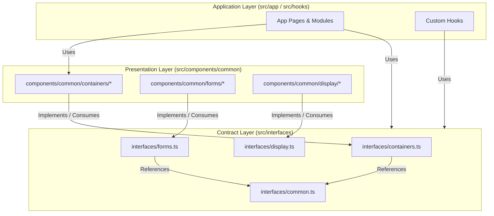

# Concept: Chuẩn hoá Naming Convention Common Containers & Tái cấu trúc Interfaces UI Contracts

## 1. Problem & Goal (Vấn đề & Mục tiêu)

### Problem (Vấn đề & Điểm nghẽn Hiện tại)
- **Bối cảnh & Điểm kích hoạt**: Thư mục `src/components/common/containers` và `src/components/common` chứa các component dùng chung trên toàn bộ ứng dụng (CRUD layout, filters, tables, form modals, headers), cùng với các interface định nghĩa contract.
- **Hiện tượng & Khiếm khuyết kỹ thuật**:
  - **Bất đồng nhất về Naming Convention**: Tên thư mục và component trong `containers` chưa theo quy tắc nhất quán (ví dụ: `wrapper-header` và `wrapper-form-modal` dùng tiền tố `wrapper-*`, trong khi `list-wrapper` dùng hậu tố `*-wrapper`, `filter-panel`, `list-table`, `breadcrumb-nav` lại dùng danh từ chức năng).
  - **Interface Scattering & Circular Dependency Risk**: Nhiều interface cốt lõi (`ICardAction`, `IFilterField`, `FilterOption`, `IFormField`, `TableCustomAction`, `BreadcrumbItem`, `CodeDisplayProps`) bị định nghĩa phân tán rải rác bên trong file component của `components/common/**`.
  - **Vi phạm phân tầng Layer Dependency**: File `src/interfaces/component.ts` hiện tại lại đang `import { CodeDisplayProps } from '@/components/common'`, khiến tầng hợp đồng (`interfaces`) bị phụ thuộc ngược vào tầng triển khai giao diện (`components`).
- **Nguyên nhân cốt lõi (Root Cause)**: Chưa thiết lập chuẩn quy hoạch ranh giới giữa UI Presentation Layer và Contract/Type Layer; naming convention ban đầu đặt tự phát theo từng feature PR.
- **Tác động (Impact / Blast Radius)**: Gây khó khăn cho developer khi tìm kiếm và tái sử dụng component; nguy cơ circular dependency khi mở rộng; phá vỡ tính clean của codebase architecture.

### Goal (Mục tiêu Kỹ thuật Cần đạt)
- **Mục tiêu cốt lõi**:
  - Chuẩn hoá toàn bộ tên thư mục và tên component trong `src/components/common/containers` theo hệ thống danh pháp trực quan, dễ đoán và nhất quán.
  - Gom toàn bộ các interface/type dùng chung từ `components/common` về `src/interfaces/`, xoá bỏ hoàn toàn phụ thuộc ngược (`import from '@/components/common'` trong `src/interfaces`).
- **Tiêu chí nghiệm thu (Acceptance Criteria)**:
  - Tất cả component trong `src/components/common/containers` có tên thể hiện rõ vai trò kiến trúc (Container/Layout/Section), đồng bộ giữa tên folder (kebab-case) và tên component (PascalCase).
  - Không còn bất kỳ interface dùng chung nào bị giấu bên trong file component cá lẻ nếu có hơn 1 nơi sử dụng hoặc thuộc contract chung.
  - `src/interfaces/` là Single Source of Truth cho toàn bộ Type Contracts, không import từ `@/components/**`.
  - Cập nhật toàn bộ các import path liên quan trong codebase mà không làm gãy type check hay runtime.

---

## 2. Scope Boundaries (Ranh giới Phạm vi)

### In-Scope
- Rà soát và chuẩn hoá tên component & thư mục trong `src/components/common/containers/` (`wrapper-header`, `wrapper-form-modal`, `list-wrapper`, `breadcrumb-nav`, `filter-panel`, `list-table`, `mobile-card-list`, `pagination-controls`).
- Tách và phân loại lại các interface/types dùng chung về thư mục `src/interfaces/` (ví dụ: `interfaces/containers.ts`, `interfaces/forms.ts`, `interfaces/display.ts`...).
- Refactor file `src/components/common/index.ts` và `src/interfaces/index.ts` để re-export tương thích ngược an toàn.
- Cập nhật toàn bộ các references, pages, components đang import các component và types bị đổi tên/chuyển chỗ.

### Explicit Out-of-Scope
- Thay đổi logic nghiệp vụ, UI styling (CSS), hoặc hành vi runtime của các component.
- Tái cấu trúc các component thuộc tầng `src/components/custom-antd` hoặc feature-specific components (`src/components/modules/**`).

---

## 3. Solution Options & Trade-offs (Phương án Kiến trúc & Đánh đổi)

### So sánh các Phương án Kiến trúc

| Tiêu chí | Option 1: Semantic Role-Based Naming + Modular Interfaces (Đề xuất) | Option 2: Suffix-Standardized (`*Container`) + Single `component.ts` | Option 3: Minimal Prefix Fix + Flat `component.ts` |
| :--- | :--- | :--- | :--- |
| **Quy tắc Naming Containers** | Đặt tên theo vai trò ngữ cảnh rõ ràng: `list-container` (thay `list-wrapper`), `list-header` (thay `wrapper-header`), `form-modal-container` (thay `wrapper-form-modal`) | Đặt tên có hậu tố `-container` cho tất cả: `list-container`, `header-container`, `form-modal-container`, `breadcrumb-container` | Chỉ đảo tiền tố: `wrapper-header` $\rightarrow$ `header-wrapper`, `wrapper-form-modal` $\rightarrow$ `form-modal-wrapper` |
| **Cấu trúc `src/interfaces`** | Chia nhỏ theo domain: `interfaces/containers.ts`, `interfaces/forms.ts`, `interfaces/display.ts` | Dồn tất cả UI types vào một file `interfaces/component.ts` lớn | Dồn tất cả UI types vào `interfaces/component.ts` và `interfaces/common.ts` |
| **Khả năng mở rộng (Scalability)** | Rất cao, dễ tìm type và component khi project scale lớn | Trung bình, file `component.ts` dễ bị phình to | Thấp, cấu trúc naming vẫn lộn xộn |
| **Độ phức tạp di chuyển (Blast Radius)** | Vừa phải, kiểm soát tốt qua TypeScript compiler | Lớn (đổi tên gần như toàn bộ thư mục container) | Thấp nhất |

---

## 4. Proposed Solution & Core Mechanism (Giải pháp Đề xuất & Cơ chế)

### 4.1. Ma trận Chuẩn hoá Naming cho Containers (`Option 1 - Khuyến nghị`)

| Thư mục Hiện tại | Component Hiện tại | Thư mục Đề xuất mới | Component Đề xuất mới | Vai trò kiến trúc |
| :--- | :--- | :--- | :--- | :--- |
| `wrapper-header` | `WrapperHeader` | `list-header` | `ListHeader` | Phần header của danh sách (chứa Title, Search/Filters và Action buttons) |
| `wrapper-form-modal` | `WrapperFormModal` | `form-modal-container` | `FormModalContainer` | Container bọc Modal Form sinh từ Schema/Fields |
| `list-wrapper` | `ListWrapper` | `list-container` | `ListContainer` | Container cấp cao nhất của trang Danh sách CRUD (bao gồm Breadcrumb, Header, Table/Cards, Modals) |
| `breadcrumb-nav` | `BreadcrumbNav` | `breadcrumb-nav` *(giữ nguyên)* | `BreadcrumbNav` *(giữ nguyên)* | Thanh điều hướng Breadcrumb |
| `filter-panel` | `FilterPanel` | `filter-panel` *(giữ nguyên)* | `FilterPanel` *(giữ nguyên)* | Khung chứa các bộ lọc tìm kiếm |
| `list-table` | `ListTable` | `list-table` *(giữ nguyên)* | `ListTable` *(giữ nguyên)* | Bảng hiển thị dữ liệu CRUD |
| `mobile-card-list` | `MobileCardList` | `mobile-card-list` *(giữ nguyên)* | `MobileCardList` *(giữ nguyên)* | Danh sách dạng Card responsive cho mobile |
| `pagination-controls` | `PaginationControls` | `pagination-controls` *(giữ nguyên)* | `PaginationControls` *(giữ nguyên)* | Bộ điều khiển phân trang |

### 4.2. Cấu trúc Module hoá `src/interfaces/`

```text
src/interfaces/
├── index.ts              # Re-export toàn bộ
├── auth.ts               # Auth & Session contracts
├── base-api.ts           # API Request/Response contracts
├── common.ts             # Generic utility types (IOption, PaginationParams...)
├── containers.ts         # NEW: Hợp đồng cho ListContainer, ListHeader, Breadcrumb, Table, Filters, CardList
├── forms.ts              # NEW: Hợp đồng cho FormField, FormModal, FormDrawer, Upload, Select...
├── display.ts            # NEW: Hợp đồng cho CodeDisplay, StatCard, StatusTag, MediaLightbox...
├── feedback.ts           # NEW: Hợp đồng cho DataNotFound, Empty, Loading...
├── api-hooks.ts          # Hook interfaces
├── navigation.ts         # Navigation & Menu interfaces
└── notification.ts       # Notification interfaces
```

### 4.3. Quan hệ Phụ thuộc (Clean Architecture Layering)



---

## 5. Critical Risks & Edge Cases (Rủi ro & Kịch bản Biên)

- **Import Breakage trong các Feature Pages**: Khi đổi tên `ListWrapper` $\rightarrow$ `ListContainer`, `WrapperHeader` $\rightarrow$ `ListHeader`, `WrapperFormModal` $\rightarrow$ `FormModalContainer`, nhiều file trong `src/app/**` có thể bị lỗi import nếu không migrate đồng loạt.
  - *Mitigation*: Cung cấp alias re-export tạm thời (hoặc deprecated alias) trong `src/components/common/index.ts` trong giai đoạn chuyển đổi, sau đó dùng công cụ thay thế toàn diện và kiểm tra bằng `npm run build` / `npx tsc --noEmit`.
- **Circular Dependency khi di chuyển Types**: Đảm bảo các file trong `src/interfaces/` chỉ phụ thuộc lẫn nhau hoặc phụ thuộc vào thư viện bên ngoài (`@refinedev/core`, `react`, antd types), tuyệt đối không import từ `src/components/**`.
