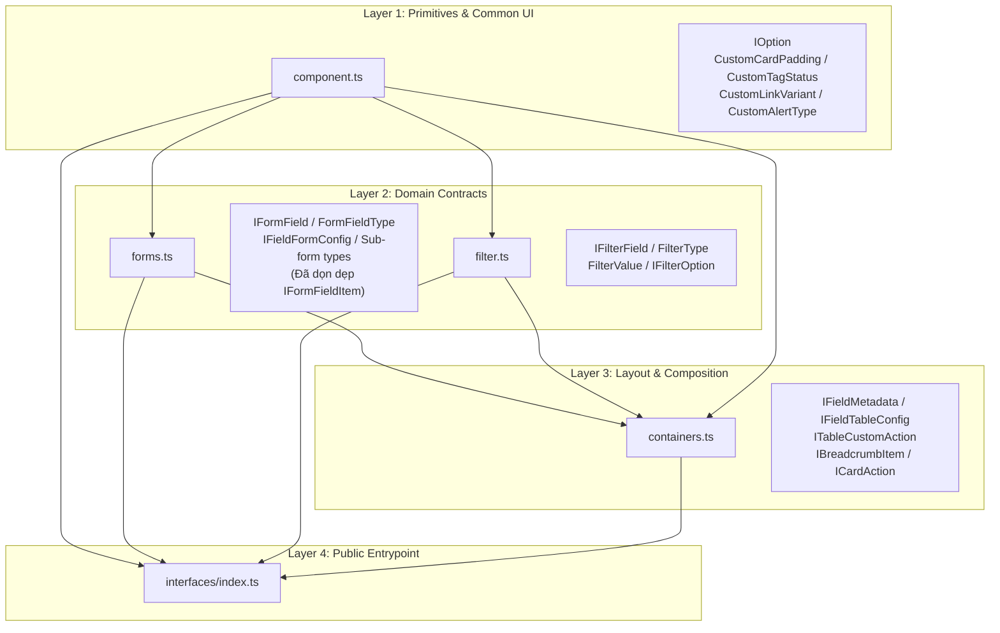

# Concept: Đồng nhất & Chuẩn hóa Hệ thống Interfaces & Hợp nhất Form Modal Containers

## 1. Problem & Goal (Vấn đề & Mục tiêu)

### Problem (Vấn đề & Điểm nghẽn Hiện tại)
- **Bối cảnh & Điểm kích hoạt**: Trong quá trình phát triển các components dùng chung (`ListContainer`, `FilterPanel`, `FormModalLayout`, `FormModalContainer`, `FormDrawerLayout`), mã nguồn đang tồn tại hai bộ kiến trúc song song gây phân mảnh:
  1. Hai hệ thống Form Modal đối chọi: Thư mục legacy `src/components/common/forms/form-modal-layout` (`CreateFormDialog`, `EditFormDialog`, `FormFields`, `FormModalLayout`) vs Container hiện đại `src/components/common/containers/form-modal-container` (`FormModalContainer`).
  2. Các định nghĩa interface và types bị phân mảnh và tự định nghĩa chồng chéo giữa `containers.ts`, `forms.ts`, `filter.ts`, và `component.ts`.
- **Hiện tượng & Khiếm khuyết kỹ thuật**:
  - **Tồn tại component thừa & phân mảnh modal**: `CreateFormDialog` và `EditFormDialog` không còn trang nào sử dụng nhưng vẫn kéo theo hàng loạt interface trong `component.ts`. Hai màn hình wizard (`ImportData.tsx` và `ProcessScrapeData.tsx`) vẫn đang bọc qua wrapper cũ `FormModalLayout`.
  - **Phân mảnh Filter System**: `filter.ts` chứa interface cũ (`IFilterItem`, `CustomFilterType`) chỉ được dùng ở 2 màn hình legacy (`photos`, `scraping-data`), trong khi `containers.ts` lại tự định nghĩa hệ thống filter chuẩn mới (`IFilterField`, `FilterType`, `FilterValue`, `IFilterOption`) dùng cho hơn 15 trang.
  - **Phân mảnh Form Types**: `component.ts` đang chứa `IFormFieldItem` cùng 6 sub-interfaces chỉ phục vụ riêng cho `form-modal-layout` cũ, trong khi `forms.ts` chứa `IFormField` chuẩn phục vụ cho hệ thống dynamic form hiện tại.
  - **Lệch vị trí Primitive Types**: `IOption` (kiểu dữ liệu nguyên tử dùng cho cả Form, Select, Filter, Containers) đang nằm ở `forms.ts`, khiến `component.ts`, `containers.ts`, `filter.ts` đều phải import phụ thuộc chéo vào `forms.ts`.
  - **Trùng lặp Table Action Contracts**: `IActionTableItem` trong `filter.ts` lỗi thời và cạnh tranh với `ITableCustomAction<RecordType>`, `IActionMenuItem`, `ICardAction` trong `containers.ts`.
- **Nguyên nhân cốt lõi (Root Cause)**: Thiếu Single Source of Truth (SSOT) và ranh giới domain rõ ràng; các container mới được tạo mà chưa dọn dẹp triệt để mã nguồn cũ và các interface phụ thuộc.
- **Tác động (Impact / Blast Radius)**:
  - Phình to dung lượng bundle và tăng cognitive load cho lập trình viên.
  - Gây nhầm lẫn khi tạo form modal mới hoặc viết filter mới.

### Goal (Mục tiêu Kỹ thuật Cần đạt)
- **Mục tiêu cốt lõi**: 
  1. Xoá bỏ hoàn toàn thư mục legacy `form-modal-layout`, thống nhất sử dụng duy nhất `form-modal-container` (`FormModalContainer`) cho toàn bộ form modal trong dự án.
  2. Tái cấu trúc và phân bổ lại toàn bộ type definitions về đúng Single Source of Truth (SSOT) theo từng Domain Layer: `component.ts` (Primitives & UI Elements), `filter.ts` (Filter Contracts), `forms.ts` (Form Contracts), và `containers.ts` (Layout, Table, Header & Action Contracts).
- **Tiêu chí nghiệm thu (Acceptance Criteria)**:
  - Xoá bỏ hoàn toàn thư mục `src/components/common/forms/form-modal-layout/` và gỡ bỏ export khỏi `src/components/common/index.ts`.
  - Chuyển đổi 2 màn hình wizard (`ImportData.tsx`, `ProcessScrapeData.tsx`) sang dùng trực tiếp `CustomModal` chuẩn từ `@/components/custom-antd`.
  - Dọn dẹp 100% các legacy interface không còn dùng trong `src/interfaces/component.ts` (`IFormFieldItem` và các props liên quan).
  - `IOption` được đặt làm primitive type tại `src/interfaces/component.ts` (hoặc re-export chuẩn).
  - Toàn bộ filter contracts (`IFilterField`, `FilterType`, `FilterValue`, `IFilterOption`) được chuyển dời về `src/interfaces/filter.ts`.
  - `src/interfaces/containers.ts` chỉ tập trung vào Table (`IFieldTableConfig`, `ITableCustomAction`), Layout/Header (`IBreadcrumbItem`, `ICardAction`), và Metadata (`IFieldMetadata`).
  - Toàn bộ barrel export tại `src/interfaces/index.ts` và `src/components/common/index.ts` được duy trì đầy đủ, bảo đảm backwards-compatibility.
  - Typecheck (`tsc --noEmit` hoặc `npm run build`) đạt 100% pass với 0 lỗi.

---

## 2. Scope Boundaries (Ranh giới Phạm vi)

- **In-Scope**:
  - Xoá thư mục `src/components/common/forms/form-modal-layout/`.
  - Cập nhật [ImportData.tsx](file:///Users/kiem/Sources/PERSONAL/only-one-fe/src/app/(root)/scraping/items/components/ImportData.tsx) và [ProcessScrapeData.tsx](file:///Users/kiem/Sources/PERSONAL/only-one-fe/src/app/(root)/scraping/scraping-data/components/ProcessScrapeData.tsx) sang `CustomModal`.
  - Tái cấu trúc các tệp `src/interfaces/component.ts`, `src/interfaces/filter.ts`, `src/interfaces/forms.ts`, `src/interfaces/containers.ts`, `src/interfaces/index.ts`.
  - Cập nhật export tại `src/components/common/index.ts`.
- **Explicit Out-of-Scope**:
  - Không thay đổi nghiệp vụ cào dữ liệu (scraping) hoặc import dữ liệu trong các file wizard.
  - Không thay đổi các custom hook Refine hay logic API backend.

---

## 3. Proposed Solution & Core Mechanism (Giải pháp Đề xuất & Cơ chế)

### 3.1. Hợp nhất Kiến trúc Modal Components (Single Modal Paradigm)
Xoá bỏ hoàn toàn `form-modal-layout`. Quy hoạch các loại Modal như sau:
* **Form Modals (CRUD/Refine Forms)**: Dùng duy nhất `FormModalContainer` (`src/components/common/containers/form-modal-container`), tự động tích hợp form binding, submit handling và responsive rendering.
* **Custom Step Wizards (Không theo Form chuẩn)**: Dùng trực tiếp `CustomModal` (`src/components/custom-antd`) kết hợp với `CustomSteps` và `CustomSpin`.

### 3.2. Modular Domain Separation Architecture cho Interfaces
Phân chia trách nhiệm độc lập theo 4 tầng domain interface:

### Chi tiết Phân bổ Interface & Dọn dẹp

#### 1. `src/interfaces/component.ts` (Primitive & Common UI Props)
* **Giữ & Bổ sung**: `IOption<TValue, TLabel>`, `CustomCardPadding`, `CustomCardShadow`, `CustomLinkVariant`, `CustomButtonHubVariant`, `CustomTagStatus`, `CustomAlertType`.
* **Xoá bỏ triệt để (Dead Codes)**: `IFormFieldItemCodeProps`, `IFormFieldItemInputProps`, `IFormFieldItemSelectProps`, `IFormFieldItemSwitchProps`, `IFormFieldItemTextareaProps`, `IFormFieldItemUploadProps`, `IFormFieldItem`.

#### 2. `src/interfaces/forms.ts` (Form Domain SSOT)
* Import: `IOption` từ `./component`.
* Chứa: `FormFieldType`, `IFieldFormConfig`, `IBaseFormField`, `IFormField` (và các subtype `IInputFormField`, `ISelectFormField`, `INumberFormField`, `IPasswordFormField`, `ITextAreaFormField`, `ISwitchFormField`, `ICustomFormField`).

#### 3. `src/interfaces/filter.ts` (Filter Domain SSOT)
* Import: `IOption` từ `./component`.
* Chứa: `FilterType`, `FilterValue`, `IFilterOption`, `IFilterField`, `IFilterItem` (giữ adapter hoặc refactor nhẹ).

#### 4. `src/interfaces/containers.ts` (Containers, Tables & Actions SSOT)
* Import: `IFieldFormConfig` từ `./forms`, `IFilterField` từ `./filter`.
* Chứa: `IFieldTableConfig`, `IFieldMetadata`, `IBreadcrumbItem`, `ITableCustomAction<RecordType>`, `IActionMenuItem`, `ICardAction`, `ICardActionPermission`.

#### 5. Barrel Exports
* `src/interfaces/index.ts`: Re-export toàn bộ 4 file type.
* `src/components/common/index.ts`: Loại bỏ dòng `export * from './forms/form-modal-layout';`, chỉ giữ `export * from './containers/form-modal-container';`.

---

## 4. Critical Risks & Edge Cases (Rủi ro & Kịch bản Biên)

| Rủi ro / Tình huống biên | Khả năng | Tác động | Chiến lược Giảm thiểu (Mitigation Strategy) |
| :--- | :--- | :--- | :--- |
| **Gãy giao diện ở 2 trang wizard (ImportData & ProcessScrapeData)** | Thấp | Thấp | Giữ nguyên cấu trúc JSX bên trong (Card, Steps, Spin), chỉ thay thẻ bọc ngoài cùng từ `FormModalLayout` sang `CustomModal`. |
| **Breaking Imports tại các Page/Component** | Thấp | Thấp | Barrel export tại `src/interfaces/index.ts` bảo đảm tất cả named exports vẫn hoạt động trơn tru dù import từ `@/interfaces`. |
| **Vòng lặp phụ thuộc (Circular Dependency)** | Cực thấp | Trung bình | Thiết lập luồng 1 chiều nghiêm ngặt: `component` $\rightarrow$ `forms` / `filter` $\rightarrow$ `containers`. |
