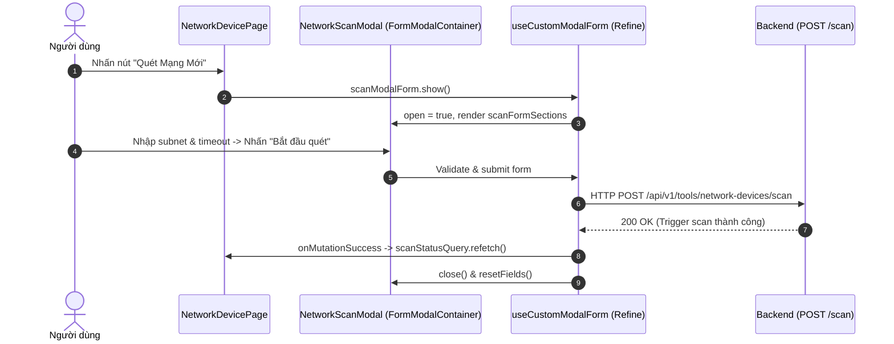

# Concept: Tái cấu trúc NetworkScanModal Tái sử dụng FormModalContainer (Create Mode & Schema Sections)

## 1. Problem & Goal (Vấn đề & Mục tiêu)

### Problem (Vấn đề & Điểm nghẽn Hiện tại)
- **Bối cảnh & Điểm kích hoạt**: Tại trang Quản lý Thiết bị Mạng ([NetworkDevicePage](file:///d:/Sources/Personal/only-one-fe/src/app/(root)/tool/network-device/page.tsx)), chức năng Quét Mạng LAN đang sử dụng một component modal tùy biến riêng biệt ([NetworkScanModal.tsx](file:///d:/Sources/Personal/only-one-fe/src/app/(root)/tool/network-device/components/NetworkScanModal.tsx)).
- **Hiện tượng & Khiếm khuyết kỹ thuật**:
  - `NetworkScanModal` tự quản lý vòng đời form thủ công bằng `CustomModal` + `CustomForm` + `form.validateFields()` + `useState(isScanModalOpen)` + `useState(isTriggeringScan)`.
  - Không tận dụng được [FormModalContainer](file:///d:/Sources/Personal/only-one-fe/src/components/common/containers/form-modal-container/index.tsx) và kiến trúc Schema-driven (`IFormSection[]`), dẫn đến lặp code UI/UX, thiếu tính đồng bộ với chuẩn thiết kế chung của dự án.
- **Nguyên nhân cốt lõi (Root Cause)**: Trước đây, hành động kích hoạt quét mạng (Trigger Command) bị xem là khác biệt với CRUD form thông thường, mà bỏ qua thực tế rằng bản chất kỹ thuật của việc kích hoạt scan chính là gửi một HTTP `POST` payload (`subnet`, `probeTimeoutMs`) tới endpoint `API_ENDPOINT.NETWORK_DEVICES.SCAN`, hoàn toàn tương thích với cơ chế `action: 'create'` của `useCustomModalForm`.
- **Tác động (Impact / Blast Radius)**:
  - Tốn boilerplate code ở cả 3 tầng: Component (`NetworkScanModal`), Hook (`useNetworkDeviceModals`), và Page (`NetworkDevicePage`).
  - Mất đi các tính năng tự động của container: responsive width, tự động binding `loading`/`disabled` trên nút submit, tự động reset form sau khi đóng.

### Goal (Mục tiêu Kỹ thuật Cần đạt)
- **Mục tiêu cốt lõi**:
  1. Chuyển đổi quản lý state của Network Scan sang hook chuẩn `useCustomModalForm` với `action: 'create'` và `resource: API_ENDPOINT.NETWORK_DEVICES.SCAN`.
  2. Tái cấu trúc [NetworkScanModal.tsx](file:///d:/Sources/Personal/only-one-fe/src/app/(root)/tool/network-device/components/NetworkScanModal.tsx) sử dụng trực tiếp [FormModalContainer](file:///d:/Sources/Personal/only-one-fe/src/components/common/containers/form-modal-container/index.tsx) kết hợp với cấu hình form dạng `sections: IFormSection[]`.
  3. Tối giản hóa hook `useNetworkDeviceModals` và trang `NetworkDevicePage`, loại bỏ toàn bộ boilerplate state thủ công.
- **Tiêu chí nghiệm thu (Acceptance Criteria)**:
  - Nhấn nút *"Quét Mạng Mới"* ở header -> Modal hiển thị mượt mà qua `scanModalForm.show()`.
  - Form hiển thị đúng 2 trường: Dải mạng Subnet (Input với Tooltip) và Thời gian chờ UDP probe (InputNumber với validate required, min/max/step).
  - Giá trị mặc định `probeTimeoutMs = 3000` được nạp chính xác thông qua `createInitialValues`.
  - Nhấn *"Bắt đầu quét"* -> Validate form -> Gửi `POST` tới backend -> Hiển thị loading trên button -> Thành công: đóng modal, reset form, refetch `scanStatusQuery`, hiển thị toast thông báo thành công.
  - Mã nguồn tuân thủ 100% TypeScript strict type và quy chuẩn linting của dự án.

---

## 2. Scope Boundaries (Ranh giới Phạm vi)

- **In-Scope**:
  - Định nghĩa `scanFormSections` trong constants của module `network-device`.
  - Cập nhật `useNetworkDeviceModals.ts` để sử dụng `useCustomModalForm` cho `scanModalForm`.
  - Cập nhật `NetworkScanModal.tsx` để render `FormModalContainer` với `sections`.
  - Cập nhật `page.tsx` để binding `onClick: () => scanModalForm.show()` và truyền `modalForm={scanModalForm}`.
- **Explicit Out-of-Scope**:
  - Không can thiệp vào `DeviceApproachModal` hay `DeviceDetailModal` trong task này.
  - Không thay đổi logic backend API hay DataProvider của Refine.

---

## 3. Proposed Solution & Core Mechanism (Giải pháp Đề xuất & Cơ chế)

### Core Mechanism
1. **Hook Layer (`useNetworkDeviceModals`)**:
   - Sử dụng `useCustomModalForm<any, ITriggerScanRequest>({ action: 'create', resource: API_ENDPOINT.NETWORK_DEVICES.SCAN, onMutationSuccess, successNotification })`.
   - Loại bỏ các biến state thủ công: `isTriggeringScan`, `isScanModalOpen`, `handleTriggerScan`.
2. **Schema Definition (`constants/network-scan-form.constant.ts` hoặc `constants/index.ts`)**:
   - Định nghĩa `IFormSection<ITriggerScanRequest>[]` chứa 2 field: `subnet` (input + tooltip) và `probeTimeoutMs` (number + rulesConfig).
3. **Component Layer (`NetworkScanModal`)**:
   - Nhận duy nhất prop `modalForm: UseCustomModalFormResponse<any, ITriggerScanRequest>`.
   - Bọc và trả về `<FormModalContainer modalForm={modalForm} title="🔍 Kích hoạt Quét Mạng LAN" okText="Bắt đầu quét" width={520} sections={scanFormSections} createInitialValues={{ probeTimeoutMs: 3000 }} />`.

### Workflow / Logic Flow



---

## 4. UI Wireframe & Layout

```text
+-------------------------------------------------------------------+
| 🔍 Kích hoạt Quét Mạng LAN                                    [X] |
+-------------------------------------------------------------------+
|                                                                   |
|  Dải mạng Subnet (Tùy chọn) (?)                                   |
|  [ Để trống để tự động nhận diện (vd: 192.168.1)                ] |
|                                                                   |
|  Thời gian chờ phản hồi UDP probe (ms) *                          |
|  [ 3000                                                         ] |
|                                                                   |
+-------------------------------------------------------------------+
|                                      [ Hủy ]  [ 📡 Bắt đầu quét ] |
+-------------------------------------------------------------------+
```

---

## 5. Critical Risks & Edge Cases (Rủi ro & Kịch bản Biên)

1. **Query Refetch Timing**: Đảm bảo `onMutationSuccess` gọi đúng hàm `onScanTriggered()` (refetch `scanStatusQuery`) để UI trên `NetworkDeviceStatsHeader` cập nhật ngay trạng thái quét `IN_PROGRESS`.
2. **Form Reset on Reopen**: Kiểm tra `createInitialValues={{ probeTimeoutMs: 3000 }}` được nạp lại chính xác mỗi khi người dùng mở lại modal.
3. **Button Icon & Text**: Đảm bảo prop `okText="Bắt đầu quét"` hiển thị đúng trên primary action button của container.
