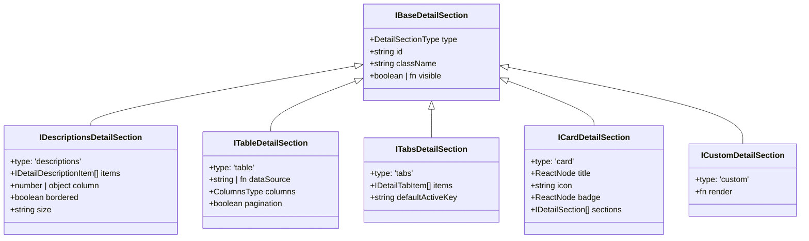

# Concept: Xây dựng Container & Schema Hiển thị Chi tiết Chuẩn Hóa (DetailModalContainer & CustomDetailSection)

## 1. Problem & Goal (Vấn đề & Mục tiêu)

### Problem (Vấn đề & Điểm nghẽn Hiện tại)
- **Bối cảnh & Điểm kích hoạt**: Trong các module của `only-one-fe` (như `DeviceDetailModal.tsx`, `ViewJobEvent.tsx`, hay các modal xem chi tiết entity), người dùng cần hiển thị thông tin chi tiết của một đối tượng dữ liệu theo nhiều dạng: bảng thuộc tính (`CustomDescriptions`), bảng dữ liệu con (`CustomTable`), phân tách theo tab (`CustomTabs`), khối nhóm có tiêu đề (`CustomCard`), hoặc khối tùy biến (`custom view`).
- **Hiện tượng & Khiếm khuyết kỹ thuật**:
  - Chưa có hệ thống schema và container chuẩn hóa cho việc hiển thị chi tiết (Read-Only / Inspect Views).
  - Khác với phía Form (đã có bộ đôi hoàn chỉnh `FormModalContainer` + `CustomFormSection` + `IFormSection`), phía Detail vẫn buộc developer phải dựng thủ công từng dòng JSX `<CustomDescriptions>`, `<CustomDescriptions.Item>`, `<CustomTabs>`, `<CustomTable>` lặp đi lặp lại.
  - Xử lý format dữ liệu (ngày tháng `formatDate`, copyable text, tag màu, badge status, JSON display, array tag list) bị phân mảnh rải rác ở từng component, thiếu cơ chế formatter tự động theo schema.
- **Nguyên nhân cốt lõi (Root Cause)**: Chưa có định nghĩa hợp đồng polymorphic `IDetailSection` và engine hiển thị `CustomDetailSection` / `DetailModalContainer`.
- **Tác động (Impact / Blast Radius)**:
  - Tốn nhiều LOC cho các modal xem thông tin tĩnh.
  - Thiếu nhất quán về style (kích thước chữ, khoảng cách padding, màu sắc badge, responsive column trên mobile).

### Goal (Mục tiêu Kỹ thuật Cần đạt)
- **Mục tiêu cốt lõi**: Xây dựng kiến trúc hiển thị chi tiết Declarative 100% gồm:
  1. Hợp đồng schema đa hình `IDetailSection<TRecord>` (hỗ trợ `descriptions`, `table`, `tabs`, `card`, `custom`).
  2. Engine render `CustomDetailSection<TRecord>` phụ trách tự động format dữ liệu, quản lý layout và lồng ghép các sections.
  3. Container `DetailModalContainer<TRecord>` bọc modal chuẩn hóa header, footer actions, loading overlay và tích hợp liền mạch với `CustomDetailSection`.
- **Tiêu chí nghiệm thu (Acceptance Criteria)**:
  - Định nghĩa đầy đủ các loại section trong `src/interfaces/details.ts`:
    - `descriptions`: Cấu hình danh sách trường (`items: IDetailDescriptionItem[]`) với các built-in formatters: `datetime`, `date`, `tag`, `badge`, `boolean`, `copyable`, `json`, `currency`, `custom render`.
    - `table`: Hiển thị bảng dữ liệu con từ mảng trong record (`name: keyof TRecord` hoặc `dataSource`) với cấu hình columns.
    - `tabs`: Điều hướng nhiều tab, mỗi tab chứa một hoặc nhiều detail sections con.
    - `card`: Khung card có viền, header, icon, badge bọc các descriptions hoặc table bên trong.
    - `custom`: Escape hatch nhận render prop `(record: TRecord) => ReactNode`.
  - Hỗ trợ responsive columns tự động (`column={{ xs: 1, sm: 2, md: 3 }}`).
  - Refactor [DeviceDetailModal.tsx](file:///d:/Sources/Personal/only-one-fe/src/app/(root)/tool/network-device/components/DeviceDetailModal.tsx) chuyển sang khai báo schema `sections: IDetailSection<INetworkDevice>[]` ngắn gọn, loại bỏ toàn bộ JSX lồng nhau thủ công.

---

## 2. Scope Boundaries (Ranh giới Phạm vi)

- **In-Scope**:
  - Tạo `src/interfaces/details.ts` định nghĩa toàn bộ contracts: `IDetailSection`, `IDescriptionsDetailSection`, `ITableDetailSection`, `ITabsDetailSection`, `ICardDetailSection`, `ICustomDetailSection`, `IDetailDescriptionItem`.
  - Tạo `src/components/common/display/custom-detail-section/` chứa `CustomDetailSection`, `DescriptionsDetailSection`, `TableDetailSection`, `TabsDetailSection`, `CardDetailSection`.
  - Tạo `src/components/common/containers/detail-modal-container/` chứa `DetailModalContainer`.
  - Export từ barrel files `@/interfaces` và `@/components/common`.
  - Refactor `DeviceDetailModal.tsx` để chứng minh sức mạnh của schema mới.
- **Explicit Out-of-Scope**:
  - Thay đổi backend API contracts.
  - Can thiệp vào các form nhập liệu (đã thuộc phạm vi của `FormModalContainer` và `CustomFormSection`).

---

## 3. Polymorphic Detail Architecture (Kiến trúc Schema Đa hình)



---

## 4. UI Wireframe & Section Layouts (Giao diện Minh họa)

### 4.1. ASCII Modal & Sections Layout
```text
+-----------------------------------------------------------------------+
| [*] [Icon] Chi Tiết Thiết Bị: 192.168.1.100       [Online Badge]  [X] |
+-----------------------------------------------------------------------+
|  == SECTION 1: type: 'descriptions' (bordered, column=2) ==          |
|  +--------------------------------+--------------------------------+  |
|  | Địa chỉ IP: 192.168.1.100 [copy]| Trạng thái: (*) Đang trực tuyến|  |
|  +--------------------------------+--------------------------------+  |
|  | Địa chỉ MAC: AA:BB:CC:DD:EE:FF | Loại thiết bị: [Camera ONVIF]  |  |
|  +--------------------------------+--------------------------------+  |
|  | Nhà sản xuất: Hikvision        | Model: DS-2CD2043G0-I          |  |
|  +--------------------------------+--------------------------------+  |
|  | Cổng mở (Open Ports): [Port 80] [Port 554] [Port 8000]          |  |
|  +-----------------------------------------------------------------+  |
|                                                                       |
|  == SECTION 2: type: 'card' (title="Cấu hình ONVIF Profiles") ==     |
|  +-- [Profiles Table / Custom Sub-view] ---------------------------+  |
|  | Profile Name  | Resolution  | Encoding | RTSP URL               |  |
|  | MainStream    | 1920x1080   | H.264    | rtsp://192.168.1.100/..|  |
|  | SubStream     | 640x360     | H.264    | rtsp://192.168.1.100/..|  |
|  +-----------------------------------------------------------------+  |
+-----------------------------------------------------------------------+
|                                   [Đóng]  [+ Chuyển sang Chẩn đoán]   |
+-----------------------------------------------------------------------+
```

---

## 5. Declarative Schema Example (Minh họa Schema mong muốn)

Thay vì viết hàng chục dòng JSX thủ công trong `DeviceDetailModal.tsx`:
```tsx
export const DeviceDetailModal = ({
    device,
    open,
    onClose,
    onOpenApproach,
}: DeviceDetailModalProps) => {
    const typeCfg = device ? DEVICE_TYPE_CONFIG[device.deviceType] || DEVICE_TYPE_CONFIG.UNKNOWN : null;

    const sections: IDetailSection<INetworkDevice>[] = useMemo(
        () => [
            {
                type: 'descriptions',
                bordered: true,
                size: 'small',
                column: { xs: 1, sm: 2 },
                items: [
                    { name: 'ipAddress', label: 'Địa chỉ IP', copyable: true, strong: true },
                    {
                        name: 'isOnline',
                        label: 'Trạng thái',
                        format: 'badge',
                        badgeProps: (val) => ({
                            status: val ? 'success' : 'default',
                            text: val ? 'Đang trực tuyến' : 'Ngoại tuyến',
                        }),
                    },
                    { name: 'macAddress', label: 'Địa chỉ MAC', copyable: true, emptyText: 'Chưa xác định' },
                    {
                        name: 'deviceType',
                        label: 'Loại thiết bị',
                        render: () => <CustomTag color={typeCfg?.color}>{typeCfg?.label}</CustomTag>,
                    },
                    {
                        name: 'vendor',
                        label: 'Nhà sản xuất (Vendor)',
                        render: (_, record) => record.vendor || record.onvifMetadata?.deviceInformation?.manufacturer || 'Chưa xác định',
                    },
                    {
                        name: 'lastSeenAt',
                        label: 'Lần cuối thấy',
                        format: 'datetime',
                    },
                    {
                        name: 'openPorts',
                        label: 'Cổng mở (Open Ports)',
                        span: 2,
                        render: (ports) =>
                            ports?.length > 0 ? (
                                <CustomFlex gap="4px" wrap="wrap">
                                    {ports.map((port: number) => (
                                        <CustomTag key={port} color="cyan">Port {port}</CustomTag>
                                    ))}
                                </CustomFlex>
                            ) : 'Không phát hiện cổng mở',
                    },
                ],
            },
            {
                type: 'custom',
                visible: (record) => Boolean(record.onvifMetadata),
                render: (record) => <OnvifProfilesList onvif={record.onvifMetadata} />,
            },
        ],
        [typeCfg],
    );

    return (
        <DetailModalContainer<INetworkDevice>
            open={open}
            onClose={onClose}
            data={device}
            width={750}
            title={device ? `Chi Tiết Thiết Bị: ${device.ipAddress}` : 'Chi Tiết Thiết Bị'}
            icon={typeCfg ? <Icon icon={typeCfg.icon} width={22} height={22} /> : undefined}
            sections={sections}
            extraActions={(d) => (
                <CustomButton
                    key="approach"
                    type="primary"
                    icon={<Icon icon="mdi:flash" />}
                    onClick={() => onOpenApproach(d)}
                >
                    Chuyển sang Chẩn đoán ngay
                </CustomButton>
            )}
        />
    );
};
```

---

## 6. Critical Risks & Edge Cases (Rủi ro & Kịch bản Biên)

1. **Nested Record Field Resolution**: Thuộc tính `name` trong `IDetailDescriptionItem` có thể là nested path như `'onvifMetadata.deviceInformation.model'` hoặc mảng `['onvifMetadata', 'deviceInformation', 'model']`. Engine cần sử dụng helper an toàn (như lodash `get` hoặc utility extractor) để tránh lỗi null reference.
2. **Format Fallback & Empty State**: Khi giá trị là `null`, `undefined` hoặc chuỗi rỗng, engine tự động render `emptyText` (mặc định là `'-'`) thay vì để ô bị trống hoặc hiển thị text xám mờ.
3. **TypeScript Generic Type Safety**: Đảm bảo `name: keyof TRecord | string` gợi ý chính xác key của interface entity nhưng vẫn cho phép truyền custom string path khi cần.
