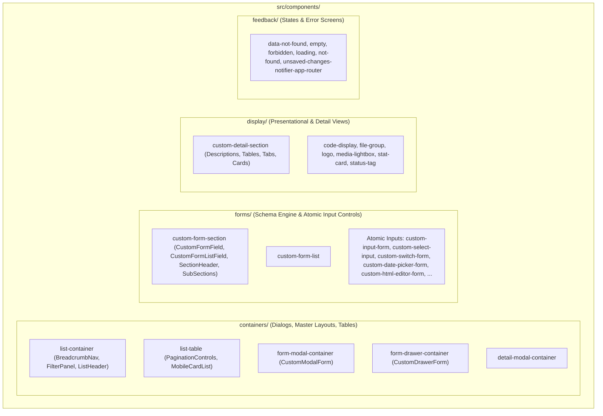

# Concept: Tái cấu trúc Thư mục src/components, Chuẩn hóa Đúng Mục đích Domain & Colocate Types

## 1. Problem & Goal (Vấn đề & Mục tiêu)

### Problem (Vấn đề & Điểm nghẽn Hiện tại)
- **Bối cảnh & Điểm kích hoạt**: Thư mục `src/components/common/forms/` hiện tại đang chứa lẫn lộn 3 nhóm thành phần có mục đích kiến trúc hoàn toàn khác nhau:
  1. **Containers**: `custom-modal-form` và `custom-drawer-form` bản chất là các **Containers** (hộp thoại dialog/drawer bọc form và tích hợp với hook `useCustomModalForm` / `useCustomDrawerForm`), nhưng lại bị đặt nhầm vào folder `forms/`.
  2. **Schema Rendering Engine**: `custom-form-field` (và `custom-form-list-field`) là bộ máy phân giải (dispatcher engine) nội bộ của `custom-form-section` (chỉ được `CustomFormSection` gọi để render các fields theo `IFormField[]`), nhưng lại bị tách ra thành top-level folder riêng.
  3. **Atomic Form Controls**: Các input nguyên tử (`custom-input-form`, `custom-select-input`, `custom-switch-form`, `custom-date-picker-form`...).
- **Hiện tượng & Khiếm khuyết kỹ thuật**:
  - Sai lệch phân loại kiến trúc (Architectural Misclassification): Container bọc form bị lẫn vào bộ input controls.
  - Phân mảnh schema engine: `custom-form-section` và `custom-form-field` bị tách rời dù có quan hệ cha-con 100%.
  - Types bị tách rời ở `src/interfaces/` (`forms.ts`, `details.ts`, `containers.ts`, `filter.ts`).
- **Tác động (Impact / Blast Radius)**:
  - Khó nhận biết ranh giới trách nhiệm giữa Container vs Form Section vs Atomic Input.
  - Phức tạp hóa luồng import và bảo trì code.

### Goal (Mục tiêu Kỹ thuật Cần đạt)
- **Mục tiêu cốt lõi**: Tái cấu trúc phân bổ đúng 100% mục đích chức năng cho từng thành phần:
  1. **Chuyển `custom-modal-form` và `custom-drawer-form` sang `src/components/containers/`**:
     - `containers/form-modal-container/`: Chứa `CustomModalForm.tsx`, `types.ts`, `index.tsx`.
     - `containers/form-drawer-container/`: Chứa `CustomDrawerForm.tsx`, `types.ts`, `index.tsx`.
  2. **Gom `custom-form-field` và `custom-form-list-field` vào `src/components/forms/custom-form-section/`**:
     - `custom-form-section/` trở thành engine schema form trọn gói tự đóng gói (Self-contained Form Engine).
  3. **Chuẩn hóa các nhóm Top-level Containers trong `src/components/containers/`**:
     - `list-container/` (chứa `BreadcrumbNav.tsx`, `FilterPanel.tsx`, `ListHeader.tsx`, `types.ts`, `index.tsx`).
     - `list-table/` (chứa `PaginationControls.tsx`, `MobileCardList.tsx`, `utils.ts`, `types.ts`, `index.tsx`).
     - `form-modal-container/` (chứa `CustomModalForm.tsx`, `types.ts`, `index.tsx`).
     - `form-drawer-container/` (chứa `CustomDrawerForm.tsx`, `types.ts`, `index.tsx`).
     - `detail-modal-container/` (chứa `types.ts`, `index.tsx`).
  4. **Colocate Types về Component sở hữu**:
     - `src/interfaces/forms.ts` $\rightarrow$ `src/components/forms/custom-form-section/types.ts` (và re-export tại `forms/types.ts`).
     - `src/interfaces/details.ts` $\rightarrow$ `src/components/display/custom-detail-section/types.ts`.
     - `src/interfaces/containers.ts`, `filter.ts`, `navigation.ts` $\rightarrow$ `src/components/containers/types.ts`.
     - `src/interfaces/media.ts` $\rightarrow$ `src/components/display/media-lightbox/types.ts`.

---

## 2. Target Component Classification (Phân loại Kiến trúc Chuẩn Hóa)



---

## 3. Detailed Target Directory Tree (Cây Thư Mục Chi Tiết)

```text
src/
├── components/
│   ├── containers/
│   │   ├── list-container/
│   │   │   ├── BreadcrumbNav.tsx
│   │   │   ├── FilterPanel.tsx
│   │   │   ├── ListHeader.tsx
│   │   │   ├── types.ts
│   │   │   └── index.tsx
│   │   ├── list-table/
│   │   │   ├── PaginationControls.tsx
│   │   │   ├── MobileCardList.tsx
│   │   │   ├── utils.ts
│   │   │   ├── types.ts
│   │   │   └── index.tsx
│   │   ├── form-modal-container/
│   │   │   ├── CustomModalForm.tsx            # [MOVE TỪ FORMS SANG CONTAINERS]
│   │   │   ├── types.ts
│   │   │   └── index.tsx                      # Export FormModalContainer & CustomModalForm
│   │   ├── form-drawer-container/
│   │   │   ├── CustomDrawerForm.tsx           # [MOVE TỪ FORMS SANG CONTAINERS]
│   │   │   ├── types.ts
│   │   │   └── index.tsx                      # Export FormDrawerContainer & CustomDrawerForm
│   │   ├── detail-modal-container/
│   │   │   ├── types.ts
│   │   │   └── index.tsx
│   │   ├── types.ts                           # Re-export container types
│   │   └── index.ts                           # Barrel export containers
│   │
│   ├── forms/
│   │   ├── custom-form-section/               # [ENGINE FORM SCHEMA TRỌN GÓI]
│   │   │   ├── CustomFormField.tsx            # [MOVE TỪ FORMS/CUSTOM-FORM-FIELD VÀO ĐÂY]
│   │   │   ├── CustomFormListField.tsx        # [MOVE TỪ FORMS/CUSTOM-FORM-LIST-FIELD VÀO ĐÂY]
│   │   │   ├── CardFormSection.tsx
│   │   │   ├── CollapseFormSection.tsx
│   │   │   ├── PlainFormSection.tsx
│   │   │   ├── TabsFormSection.tsx
│   │   │   ├── SectionHeader.tsx
│   │   │   ├── types.ts                       # [COLOCATE IFormField, IFormSection...]
│   │   │   └── index.tsx                      # Export CustomFormSection, CustomFormField...
│   │   ├── custom-form-list/                  # [HELPER CHO DYNAMIC LISTS]
│   │   │   └── index.tsx
│   │   ├── custom-checkbox-group-form/
│   │   ├── custom-code-editor-form/
│   │   ├── custom-date-picker-form/
│   │   ├── custom-html-editor-form/
│   │   │   ├── HtmlEditor.tsx                 # [MOVE TỪ FORMS/HTML-EDITOR VÀO ĐÂY]
│   │   │   └── index.tsx
│   │   ├── custom-input-form/
│   │   ├── custom-json-toggle-form/
│   │   ├── custom-radio-group-form/
│   │   ├── custom-range-picker/
│   │   ├── custom-select-input/
│   │   ├── custom-switch-form/
│   │   ├── custom-upload-form/
│   │   ├── types.ts                           # Re-export form types
│   │   └── index.ts                           # Barrel export atomic inputs + schema engine
│   │
│   ├── display/
│   │   ├── code-display/
│   │   ├── custom-detail-section/             # Chứa types.ts (IDetailSection...)
│   │   ├── file-group/
│   │   ├── logo/
│   │   ├── media-lightbox/                    # Chứa types.ts (IMediaItem...)
│   │   ├── stat-card/
│   │   ├── status-tag/
│   │   └── index.ts
│   │
│   ├── feedback/
│   │   ├── data-not-found/
│   │   ├── empty/
│   │   ├── forbidden/
│   │   ├── loading/
│   │   ├── not-found/
│   │   ├── unsaved-changes-notifier-app-router/
│   │   └── index.ts
│   │
│   ├── custom-antd/
│   ├── layout/
│   └── index.ts                               # Barrel export trung tâm duy nhất (@/components)
│
├── interfaces/
│   ├── auth.ts
│   ├── base-api.ts
│   ├── component.ts
│   ├── api-hooks.ts
│   ├── notification.ts
│   └── index.ts                               # Chỉ còn global core contracts
```

---

## 4. Re-allocation & Relocation Matrix (Bảng Chuyển Đổi Vị Trí)

| Component Cũ | Vị Trí Mới | Phân Loại Chuẩn | Rationale |
| :--- | :--- | :--- | :--- |
| `forms/custom-modal-form/` | `containers/form-modal-container/CustomModalForm.tsx` | **Container** | Là dialog container bọc form và liên kết `useCustomModalForm`. |
| `forms/custom-drawer-form/` | `containers/form-drawer-container/CustomDrawerForm.tsx` | **Container** | Là drawer container bọc form và liên kết `useCustomDrawerForm`. |
| `forms/custom-form-field/` | `forms/custom-form-section/CustomFormField.tsx` | **Schema Engine** | Là dispatcher render sub-fields nội bộ của `custom-form-section`. |
| `forms/custom-form-list-field/` | `forms/custom-form-section/CustomFormListField.tsx` | **Schema Engine** | Là renderer cho `type: 'list'` của `custom-form-field`. |
| `forms/html-editor/` | `forms/custom-html-editor-form/HtmlEditor.tsx` | **Atomic Sub-widget** | Editor nội bộ của `CustomHtmlEditorForm`. |
| `containers/breadcrumb-nav/` | `containers/list-container/BreadcrumbNav.tsx` | **Layout Component** | Thành phần header của `ListContainer`. |
| `containers/filter-panel/` | `containers/list-container/FilterPanel.tsx` | **Layout Component** | Thành phần lọc của `ListContainer`. |
| `containers/list-header/` | `containers/list-container/ListHeader.tsx` | **Layout Component** | Thành phần header của `ListContainer`. |
| `containers/pagination-controls/`| `containers/list-table/PaginationControls.tsx` | **Table Component** | Phân trang nội bộ của `ListTable`. |
| `containers/mobile-card-list/` | `containers/list-table/MobileCardList.tsx` | **Table Component** | Responsive view nội bộ của `ListTable`. |

---

## 5. Types Colocation Matrix (Bảng Chuyển Đổi Types)

| File Types Hiện tại | Vị trí Chuyển về Mới | Các Types Chính |
| :--- | :--- | :--- |
| `src/interfaces/forms.ts` | `src/components/forms/custom-form-section/types.ts` & `src/components/forms/types.ts` | `IFormField`, `IFormSection`, `FormFieldType`, `IInputFormField`, `IListFormField`... |
| `src/interfaces/details.ts` | `src/components/display/custom-detail-section/types.ts` | `IDetailSection`, `IDetailDescriptionItem`, `DetailFormatType`... |
| `src/interfaces/containers.ts`, `filter.ts`, `navigation.ts` | `src/components/containers/` (trong từng container và `containers/types.ts`) | `IBreadcrumbItem`, `ITableCustomAction`, `IFilterField`, `ICardAction`, `ListTableProps`, `ListContainerProps`... |
| `src/interfaces/media.ts` | `src/components/display/media-lightbox/types.ts` | `IMediaItem`, `ILightboxProps`... |

---

## 6. Critical Risks & Migration Strategy (Rủi ro & Kịch bản Di chuyển)

1. **Backward Compatibility trong Barrel Exports**:
   - `src/components/index.ts` re-export toàn bộ components: `FormModalContainer`, `CustomModalForm`, `CustomDrawerForm`, `CustomFormField`, `CustomFormSection`, `BreadcrumbNav`, `FilterPanel`... để mọi code hiện có trong `src/app/**` không bị hỏng import.
   - `src/interfaces/index.ts` re-export các types từ `@/components/**/types` trong giai đoạn chuyển tiếp.
2. **Zero Runtime Side Effects**:
   - Không thay đổi bất kỳ logic nội bộ nào của component.
   - Kiểm tra `npx tsc --noEmit` và `npm run lint` sau từng bước.
