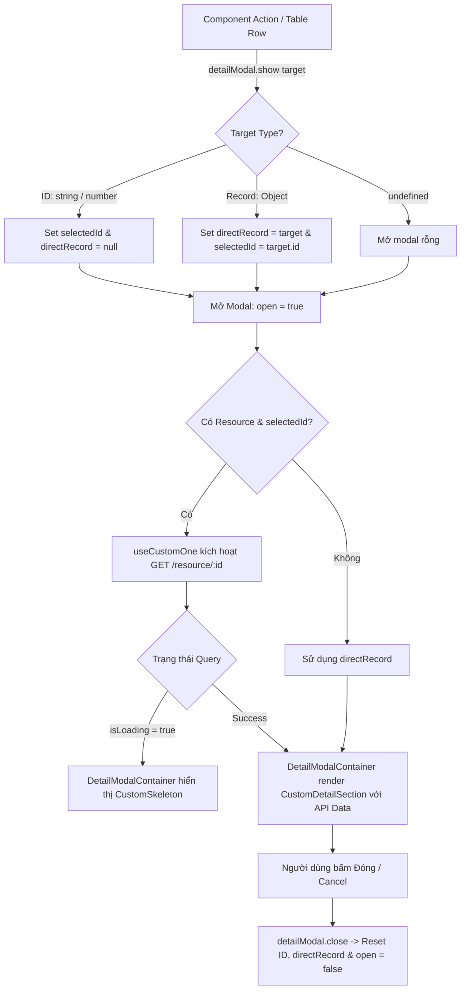

# Concept: Chuẩn hóa Hook `useCustomModalDetail` & Nâng cấp `DetailModalContainer`

## 1. Problem & Goal (Vấn đề & Mục tiêu)

### Problem (Vấn đề & Điểm nghẽn Hiện tại)
- **Bối cảnh & Điểm kích hoạt**: Khi xây dựng các modal hiển thị chi tiết (ví dụ: `DeviceDetailModal.tsx`), lập trình viên phải tự quản lý thủ công nhiều state cục bộ (`open`, `selectedRecord`, `loading`), đồng thời phải truyền quá nhiều props rời rạc vào `DetailModalContainer` (`open`, `onClose`, `data`, `loading`, `title`, ...).
- **Hiện tượng & Khiếm khuyết kỹ thuật**: 
  - Prop drilling & boilerplate state fatigue: Mỗi màn hình có modal xem chi tiết đều phải lặp lại cùng một đoạn code quản lý `useState`, callback đóng/mở.
  - Thiếu tích hợp API data fetching: Nếu một modal cần lấy chi tiết đầy đủ của record từ backend thông qua API (`GET /resource/:id`), dev phải tự gọi `useCustomOne` hoặc `useOne` riêng rẽ và tự đồng bộ lifecycle với trạng thái mở/đóng modal.
- **Nguyên nhân cốt lõi (Root Cause)**: `DetailModalContainer` hiện là một Presentational Component thụ động, chưa có Controller Hook tương ứng (như mô hình `useCustomModalForm` đi kèm với `FormModalContainer` đã có trong hệ thống).
- **Tác động (Impact / Blast Radius)**: Tăng lượng mã nguồn lặp lại (boilerplate), giảm năng suất phát triển, tiềm ẩn rủi ro memory leak hoặc không reset data khi đóng modal.

### Goal (Mục tiêu Kỹ thuật Cần đạt)
- **Mục tiêu cốt lõi**: Xây dựng custom hook **`useCustomModalDetail`** kế thừa `useModal` từ `@refinedev/antd` và `useCustomOne` từ `@refinedev/core`, đóng gói toàn bộ lifecycle đóng/mở modal và data fetching tự động; đồng thời nâng cấp `DetailModalContainer` để nhận trực tiếp object controller `detailModal`.
- **Tiêu chí nghiệm thu (Acceptance Criteria)**:
  - `useCustomModalDetail` hỗ trợ mở modal linh hoạt theo 2 chế độ:
    1. **Fetch API qua ID**: Gọi `detailModal.show(id)` $\rightarrow$ Kích hoạt `useCustomOne` tự động gọi API `GET /resource/:id` khi modal mở.
    2. **Truyền Record trực tiếp**: Gọi `detailModal.show(record)` $\rightarrow$ Sử dụng ngay dữ liệu sẵn có mà không phát sinh thêm request mạng.
  - `DetailModalContainer` nhận prop `detailModal={detailModal}` để tự động suy luận `open`, `loading`, `data`, `onClose` và tự động hiển thị `CustomSkeleton` khi đang fetch API.
  - Đảm bảo **Backward Compatibility**: `DetailModalContainer` vẫn hỗ trợ cách truyền props truyền thống (`open`, `onClose`, `data`, `loading`) nếu không dùng hook.
  - Tự động dọn dẹp state (`id`, `data`) khi đóng modal để tránh hiển thị dữ liệu cũ khi mở lại.

---

## 2. Scope Boundaries (Ranh giới Phạm vi)

- **In-Scope**:
  - Tạo mới hook `useCustomModalDetail` tại `src/hooks/api/useCustomModalDetail.ts` và export qua `src/hooks/index.ts`.
  - Cập nhật types và logic tại `src/components/containers/detail-modal-container/index.tsx` và `types.ts`.
  - Tích hợp `CustomSkeleton` khi `detailModal.isLoading === true`.
  - Refactor mẫu `DeviceDetailModal.tsx` và `useNetworkDeviceModals.ts` để áp dụng hook và container mới.
- **Explicit Out-of-Scope**:
  - Không thay đổi cấu trúc của `CustomDetailSection` hay `CustomDescriptions`.
  - Không sửa đổi logic nghiệp vụ backend hoặc các API endpoint hiện có.

---

## 3. Proposed Solution & Core Mechanism (Giải pháp Đề xuất & Cơ chế)

### Core Mechanism (Cơ chế Vận hành Cốt lõi)

1. **`useCustomModalDetail` Hook Controller**:
   - Sử dụng `useModal` từ `@refinedev/antd` để quản lý `modalProps` (`open`, `onCancel`, `show`, `close`).
   - Quản lý 2 state nội bộ: `selectedId` (khi cần fetch API) và `directRecord` (khi truyền data có sẵn).
   - Tích hợp `useCustomOne<TData>` với cấu hình `queryOptions.enabled = Boolean(resource && selectedId && modalProps.open)`.
   - Hàm `show(target?: BaseKey | TData)` thông minh:
     - Nếu `target` là kiểu primitive (number / string) $\rightarrow$ gán `selectedId = target`, reset `directRecord`.
     - Nếu `target` là object $\rightarrow$ gán `directRecord = target`, gán `selectedId = target.id ?? null`.
   - Hàm `close()`: Đóng modal và reset sạch sẽ các state tạm.
   - Trả về: `{ open, show, close, record, data, id, isLoading, isFetching, refetch, modalProps }`.

2. **`DetailModalContainer` Component Enhancement**:
   - Mở rộng Props:
     ```ts
     export type DetailModalContainerProps<TRecord extends object = Record<string, unknown>> = {
         detailModal?: UseCustomDetailModalReturnType<TRecord>;
         // Giữ nguyên các props tùy chỉnh khác: title, icon, badge, width, sections, extraActions, footer...
     } & Partial<LegacyDetailModalProps<TRecord>>;
     ```
   - Tự động resolve:
     - `isOpen = detailModal ? detailModal.open : props.open`
     - `activeData = detailModal ? detailModal.data : props.data`
     - `isLoading = detailModal ? detailModal.isLoading : (props.loading ?? false)`
     - `handleClose = detailModal ? detailModal.close : props.onClose`

### Workflow / Logic Flow



### UI State Handling Matrix

| UI State | Điều kiện | Hành vi & Hiển thị |
| :--- | :--- | :--- |
| **Loading State** | `detailModal.isLoading === true` | Hiển thị `CustomSkeleton active` dạng paragraph với số dòng cấu hình được trong modal body. |
| **Populated State** | `detailModal.data` có dữ liệu | Render `CustomDetailSection` với danh sách sections hoặc custom `children`. |
| **Empty / No Data** | `detailModal.data === null` & `!isLoading` | Render `null` hoặc `Empty` placeholder tùy chọn. |
| **Footer State** | Mặc định | Tự động render nút "Đóng" + các action mở rộng từ `extraActions(data, close)`. |

---

## 4. Critical Risks & Edge Cases (Rủi ro & Kịch bản Biên)

1. **Race Condition & Stale Cache**: Khi mở modal cho ID #1 rồi nhanh chóng đổi sang ID #2, React Query cache có thể hiển thị chớp nhoáng dữ liệu cũ.
   - *Chiến lược*: Reset `directRecord` ngay khi gọi `show()` và đảm bảo `queryKey` theo `id` để React Query quản lý độc lập.
2. **Object Type Guard**: Phân biệt giữa `BaseKey` (ID) và `TRecord` (Object).
   - *Chiến lược*: Kiểm tra `typeof target !== 'object'` để nhận diện ID, ngược lại coi là record object.
3. **Data Precedence**: Khi cả API data và Direct Record cùng tồn tại.
   - *Chiến lược*: Ưu tiên `query.data` nếu query thành công, fallback về `directRecord`.
